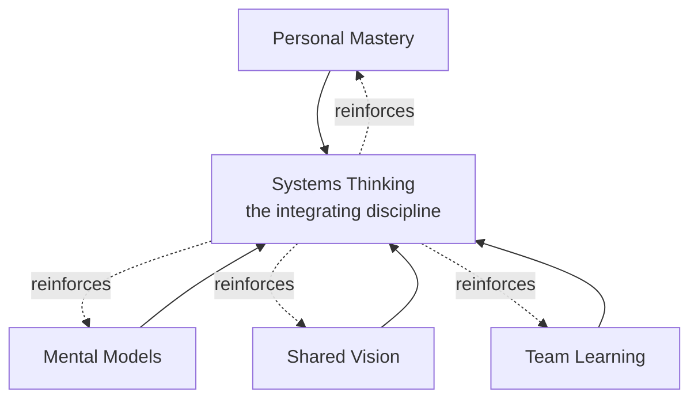

## Senge's Five Disciplines of the Learning Organization

### Overview

Peter Senge's Five Disciplines framework, introduced in *The Fifth Discipline: The Art and Practice of the Learning Organization* (1990), describes five interlocking capacities that organizations must cultivate to become "learning organizations" — organizations where people continually expand their capacity to create desired results, where new patterns of thinking are nurtured, where collective aspiration is set free, and where people continually learn how to learn together. Systems Thinking is positioned as the **fifth discipline** — the integrating discipline that fuses the other four into a coherent body of theory and practice, which is why the framework carries the book's title.

The five disciplines are: **Personal Mastery**, **Mental Models**, **Shared Vision**, **Team Learning**, and **Systems Thinking**.

### The Five Disciplines

#### 1. Personal Mastery

- **Key Points**
  - The discipline of continually clarifying and deepening personal vision, focusing energies, developing patience, and seeing reality objectively
  - Involves holding a **creative tension** between one's current reality and a desired future vision — this tension is the energy source for genuine learning and growth, rather than something to be resolved by lowering the vision
  - Distinguished from simple skill acquisition or competence: personal mastery is an ongoing discipline/practice, never a state one fully "arrives" at
  - Organizations that fail to encourage personal mastery risk a workforce that is competent but not genuinely committed or growing
- **Example**

  An employee practicing personal mastery continually clarifies what she genuinely wants from her career (vision) while honestly assessing her current skills and circumstances (current reality), using the resulting tension to motivate deliberate skill development rather than either abandoning the vision or becoming complacent about the gap.

#### 2. Mental Models

- **Key Points**
  - Deeply ingrained assumptions, generalizations, or images that influence how individuals understand the world and take action, often operating below conscious awareness
  - The discipline involves surfacing, testing, and improving internal pictures of how the world works — including within organizations, where unexamined mental models (e.g., "customers only care about price") can silently constrain strategic options
  - Requires practices like **balancing advocacy with inquiry**: openly stating one's reasoning and genuinely exploring others' reasoning, rather than only defending a predetermined position
  - Directly connects to systems thinking's emphasis on multiple perspectives (paralleling DSRP's Perspectives element) — differing mental models among stakeholders are often the source of conflicting interpretations of the same system behavior
- **Example**

  A leadership team that has long operated on the unexamined mental model "our competitive advantage is manufacturing efficiency" may fail to notice a shift toward customer-experience-driven competition until this mental model is explicitly surfaced and tested against emerging market evidence.

#### 3. Shared Vision

- **Key Points**
  - The practice of building a sense of commitment in a group by developing shared images of the future and the principles/guiding practices by which the group hopes to get there
  - Distinguished from a vision statement imposed top-down: genuine shared vision emerges from an ongoing process of individuals sharing personal visions and finding common ground, not from a single leader's declaration alone
  - A shared vision fosters genuine commitment rather than mere compliance, which Senge distinguishes as fundamentally different organizational states — compliance follows rules, while commitment generates energy and initiative beyond what is required
- **Example**

  A company that develops its strategic vision through structured dialogue across levels of the organization, allowing genuine debate and refinement of the vision, tends to generate more sustained employee initiative than one where a vision is announced via a single executive memo.

#### 4. Team Learning

- **Key Points**
  - The discipline of aligning and developing the capacity of a team to create the results its members truly desire, built on the disciplines of shared vision and personal mastery
  - Centers on **dialogue** — the capacity of team members to suspend assumptions and enter into genuine collective thinking, distinct from **discussion**, which Senge frames as a more adversarial, position-defending process where ideas are presented and defended
  - Team learning is considered vital because teams, not individuals, are the fundamental learning unit in most modern organizations — most significant decisions are made in teams, making team-level learning capacity a critical organizational asset
  - Requires practices for working through **defensive routines**: habitual patterns of interaction that protect individuals or groups from the threat or embarrassment of exposing their own thinking, which can silently block genuine collective learning
- **Example**

  A product team practicing team learning holds sessions where members are explicitly asked to suspend their initial positions and explore the reasoning behind colleagues' differing views before advocating for a specific solution, rather than immediately debating pre-formed recommendations.

#### 5. Systems Thinking (The Fifth Discipline)

- **Key Points**
  - Described as the discipline that integrates the other four, providing the conceptual framework (a body of knowledge and tools including feedback loops, delays, and archetypal structures) that helps make the full patterns of organizational behavior clearer and shows how to change them effectively
  - Without systems thinking, the other four disciplines risk becoming a collection of separate, disconnected practices rather than an integrated approach — Senge specifically frames systems thinking as what fuses the disciplines into a coherent body of theory and practice
  - Centers on seeing **interrelationships rather than linear cause-effect chains**, and seeing **patterns of change rather than static snapshots**
  - Closely associated with the concept of **systems archetypes** — recurring generic structures (e.g., "Limits to Growth," "Shifting the Burden," "Tragedy of the Commons") that Senge and colleagues catalogued as common patterns underlying many organizational problems, providing diagnostic templates practitioners can recognize and apply across different specific situations

### How the Disciplines Interrelate

- **Key Points**
  - The disciplines are explicitly interdependent, not a checklist to be completed independently: personal mastery provides the individual motivation and clarity that feeds into shared vision; mental models work provides the tools for surfacing the assumptions that must be examined for genuine team learning and dialogue to occur; systems thinking provides the integrative lens that reveals how all of these individual and interpersonal practices connect to organizational-level structure and behavior
  - [Inference] Practitioners commonly describe the five disciplines as mutually reinforcing rather than sequential — an organization does not "complete" personal mastery before moving to mental models, but rather develops all five in an ongoing, iterative practice, though the degree of formal empirical validation for this mutual-reinforcement claim (versus its being a compelling conceptual framework) is not extensively documented in controlled organizational studies.

### Learning Disabilities (Organizational Barriers)

Senge also catalogued common "learning disabilities" that prevent organizations from developing these disciplines, several of which map directly onto systems thinking failures:

- **"I am my position"** — confusing one's job function with one's identity, which narrows attention to one's own role and obscures the systemic interactions produced when all roles interact
- **"The enemy is out there"** — externalizing blame for problems onto outside forces, obscuring how the organization's own internal structure contributes to the problem (a systems-thinking failure to see the boundary of the system correctly)
- **The illusion of taking charge** — proactive but reactive behavior disguised as strategic action, without addressing underlying systemic causes
- **The fixation on events** — attention focused on discrete events (a sales dip, a product launch) rather than the slower, underlying patterns and structures generating those events, which Senge associates with the "iceberg model" of systemic depth (events at the surface, underlying patterns and structures below)
- **The parable of the boiled frog** — a metaphor (of contested biological accuracy but persistent pedagogical use) for organizations' difficulty in noticing slow, gradual threats compared to sudden, dramatic ones
- **The delusion of learning from experience** — the difficulty of learning from the consequences of decisions when those consequences are distant in time or space from the decision itself, a direct consequence of delays in feedback loops

### Relationship to Broader Systems Thinking Techniques

| Discipline | Connection to Systems Mapping Techniques |
| --- | --- |
| Systems Thinking | Directly employs Causal Loop Diagrams, systems archetypes, and stock-flow thinking as core tools |
| Mental Models | Parallels DSRP's Perspectives element (surfacing differing points of view) and concept mapping (externalizing implicit assumptions) |
| Team Learning | Dialogue practices resemble structured facilitation techniques used in connection-circle or CLD group-mapping sessions |
| Shared Vision | Analogous to defining a model's purpose/scope statement in model documentation practice — a clear, examined statement of desired future state |

### Common Pitfalls in Applying the Five Disciplines

- **Treating systems thinking as a standalone toolkit divorced from the other four disciplines** — using causal loop diagrams or archetypes without also addressing mental models, personal mastery, or team dialogue often produces technically correct diagrams that fail to change actual organizational behavior, since the human/interpersonal disciplines are what enable a diagram's insights to be acted upon.
- **Confusing shared vision with a leadership-issued vision statement** — a vision statement created without genuine participatory dialogue tends to produce compliance rather than the commitment Senge distinguishes as the goal of the shared-vision discipline.
- **Mistaking discussion for dialogue in team learning contexts** — teams that engage in vigorous debate and position-defending (discussion) without ever practicing suspension of assumptions (dialogue) may believe they are practicing team learning while missing its core mechanism.
- **Fixation on events over patterns and structure** — organizations that respond only to discrete crises (the fixation-on-events learning disability) without examining the underlying feedback structures generating recurring crises tend to see the same problems resurface in different forms.
- [Inference] The specific "parable of the boiled frog" example Senge used is a widely cited teaching metaphor, but the underlying biological claim (that a frog will not react to gradually heated water) is generally considered scientifically inaccurate; this does not undermine the organizational point being illustrated, but is worth noting as a factual caveat about the metaphor's literal accuracy rather than its pedagogical validity.

### Related Topics

- Causal Loop Diagrams and Systems Archetypes (Limits to Growth, Shifting the Burden, Tragedy of the Commons)
- The Iceberg Model (events, patterns, structures, mental models)
- DSRP: Distinctions, Systems, Relationships, and Perspectives (parallel to Mental Models discipline)
- Organizational Network Analysis (informal structures relevant to Team Learning)
- Double-loop learning (Argyris) and its relationship to Mental Models
- Model Documentation and Communication (parallels to articulating Shared Vision)