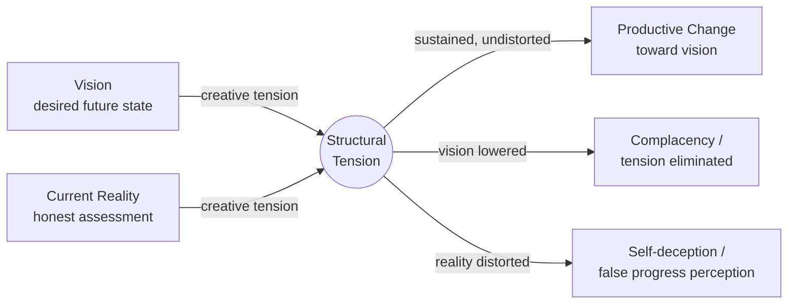
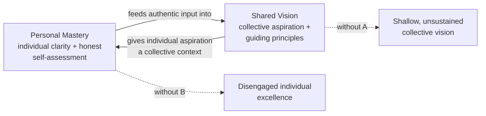

## Personal Mastery and Shared Vision

### Overview

Personal Mastery and Shared Vision are two of Peter Senge's five disciplines of the learning organization, introduced in *The Fifth Discipline* (1990). While each stands as an independent discipline, they are closely coupled: personal mastery cultivates the individual clarity, aspiration, and capacity for honest self-assessment that make genuine shared vision possible, and shared vision in turn gives individual personal mastery practice a connection to a larger collective purpose. Organizations that develop one without the other tend to produce either isolated individual excellence disconnected from organizational direction, or a collective vision that lacks the individual commitment needed to sustain it.

### Personal Mastery

#### Core Definition

Personal Mastery is the discipline of continually clarifying and deepening personal vision, focusing energies, developing patience, and seeing reality objectively. It is explicitly framed as a discipline — an ongoing practice — rather than a fixed competency or credential one eventually possesses.

#### The Structural Tension Model

- **Key Points**
  - Personal mastery operates through **creative tension**: the gap between a clearly articulated vision (what one wants) and current reality (what actually is)
  - This tension is treated as a source of creative energy for change, not a problem to be eliminated — the discipline lies in holding both vision and current reality clearly in view simultaneously, rather than distorting either to reduce discomfort
  - Two common failure modes for resolving this tension in unproductive ways: **lowering the vision** to match current reality (eliminating the tension by abandoning aspiration), or **distorting one's perception of current reality** to appear closer to the vision than is actually true (self-deception)
  - Genuine personal mastery practice requires **emotional tension tolerance** — the capacity to sit with the discomfort of the gap without collapsing it prematurely in either direction

#### Component Practices

- **Personal vision**: Continually clarifying what one genuinely wants — distinguished from goals or objectives by its deeper, more intrinsic character (results desired as ends in themselves, not instrumental steps toward something else)
- **Holding creative tension**: The ongoing discipline of maintaining clear sight of both vision and current reality without collapsing the gap through denial or resignation
- **Seeing structural conflicts**: Recognizing underlying belief systems or structures (e.g., a limiting belief about one's own worthiness or capability) that can undermine sustained pursuit of a vision, similar in spirit to identifying a balancing feedback loop that resists change
- **Commitment to the truth**: A relentless commitment to rooting out the ways individuals limit or deceive themselves from seeing what is — treated as essential to keeping the vision/reality gap honest rather than distorted
- **Using the subconscious**: Recognition that highly disciplined practitioners often engage a level of consistent focus and follow-through that operates below full conscious deliberation, similar to a skilled practitioner's fluency in any well-practiced craft

#### Organizational Role

- **Key Points**
  - Organizations cannot mandate personal mastery in individuals, but they can create **conditions that encourage it**: fostering environments where people are encouraged to pursue personal vision, supported in seeing current reality honestly (including unwelcome truths), and not punished for the vulnerability that honest self-assessment requires
  - A workforce without personal mastery tends toward **compliance rather than commitment** — technically completing assigned tasks without the deeper motivational engagement that comes from connecting work to genuinely held personal aspiration
  - [Inference] Because personal mastery is inherently individual and cannot be directly imposed, organizational encouragement of this discipline is generally understood to work indirectly — through culture, leadership modeling, and psychological safety — rather than through formal programs or mandates, though the specific mix of practices that most effectively encourages personal mastery is not rigorously benchmarked across organizational contexts.

### Shared Vision

#### Core Definition

Shared Vision is the discipline of building a sense of commitment in a group by developing shared images of the future being sought, along with the principles and guiding practices by which the group hopes to get there. It is explicitly distinguished from a vision statement handed down by leadership: genuine shared vision is built through an ongoing process, not declared in a single act.

#### Genuine Vision vs. Imposed Vision

- **Key Points**
  - A vision that is merely announced or imposed by leadership tends to generate **compliance** — people follow because they are expected to or because doing so is instrumentally useful to them, not because they are intrinsically committed
  - A genuinely shared vision, built through dialogue where individuals' personal visions are voiced, heard, and woven into a common picture, tends to generate **commitment** — people pursue the vision because they want to, generating energy, initiative, and resilience beyond what compliance produces
  - Senge distinguishes several levels of relationship to a vision along a spectrum: **commitment** (wants it, will make it happen), **enrollment** (wants it, will do what can be done within the spirit of the law), **genuine compliance** (sees the benefits, does what's expected and no more), **formal compliance** (sees the benefits on the whole, does what's expected, makes this visible), **grudging compliance** (does not see the benefit but also does not want to lose their job, does what's expected but signals not really on board), **noncompliance**, and **apathy**

#### Building Shared Vision — Practical Process

1. **Encourage personal vision first** — individuals need clarity about their own aspirations before genuine group vision-building can occur; an organization of people without personal vision can only ever produce a superficial, "paint-by-numbers" shared vision
2. **Vision as an ongoing process, not an event** — shared vision-building is treated as continuous dialogue that evolves over time, not a single off-site workshop producing a finalized statement
3. **Balance advocacy and inquiry** — leaders and participants alike are encouraged to state their own vision clearly (advocacy) while genuinely exploring others' visions (inquiry), rather than only pushing a predetermined direction
4. **Allow visions to build on each other** — genuine shared vision emerges from the interplay of individual visions, often producing a richer picture than any single person's original vision, rather than being a simple averaging or negotiation

- **Example**

  A leadership team introducing a new strategic direction sees markedly different levels of engagement depending on process: an announced five-year plan tends to produce formal or grudging compliance, while a structured series of dialogues in which employees at multiple levels articulate what they personally want the organization to become — with genuine incorporation of that input into the resulting direction — tends to produce enrollment and commitment.

### The Interdependence of Personal Mastery and Shared Vision

- **Key Points**
  - Shared vision without personal mastery in the individuals contributing to it tends to be shallow — people participate in articulating a vision without the deep personal clarity and commitment to actually sustain pursuit of it once initial enthusiasm fades
  - Personal mastery without connection to shared vision can leave highly capable, self-directed individuals working at cross purposes, or disengaged from the organization's collective direction because their personal aspirations have no organizational outlet
  - Organizations seeking to build genuine shared vision are therefore encouraged to simultaneously invest in personal mastery practices, since the two disciplines reinforce each other: personal clarity feeds authentic contribution to collective vision, and a genuinely shared vision gives individual aspiration a meaningful collective context

### Common Pitfalls

- **Treating personal mastery as performance management** — reframing personal mastery as a corporate competency-tracking exercise (annual goal-setting tied to review cycles) tends to strip out the intrinsic, self-directed character that distinguishes the discipline from ordinary goal management, and can produce compliance-oriented goal-setting rather than genuine personal vision clarification.
- **Resolving creative tension by lowering the vision** — under organizational pressure to show quick results, individuals or teams often unconsciously scale back an aspirational vision to something more immediately achievable, eliminating the productive tension that would otherwise drive genuine change.
- **Distorting current reality instead of confronting it honestly** — organizational cultures that punish bad news or discourage candid assessment of current performance undermine the "commitment to the truth" component of personal mastery, since accurate perception of current reality is structurally necessary for productive creative tension.
- **Declaring a vision rather than building one** — leadership teams frequently produce polished vision statements through a closed process and then attempt to generate enthusiasm through communication and rollout, when the underlying issue is that a lack of genuine participatory dialogue in creating the vision limits it to compliance rather than commitment regardless of how well it is subsequently communicated.
- **Assuming shared vision is a one-time deliverable** — treating vision-building as complete once a statement is finalized, rather than as an ongoing dialogue that must be revisited as circumstances and personal visions evolve, tends to produce a vision that gradually loses relevance and engagement over time.

### Practical Recommendations

- Invest in creating psychological safety before expecting genuine personal mastery practice, since honest assessment of current reality (a core component of the discipline) requires an environment where unwelcome truths can be voiced without punishment.
- When building shared vision, begin by explicitly inviting individual personal visions into the conversation rather than starting from a leadership-drafted statement seeking validation or feedback.
- Revisit shared vision periodically as an ongoing dialogue rather than treating an initial vision statement as permanent or finished.
- Model the balance of advocacy and inquiry visibly at the leadership level, since teams tend to mirror the dialogue patterns demonstrated by those setting organizational direction.

### Related Topics

- Senge's Five Disciplines of the Learning Organization (full framework overview)
- Mental Models and the practice of balancing advocacy with inquiry
- Team Learning and the distinction between dialogue and discussion
- Systems Thinking as the integrating discipline
- Organizational learning disabilities (e.g., "the illusion of taking charge")
- Model Documentation and Communication (parallels in articulating purpose/vision for a model)