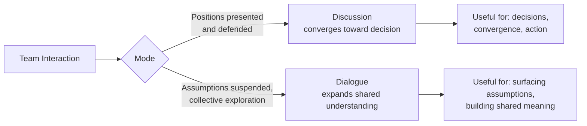
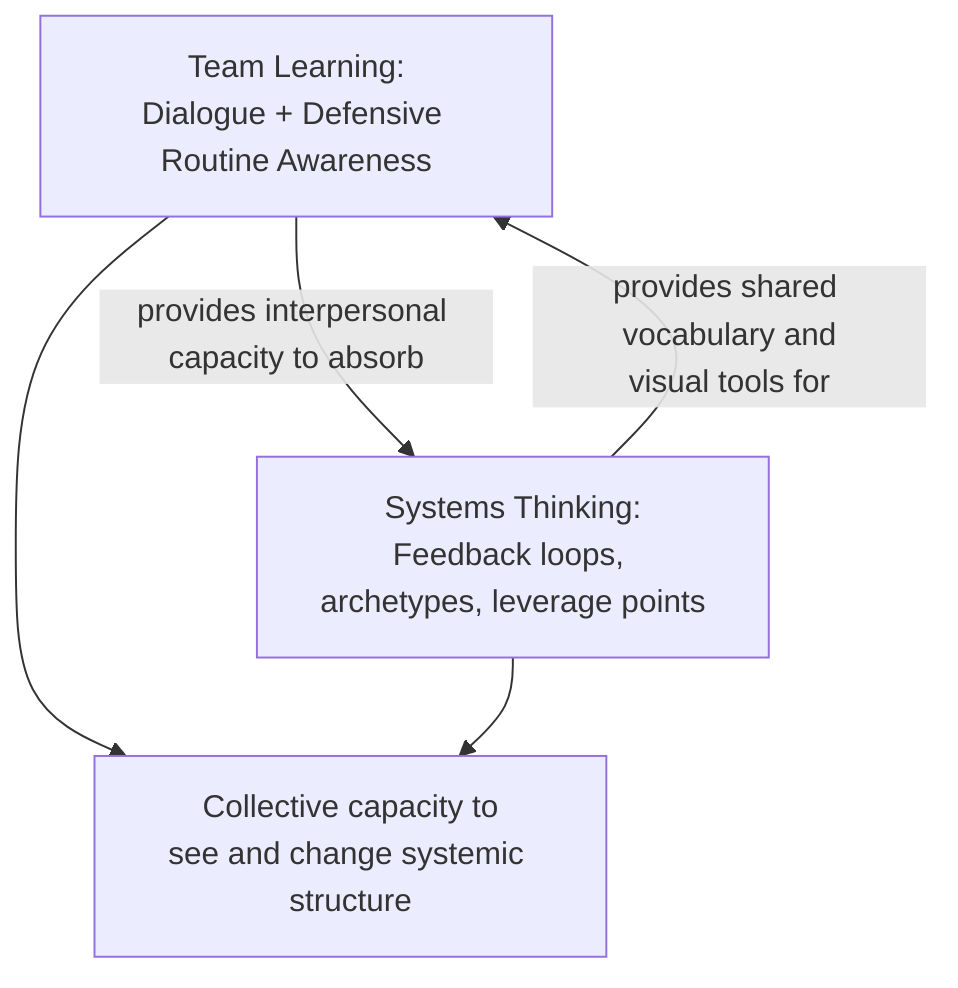

## Team Learning and Systems Thinking Practice

### Overview

Team Learning and Systems Thinking are the fourth and fifth of Peter Senge's five disciplines of the learning organization, introduced in *The Fifth Discipline* (1990). Team Learning is the discipline of aligning and developing a team's capacity to create results its members genuinely desire, built on the foundations of shared vision and personal mastery. Systems Thinking is positioned as the integrating "fifth discipline" — the conceptual framework and toolset that fuses personal mastery, mental models, shared vision, and team learning into a coherent practice. Together, they represent the point at which individual and interpersonal disciplines (personal mastery, mental models, shared vision) become organizationally actionable through collective practice and structural understanding.

### Team Learning

#### Core Definition and Rationale

- **Key Points**
  - Team Learning is defined as the discipline of aligning and developing the capacity of a team to create the results its members truly desire
  - Senge argues teams, not individuals, are the fundamental learning unit in modern organizations, since most significant decisions are made in group settings — making team-level learning capacity a critical organizational asset that individual learning alone cannot substitute for
  - Team learning requires the prior disciplines: **personal mastery** (individuals with clarity and commitment) and **shared vision** (a genuinely held common direction) form the foundation on which team learning capacity is built

#### Dialogue vs. Discussion

- **Key Points**
  - **Dialogue**: the capacity of team members to suspend their own assumptions and enter into genuine collective thinking together — an open-ended exploration of complex, subtle issues where participants listen to each other and to themselves, aiming to see beyond individual viewpoints toward a larger shared understanding
  - **Discussion**: a different mode of interaction, described as more akin to a ping-pong of ideas where participants present and defend fixed positions, working toward a decision or conclusion rather than a shared exploration
  - Both modes are useful, but Senge argues most organizational interaction is heavily weighted toward discussion, and that teams need to deliberately cultivate the capacity for dialogue — which does not come naturally in cultures accustomed to advocacy-driven debate

#### Defensive Routines

- **Key Points**
  - Defensive routines are habitual patterns of interaction that protect individuals or groups from the threat or embarrassment of exposing their own thinking, often operating unconsciously
  - These routines can silently block genuine team learning even among individually capable and well-intentioned team members, since the routines are specifically designed (often unconsciously) to prevent the very exposure of reasoning that dialogue requires
  - Learning to recognize and work through defensive routines — rather than either avoiding the underlying issues or attacking the routines directly, which tends to trigger further defensiveness — is treated as a core skill for developing team learning capacity
- **Example**

  A team that consistently avoids openly discussing a repeatedly missed deadline (perhaps out of fear of assigning blame) may develop indirect communication patterns and unstated resentments that block genuine collective problem-solving, even though every individual team member privately recognizes the issue.

#### Conditions for Team Learning

- Practicing dialogue explicitly, potentially with a facilitator initially, to help members learn to suspend assumptions rather than immediately defend positions
- Developing the capacity to see one's own thinking as a "revealing" rather than a "concluding" act — treating one's own assumptions as available for examination alongside those of others
- Building sufficient psychological safety that team members can expose uncertain or incomplete thinking without fear of it being used against them
- Combining dialogue (exploration) and discussion (decision-making) at appropriate points, rather than treating either mode as universally superior

### Systems Thinking as the Fifth Discipline

#### Integrating Role

- **Key Points**
  - Systems Thinking is explicitly described as the discipline that integrates the other four (personal mastery, mental models, shared vision, team learning) into a coherent body of theory and practice, which is why it gives its name to the overall framework
  - Without systems thinking, Senge argues, the seeds planted by the other disciplines fall on rocky ground — insights into feedback and structural interrelationships are what allow the human/interpersonal disciplines to translate into effective organizational change, rather than remaining isolated good intentions
  - Systems thinking specifically shifts attention from **linear cause-effect chains** to **interrelationships**, and from **static snapshots** to **patterns of change over time**

#### Core Practice Elements

- **Seeing interrelationships rather than isolated events**: training attention on the web of causes and feedback connecting organizational events, rather than treating each event as an independent occurrence with a single linear cause
- **Seeing patterns of change rather than static snapshots**: using tools like behavior-over-time graphs to notice trends, cycles, and trajectories rather than reacting only to the most recent data point
- **Systems archetypes**: recurring generic structures (e.g., "Limits to Growth," "Shifting the Burden," "Tragedy of the Commons," "Escalation") that recur across many specific organizational situations, providing diagnostic templates that let practitioners recognize familiar structural patterns underneath superficially different problems
- **Leverage points**: identifying where small, well-focused actions can produce significant, lasting improvement, rather than dispersing effort evenly across a system — a central practical payoff of systems thinking practice

#### Connecting Team Learning and Systems Thinking

- **Key Points**
  - Team learning provides the interpersonal capacity (dialogue, suspension of defensive routines) that allows a team to genuinely absorb and act on systems-thinking insights, which are frequently counterintuitive and threaten to trigger the very defensive routines that block learning
  - Systems thinking provides team learning with a shared conceptual vocabulary (feedback loops, archetypes, leverage points) and shared visual tools (causal loop diagrams, connection circles) that give dialogue a common structure to organize around, rather than leaving collective exploration unstructured
  - [Inference] Practitioners commonly observe that systems-thinking tools (such as causal loop diagrams) are most effective when built collaboratively through a team-learning process (dialogue, suspended assumptions) rather than presented as a finished diagram by a single analyst, since the process of jointly constructing the diagram is often where the deepest shared understanding and buy-in develops — though the degree to which this process effect outweighs the diagram's informational content is not rigorously separated in controlled studies.

### Practical Application — Combined Practice Example

A cross-functional team facing a recurring quality problem might combine both disciplines as follows:

1. **Team Learning phase**: Facilitated dialogue sessions where team members suspend blame-oriented positions and openly explore each person's view of what is contributing to the quality issue, working through initial defensive routines (e.g., engineering blaming procurement, procurement blaming engineering specifications)
2. **Systems Thinking phase**: The team collaboratively builds a causal loop diagram surfacing the feedback structure underlying the quality problem — potentially revealing a "Shifting the Burden" archetype where a quick fix (increased inspection) is masking, rather than resolving, an underlying root cause (inadequate supplier qualification process)
3. **Integration**: Because the diagram was built through genuine dialogue rather than presented by an outside analyst, team members are more likely to trust and act on its counterintuitive implication (that increased inspection effort may be perpetuating rather than solving the problem) than if the same insight had been delivered as a top-down technical finding

### Common Pitfalls

- **Mistaking discussion for dialogue** — teams that engage in vigorous debate and idea exchange (discussion) without ever practicing the suspension of assumptions that defines dialogue may believe they are achieving team learning while missing its most distinctive mechanism.
- **Attacking defensive routines directly** — confronting a team's defensive patterns head-on, without first building the psychological safety and dialogue skill needed to work through them constructively, tends to trigger further defensiveness rather than resolving the underlying block to learning.
- **Presenting systems-thinking diagrams rather than co-building them** — an outside analyst or consultant delivering a finished causal loop diagram to a team, however structurally accurate, often generates less genuine understanding and buy-in than a diagram the team builds together through its own dialogue process.
- **Treating systems thinking as a standalone technical toolkit** — applying causal loop diagrams or archetype pattern-matching without also cultivating team learning capacity (dialogue, defensive-routine awareness) risks producing technically correct diagrams that the team cannot genuinely internalize or act upon, since deep organizational change requires the human/interpersonal capacity that team learning provides.
- **Neglecting the foundational disciplines** — attempting to build team learning capacity without first cultivating personal mastery (individual clarity) and shared vision (common direction) among team members tends to produce shallow or short-lived improvements in team dialogue quality.

### Practical Recommendations

- Introduce dialogue practice explicitly and, initially, with facilitation support, rather than assuming teams will naturally shift from discussion-dominant interaction to genuine dialogue without deliberate practice.
- When a team hits a recurring, seemingly intractable problem, treat the presence of defensive routines as a diagnostic signal worth naming and working through collaboratively, rather than avoiding the underlying dynamic.
- Build systems-thinking artifacts (causal loop diagrams, connection circles) as a collaborative team-learning exercise whenever feasible, rather than delivering them as a finished analytical product to be reviewed.
- Pair systems archetypes with genuine dialogue: presenting an archetype (e.g., "this looks like Shifting the Burden") as a hypothesis to explore together, not a diagnosis to be accepted, preserves the exploratory character of dialogue rather than converting the session back into a discussion defending a predetermined conclusion.

### Related Topics

- Senge's Five Disciplines of the Learning Organization (full framework overview)
- Personal Mastery and Shared Vision (the foundational disciplines feeding team learning)
- Mental Models and the practice of balancing advocacy with inquiry
- Systems Archetypes (Limits to Growth, Shifting the Burden, Tragedy of the Commons)
- Causal Loop Diagrams and Connection Circles as collaborative team-learning tools
- The Iceberg Model (events, patterns, structures) as a complementary systems-thinking framework