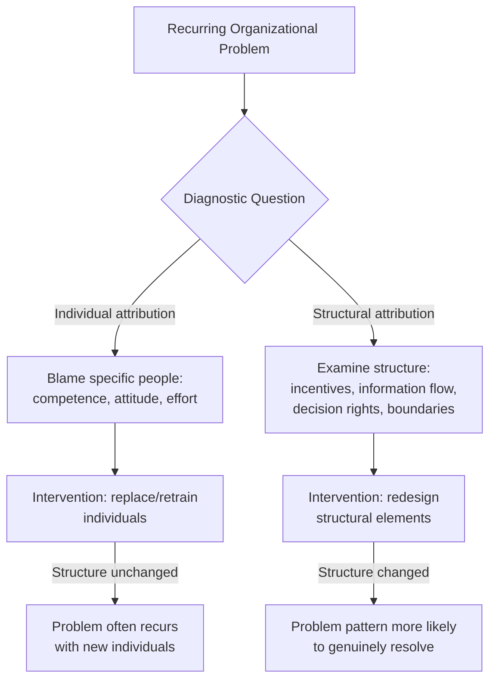
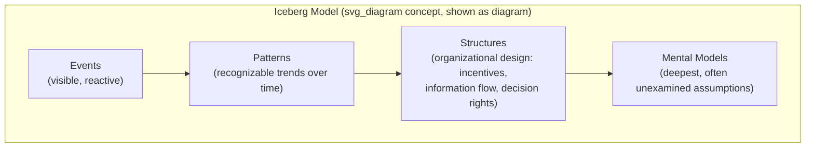

## Organizational Structure as a Driver of Behavior

### Overview

A foundational principle in systems thinking, often summarized as "structure drives behavior" or "structure influences behavior," holds that persistent patterns of organizational behavior are produced primarily by the underlying structure of the system — its feedback loops, incentive systems, information flows, and decision rules — rather than by the personalities, competence, or intentions of the individuals operating within it. This principle reframes a common but limited diagnostic instinct (blaming individual people for recurring problems) toward a structural diagnostic instinct (examining the system that consistently produces those problem-generating behaviors, regardless of who occupies the roles within it).

This idea is central to systems thinking as practiced within organizations (Senge, Forrester, and the broader system dynamics tradition) and underlies much of the diagnostic and intervention methodology used in organizational systems work.

### The Core Principle: Structure Drives Behavior

- **Key Points**
  - The same underlying structure, when populated by different individuals, tends to reproduce similar patterns of behavior over time — a strong signal that the structure itself, not the specific people, is the primary driver
  - Conversely, replacing individuals within a structurally unchanged system (a common organizational instinct when problems recur — "get new people in these roles") frequently fails to resolve persistent problems, because the underlying structural incentives and feedback loops that produced the original behavior remain intact
  - This does not deny that individual competence, values, and choices matter — rather, it reframes where to look first when a behavior pattern is **persistent and recurring** rather than a one-off event
- **Example**

  A sales organization that consistently sees sales representatives making aggressive short-term promises to customers, despite multiple rounds of hiring "better" salespeople and coaching on ethical selling, likely has a structural driver (e.g., a commission structure heavily weighted toward immediate deal closure with no clawback for post-sale customer dissatisfaction) that will continue producing this behavior regardless of who occupies the sales roles until the underlying incentive structure changes.

### Structural Elements That Drive Behavior

#### 1. Incentive and Reward Systems

- **Key Points**
  - Formal incentive structures (compensation, promotion criteria, performance metrics) create powerful feedback loops that shape behavior, often more powerfully than stated organizational values or mission statements
  - A frequently observed structural failure: rewarding behavior A while hoping for behavior B (e.g., rewarding individual output metrics while hoping for collaborative teamwork) — the reward structure, not the stated hope, tends to determine actual behavior over time

#### 2. Information Flow and Feedback Delays

- **Key Points**
  - The speed and accuracy with which information about consequences reaches decision-makers materially shapes behavior; long delays between a decision and its consequences (a structural property) make it difficult for individuals to learn from experience, regardless of their intelligence or diligence — directly connecting to Senge's "delusion of learning from experience" learning disability
  - Organizational structures that filter, delay, or distort information as it moves through hierarchical layers (a structural property of the reporting chain) shape what decision-makers can actually perceive about system state, independent of their analytical capability

#### 3. Decision Rights and Authority Structure

- **Key Points**
  - Who has authority to make which decisions, and at what organizational level, structurally shapes the speed and quality of response to emerging problems — a highly centralized decision structure will produce slower, more bottlenecked responses regardless of how capable the individuals at each level are
  - Mismatches between where information/expertise exists and where decision authority is held (a structural property) frequently produce poor decisions that appear, superficially, to reflect a lack of individual judgment when the actual driver is structural misalignment

#### 4. Organizational Silos and Boundaries

- **Key Points**
  - Departmental or functional boundaries (a structural feature) shape what information and priorities are visible to different parts of the organization, often producing local optimization that undermines system-wide performance — a manifestation of the broader systems-thinking observation that optimizing parts does not guarantee optimizing the whole
  - Cross-functional conflict frequently attributed to interpersonal friction between specific individuals often has a structural root: incompatible metrics, competing resource allocation processes, or unclear decision rights across the boundary

### Structural Diagnosis vs. Individual Diagnosis

- **Key Points**
  - This is not a claim that individual attribution is always wrong — some problems genuinely are attributable to specific individual choices or competence gaps — but systems thinking practice specifically directs attention to structural explanation **first**, particularly when a behavior pattern is recurring across multiple individuals occupying the same role or when problems persist despite personnel changes
  - [Inference] A useful diagnostic heuristic drawn from this principle: if a problem has recurred across multiple different people occupying the same organizational role or position, the structural explanation becomes progressively more likely relative to an individual-competence explanation, though this heuristic requires judgment about how many recurrences constitute a meaningful pattern versus coincidence.

### Relationship to Systems Archetypes

Several classic systems archetypes specifically describe how organizational structure produces recurring dysfunctional behavior patterns, independent of the specific individuals involved:

| Archetype | Structural Behavior Pattern |
| --- | --- |
| Shifting the Burden | A structural reliance on a quick, symptomatic fix erodes the organization's capacity to apply the more fundamental (but slower) solution, regardless of who is making the choice under pressure |
| Limits to Growth | A reinforcing growth process interacts with a structural constraint (capacity, resources, market saturation) that eventually slows growth, independent of individual effort to sustain it |
| Tragedy of the Commons | Individually rational behavior under a shared-resource structure produces collectively destructive outcomes, even when every individual involved is behaving reasonably given the structure they face |
| Escalation | A structural competitive dynamic (each party responding to the other's actions) drives mutually reinforcing escalation independent of either party's underlying disposition toward conflict |

[Inference] These archetypes are frequently cited specifically because they demonstrate how personally reasonable, well-intentioned individual decisions can still produce collectively poor outcomes purely as a function of structure — reinforcing the broader principle that structural diagnosis, not individual blame, is often the more productive starting point for these categories of recurring problems.

### The Iceberg Model Connection

- **Key Points**
  - The "iceberg model" (Events → Patterns → Structures → Mental Models) commonly used in systems thinking education places **structure** below the visible "events" and "patterns" layers, and above the deepest "mental models" layer — reflecting the idea that structure is a durable, often invisible driver of the patterns and events that are directly observed
  - Organizations that only address the events layer (reacting to each incident individually) or even the patterns layer (recognizing a recurring trend) without examining the underlying structural layer tend to see the same problem resurface in new forms, since the structural driver remains unaddressed

### Common Pitfalls

- **Defaulting to individual blame for structurally-driven problems** — replacing personnel in a role that has repeatedly underperformed, without examining whether the role's incentives, information access, or decision authority are structurally set up to fail, frequently produces a repeat of the same problem with new people.
- **Assuming structural explanation excuses all individual accountability** — over-applying the structure-drives-behavior principle can be misused to avoid legitimate accountability for individual choices that are genuinely within a person's discretion; the principle is a diagnostic starting point for recurring, structurally-explicable patterns, not a blanket excuse for any behavior.
- **Redesigning structure without stakeholder buy-in** — structural changes (new incentive systems, reorganized decision rights) imposed without genuine dialogue (connecting to the Team Learning discipline) often fail because affected individuals were not meaningfully involved in surfacing the structural diagnosis in the first place.
- **Underestimating the durability of structural incentives against stated values** — organizations sometimes assume that clearly communicating desired behavior (via values statements or training) will override a misaligned incentive structure; the incentive structure typically wins over stated intentions when the two are in tension.
- **Treating structure as immutable** — while structure is often invisible and slow-changing relative to events, it is not fixed; systems thinking practice specifically aims to identify leverage points where structural redesign is possible, rather than treating structural patterns as permanent facts of organizational life.

### Practical Recommendations

- When a problem recurs despite personnel changes, treat this as a strong diagnostic signal to examine incentive structures, information flow, decision rights, and organizational boundaries before further individual-level intervention.
- Use the iceberg model explicitly in diagnostic discussions to guide attention below the events and patterns layers toward the structural layer, since natural organizational instinct tends to gravitate toward reacting to events.
- Cross-reference recurring problems against known systems archetypes (Shifting the Burden, Limits to Growth, Tragedy of the Commons, Escalation) as diagnostic hypotheses, since these provide pre-validated structural explanations for many common organizational dysfunctions.
- Involve the people operating within a structure in diagnosing and redesigning it (connecting to Team Learning's dialogue practice), since structural changes are more likely to be genuinely adopted when those affected participated in identifying the structural driver.

### Related Topics

- Team Learning and Systems Thinking Practice (dialogue as a tool for structural diagnosis)
- Senge's Five Disciplines of the Learning Organization
- Systems Archetypes (Shifting the Burden, Limits to Growth, Tragedy of the Commons, Escalation)
- The Iceberg Model (Events, Patterns, Structures, Mental Models)
- Causal Loop Diagrams for mapping structural feedback in organizations
- Organizational Network Analysis (informal structure as a complement to formal structural analysis)