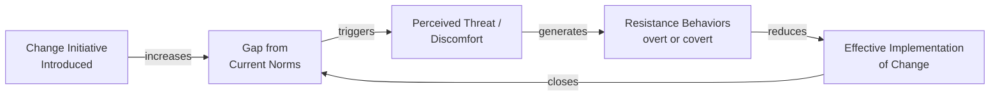
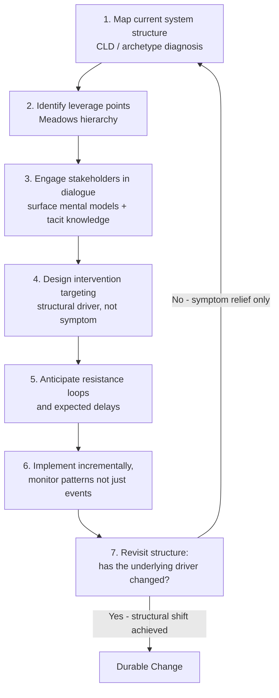

## Change Management Through a Systems Lens

### Overview

Applying a systems lens to change management means treating organizational change not as a linear, plan-and-execute project but as an intervention into a dynamic system with existing feedback loops, structural incentives, delays, and resistance-generating mechanisms. Conventional change management frameworks (e.g., Kotter's 8-Step Process, ADKAR) focus heavily on sequencing communication, sponsorship, and individual adoption. A systems-thinking lens complements these by asking a different diagnostic question: what is the current system structure that produces today's behavior, and what feedback dynamics will the change intervention itself trigger — including resistance, unintended consequences, and delayed effects that a linear implementation plan tends to overlook.

### Why Change Efforts Often Fail — A Systems Explanation

- **Key Points**
  - Many change initiatives fail not because of poor communication or insufficient sponsorship (the conventional explanation) but because the change targets a **symptom** rather than the underlying structural driver — a manifestation of the Shifting the Burden archetype, where a quick intervention (a new policy, a reorg) provides temporary relief while the underlying structural cause remains untouched
  - Change efforts frequently trigger **balancing feedback loops** (unintended, often unconscious organizational resistance that pulls the system back toward its prior equilibrium) that were invisible during planning because planning tools rarely account for the system's self-correcting tendencies
  - **Delays** between implementing a change and observing its full effects mean organizations often judge a change's success or failure prematurely, before the system has had time to fully respond — a manifestation of the delayed-feedback challenge central to system dynamics

### The Balancing Loop of Organizational Resistance

- **Key Points**
  - This is a classic **balancing (self-correcting) feedback loop**: the larger the gap the change creates from established organizational norms, the stronger the resistance it tends to generate, pulling the system back toward its prior state
  - [Inference] This structural tendency does not mean change is impossible, but it suggests that change strategies explicitly designed to work *with* this balancing dynamic (e.g., smaller incremental steps, addressing the perceived threat directly, building genuine buy-in through dialogue) are likely to be more durable than strategies that attempt to overpower resistance through authority or urgency alone, though the relative effectiveness of specific change tactics against this dynamic is highly context-dependent and not reducible to a universal formula.

### Applying Systems Thinking Tools to Change Management

#### 1. Mapping the Current System Before Designing the Intervention

- Building a causal loop diagram or connection circle of the *current* system — the structure producing today's undesired behavior — before designing any intervention, following the "structure drives behavior" principle: an effective change must alter the structural drivers, not just the surface behavior
- Explicitly identifying which archetype (Shifting the Burden, Limits to Growth, Escalation, etc.) best describes the current dysfunctional pattern, since each archetype implies a different class of effective intervention

#### 2. Identifying Leverage Points

- **Key Points**
  - Not all points of intervention in a system are equally powerful; systems thinking emphasizes identifying **leverage points** — places where a relatively small, well-targeted change can produce disproportionately large and lasting improvement
  - Donella Meadows' hierarchy of leverage points (from shallow to deep) is commonly referenced: parameters and numbers (shallow, easiest to change but often least impactful) up through feedback loop structures, information flows, rules, goals, and ultimately the paradigm or mindset underlying the system (deepest, hardest to change, but often most transformative)
  - Change management efforts that only adjust shallow leverage points (e.g., changing a single metric or policy number) while leaving deeper structural elements (information flows, goals, underlying mental models) untouched tend to produce change that reverts once initial attention fades

#### 3. Anticipating Feedback and Delays

- Explicitly forecasting the balancing loops a proposed change is likely to trigger (resistance mechanisms) before launch, rather than treating resistance as an unexpected obstacle to be reactively managed
- Building realistic expectations for the **time delay** between implementation and observable results, since premature judgment of a change's success or failure (before feedback has had time to propagate through the system) is a common source of abandoning changes that would have worked given sufficient time, or persisting with changes that are not working

#### 4. Engaging Team Learning and Dialogue in Change Design

- Connecting directly to the Team Learning discipline: change interventions designed through genuine dialogue with the people who will be affected — surfacing their mental models and structural understanding of the current system — tend to generate more durable commitment than changes designed by a small group and then communicated/rolled out
- This also serves a diagnostic function: people operating within the current system often have tacit knowledge of structural drivers (informal workarounds, unstated incentive effects) that are invisible to those designing change from outside the system

### A Systems-Informed Change Process (Illustrative)

### Example — Applying the Systems Lens to a Common Change Scenario

**Scenario**: An organization wants to increase cross-functional collaboration.

- **Conventional approach**: Announce a new collaboration initiative, run training on collaborative behaviors, communicate the importance of teamwork from leadership.
- **Systems-lens approach**:
  1. Map the current structure: individual performance metrics and promotion criteria are entirely siloed by department (a structural driver, per "Organizational Structure as a Driver of Behavior"), meaning individually rational behavior under the current incentive structure is to protect one's own department's numbers rather than collaborate — a Tragedy of the Commons-like structural dynamic
  2. Identify the leverage point: adjusting the shallow "training and communication" layer alone (a common default) is unlikely to durably change behavior while the deeper "goals and incentive structure" layer remains siloed
  3. Engage affected teams in dialogue to surface how the current metrics actually shape their day-to-day choices, which may reveal structural drivers invisible to leadership
  4. Design the intervention to include changes to the incentive structure itself (e.g., shared cross-functional metrics) rather than relying solely on training and messaging
  5. Anticipate that changing incentive structures will trigger resistance from those who benefited under the old structure, and plan for this rather than being surprised by it
  6. Allow sufficient time for the new incentive structure to actually shift behavior patterns before judging the initiative's success, since behavior change driven by structural incentive shifts typically lags the formal policy change

### Common Pitfalls

- **Treating change as an event rather than a structural shift** — announcing a change and treating the announcement itself as the intervention, without altering the underlying feedback loops and incentives that produced the prior behavior, tends to produce the classic pattern where a change appears to succeed briefly before the system reverts to its prior equilibrium.
- **Attacking resistance rather than understanding it as a structural signal** — treating organizational resistance purely as a communication or attitude problem to be overcome, rather than as a balancing feedback loop revealing something about how the change threatens existing structural equilibrium, often results in escalating conflict rather than genuine adoption.
- **Judging success or failure before delays have played out** — abandoning a structurally sound change initiative too early, before the system has had time to respond, or conversely persisting with a structurally flawed initiative because early positive signals have not yet been offset by delayed negative feedback.
- **Only intervening at shallow leverage points** — adjusting easily-changed parameters (a policy number, a training program) while leaving deeper structural elements (incentive systems, information flows, underlying goals) untouched produces change that looks complete on paper but does not durably alter behavior.
- **Designing change without dialogue** — change designed by a small leadership group without genuine engagement of those who understand the current system's tacit structural workings frequently misses critical structural drivers and generates lower commitment (versus mere compliance) from those expected to adopt it.

### Practical Recommendations

- Before designing any change intervention, explicitly map the current system's structure (causal loop diagram or connection circle) and identify which systems archetype, if any, best describes the current dysfunctional pattern.
- Classify the proposed intervention against Meadows' leverage-point hierarchy, and consciously ask whether the intervention targets a sufficiently deep leverage point to produce durable change, or only a shallow, easily-reverted one.
- Explicitly forecast likely resistance mechanisms and realistic timeframes for observing genuine effects before launch, rather than treating resistance as an unexpected obstacle or judging outcomes prematurely.
- Use dialogue-based engagement (connecting to the Team Learning discipline) to surface tacit structural knowledge from those operating within the current system, both to improve the diagnostic accuracy of the change design and to build genuine commitment rather than compliance.

### Related Topics

- Organizational Structure as a Driver of Behavior
- Team Learning and Systems Thinking Practice (dialogue in change design)
- Systems Archetypes (Shifting the Burden, Tragedy of the Commons, Limits to Growth)
- Leverage points analysis (Meadows' hierarchy)
- Senge's Five Disciplines of the Learning Organization
- Causal Loop Diagrams for mapping pre- and post-intervention system structure