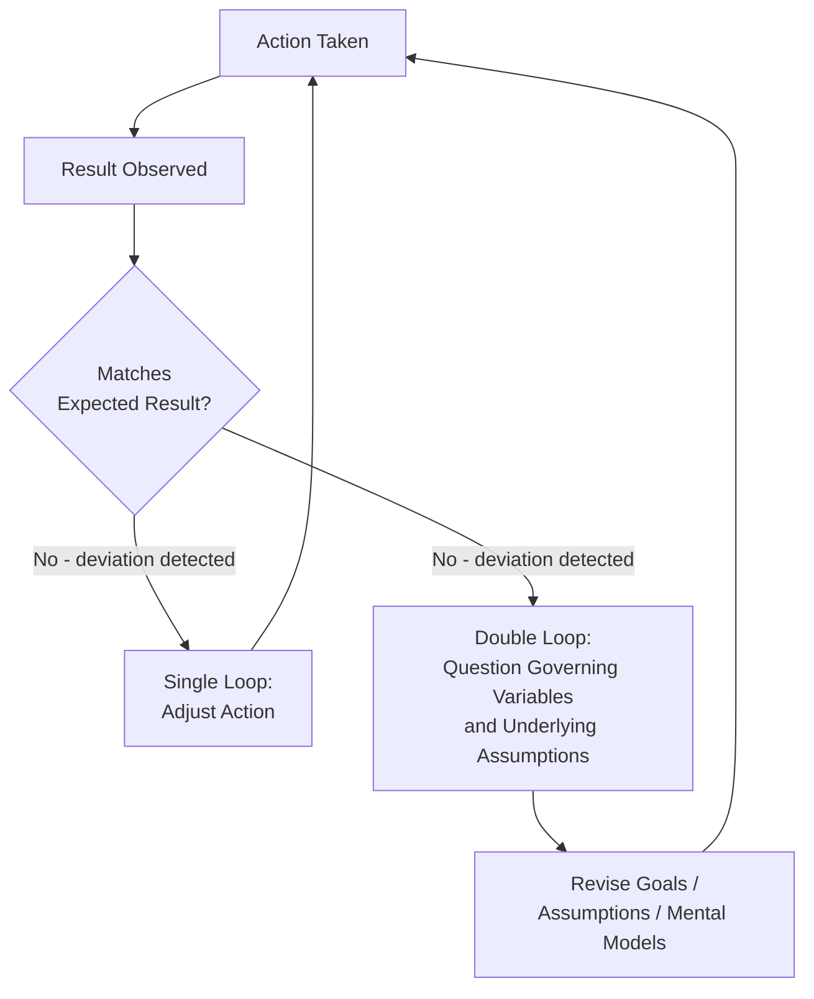
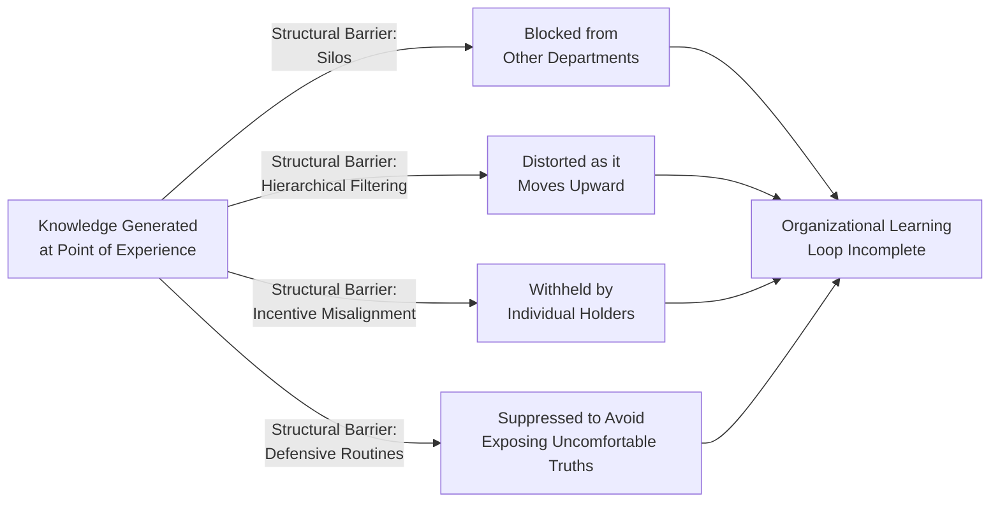

## Organizational Learning Loops and Knowledge Flow

### Overview

Organizational Learning Loops describes the feedback structures through which organizations detect, interpret, and act on information to improve their behavior over time — and Knowledge Flow describes how the resulting insight moves (or fails to move) across individuals, teams, and organizational boundaries. Together, these concepts extend systems thinking's feedback-loop vocabulary from technical/operational systems to the specifically cognitive and informational processes by which organizations "learn." The foundational distinction in this area — single-loop versus double-loop learning, developed by Chris Argyris and Donald Schön — is one of the most widely applied organizational-learning frameworks and connects directly to Senge's Mental Models discipline.

### Single-Loop vs. Double-Loop Learning

#### Single-Loop Learning

- **Key Points**
  - Single-loop learning occurs when an organization detects an error or deviation from expected results and corrects the action **without questioning the underlying assumptions, goals, or governing variables** that produced the error in the first place
  - Analogous to a thermostat: it detects when temperature deviates from a set point and takes corrective action (turning heating/cooling on or off), but never questions whether the set point itself is correct
  - This is efficient and appropriate for well-understood, stable problems where the underlying goals and assumptions are sound and only the specific action needs adjustment

#### Double-Loop Learning

- **Key Points**
  - Double-loop learning occurs when, in addition to correcting the immediate error, the organization also questions and potentially revises the underlying assumptions, goals, or "governing variables" that produced the situation calling for correction in the first place
  - Continuing the thermostat analogy: double-loop learning would involve questioning *why* the temperature set point is set where it is, and potentially changing the set point itself, not just the corrective action taken to reach it
  - Double-loop learning is considered essential for addressing recurring or deeply rooted organizational problems, since single-loop correction alone can perpetuate a flawed underlying structure indefinitely by repeatedly fixing symptoms without ever examining the goal or assumption generating them

- **Example**

  A customer support team missing response-time targets might, in single-loop fashion, simply add more staff or streamline scripts to hit the existing target faster. A double-loop response would additionally ask whether "response time" is even the right governing variable to optimize — perhaps "resolution quality" or "customer effort" better reflects what the organization actually wants to achieve, in which case the underlying goal itself, not just the action taken to meet it, needs revision.

### Organizational Learning as a Feedback Structure

- **Key Points**
  - Organizational learning can be represented as a feedback loop: **action → outcome → detection/interpretation of outcome → adjustment of future action**, with double-loop learning adding a second, deeper feedback path that can revise the goals and assumptions governing the first loop
  - The **speed and fidelity of the feedback loop** materially affects learning capacity: long delays between action and observable outcome (a structural property, connecting to "Organizational Structure as a Driver of Behavior") make it difficult for an organization to attribute outcomes correctly to the actions that caused them — directly related to Senge's "delusion of learning from experience" learning disability
  - **Interpretation** is a critical and often overlooked stage: the same outcome data can be interpreted differently depending on the mental models of those reviewing it, meaning organizational learning loops are not purely mechanical but are filtered through the Mental Models discipline at every cycle

### Knowledge Flow Across Organizational Boundaries

#### Tacit vs. Explicit Knowledge

- **Key Points**
  - **Explicit knowledge**: knowledge that can be readily articulated, documented, and transferred (procedures, manuals, data reports)
  - **Tacit knowledge**: knowledge that is difficult to articulate or formalize — skill-based intuition, contextual judgment, and experience-based pattern recognition that experienced practitioners often cannot fully explain even to themselves
  - Organizational learning loops depend heavily on converting relevant tacit knowledge into a form that can be shared and acted upon collectively, but this conversion is inherently lossy and effortful — a structural challenge distinct from simply having good documentation systems

#### Knowledge Flow Barriers (Structural, Not Just Individual)

- **Key Points**
  - **Organizational silos** (connecting directly to "Organizational Structure as a Driver of Behavior") structurally impede knowledge flow across functional boundaries, since information relevant to one department's decisions may be generated and held within another department with no structural mechanism for transfer
  - **Hierarchical filtering**: as information moves up through management layers, it is frequently summarized, filtered, and reframed — a structural property of hierarchical reporting that can systematically distort what senior decision-makers actually perceive about ground-level reality
  - **Incentive misalignment**: if knowledge-sharing is not structurally rewarded (or is implicitly penalized, e.g., if admitting uncertainty or error is punished), individuals rationally withhold knowledge that would otherwise support organizational learning — directly connecting to the "structure drives behavior" principle
  - **Defensive routines** (from the Team Learning discipline) specifically block the sharing of knowledge that would expose uncomfortable truths, since surfacing such knowledge threatens the psychological protections defensive routines are designed to maintain

### Mechanisms That Support Effective Knowledge Flow

- **Communities of practice**: informal groups of practitioners who share tacit knowledge through ongoing interaction, often more effective at transferring experience-based knowledge than formal documentation systems
- **Boundary-spanning roles**: individuals or teams whose explicit function is to bridge organizational silos, translating knowledge and priorities between otherwise disconnected parts of the organization — a structural intervention addressing the silo barrier directly
- **After-action review / retrospective practices**: structured processes explicitly designed to shorten the feedback delay between action and reflective learning, and to create space for double-loop questioning of underlying assumptions rather than only single-loop correction of specific actions
- **Psychological safety**: an organizational climate where surfacing errors, uncertainty, and dissenting views is not punished, directly addressing the defensive-routine and incentive-misalignment barriers to knowledge flow
- **Network/relationship mapping**: applying formal network analysis (as in "Network and Relationship Mapping") to visualize actual knowledge-flow patterns — frequently revealing that informal advice-seeking networks diverge substantially from formal organizational charts, surfacing unrecognized bottlenecks or isolated knowledge silos

### Relationship to Other Systems Thinking Concepts

| Concept | Connection to Organizational Learning Loops |
| --- | --- |
| Senge's Mental Models discipline | Interpretation stage of the learning loop is filtered through mental models; double-loop learning specifically requires surfacing and revising these models |
| Team Learning / Dialogue | Genuine dialogue is often necessary to surface the tacit knowledge and defensive routines that block effective knowledge flow |
| Organizational Structure as a Driver of Behavior | Knowledge-flow barriers (silos, hierarchical filtering, incentive misalignment) are structural properties, not individual failings |
| Systems Archetypes | "Shifting the Burden" is a common manifestation of single-loop-only learning: repeatedly applying a quick fix without double-loop examination of the underlying goal or assumption |
| Network and Relationship Mapping | Provides an empirical/structural method for visualizing actual (vs. formally assumed) knowledge-flow pathways |

### Common Pitfalls

- **Mistaking single-loop correction for genuine learning** — an organization that consistently adjusts actions to hit a target without ever questioning whether the target itself reflects the right underlying goal may appear to be "learning" (metrics improve) while a deeper structural problem persists indefinitely.
- **Assuming documentation systems solve knowledge flow** — investing in explicit-knowledge repositories (wikis, procedure manuals) while ignoring tacit-knowledge transfer mechanisms (communities of practice, mentorship, informal knowledge networks) addresses only part of the knowledge-flow challenge.
- **Underestimating hierarchical filtering** — senior leaders often believe they have accurate visibility into ground-level reality because formal reporting structures exist, without accounting for the systematic distortion that occurs as information is summarized and reframed moving up multiple management layers.
- **Punishing the surfacing of errors** — organizational cultures that penalize admitting mistakes or uncertainty structurally suppress the very information needed for double-loop learning, regardless of how strongly the organization claims to value learning and continuous improvement.
- **Treating knowledge flow as purely a technology problem** — assuming a new knowledge-management software platform will resolve knowledge-flow barriers that are actually structural (incentives, silos, psychological safety) rather than technical, tends to produce underused systems that do not address the root barriers.

### Practical Recommendations

- When a problem recurs despite repeated corrective action, explicitly ask whether the organization has been engaged in single-loop correction of symptoms without double-loop examination of the underlying governing goals or assumptions.
- Invest in reducing feedback delay between action and observable outcome wherever structurally possible, since long delays are a primary structural barrier to organizational learning regardless of individual analytical capability.
- Use network/relationship mapping to empirically assess actual knowledge-flow patterns rather than assuming the formal organizational chart reflects how information and expertise actually move.
- Explicitly build psychological safety and incentive alignment around surfacing errors and uncertainty, since these structural conditions determine whether double-loop learning can occur regardless of stated organizational values around learning.

### Related Topics

- Organizational Structure as a Driver of Behavior (structural barriers to knowledge flow)
- Team Learning and Systems Thinking Practice (dialogue and defensive routines)
- Senge's Five Disciplines of the Learning Organization (Mental Models discipline)
- Change Management Through a Systems Lens (double-loop learning in change design)
- Network and Relationship Mapping (visualizing actual knowledge-flow structure)
- Systems Archetypes (Shifting the Burden as a single-loop-only learning failure)