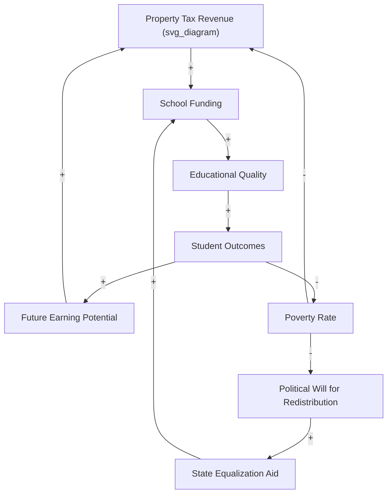
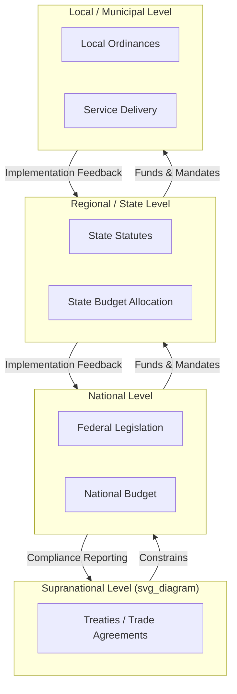

## Systems Thinking in Public Policy and Governance

### Overview

Public policy and governance systems are characterized by multiple interacting stakeholders, delayed feedback, distributed authority, and outcomes that emerge from the interaction of legal, economic, social, and institutional subsystems. Systems thinking provides a structured approach to understanding why policies produce unintended consequences, why problems persist despite repeated interventions, and how leverage points can be identified within complex governance structures. Unlike linear cause-effect policy analysis, systems thinking treats policy domains (healthcare, education, criminal justice, environmental regulation) as networks of interdependent feedback loops operating across multiple time scales and jurisdictional boundaries.

### Why Traditional Policy Analysis Falls Short

**Key Points**

- Traditional policy analysis often assumes linear causality: problem → intervention → outcome
- Real governance systems exhibit circular causality, where outcomes feed back to alter the conditions that produced them
- Policies frequently fail or backfire because they target symptoms rather than structural drivers
- Jurisdictional fragmentation (federal/state/local, or national/regional/municipal) means no single actor controls the entire system
- Time delays between policy implementation and observable effects (often years for education or public health policy) obscure causal attribution

Common failure patterns include:

- **Policy resistance**: the system compensates for an intervention, neutralizing its intended effect (e.g., increased road capacity leading to induced demand and unchanged congestion)
- **Shifting the burden**: a quick symptomatic fix undermines the capacity to apply a fundamental fix (e.g., emergency housing subsidies reducing pressure for structural affordable-housing reform)
- **Fixes that fail**: short-term relief followed by problem resurgence, often worse than before

### Core Systems Thinking Concepts Applied to Governance

#### Stocks and Flows in Policy Systems

Governance systems can be modeled using stock-and-flow structures, where stocks represent accumulated quantities (e.g., prison population, unemployed workforce, carbon in the atmosphere) and flows represent rates of change (e.g., incarceration rate, job creation rate, emissions rate).

$$\frac{dS}{dt} = \text{Inflow}(t) - \text{Outflow}(t)$$

Where $S$ is a policy-relevant stock (e.g., number of people below the poverty line), and inflow/outflow are influenced by policy levers (e.g., benefit eligibility rules, minimum wage, tax credits).

**Example**

Consider a stock representing the unemployed population, $U$:

- Inflow: layoffs, new labor-market entrants, discouraged workers re-entering the search
- Outflow: hiring rate, retirements, discouragement (exiting the labor force)

A policy that only addresses outflow (e.g., job training programs increasing hiring rate) without addressing inflow (e.g., economic volatility causing layoffs) will show diminishing returns as inflow continues unabated.

#### Feedback Loops in Governance

Reinforcing (R) and balancing (B) loops recur across policy domains:

- **Reinforcing loop example**: Concentrated poverty → underfunded schools (property-tax-based funding) → lower educational attainment → reduced earning potential → continued poverty concentration. This loop can lock in inequality across generations absent an external intervention.
- **Balancing loop example**: Rising crime → increased policing budget → (intended) reduced crime → reduced perceived need for policing budget → budget reduction → potential crime increase. Balancing loops seek equilibrium, but the equilibrium point itself may be undesirable.

#### Causal Loop Diagram: Education Funding and Inequality

This diagram shows a reinforcing loop (R: A→B→C→D→E→A) where wealthier districts perpetuate advantage, counterbalanced by a potential intervention loop through state equalization aid, which itself depends on political will that can erode as poverty concentrates (weakening the very feedback needed to trigger it).

### Leverage Points in Policy Systems

Donella Meadows' hierarchy of leverage points, ranked from least to most effective, is directly applicable to governance interventions:

1. **Constants, parameters, numbers** (lowest leverage): tax rates, subsidy amounts, budget allocations — easiest to change, weakest long-term effect
2. **Buffer sizes**: strategic reserves, rainy-day funds, stockpiles
3. **Physical structure**: infrastructure, institutional architecture (agency organization)
4. **Delays**: length of feedback loops (e.g., time between policy passage and measurable effect)
5. **Balancing feedback loop strength**: regulatory enforcement mechanisms, oversight bodies
6. **Reinforcing feedback loop strength**: progressive taxation (dampening wealth-concentration loops) or campaign finance rules (dampening influence-concentration loops)
7. **Information flows**: transparency laws, public reporting requirements, freedom-of-information mechanisms
8. **Rules of the system**: constitutions, statutes, regulatory frameworks, voting systems
9. **Self-organization**: capacity of the system to change its own structure (constitutional amendment processes, civil society formation)
10. **Goals of the system**: what the system is fundamentally optimizing for (GDP growth vs. wellbeing, punishment vs. rehabilitation)
11. **Paradigms** (highest leverage): the shared mindset from which the system's goals, structure, and rules arise (e.g., market-fundamentalist vs. commons-based governance paradigms)

**Key Points**

- Policymakers disproportionately intervene at low-leverage points (numbers, subsidies) because they are politically tractable and quickly visible
- High-leverage interventions (rules, paradigms) face greater resistance because they threaten existing power distributions
- Effective systemic reform often requires combining a low-leverage, visible action (to build coalition support) with a high-leverage structural change (to alter the loop dynamics)

### Multi-Level Governance as a Nested System

Public governance is a hierarchy of nested systems (supranational, national, regional, municipal), each with its own feedback loops, and each constrained by the levels above and below it (a structure sometimes described in institutional theory as polycentric governance, per Elinor Ostrom's work on managing common-pool resources).

[Inference] The effectiveness of polycentric governance structures for a given policy domain depends heavily on the alignment of incentives across levels; misaligned incentives (e.g., a national mandate without corresponding funding, sometimes called an "unfunded mandate") can produce implementation failure at the local level even when the policy design is sound at the national level.

### System Archetypes in Governance Contexts

| Archetype | Governance Example | Structural Pattern |
| --- | --- | --- |
| Tragedy of the Commons | Overfishing in unregulated waters, groundwater depletion | Multiple actors share a finite resource; individually rational extraction leads to collective depletion |
| Shifting the Burden | Opioid crisis response via increased prescribing regulation without addressing underlying pain-management and addiction treatment infrastructure | Symptomatic intervention reduces pressure for fundamental fix, which atrophies |
| Limits to Growth | Urban infrastructure reaching capacity as population grows, causing service degradation | A reinforcing growth loop encounters a balancing loop from a constraining resource (roads, water systems, school capacity) |
| Escalation | Arms races between nations, or "tough on crime" legislative bidding between political parties | Two or more actors each react to the other's actions, driving reinforcing mutual escalation |
| Success to the Successful | Concentration of federal research funding in already well-funded universities | Two competing entities draw from the same limited resource pool; initial advantage compounds |
| Fixes that Fail | Increasing police presence to reduce visible homelessness, displacing rather than resolving the underlying housing/mental-health system gap | A quick fix produces short-term relief but the underlying problem resurfaces, often intensified |

### Stakeholder and Actor Mapping

Governance systems require explicit mapping of actors, their incentives, and their positions within feedback structures, since policy outcomes emerge from the interaction of actors with divergent (and often conflicting) objective functions.

**Example**

For a carbon pricing policy, relevant stakeholder categories include:

- **Regulators**: seeking measurable emissions reduction and political viability
- **Industry incumbents**: seeking to minimize compliance cost, potentially lobbying to weaken enforcement (a balancing loop that can suppress the policy's intended reinforcing effect on decarbonization)
- **Emerging clean-tech sector**: benefiting from the policy, potentially reinforcing political support over time as the sector grows (a reinforcing loop favoring policy persistence)
- **Consumers**: bearing pass-through costs, whose political response (support or backlash) feeds back into regulator incentives

This stakeholder interaction can be represented as a modified causal loop diagram or, for more rigorous analysis, as an agent-based model where each actor type follows a distinct decision rule.

### Quantitative and Computational Approaches

#### System Dynamics Modeling

System dynamics (originated by Jay Forrester, later applied to global policy in the *Limits to Growth* study) uses differential-equation-based simulation to model policy stocks, flows, and feedback over time. Governance applications include:

- Epidemiological policy modeling (SIR/SEIR compartmental models informing public health interventions)
- Climate policy modeling (integrated assessment models such as DICE/RICE, which couple economic and climate subsystems)
- Urban planning models (housing stock, transportation capacity, population dynamics)

A simplified compartmental model relevant to public health policy:

$$\frac{dS}{dt} = -\beta S I, \quad \frac{dI}{dt} = \beta S I - \gamma I, \quad \frac{dR}{dt} = \gamma I$$

where $S$, $I$, $R$ represent susceptible, infected, and recovered population stocks, $\beta$ is the transmission rate (a parameter directly affected by policy levers such as mask mandates or gathering restrictions), and $\gamma$ is the recovery rate.

#### Agent-Based Modeling for Policy Simulation

Agent-based models (ABMs) simulate heterogeneous actors (citizens, firms, agencies) following behavioral rules, allowing emergent macro-level policy outcomes to arise from micro-level interaction rules. This approach is used in:

- Housing market and gentrification simulation
- Traffic and transportation policy testing
- Epidemic spread with heterogeneous contact networks
- Tax policy behavioral response modeling

[Unverified] The predictive accuracy of any specific ABM or system dynamics model for real-world policy outcomes depends heavily on calibration data quality and model structure validity; such models are generally more reliable for exploring qualitative dynamics and comparing intervention scenarios than for precise point forecasts.

### Applying Systems Thinking to Policy Design: A Structured Process

**Next Steps** (as a practical methodology, not literal navigation steps)

1. **Define the boundary**: explicitly state which actors, institutions, and processes are included in the analysis and which are treated as exogenous
2. **Identify stocks and flows**: enumerate the accumulating quantities relevant to the policy problem (debt, population health, infrastructure condition, institutional trust)
3. **Map feedback loops**: construct causal loop diagrams identifying reinforcing and balancing structures
4. **Locate delays**: identify where feedback is delayed (e.g., electoral cycles vs. policy maturation timelines), since delays are a major source of policy oscillation and overcorrection
5. **Identify archetypal patterns**: check whether the problem matches a known archetype (shifting the burden, tragedy of the commons, escalation)
6. **Evaluate leverage points**: assess where intervention would have the highest structural effect, not merely the most immediate visibility
7. **Simulate or model**: where feasible, use system dynamics or agent-based simulation to test intervention scenarios before full-scale implementation
8. **Monitor and adapt**: implement adaptive governance structures (sometimes called adaptive management) that build in feedback-driven course correction rather than assuming a static, one-time policy fix

### Institutional and Theoretical Foundations

- **Elinor Ostrom's design principles for commons governance**: derived from empirical study of self-organized resource management systems, identifying structural conditions (clearly defined boundaries, congruence between rules and local conditions, collective-choice arrangements, monitoring, graduated sanctions, conflict-resolution mechanisms, nested enterprises) that sustain cooperative equilibria in shared-resource systems
- **Donella Meadows' *Thinking in Systems***: foundational text translating general systems dynamics into practical heuristics for social and policy systems, including the leverage-points framework referenced above
- **Herbert Simon's bounded rationality**: relevant to governance because policymakers and bureaucratic agents operate with limited information-processing capacity, shaping how feedback is perceived and acted upon within institutions
- **Complexity/adaptive systems governance**: literature on "muddling through" (Charles Lindblom) and adaptive policy cycles that account for irreducible uncertainty in complex governance systems, favoring iterative, reversible interventions over comprehensive, static plans

### Practical Governance Applications by Domain

| Domain | Systemic Challenge | Systems Thinking Application |
| --- | --- | --- |
| Public health | Delayed feedback between intervention and epidemiological outcome | Compartmental modeling, scenario simulation before mandate implementation |
| Environmental regulation | Diffuse, long-delay externalities (climate, biodiversity loss) | Integrated assessment modeling, tragedy-of-the-commons frameworks, Ostrom-style polycentric regulation |
| Criminal justice | Reinforcing loops between incarceration, poverty, and recidivism | Causal loop mapping to identify whether interventions address root causes or symptoms |
| Urban planning | Limits-to-growth dynamics in infrastructure capacity | System dynamics modeling of housing, transit, and population stocks |
| Economic policy | Reinforcing wealth-concentration loops, boom-bust balancing cycles | Stock-flow consistent macroeconomic modeling, leverage-point analysis of tax and regulatory structure |
| Education policy | Success-to-the-successful funding dynamics | Structural funding-formula redesign targeting rule-level leverage rather than parameter-level (grant amount) adjustments |

### Limitations and Critiques of Systems Thinking in Governance

**Key Points**

- Causal loop diagrams are qualitative and can obscure disagreement about the actual sign or strength of a causal link between stakeholders
- Quantitative system dynamics models require assumptions (functional forms, parameter values) that may not be empirically validated, risking false precision
- Systems thinking frameworks can be used to justify inaction ("the system is too complex to intervene") as easily as to justify intervention
- Power and political economy are sometimes underweighted in systems diagrams that treat all actors as symmetric nodes, when in practice actors have vastly different capacity to influence system structure
- [Speculation] Overreliance on systems modeling outputs without corresponding stakeholder legitimacy and democratic accountability processes could produce technically elegant but politically unimplementable policy recommendations

### Related Topics

- System dynamics modeling and Vensim/Stella simulation tools
- Causal loop diagram construction methodology
- Donella Meadows' leverage points framework (deep dive)
- Elinor Ostrom's institutional analysis and development (IAD) framework
- Agent-based modeling for social systems
- Systems thinking in organizational management (contrast with governance-scale application)
- Complex adaptive systems theory
- Policy feedback theory (Paul Pierson, political science literature)
- Wicked problems framework (Rittel and Webber)
- Systems thinking in environmental and climate policy