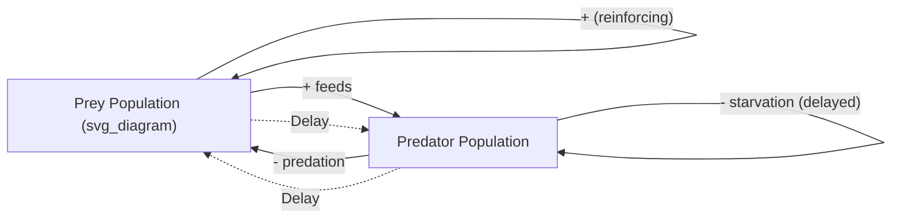
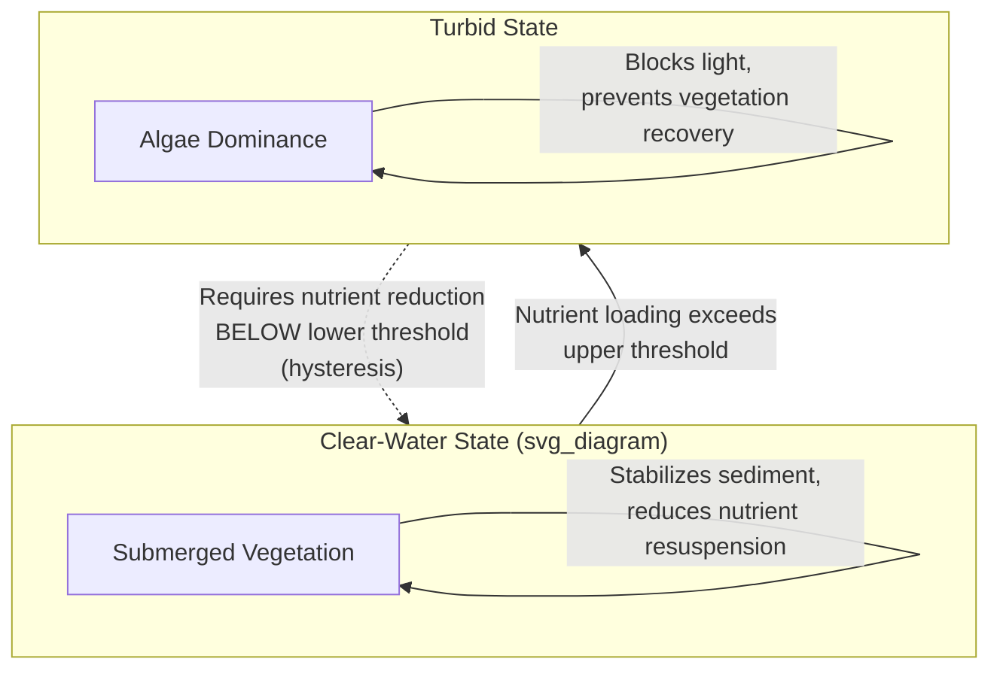
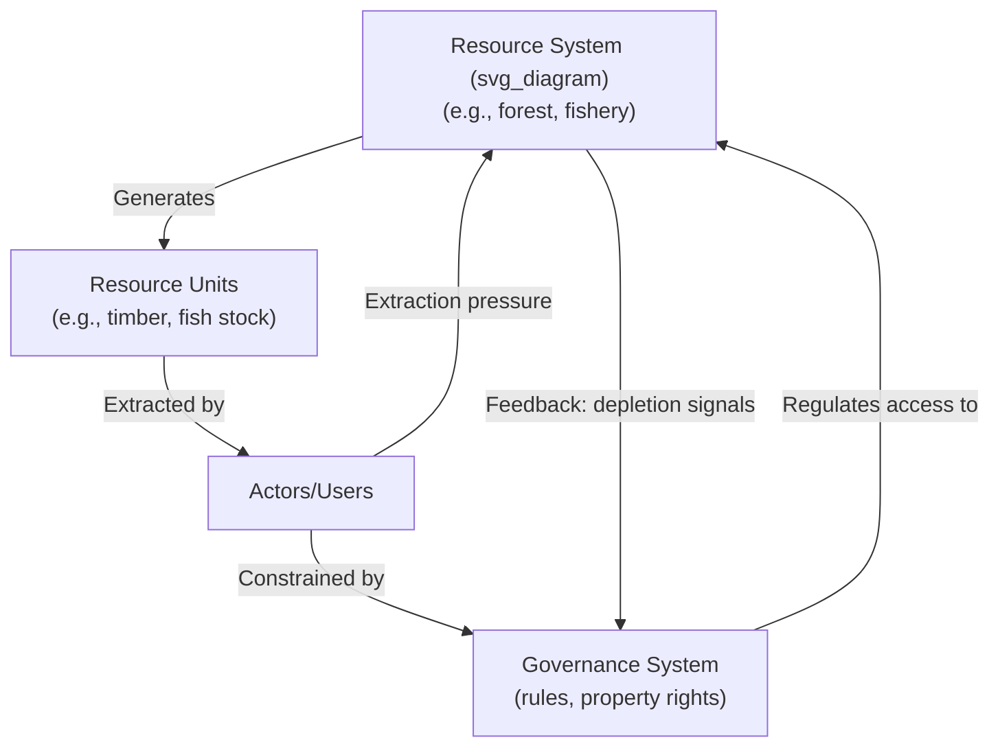

## Systems Thinking in Environmental and Ecological Systems

### Overview

Ecological and environmental systems are paradigmatic examples of complex adaptive systems: networks of interdependent species, physical processes, and biogeochemical cycles connected through nonlinear feedback loops, operating across nested spatial scales (organism, population, ecosystem, biome, biosphere) and temporal scales (seasonal cycles to geological time). Systems thinking in this domain provides the conceptual and mathematical tools to understand phenomena such as population dynamics, ecosystem resilience, tipping points, and the coupling between human socioeconomic activity and natural systems (socio-ecological systems). This domain is also where much of general systems theory and system dynamics originated empirically, given ecology's early adoption of feedback-based modeling.

### Foundational Concepts

#### Ecosystems as Networks of Stocks and Flows

Ecosystems can be modeled as stocks (biomass of a species population, nutrient concentration in soil, carbon stored in a forest) connected by flows (birth/death rates, nutrient uptake/release, carbon sequestration/emission).

$$\frac{dN}{dt} = rN\left(1 - \frac{N}{K}\right)$$

This is the logistic growth equation, where $N$ is population size (a stock), $r$ is the intrinsic growth rate, and $K$ is the carrying capacity — the balancing feedback loop constraining the reinforcing growth loop $rN$. As $N$ approaches $K$, the term $\left(1 - \frac{N}{K}\right)$ approaches zero, throttling growth — a direct example of a balancing (negative) feedback loop operating on a biological stock.

#### Predator-Prey Dynamics as Coupled Feedback Loops

The Lotka-Volterra equations formalize a two-stock, coupled reinforcing/balancing system:

$$\frac{dx}{dt} = \alpha x - \beta xy$$

$$\frac{dy}{dt} = \delta xy - \gamma y$$

Where $x$ is prey population, $y$ is predator population, $\alpha$ is prey growth rate, $\beta$ is predation rate, $\delta$ is predator growth efficiency from consumption, and $\gamma$ is predator death rate. This produces oscillatory dynamics: prey growth (reinforcing) feeds predator growth, which increases predation (balancing prey), which then starves predators (balancing predator population), allowing prey to recover — a classic delayed balancing loop pair producing cyclical rather than steady-state behavior.

### Feedback Loops in Ecological and Climate Systems

#### Reinforcing (Amplifying) Feedback Loops

- **Ice-albedo feedback**: warming melts reflective ice/snow → exposes darker ocean/land surface → increases solar absorption → further warming. This is a well-documented reinforcing loop in climate science.
- **Permafrost-carbon feedback**: warming thaws permafrost → releases stored methane and CO₂ → increases greenhouse forcing → further warming
- **Forest dieback feedback**: drought stresses forest → tree mortality reduces transpiration and canopy cover → reduced local rainfall recycling → further drought stress (documented in Amazon basin research)

#### Balancing (Stabilizing) Feedback Loops

- **Carbon cycle buffering**: increased atmospheric CO₂ → increased plant photosynthetic uptake (CO₂ fertilization effect) → partial reabsorption of emitted carbon
- **Cloud feedback (partially balancing in some models)**: warming increases evaporation → increased low-cloud cover in some regimes → increased albedo → partial cooling offset [Inference: cloud feedback sign and magnitude remain an active area of climate science research and vary by cloud type and altitude, making this one of the more uncertain feedback mechanisms in climate models]
- **Population-resource balancing**: population growth increases resource consumption → resource scarcity increases mortality/reduces birth rate → population stabilizes below or at carrying capacity

### Tipping Points and Regime Shifts

A central concept in ecological systems thinking is the existence of multiple stable states (alternative stable equilibria), where a system can shift abruptly from one regime to another once a threshold (tipping point) is crossed, often exhibiting hysteresis (the system does not return to its original state via the same path when the driving pressure is reversed).

$$\text{Resilience} \neq \text{Stability}$$

Resilience, in the ecological sense (C.S. Holling's definition), refers to the amount of disturbance a system can absorb before shifting to a different stable regime — distinct from engineering resilience, which measures return time to a single equilibrium.

**Example**

Shallow lake ecosystems exhibit a well-documented regime shift: a clear-water state (dominated by submerged vegetation) can shift to a turbid, algae-dominated state once nutrient loading (phosphorus) crosses a critical threshold. Because the turbid state is self-reinforcing (algae block light needed for vegetation recovery, and vegetation loss removes a nutrient-sequestering mechanism), simply reducing nutrient input below the original threshold is often insufficient to restore the clear-water state — a hysteresis effect requiring much larger intervention (or additional measures like biomanipulation) to reverse.

### System Archetypes in Ecological Contexts

| Archetype | Ecological Example | Structural Pattern |
| --- | --- | --- |
| Tragedy of the Commons | Overfishing of shared fisheries, deforestation of open-access forests | Shared finite resource, individually rational extraction leads to collective depletion |
| Limits to Growth | Population overshoot and die-off (e.g., reindeer population crashes on isolated islands) | Reinforcing growth loop meets a balancing carrying-capacity constraint, often with overshoot due to delay |
| Escalation | Invasive species arms races with native competitors/predators | Two populations mutually respond to each other's adaptations |
| Eroding Goals | Gradual weakening of conservation targets as species decline continues (shifting baseline syndrome) | Repeated compromise on a goal in response to persistent gap between goal and reality |
| Shifting the Burden | Chemical pesticide use suppressing pest populations short-term while destroying natural predator populations, worsening long-term pest pressure | Symptomatic fix undermines fundamental fix (integrated pest management, biodiversity-based control) |

### Socio-Ecological Systems (SES) Framework

Ostrom's Social-Ecological Systems framework formalizes the coupling between human governance institutions and ecological resource systems, decomposing an SES into four core subsystems:

1. **Resource system** (e.g., a fishery, forest, aquifer) — the boundaries and size of the ecological stock
2. **Resource units** (e.g., fish, timber, water) — the extractable flow from the resource system
3. **Governance system** (e.g., regulatory bodies, property rights regimes, community institutions) — the rules structuring access and use
4. **Actors/users** — the human agents extracting resource units, whose behavior is shaped by (and shapes) the governance system

These four subsystems interact through a set of first-tier variables and produce outcomes that feed back into the resource system, closing the loop between social and ecological dynamics — making purely ecological or purely economic analysis insufficient in isolation.

### Quantitative Modeling Approaches

#### System Dynamics for Environmental Policy

The *Limits to Growth* study (Meadows et al., 1972, using the World3 model) is a foundational application of system dynamics to global environmental-economic coupling, modeling interactions among population, industrial capital, food production, resource depletion, and pollution as interlinked stocks and flows. Contemporary descendants include integrated assessment models (IAMs) such as DICE, FUND, and PAGE, which couple simplified climate physics with economic damage functions to inform climate policy.

#### Ecological Network Analysis

Food webs and ecosystem nutrient/energy flows are frequently modeled as directed graphs, where node centrality measures (e.g., keystone species identification) reveal which nodes exert disproportionate structural influence relative to their biomass — a direct ecological analogue of the leverage-points concept.

$$\text{Connectance} = \frac{L}{S^2}$​​​

Where $L$ is the number of realized trophic links and $S$ is the number of species (nodes), a standard metric of food-web complexity used to assess network robustness to species loss.

#### Agent-Based and Individual-Based Models (IBMs)

IBMs simulate discrete organisms with behavioral rules (movement, foraging, reproduction) to generate emergent population and community-level patterns, used extensively in conservation biology for scenario testing (e.g., simulating the effect of habitat fragmentation on metapopulation viability) and in fisheries management (individual-based fish stock models).

### Leverage Points Applied to Ecological Intervention

Applying Meadows' leverage-points hierarchy to environmental systems:

- **Low leverage (parameters)**: adjusting fishing quotas, pesticide application rates, emissions caps at the margin
- **Mid leverage (feedback loop strength)**: strengthening enforcement of protected-area boundaries (balancing loop), or removing subsidies for fossil fuel extraction (weakening a reinforcing loop)
- **High leverage (rules)**: establishing property rights regimes for common-pool resources (per Ostrom's design principles), rewriting environmental impact assessment requirements
- **Highest leverage (paradigm)**: shifting from a paradigm treating ecosystems as extractable resource stocks (natural capital framed purely instrumentally) to one recognizing ecological limits as hard system boundaries (planetary boundaries framework, Rockström et al.)

**Key Points**

- Environmental policy frequently intervenes at low-leverage points (emissions targets, subsidies) because they are measurable and politically negotiable
- Genuine ecological resilience often requires higher-leverage structural changes (property rights, institutional redesign, paradigm shifts) that face greater political resistance
- The planetary boundaries framework itself functions as a proposed paradigm-level leverage point, reframing economic growth as bounded by biophysical system limits rather than treating the environment as an externality

### Resilience Thinking and Adaptive Cycles

C.S. Holling's adaptive cycle model describes ecosystems (and by extension socio-ecological systems) as moving through four phases:

1. **Exploitation (r)**: rapid growth, colonization of available niches
2. **Conservation (K)**: accumulation of resources and structure, increasing efficiency but decreasing flexibility/resilience
3. **Release (Ω)**: rapid, often disturbance-triggered collapse of accumulated structure (fire, pest outbreak, disease)
4. **Reorganization (α)**: novel recombination of remaining resources, seeding the next exploitation phase

[Inference] This adaptive cycle framework is widely used descriptively in resilience literature, though empirically validating the timing and triggers of phase transitions in specific real-world ecosystems remains difficult given the complexity of confounding disturbance factors.

### Practical Applications by Sub-Domain

| Sub-Domain | Systemic Challenge | Systems Thinking Application |
| --- | --- | --- |
| Climate policy | Long-delay, globally diffuse reinforcing feedback loops | Integrated assessment modeling, planetary boundaries framework, tipping-point/hysteresis analysis |
| Fisheries management | Tragedy-of-the-commons dynamics with delayed stock-recovery feedback | Ostrom-style co-management institutions, stock-recruitment modeling |
| Conservation biology | Metapopulation viability under habitat fragmentation | Agent-based/individual-based modeling, network connectivity analysis |
| Water resource management | Aquifer depletion with long recharge delays | System dynamics modeling of groundwater stocks, adaptive allocation rules |
| Invasive species management | Escalation and reinforcing spread dynamics | Network-based spread modeling, early intervention at low-stock leverage points before establishment |
| Agricultural systems | Shifting-the-burden dynamics from monoculture/pesticide dependency | Integrated pest management, agroecological system redesign (rule-level leverage) |

### Limitations and Critiques

**Key Points**

- Ecological systems models require simplifying assumptions (functional forms for growth, interaction coefficients) that can materially affect predicted dynamics; small parameter changes can shift a model from stable to chaotic behavior in nonlinear systems
- Tipping points are often only identifiable in retrospect (after being crossed), limiting the practical predictive value of threshold-based models for proactive policy, though early-warning signal research (e.g., critical slowing down, increased variance) attempts to address this
- Coupling social and ecological subsystems (SES framework) is conceptually powerful but empirically demanding, requiring interdisciplinary data collection across governance, economic, and ecological variables simultaneously
- [Speculation] Overemphasis on quantitative modeling in environmental systems thinking risks marginalizing traditional ecological knowledge and place-based qualitative understanding that may capture system dynamics not easily formalized mathematically

### Related Topics

- Planetary boundaries framework (Rockström et al.)
- Resilience thinking and adaptive cycles (Holling, Gunderson)
- Ostrom's design principles for common-pool resource governance
- Ecological network analysis and food web modeling
- Integrated assessment models (DICE, FUND, PAGE) for climate policy
- Early-warning signals for critical transitions (critical slowing down)
- System dynamics modeling with Vensim/Stella (World3 model deep dive)
- Systems thinking in public policy and governance (cross-reference)
- Complex adaptive systems theory
- Biogeochemical cycle modeling (carbon, nitrogen, phosphorus cycles)