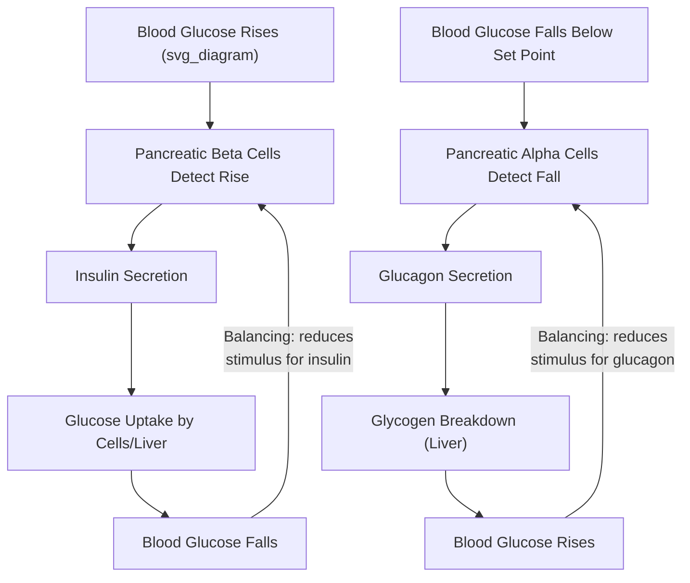
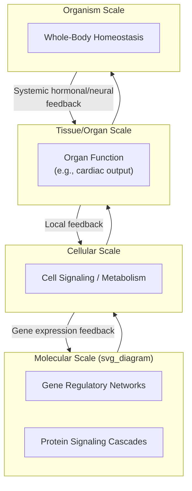
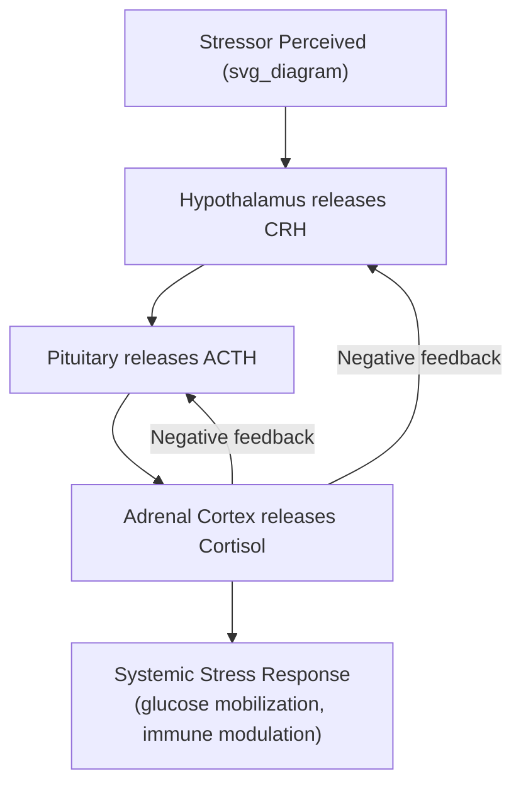

## Systems Biology and Physiological Systems

### Overview

Systems biology applies systems thinking to living organisms, treating cells, organs, and whole physiological systems as networks of interacting components (genes, proteins, metabolites, cells, organs) whose emergent behavior — homeostasis, disease, development, aging — cannot be understood by studying components in isolation. This domain formalized much of general systems theory's core vocabulary (feedback, homeostasis, regulation) well before its adoption in engineering and social sciences, since physiologist Walter Cannon coined "homeostasis" and cybernetics pioneer Norbert Wiener drew directly on physiological regulation as a founding model for feedback control theory.

### Foundational Concepts

#### Homeostasis as Balancing Feedback

Homeostasis is the canonical biological example of a balancing (negative) feedback loop: a physiological variable (body temperature, blood glucose, blood pH) is maintained near a set point despite external perturbation, through a sensor-comparator-effector control structure directly analogous to engineering control systems.

$$\text{Error}(t) = \text{Set Point} - \text{Measured Value}(t)$$

$$\text{Effector Response}(t) = f(\text{Error}(t))$$

**Example**

Blood glucose regulation:

- **Sensor**: pancreatic beta cells detect blood glucose concentration
- **Comparator**: deviation from the homeostatic set point (~70–100 mg/dL fasting) triggers hormonal response
- **Effector**: insulin secretion (glucose uptake, lowering blood glucose — balancing loop) when glucose is high; glucagon secretion (glycogen breakdown, raising blood glucose) when glucose is low
- This dual-hormone antagonistic control (insulin/glucagon) is a classic push-pull balancing mechanism, allowing bidirectional correction rather than a single-direction throttle

#### Reinforcing Feedback in Physiology

While homeostasis is dominated by balancing loops, reinforcing (positive) feedback loops appear at specific physiological junctures, typically to drive a process rapidly to completion rather than to maintain equilibrium:

- **Labor/childbirth**: uterine contractions stimulate oxytocin release, which increases contraction intensity, further increasing oxytocin — a reinforcing loop that terminates only upon delivery (an external boundary condition breaking the loop)
- **Blood clotting cascade**: initial platelet activation releases signaling molecules that recruit and activate more platelets, rapidly amplifying clot formation — a reinforcing loop bounded by clot-dissolving balancing mechanisms (fibrinolysis) to prevent runaway thrombosis
- **Action potential generation**: depolarization opens voltage-gated sodium channels, which increases depolarization, further opening channels — an extremely fast reinforcing loop terminated by channel inactivation (a time-delayed balancing mechanism)

### Multi-Scale Nested Systems in Physiology

Physiological systems are organized as nested hierarchies, with feedback operating both within and across scale boundaries:

[Inference] Disease states can often be understood as failures of feedback regulation at a specific scale, or failures of cross-scale communication (e.g., a molecular-level mutation disrupting a signaling pathway that cascades into organ-level dysfunction and eventually organism-level symptoms), though the precise causal chain is frequently difficult to fully elucidate given the density of cross-scale interactions.

### Gene Regulatory Networks (GRNs)

Gene expression is controlled by networks of transcription factors that activate or repress target genes, forming directed graphs with well-characterized recurring motifs:

- **Negative autoregulation**: a gene product represses its own transcription — a balancing loop that speeds response time and reduces expression noise compared to unregulated transcription
- **Positive autoregulation**: a gene product enhances its own transcription — a reinforcing loop capable of producing bistability (switch-like behavior between "on" and "off" expression states)
- **Feedforward loops**: a common three-node motif (regulator X → regulator Y, both X and Y → target Z) that can function as a noise filter or a pulse generator depending on the logic (AND/OR) governing Z's activation

$$\frac{d[\text{mRNA}]}{dt} = \alpha \cdot H([\text{TF}]) - \delta [\text{mRNA}]$$

Where $H([\text{TF}])$ is typically a Hill function representing cooperative transcription factor binding, $\alpha$ is the maximal transcription rate, and $\delta$ is the mRNA degradation rate — a standard stock-flow formalization of gene expression dynamics used in computational systems biology.

### Systems Archetypes in Physiological Contexts

| Archetype | Physiological Example | Structural Pattern |
| --- | --- | --- |
| Limits to Growth | Tumor growth limited by angiogenesis/nutrient diffusion (before vascularization) | Reinforcing cell-division loop constrained by a balancing nutrient/oxygen-supply limit |
| Escalation | Cytokine storm (immune overactivation in severe infection) | Immune signaling mutually amplifies across cell populations, escalating beyond the balancing regulatory capacity |
| Fixes that Fail | Antibiotic overuse suppressing susceptible bacteria while selecting for resistant strains | Short-term symptomatic relief undermines long-term treatment efficacy |
| Shifting the Burden | Chronic use of exogenous insulin/medication substituting for addressed lifestyle-driven insulin resistance | Symptomatic management reduces pressure to address root metabolic dysfunction |
| Success to the Successful | Clonal dominance in cancer evolution (fitter clones outcompete for shared resources) | Two or more cell populations compete for shared resource; advantage compounds |

### Homeostasis, Allostasis, and Systemic Resilience

- **Homeostasis**: maintenance of a fixed physiological set point via balancing feedback (classical model, e.g., body temperature ~37°C)
- **Allostasis**: a refinement recognizing that some physiological set points are dynamically adjusted based on anticipated demand (e.g., blood pressure elevation in anticipation of stress, mediated by predictive neural/endocrine signaling) rather than held rigidly constant
- **Allostatic load**: the cumulative physiological wear from chronic activation of allostatic response systems, a concept linking systemic stress-response feedback to long-term disease risk — analogous to the concept of resilience erosion in ecological systems (Holling's adaptive cycle "conservation" phase, which reduces flexibility over time)

### Quantitative and Computational Systems Biology

#### Ordinary Differential Equation (ODE) Models

Physiological subsystems are frequently modeled as coupled ODE systems representing concentrations, populations, or physical quantities as continuous stocks:

$$\frac{dx_i}{dt} = \sum_j f_{ij}(x_j) - \sum_k g_{ik}(x_i)$$

Applied domains include pharmacokinetic/pharmacodynamic (PK/PD) modeling (drug concentration and effect over time), cardiovascular circulation models (pressure-flow dynamics across vascular compartments), and endocrine axis models (hypothalamic-pituitary-adrenal axis feedback modeling for stress-hormone regulation).

#### Boolean and Logical Network Models

For systems where continuous kinetic parameters are unavailable or unnecessary, genes/proteins are modeled as binary (on/off) nodes with logical update rules, useful for qualitatively capturing regulatory network attractor states (stable expression patterns corresponding to cell fates/phenotypes) without requiring precise kinetic constants.

#### Agent-Based and Multi-Scale Models

Immune system simulations, tumor microenvironment models, and epidemiological-within-host models frequently use agent-based approaches to represent heterogeneous cell populations interacting locally, with emergent tissue-level behavior arising from individual cell decision rules (analogous to ecological individual-based models).

### The HPA Axis: An Extended Physiological Feedback Example

The hypothalamic-pituitary-adrenal (HPA) axis illustrates a multi-node balancing feedback cascade central to stress physiology:

Cortisol's negative feedback onto both the hypothalamus and pituitary is a textbook multi-point balancing loop; chronic stress can blunt this feedback sensitivity over time (a documented phenomenon in stress physiology), effectively weakening the balancing loop's gain and permitting sustained elevated cortisol — a mechanism proposed to link chronic stress to allostatic-load-related disease risk. [Inference] The precise causal contribution of HPA-axis dysregulation to specific downstream disease outcomes varies across the literature and is generally treated as one contributing factor among several rather than a sole determinant.

### Leverage Points in Physiological and Therapeutic Intervention

Applying the leverage-points hierarchy to medicine and physiology:

- **Low leverage (parameters)**: symptomatic dosing adjustments (e.g., titrating a single medication dose)
- **Mid leverage (feedback loop strength)**: drugs that modulate a regulatory feedback gain (e.g., beta-blockers dampening sympathetic reinforcing cardiovascular loops)
- **High leverage (rules/structure)**: gene therapy or receptor-structure-altering interventions changing the underlying regulatory architecture rather than just its current state
- **Highest leverage (paradigm)**: a shift from single-target pharmacology (one drug, one receptor) to network pharmacology and systems medicine, which explicitly designs interventions around network topology (e.g., targeting hub nodes or feedback-loop chokepoints identified via network analysis) rather than isolated targets

**Key Points**

- Traditional pharmacology has historically concentrated on low/mid-leverage single-target interventions
- Systems medicine and network pharmacology represent an explicit paradigm-level shift toward treating disease as a network-level dysregulation rather than a single-molecule deficiency
- Polypharmacy and drug interaction complexity are direct practical consequences of intervening in a densely interconnected physiological network — a change at one node propagates through many feedback paths

### Practical Applications by Sub-Domain

| Sub-Domain | Systemic Challenge | Systems Thinking Application |
| --- | --- | --- |
| Endocrinology | Multi-hormone axis feedback (HPA, HPG, thyroid axes) | Feedback loop mapping, ODE modeling of hormone cascades |
| Oncology | Tumor heterogeneity and evolutionary dynamics | Agent-based modeling of clonal competition, network analysis of signaling pathway rewiring |
| Immunology | Cytokine network regulation, autoimmune escalation loops | Network modeling of cytokine feedback, identification of reinforcing-loop chokepoints for therapeutic targeting |
| Pharmacology | Drug interaction and polypharmacy effects | Network pharmacology, PK/PD systems modeling |
| Cardiology | Cardiovascular pressure-flow regulation (baroreflex) | Control-theoretic modeling of baroreceptor feedback loops |
| Developmental biology | Cell fate determination via GRN attractor states | Boolean/logical network modeling of regulatory network stable states |

### Limitations and Critiques

**Key Points**

- Physiological systems models often require parameter estimation from heterogeneous experimental sources (in vitro, animal model, human clinical data), introducing calibration uncertainty
- Emergent behaviors in dense biological networks (redundancy, compensation, robustness) can make single-node "knockout" predictions from simplified models diverge from actual experimental or clinical outcomes
- Reductionist molecular biology and systems-level modeling are complementary but methodologically distinct; systems biology models are only as reliable as the mechanistic detail (or appropriately abstracted approximation) captured in their underlying network structure
- [Speculation] The transition from single-target to network-based systems medicine may face practical translational barriers (regulatory frameworks built around single-mechanism drug approval, clinical trial design assuming isolated causal pathways) that are structural rather than purely scientific in nature

### Related Topics

- Gene regulatory network motifs and Boolean network modeling
- Pharmacokinetic/pharmacodynamic (PK/PD) systems modeling
- Network pharmacology and systems medicine
- Allostasis and allostatic load (stress physiology)
- HPA axis and neuroendocrine feedback regulation
- Agent-based modeling of tumor microenvironments and immune dynamics
- Systems thinking in environmental and ecological systems (cross-reference: shared modeling formalisms)
- Cybernetics and control theory foundations (Wiener, Cannon)
- Multi-scale modeling methods in computational biology
- Complex adaptive systems theory