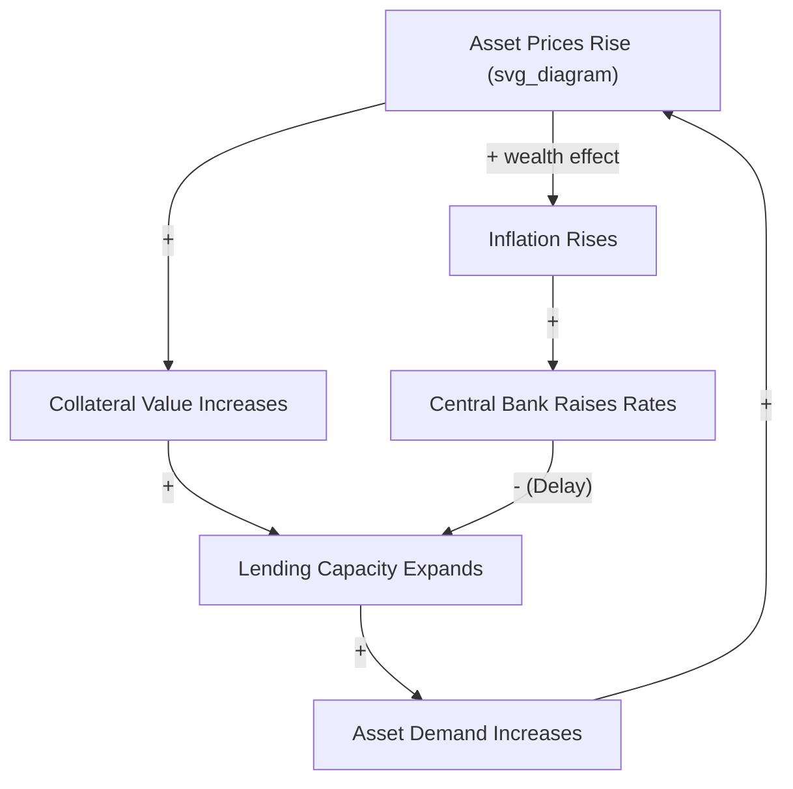
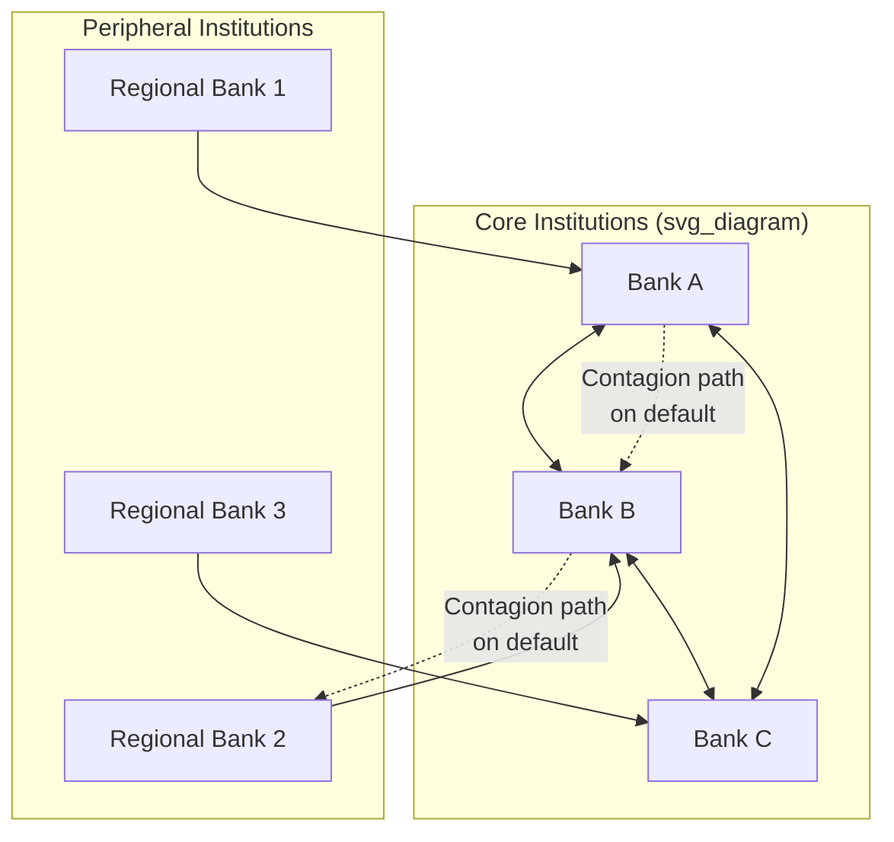

## Systems Thinking in Economics and Complexity Economics

### Overview

Economics has historically been dominated by equilibrium-based models (general equilibrium theory, rational-actor optimization) that assume markets converge to stable, predictable states. Systems thinking — and its more formalized descendant, complexity economics — challenges this assumption by treating economies as complex adaptive systems: networks of heterogeneous, boundedly rational agents (consumers, firms, banks, regulators) interacting through feedback loops, producing emergent phenomena (business cycles, financial crises, market bubbles, inequality dynamics) that are not derivable from equilibrium analysis alone. This domain draws directly on system dynamics, network theory, and agent-based modeling to explain phenomena that classical economic models systematically underpredict or miss entirely, most notably financial crises.

### Equilibrium Economics vs. Complexity Economics

**Key Points**

- Neoclassical general equilibrium theory assumes markets clear through price adjustment toward a unique, stable equilibrium, with representative (often homogeneous) rational agents
- Complexity economics (associated with W. Brian Arthur, the Santa Fe Institute, and others) instead models economies as being perpetually out of equilibrium, or exhibiting multiple possible equilibria, shaped by heterogeneous agents, increasing returns, and path dependence
- Complexity economics treats the economy as an evolving system, not a mechanism seeking a single resting point — consistent with system dynamics' emphasis on continuous feedback rather than static optimization
- [Inference] The 2008 global financial crisis is widely cited in the complexity-economics literature as evidence that equilibrium models systematically underweight systemic feedback and network-contagion risk, though the degree to which any single modeling paradigm could have "predicted" the crisis remains debated among economists

### Core Feedback Structures in Economic Systems

#### Reinforcing Loops

- **Credit-asset price spiral**: rising asset prices (e.g., housing) → increased collateral value → increased lending capacity → increased demand for assets → further price increases. This reinforcing loop, when it reverses (a deleveraging spiral), is a central mechanism in financial crisis models such as Hyman Minsky's financial instability hypothesis.
- **Network effects / increasing returns**: a platform or currency's value increases as more users adopt it, attracting further users (documented formally by W. Brian Arthur's work on increasing returns and lock-in) — a reinforcing loop that can produce path-dependent, non-ergodic market outcomes (multiple possible long-run equilibria depending on initial conditions, rather than one predictable outcome)
- **Wealth concentration**: capital ownership generates investment returns, which compound and further increase capital ownership relative to labor income — a reinforcing loop central to Thomas Piketty's $r > g$ framework (return on capital exceeding economic growth rate)

#### Balancing Loops

- **Price-supply-demand equilibration**: excess demand raises prices → higher prices reduce quantity demanded and increase quantity supplied → price pressure eases (the classical balancing mechanism underlying supply-demand analysis)
- **Central bank interest rate policy**: rising inflation → central bank raises interest rates → borrowing/investment costs increase → aggregate demand cools → inflation eases (with a well-documented policy transmission delay, often 12–18 months, which is a major source of overcorrection risk)
- **Automatic fiscal stabilizers**: economic downturn → increased unemployment claims and reduced tax revenue → automatic increase in government transfer spending relative to revenue → demand support without discretionary policy action

### Minsky's Financial Instability Hypothesis

Hyman Minsky's model is a widely cited systems-thinking framework in macroeconomics, describing how financial systems endogenously generate instability through a self-reinforcing progression of borrower risk profiles:

1. **Hedge finance**: borrowers can service both principal and interest from cash flow — a stable state
2. **Speculative finance**: borrowers can service interest but must roll over principal — increasing sensitivity to credit-availability feedback
3. **Ponzi finance**: borrowers depend on rising asset prices to refinance, since cash flow covers neither principal nor interest — a fully reinforcing, fragile state

This is often summarized as "stability is destabilizing": a prolonged period of economic calm reduces perceived risk (a balancing loop weakening over time as memory of past crises fades), encouraging increasingly leveraged, Ponzi-like financial positions until a triggering event collapses the reinforcing credit-expansion loop into a reinforcing deleveraging loop (a debt-deflation spiral, following Irving Fisher's earlier framework).

### System Archetypes in Economic Contexts

| Archetype | Economic Example | Structural Pattern |
| --- | --- | --- |
| Boom and Bust (Limits to Growth variant) | Asset bubbles (housing, dot-com, tulip mania) | Reinforcing credit/speculation loop eventually constrained by a balancing limit (debt capacity, fundamental value gap), followed by collapse |
| Tragedy of the Commons | Overexploitation of shared regulatory/fiscal capacity (e.g., competitive currency devaluation, race-to-the-bottom corporate tax competition) | Individually rational actor behavior degrades a shared systemic resource |
| Success to the Successful | Market concentration and monopoly formation | Larger firms attract more capital/customers, compounding advantage over smaller competitors |
| Shifting the Burden | Quantitative easing as a substitute for structural fiscal/productivity reform | Monetary intervention provides short-term relief, reducing pressure for addressing underlying structural economic issues |
| Escalation | Currency wars, competitive interest rate cuts between nations | Mutual reactive escalation between economic actors/nations |
| Fixes that Fail | Bailouts of "too big to fail" institutions without structural reform | Short-term crisis relief reinforces moral hazard, increasing long-term systemic fragility |

### Agent-Based Computational Economics (ACE)

Agent-based models represent the primary computational methodology in complexity economics, simulating heterogeneous agents (households, firms, banks) with bounded rationality and local interaction rules, allowing macroeconomic patterns to emerge bottom-up rather than being assumed top-down.

**Example**

A canonical ACE model structure includes:

- **Households**: consumption/saving decisions based on adaptive expectations and local information (not full rational expectations)
- **Firms**: production, pricing, and hiring decisions based on realized demand feedback rather than perfect foresight
- **Banks**: credit allocation subject to balance-sheet constraints, capable of generating endogenous credit cycles
- **Central bank/government**: policy rule agents responding to aggregate indicators with realistic implementation delays

Notable implementations include the Eurace and JAMEL models (large-scale ACE macroeconomic simulations used for policy scenario testing) and the Santa Fe artificial stock market model (an early influential ACE demonstrating that heterogeneous agent expectations alone can generate bubble/crash dynamics without external shocks).

### Network Theory in Financial Systems

Financial systems are frequently modeled as directed weighted graphs, where nodes represent financial institutions and edges represent interbank lending or derivative exposures — enabling analysis of systemic risk propagation through network contagion, distinct from analyzing any single institution's risk in isolation.

$$\text{Systemic Risk} \neq \sum \text{Individual Institution Risk}$$

Key network metrics used in financial stability analysis:

- **Node centrality**: identifies institutions whose failure would propagate most broadly through the network (analogous to keystone species in ecological networks)
- **Network density and interconnectedness**: higher density can increase resilience to small shocks (risk-sharing) while simultaneously increasing vulnerability to large, correlated shocks (contagion) — a documented robust-yet-fragile tradeoff studied extensively post-2008
- **Core-periphery structure**: many empirically observed financial networks exhibit a densely connected core of large institutions surrounded by a periphery of smaller, less-connected institutions, which shapes how shocks propagate differently depending on where they originate

### Leverage Points in Economic Policy

Applying Meadows' leverage-points hierarchy to economic system intervention:

- **Low leverage (parameters)**: interest rate adjustments, tax rate changes at the margin, stimulus check amounts
- **Mid leverage (feedback loop strength)**: capital adequacy requirements (Basel III-style regulation) that dampen the reinforcing credit-asset price spiral by constraining leverage ratios
- **High leverage (rules)**: structural banking regulation (e.g., separating commercial and investment banking, as under Glass-Steagall-style frameworks), redesigning bankruptcy/resolution regimes for systemically important institutions
- **Highest leverage (paradigm)**: shifting from GDP growth as the primary policy objective to alternative goal structures (e.g., wellbeing economics, degrowth frameworks, or Kate Raworth's "doughnut economics" combining social floor and ecological ceiling) — a goal-level and paradigm-level leverage point that reframes what the economic system is optimized to produce

**Key Points**

- Post-2008 financial regulation predominantly targeted mid-leverage points (capital requirements, stress testing) rather than high-leverage structural or paradigm-level change
- Complexity economists (e.g., Andrew Haldane, former Bank of England Chief Economist) have argued that network-topology-aware regulation (targeting systemically central nodes specifically, rather than uniform rules for all institutions) represents an underused higher-leverage regulatory approach

### Path Dependence, Increasing Returns, and Non-Ergodicity

A defining feature distinguishing complexity economics from equilibrium economics is the rejection of ergodicity (the assumption that a system's long-run average behavior is independent of its starting conditions or historical path). W. Brian Arthur's work on technology adoption (e.g., the QWERTY keyboard layout persisting despite arguably suboptimal ergonomics) demonstrates how reinforcing increasing-returns loops can lock a system into one of several possible stable states, with the specific outcome determined by small, often historically arbitrary early events rather than by any global optimum.

[Unverified] The degree to which any specific real-world market outcome (a particular technology standard, a particular firm's market dominance) reflects genuine increasing-returns lock-in versus underlying efficiency advantages is frequently contested in the economic history literature and often requires detailed case-specific analysis rather than general theoretical resolution.

### Quantitative Approaches Beyond Agent-Based Modeling

#### Stock-Flow Consistent (SFC) Modeling

SFC models (associated with post-Keynesian economics, notably Wynne Godley) explicitly track the complete set of financial stocks and flows across sectors (households, firms, government, banks, rest-of-world) such that every flow originates from and terminates in an accounted-for stock, with no "black holes" — directly analogous to system dynamics' insistence on rigorous stock-flow accounting, and used to model how sectoral balance sheet positions evolve dynamically under different policy scenarios.

#### Power Laws and Fat-Tailed Distributions

Complexity economics research has documented that many economic variables (firm size distribution, wealth distribution, financial market returns) follow power-law or fat-tailed distributions rather than the normal distributions assumed in classical financial theory — a finding with direct implications for risk management, since fat tails imply extreme events occur far more frequently than Gaussian-based risk models predict (a critique central to Nassim Taleb's work on tail risk).

### Practical Applications by Sub-Domain

| Sub-Domain | Systemic Challenge | Systems Thinking Application |
| --- | --- | --- |
| Macroeconomic policy | Delayed feedback between policy action and observable effect | System dynamics modeling, stock-flow consistent modeling |
| Financial regulation | Network contagion and systemic risk | Financial network analysis, centrality-based regulatory targeting |
| Market microstructure | Emergent volatility from heterogeneous trader behavior | Agent-based artificial market simulation |
| Development economics | Poverty traps and multiple equilibria | Nonlinear dynamical systems analysis of reinforcing poverty-perpetuation loops |
| Innovation/technology economics | Path dependence and lock-in | Increasing-returns modeling, network effect analysis |
| Environmental economics | Coupling of economic growth with ecological limits | Integrated stock-flow ecological-economic modeling (cross-reference: environmental systems thinking) |

### Limitations and Critiques

**Key Points**

- Agent-based and system dynamics economic models require behavioral assumptions (how agents form expectations, how much rationality to assume) that are difficult to validate empirically at the level of precision economic policy often demands
- Complexity economics has historically struggled to match the tractability and analytical elegance of equilibrium models, making it less prevalent in mainstream policy institutions despite growing post-2008 influence
- Network-based systemic risk models depend on data about interbank and cross-institutional exposures that is often incomplete or opaque, particularly for shadow banking and derivative exposures
- [Speculation] The relative underuse of complexity-economics approaches in mainstream central banking and regulatory practice may reflect institutional and methodological path dependence within economics itself — a reinforcing loop favoring established equilibrium modeling traditions — rather than solely reflecting complexity economics' comparative predictive performance

### Related Topics

- Minsky's financial instability hypothesis (deep dive)
- Agent-based computational economics (ACE) modeling frameworks
- Stock-flow consistent (SFC) macroeconomic modeling
- Financial network analysis and systemic risk (Andrew Haldane's work)
- W. Brian Arthur's increasing returns and path dependence theory
- Power laws and fat-tailed distributions in financial markets
- Doughnut economics and alternative goal-paradigm frameworks (Kate Raworth)
- Systems thinking in public policy and governance (cross-reference)
- Complex adaptive systems theory
- Behavioral economics and bounded rationality foundations