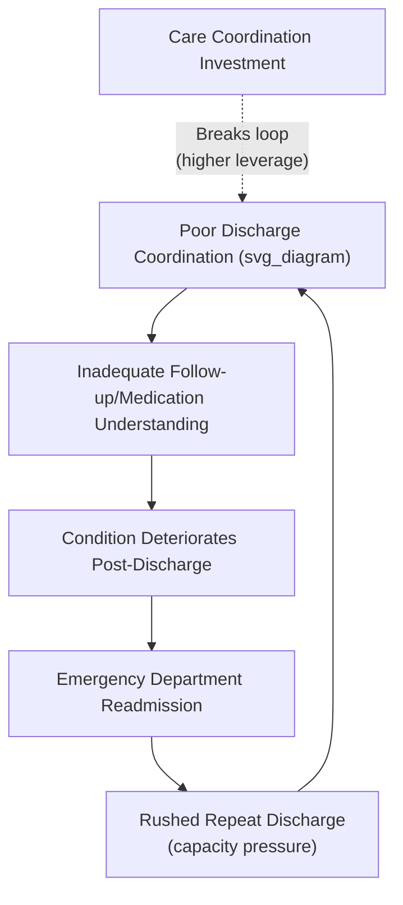
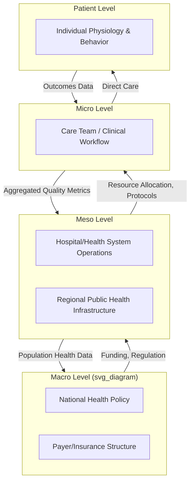

## Systems Thinking in Healthcare Systems

### Overview

Healthcare systems are complex socio-technical systems combining clinical, operational, financial, regulatory, and human-behavioral subsystems, where patient outcomes emerge from the interaction of providers, payers, institutions, technology, and policy rather than from any single component. Systems thinking in healthcare spans multiple levels of analysis — from the physiological systems of individual patients (covered separately under systems biology), through care-delivery processes within hospitals, to the macro-level structure of national health systems — and is applied both to understand persistent failure modes (medical errors, care fragmentation, cost escalation) and to design interventions that account for feedback and unintended consequences rather than isolated fixes.

### Why Healthcare Requires Systems Thinking

**Key Points**

- Healthcare outcomes result from the interaction of many subsystems: clinical care processes, hospital operations, insurance/payment structures, public health infrastructure, and patient behavior — no single subsystem fully determines outcomes
- Interventions targeting one part of the system frequently produce unintended consequences elsewhere (e.g., reducing hospital length-of-stay metrics can increase readmission rates if discharge planning is not addressed concurrently)
- Healthcare systems exhibit significant time delays between intervention and measurable outcome (e.g., preventive care investments may take years to show reduced chronic disease incidence), complicating causal attribution and political/budgetary prioritization
- High-profile system failures (patient safety incidents, care fragmentation, sepsis mortality) are frequently traced to systemic and process failures rather than to individual clinician error alone — a foundational finding of the patient safety movement following the Institute of Medicine's *To Err Is Human* report

### Feedback Loops in Clinical and Operational Care

#### Balancing Loops in Care Delivery

- **Hospital capacity management**: rising patient census → increased wait times and strain → triggers diversion protocols or discharge acceleration → census reduces toward capacity (a classic balancing loop, though one prone to overcorrection if discharge acceleration is too aggressive, feeding back into readmissions)
- **Antibiotic stewardship programs**: rising resistant-pathogen prevalence → stewardship interventions restrict inappropriate prescribing → selection pressure for resistance eases → resistant-pathogen prevalence stabilizes (a balancing loop operating on a multi-year timescale)
- **Clinical decision support alerts**: abnormal lab value detected → automated alert triggers clinician review → intervention adjusts treatment → value trends toward normal range, reducing further alerts

#### Reinforcing Loops (Often Undesirable)

- **Alarm fatigue**: high false-alarm rates from monitoring equipment → clinicians desensitize and respond more slowly or dismiss alerts → true critical alerts are more likely to be missed → adverse events increase → (in some cases) additional alarm thresholds are added defensively, further increasing alarm volume and fatigue
- **Diagnostic momentum/anchoring cascades**: an initial diagnostic impression is documented → subsequent clinicians weight the existing diagnosis heavily rather than re-evaluating independently → contradicting evidence is more likely to be discounted → diagnostic error persists and compounds across the care episode
- **Fragmentation-driven readmission cycle**: poor care coordination at discharge → patient lacks clear follow-up/medication understanding → condition deteriorates → emergency readmission → repeated poor-coordination discharge → cycle continues, particularly for chronic disease and elderly populations

### System Archetypes in Healthcare Contexts

| Archetype | Healthcare Example | Structural Pattern |
| --- | --- | --- |
| Shifting the Burden | Treating acute exacerbations of chronic disease repeatedly in the ED rather than investing in primary-care-based chronic disease management | Symptomatic fix (acute treatment) reduces pressure for fundamental fix (preventive/chronic care infrastructure), which atrophies |
| Fixes that Fail | Reducing length-of-stay metrics via faster discharge without corresponding post-acute support, producing higher readmission rates | Short-term metric improvement, worse underlying outcome |
| Limits to Growth | Emergency department volume growth outpacing physical capacity and staffing | Reinforcing demand growth meets a balancing capacity constraint, producing boarding and diversion |
| Tragedy of the Commons | Overuse of high-cost diagnostic imaging or antibiotics when individually rational for defensive medicine but collectively straining system cost and resistance patterns | Individually rational actor behavior degrades a shared systemic resource (cost pool, antimicrobial efficacy) |
| Escalation | Administrative documentation burden increasing in response to liability/audit requirements, prompting further defensive documentation | Mutual reactive escalation between regulatory/legal actors and clinical documentation practice |
| Success to the Successful | Well-resourced hospital systems attracting more referrals, staff, and capital investment, compounding advantage over under-resourced facilities | Two competing entities draw from the same limited resource pool (patients, staff, capital); initial advantage compounds |

### Multi-Level Structure of Health Systems

Health systems are nested across scales, each with distinct feedback dynamics, analogous to the multi-level governance structure discussed in public policy systems thinking:

[Inference] Misalignment between incentives at different levels (e.g., payment models at the macro/payer level that reward volume of procedures rather than outcomes) is frequently cited in health-services research as a structural driver of care fragmentation and cost escalation at the micro level, though the magnitude of this effect varies by health system and payment model design.

### Patient Safety and the Swiss Cheese Model

James Reason's "Swiss cheese" model of accident causation is a widely adopted systems-thinking framework in patient safety, conceptualizing adverse events as arising when failures ("holes") in multiple independent defensive layers (protocols, checks, redundancies) align simultaneously, rather than resulting from a single point of failure. This model explicitly shifts analysis from individual-blame ("who made the error") to systemic analysis ("what layered defenses failed to catch the error"), forming the conceptual foundation for root cause analysis (RCA) methodology used in hospital safety event investigations.

**Key Points**

- Systemic patient-safety interventions (standardized checklists, structured handoff protocols like SBAR, medication reconciliation processes) function as additional defensive layers rather than attempts to eliminate individual human error entirely, since human error is treated as an expected, unavoidable system input rather than a preventable anomaly
- The World Health Organization's Surgical Safety Checklist is a widely cited example of a low-cost, high-leverage systemic intervention (targeting the "rules"/process-structure leverage level) demonstrated to reduce surgical mortality and complications across diverse settings
- Root cause analysis explicitly traces adverse events back through contributing systemic factors (staffing levels, communication structure, equipment design, fatigue-inducing scheduling) rather than terminating analysis at the immediate proximate cause

### Health Policy and Payment System Feedback

Payment model structure is a major systemic leverage point shaping provider behavior at scale:

- **Fee-for-service payment**: reimburses per service/procedure delivered — a reinforcing loop incentivizing volume of care, potentially independent of outcome quality or necessity
- **Value-based/capitated payment**: reimburses based on patient population outcomes or a fixed per-patient amount — intended as a rule-level leverage intervention shifting the reinforcing volume incentive toward a balancing outcome-quality incentive, though it introduces its own risk of under-treatment incentives if not carefully structured
- **Bundled payment models**: a single payment covers an entire episode of care (e.g., a surgical procedure and its recovery period), intended to incentivize coordination across previously fragmented care episodes (addressing the fragmentation-readmission reinforcing loop described above)

[Unverified] The comparative real-world effectiveness of value-based versus fee-for-service payment models in improving population health outcomes varies considerably across studies and implementation contexts, and remains an active area of health policy research rather than a settled empirical consensus.

### Public Health as a Population-Level System

Public health interventions operate on population-level stocks and flows analogous to epidemiological modeling covered in systems biology, but explicitly incorporate social determinants of health as system inputs:

$$\text{Population Health Outcome} = f(\text{Clinical Care}, \text{Social Determinants}, \text{Behavior}, \text{Environment}, \text{Policy})$$

Research attributing the relative contribution of these factors (frequently cited estimates suggest clinical care accounts for a minority share of health outcome variation compared to social/behavioral/environmental factors) has been influential in shifting health-system leverage-point focus toward upstream social determinants (housing, food security, education) rather than downstream clinical treatment alone — a shift toward higher-leverage, rule/paradigm-level intervention consistent with the broader systems-thinking leverage hierarchy.

### Leverage Points in Healthcare System Design

Applying Meadows' leverage-points hierarchy to healthcare intervention:

- **Low leverage (parameters)**: adjusting individual reimbursement rates, staffing ratios at the margin
- **Mid leverage (feedback loop strength)**: clinical decision support systems that strengthen the balancing loop between abnormal findings and corrective action; antimicrobial stewardship programs
- **High leverage (rules/structure)**: redesigning payment models (fee-for-service to value-based), restructuring care coordination requirements across the continuum of care, electronic health record interoperability standards
- **Highest leverage (paradigm)**: shifting from a disease-treatment paradigm to a health-promotion/prevention paradigm, or from a fragmented-specialty-care model to an integrated population-health management model

**Key Points**

- Most healthcare quality-improvement initiatives historically target low/mid-leverage points (protocol tweaks, staffing adjustments) because they are more tractable to implement within existing institutional structures
- Structural payment reform and social-determinants-focused population health strategies represent higher-leverage interventions that face greater institutional and political resistance due to entrenched incentive structures

### Quantitative and Computational Approaches

#### Discrete-Event Simulation (DES)

Widely used for modeling hospital operational systems (emergency department patient flow, operating room scheduling, bed capacity management), representing patients as discrete entities moving through a network of queues and service points, allowing testing of capacity and process changes before real-world implementation.

#### System Dynamics for Health Policy

Applied to chronic disease burden projection, healthcare workforce planning, and epidemic/pandemic response planning, using the same stock-flow-feedback formalism described in the public policy and environmental systems domains, adapted to health-specific stocks (disease prevalence, workforce headcount, hospital bed capacity).

#### Network Analysis of Care Coordination

Referral networks and care-team communication patterns can be modeled as graphs to identify care-fragmentation risk (patients whose care spans poorly connected provider networks) and to identify high-centrality providers whose failure or absence would most disrupt care coordination — directly analogous to financial and ecological network analysis.

### Practical Applications by Sub-Domain

| Sub-Domain | Systemic Challenge | Systems Thinking Application |
| --- | --- | --- |
| Patient safety | Multi-layered defense failures leading to adverse events | Swiss cheese model, root cause analysis, checklist-based systemic redundancy |
| Hospital operations | ED overcrowding, bed capacity constraints | Discrete-event simulation of patient flow |
| Chronic disease management | Fragmented care causing readmission cycles | Care coordination network analysis, bundled payment redesign |
| Health policy | Misaligned incentives across payer/provider/patient levels | Payment model redesign as rule-level leverage intervention |
| Public health | Population health shaped by upstream social determinants | Social-determinants-focused, high-leverage upstream intervention design |
| Pandemic response | Delayed feedback between intervention and epidemiological outcome | Compartmental/system dynamics modeling (cross-reference: systems biology) |

### Limitations and Critiques

**Key Points**

- Healthcare systems modeling (discrete-event simulation, system dynamics) requires operational and clinical data that may be incomplete, siloed across institutions, or subject to significant measurement variability across facilities
- Systemic interventions (payment reform, care redesign) often require multi-stakeholder coordination (payers, providers, regulators, patients) with divergent incentives, making high-leverage structural change politically and organizationally difficult even when well-supported by systems analysis
- The Swiss cheese/systemic-failure framework, while reducing inappropriate individual blame, can be misapplied to diffuse accountability entirely if not paired with clear identification of specific, addressable systemic contributing factors
- [Speculation] The persistent gap between well-documented high-leverage recommendations (e.g., social-determinants investment, payment model reform) and their comparatively slow real-world adoption may reflect the same eroding-goals and shifting-the-burden archetypal dynamics observed elsewhere in public policy systems, where short-term-visible interventions are politically favored over structural reform

### Related Topics

- Systems biology and physiological systems (cross-reference: individual-patient-level feedback)
- Swiss cheese model and root cause analysis methodology
- Discrete-event simulation for hospital operations
- Value-based payment model design and health policy leverage points
- Social determinants of health frameworks
- Antimicrobial stewardship program design
- Care coordination network analysis
- Systems thinking in public policy and governance (cross-reference: multi-level governance structure)
- Human factors engineering and patient safety
- Epidemiological compartmental modeling (SIR/SEIR)