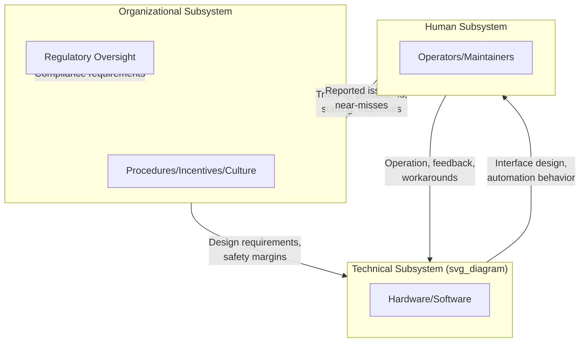
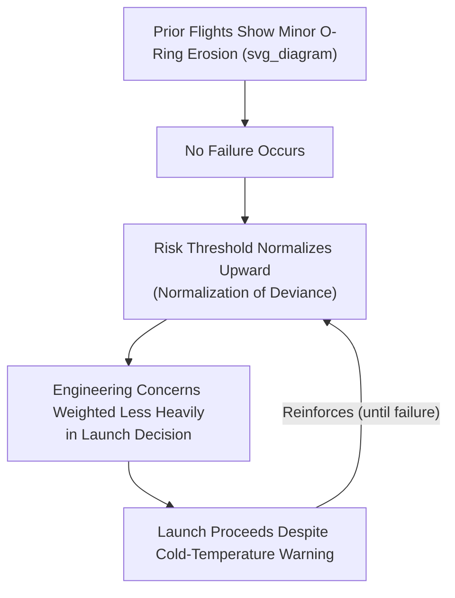

## Systems Thinking in Engineering and Sociotechnical Systems

### Overview

Engineering systems thinking extends classical systems and control theory to large-scale technical systems that are inherently embedded within human organizational, regulatory, and operational contexts — sociotechnical systems. Unlike purely technical engineering analysis (which optimizes a component or subsystem against defined specifications), sociotechnical systems thinking recognizes that system behavior, including major failures, emerges from the interaction between hardware, software, human operators, organizational procedures, and regulatory oversight. This domain underlies modern systems engineering practice, safety engineering, and infrastructure resilience analysis, and provides the conceptual foundation later adapted by software/DevOps systems thinking and other engineered-system domains in this chapter.

### Foundational Concepts

#### Systems Engineering as Applied Systems Thinking

Systems engineering formalizes systems thinking into an engineering discipline through structured processes: requirements decomposition, interface management, verification and validation, and lifecycle management, applied to systems whose complexity exceeds what any single engineering discipline (mechanical, electrical, software) can fully capture independently.

$$\text{System Behavior} \neq \sum \text{Component Behaviors}$$

This inequality is the central premise distinguishing systems engineering from component-level engineering: emergent system-level properties (safety, reliability, usability) arise from component interactions, interfaces, and the operational/human context, not from component specifications alone.

#### Sociotechnical Systems: The Human-Technology-Organization Triad

A sociotechnical system integrates three interacting subsystems:

1. **Technical subsystem**: hardware, software, physical infrastructure
2. **Human subsystem**: operators, maintainers, decision-makers, their training and cognitive limitations
3. **Organizational/regulatory subsystem**: procedures, incentive structures, regulatory oversight, organizational culture

### Feedback Loops in Engineered Systems

#### Balancing Loops (Control-Theoretic Foundations)

Engineering systems thinking shares its mathematical foundation with classical control theory, where a controller continuously compares system output to a reference input and adjusts actuation to minimize error — the archetypal balancing feedback loop:

$$e(t) = r(t) - y(t), \quad u(t) = K_p e(t) + K_i \int e(t)\,dt + K_d \frac{de(t)}{dt}$$

This PID (proportional-integral-derivative) control structure is a canonical balancing-loop implementation used across mechanical, aerospace, chemical process, and industrial control systems, where $r(t)$ is the reference/setpoint, $y(t)$ is measured output, and $u(t)$ is the control action.

#### Reinforcing Loops (Often Failure-Inducing)

- **Alarm/alert cascades**: an initial fault triggers alarms → operator attention is divided across multiple simultaneous alerts → response to any single alert is delayed → the underlying fault propagates → triggers further alarms — a well-documented contributor to major industrial accidents (e.g., Three Mile Island) where operators were overwhelmed by more than 100 simultaneous alarms
- **Maintenance deferral spiral**: budget pressure defers maintenance → equipment degrades → failure rate increases → emergency repair costs consume budget that would have funded preventive maintenance → further deferral — a reinforcing loop frequently cited in infrastructure resilience literature (bridges, power grids, water systems)
- **Complexity-coupling spiral**: system failures prompt addition of new safety subsystems/interlocks → increased system complexity and component coupling → new failure modes emerge from unanticipated interactions between the added safeguards themselves → prompts further safeguards

### System Archetypes in Engineering Contexts

| Archetype | Engineering Example | Structural Pattern |
| --- | --- | --- |
| Fixes that Fail | Adding a redundant safety interlock that introduces a new failure mode via unanticipated interaction with existing systems | Symptomatic fix produces short-term relief, introduces a new underlying problem |
| Shifting the Burden | Relying on automation to compensate for known human-factors design flaws rather than redesigning the interface | Symptomatic fix (automation compensation) reduces pressure for fundamental fix (interface redesign), degrading operator skill retention over time |
| Limits to Growth | Power grid capacity failing to scale with demand growth, producing rolling blackouts | Reinforcing demand growth loop meets a balancing physical-capacity constraint |
| Escalation | Cybersecurity arms race between attackers and defenders in critical infrastructure systems | Mutual reactive escalation between two adversarial actors |
| Drift to Low Performance | Gradual erosion of safety margins as an organization repeatedly operates successfully despite deviations from procedure ("normalization of deviance," per Diane Vaughan's analysis of the Challenger disaster) | Repeated successful operation under a compromised standard gradually resets the perceived acceptable baseline downward |

### Normal Accident Theory and High-Reliability Organizations

Two influential, partly competing systems-thinking frameworks address failure in complex technical systems:

- **Normal Accident Theory (Charles Perrow)**: argues that systems combining high interactive complexity (many non-obvious component interactions) and tight coupling (little slack or buffer time between processes) will inevitably experience "normal accidents" — failures arising from unanticipated interactions between multiple small, individually manageable faults, essentially unavoidable given the system's structural properties regardless of operator skill or procedural rigor
- **High-Reliability Organization (HRO) theory**: argues that certain organizations (aircraft carriers, air traffic control, nuclear plant operations) achieve remarkably low accident rates despite high complexity/coupling through cultural and organizational practices: preoccupation with failure, reluctance to simplify interpretations, sensitivity to operations, commitment to resilience, and deference to expertise (the five HRO principles per Weick and Sutcliffe)

[Inference] These two frameworks are often presented as being in tension (structural inevitability of failure vs. organizational mitigability), though in practice both are frequently used complementarily: normal accident theory highlights which system structures are inherently higher-risk, while HRO principles describe organizational practices that can reduce (though not eliminate) accident likelihood within those structural constraints.

### Case Study Structure: The Challenger Disaster as a Sociotechnical System Failure

The 1986 Space Shuttle Challenger disaster is a widely referenced case study in sociotechnical systems thinking, illustrating failure emerging from interaction across all three subsystem layers rather than a single component defect:

- **Technical**: O-ring seals in the solid rocket boosters had reduced elasticity at low ambient temperatures, a known engineering limitation
- **Human**: engineers raised concerns about launching in cold temperatures, but their risk assessment was communicated through a process that diluted its urgency by the time it reached final decision-makers
- **Organizational**: schedule pressure and a normalized history of minor O-ring erosion on previous successful flights (normalization of deviance) shifted the organization's implicit risk threshold over time, reinforcing a belief that the anomaly was an acceptable operating condition rather than a warning signal

### Leverage Points in Engineering System Design

Applying Meadows' leverage-points hierarchy to sociotechnical engineering:

- **Low leverage (parameters)**: adjusting a single safety margin threshold, alarm setpoint tuning
- **Mid leverage (feedback loop strength)**: strengthening incident-reporting and near-miss feedback loops (balancing loops that surface latent risk before failure)
- **High leverage (rules/structure)**: redesigning interfaces to reduce human-factors-induced error modes, restructuring organizational reporting hierarchies to reduce information-dilution between frontline engineers and final decision-makers
- **Highest leverage (paradigm)**: shifting organizational safety culture from a compliance-based paradigm (meeting minimum regulatory checklist requirements) to a resilience-based paradigm (continuously probing for latent system weaknesses, per HRO principles) — a fundamental reframing of what "safety" means organizationally

**Key Points**

- Post-accident investigations frequently identify high-leverage organizational and cultural factors (information flow structure, incentive misalignment, normalization of deviance) as root contributors, even when the proximate technical cause is a single component
- Engineering standards bodies (e.g., systems safety standards in aerospace, nuclear, and process industries) increasingly formalize sociotechnical factors (human factors engineering, safety culture assessment) alongside purely technical reliability requirements

### Resilience Engineering

Resilience engineering, distinct from traditional reliability engineering, focuses on a system's capacity to adapt to unanticipated conditions rather than solely preventing anticipated failure modes. Key concepts include:

- **Anticipation**: capacity to foresee potential disruptions before they manifest
- **Monitoring**: ongoing awareness of system state relative to safe operating boundaries
- **Response**: capacity to adapt operations when disruptions occur
- **Learning**: capacity to incorporate lessons from both failures and successes into future system design

This framework treats resilience as an emergent systemic property arising from the interaction of technical redundancy, human adaptive capacity, and organizational learning mechanisms — directly paralleling the resilience concept in ecological systems thinking (Holling's adaptive cycle), applied here to engineered infrastructure.

### Quantitative and Computational Approaches

#### Fault Tree and Event Tree Analysis

Structured graphical methods for decomposing how combinations of component failures propagate to system-level failure (fault tree, working backward from a top-level failure event) or how an initiating event propagates through subsequent system responses to various outcomes (event tree, working forward). These remain foundational quantitative risk assessment tools in nuclear, aerospace, and process safety engineering.

#### System-Theoretic Process Analysis (STPA)

A more recent hazard analysis technique (developed by Nancy Leveson) explicitly modeling systems as hierarchical control structures, identifying hazards arising from inadequate control actions (e.g., a control action provided too early, too late, or not provided when needed) rather than solely from component failure — extending systems thinking's control-loop framework directly into formal safety analysis methodology, particularly suited to software-intensive and highly automated systems where traditional component-failure-based methods (fault trees) are less applicable.

#### Network Reliability Analysis

Infrastructure systems (power grids, water networks, transportation networks) are modeled as graphs to analyze cascading failure propagation (e.g., a single transmission line failure triggering load redistribution that overloads adjacent lines, as occurred in large-scale blackout events), directly analogous to financial and ecological network contagion analysis.

### Practical Applications by Sub-Domain

| Sub-Domain | Systemic Challenge | Systems Thinking Application |
| --- | --- | --- |
| Aerospace/nuclear safety | Rare, high-consequence failures from complex component interaction | Fault tree analysis, normal accident theory, STPA |
| Critical infrastructure (power grids) | Cascading failure propagation | Network reliability analysis, capacity/demand balancing loop design |
| Industrial process control | Real-time balancing of process variables | PID/control-theoretic feedback design |
| Organizational safety culture | Normalization of deviance, information dilution | HRO principles, incident-reporting feedback loop strengthening |
| Human-automation interaction | Automation-induced skill degradation, mode confusion | Sociotechnical interface redesign, shifting-the-burden archetype mitigation |
| Infrastructure asset management | Maintenance deferral reinforcing loops | Life-cycle cost modeling, preventive maintenance feedback loop design |

### Limitations and Critiques

**Key Points**

- Fault tree and event tree methods assume failures can be reasonably enumerated in advance; highly novel or software-driven interaction failures may not be captured by methods designed around component-failure logic (a primary motivation for STPA's control-structure-based alternative)
- Normal accident theory's claim of structural inevitability is difficult to empirically falsify, since it is consistent with both the occurrence and non-occurrence of accidents (non-occurrence can always be attributed to insufficient elapsed time or luck), a critique raised within the safety science literature
- Sociotechnical analysis requires organizational and cultural data (safety climate, communication patterns) that is harder to quantify rigorously than physical component reliability data, introducing more interpretive judgment into root-cause conclusions
- [Speculation] The tension between compliance-based and resilience-based safety paradigms may itself function as a shifting-the-burden dynamic at the regulatory level: compliance-based regulation is more easily audited and enforced, potentially crowding out investment in harder-to-measure resilience-based organizational practices even where the latter may offer higher long-term leverage

### Related Topics

- Normal Accident Theory (Charles Perrow) and High-Reliability Organizations (Weick & Sutcliffe)
- System-Theoretic Process Analysis (STPA) and Nancy Leveson's control-structure safety methodology
- Resilience engineering principles (anticipation, monitoring, response, learning)
- Human factors engineering and human-automation interaction design
- Network reliability analysis for critical infrastructure
- Normalization of deviance (Diane Vaughan) and organizational safety culture
- Systems thinking in software engineering and DevOps (cross-reference)
- Fault tree and event tree analysis methodology
- PID control theory and classical feedback control foundations
- Systems thinking in healthcare systems (cross-reference: patient safety parallels)