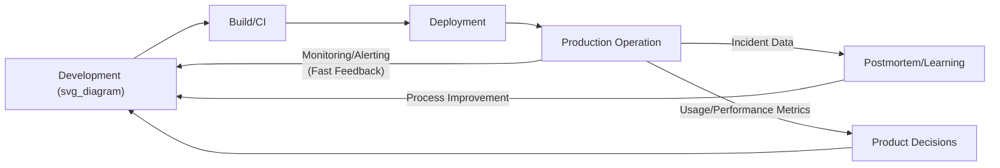
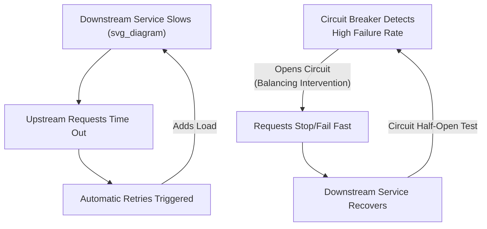
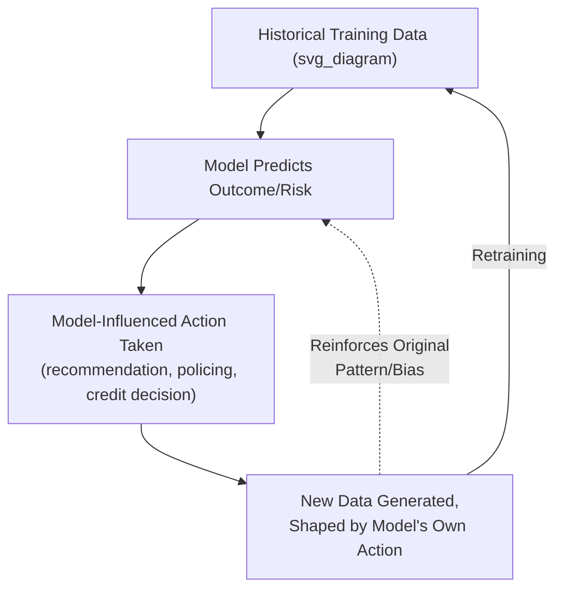
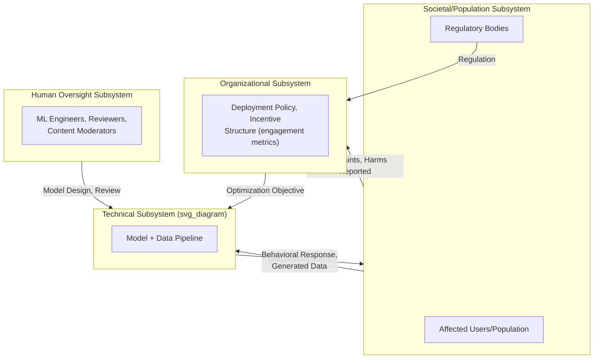

## Systems Thinking in Technology, Data, and Artificial Intelligence

### Overview

Modern software, data, and AI systems are sociotechnical systems in their own right, but with distinguishing characteristics: extremely rapid feedback cycles (deployment, monitoring, retraining measured in hours or minutes rather than years), self-modifying behavior (machine learning systems that update their own parameters from data), and emergent behavior from the interaction of distributed software components, human users, and — increasingly — learning algorithms whose internal decision logic is not fully human-interpretable. Systems thinking applied to this domain extends classical control-loop and feedback concepts to address phenomena specific to data-driven systems: feedback loops between models and the data they generate, distributed system failure modes, and the societal-scale effects of algorithmic systems operating at population scale.

### Software Systems as Feedback-Rich Sociotechnical Systems

#### DevOps and the Continuous Feedback Loop

DevOps practice explicitly formalizes systems thinking as one of its "Three Ways" (per Gene Kim's *The Phoenix Project* and *The DevOps Handbook*): the First Way emphasizes fast, reliable flow from development through operations to the customer; the second explicitly names amplifying feedback loops (from operations back to development) as core to shortening the time between a defect being introduced and being detected; the third emphasizes continuous experimentation and organizational learning.

**Key Points**

- Shortening feedback loop latency (time from code change to production signal) is a central optimization target in DevOps systems thinking, since delayed feedback is a well-documented driver of compounding defects, analogous to delay-induced oscillation in general system dynamics
- Continuous integration/continuous deployment (CI/CD) pipelines function as an engineered balancing loop: automated tests detect deviation from expected behavior early, preventing defect accumulation before it reaches production
- Blameless postmortems (a practice popularized by Google's Site Reliability Engineering discipline) apply the same systemic-rather-than-individual-blame principle found in healthcare's root cause analysis and engineering's Swiss cheese model

#### Distributed Systems Failure Modes

Distributed software systems exhibit reinforcing-loop failure patterns distinct from monolithic systems, arising from network partitions, timing dependencies, and cascading resource exhaustion:

- **Cascading failure via retry storms**: a downstream service slows down → upstream services time out and automatically retry → retry traffic adds load to the already-struggling downstream service → further slowdown → more retries — a reinforcing loop that can take down an entire distributed system from a single component's initial degradation
- **Thundering herd problem**: many clients simultaneously request the same resource (e.g., after a cache expiry or service restart) → the backing service is overwhelmed by the synchronized load spike → service fails or slows → clients retry simultaneously again — a self-reinforcing synchronization failure
- **Circuit breaker pattern** (a direct balancing-loop countermeasure): a service monitors downstream failure rate → upon exceeding a threshold, it stops sending requests temporarily ("opens" the circuit) → downstream service recovers under reduced load → circuit periodically tests recovery and "closes" once healthy — an explicitly engineered balancing loop designed to interrupt cascading-failure reinforcing loops

### Feedback Loops Specific to Data and Machine Learning Systems

#### Data Feedback Loops (Model-Data Interaction)

A defining characteristic of ML systems operating in production is that model outputs can influence the future data the model is trained or evaluated on, creating feedback structures absent from static software systems:

- **Recommender system feedback loops**: a model recommends content → user engagement with recommended content is logged as training data → the model is retrained on this engagement data, reinforcing whatever patterns drove initial recommendations → recommendations narrow around reinforced patterns (a well-documented mechanism contributing to "filter bubble" and echo-chamber effects)
- **Predictive policing feedback loops**: a model predicts higher crime risk in an area based on historical arrest data → increased police presence in that area → increased arrests recorded (independent of underlying crime rate) → next model iteration trained on this arrest data predicts even higher risk in the same area — a reinforcing loop that can compound historical bias rather than reflecting actual crime distribution, a concern documented extensively in algorithmic fairness literature
- **Credit/insurance scoring feedback loops**: a model denies credit to a segment based on historical default data → that segment has fewer opportunities to build a positive credit history → future model iterations see continued elevated risk signals for that segment → denial patterns reinforce

[Inference] The extent to which any specific deployed system exhibits a strong reinforcing feedback loop of this kind depends on system-specific factors (retraining frequency, whether counterfactual/exploration data is deliberately collected, presence of debiasing interventions), and is generally best assessed empirically for a given deployed system rather than assumed uniformly across all ML applications.

#### Concept Drift as a Balancing/Disruption Challenge

Machine learning systems assume some stability between training-data distribution and deployment-time data distribution; when the underlying data-generating process changes over time (concept drift), model performance degrades even without any change to the model itself — a systems-thinking-relevant phenomenon because it reflects the model being embedded in a broader, non-stationary environment rather than existing in isolation.

$$P_{\text{train}}(Y|X) \neq P_{\text{deployment, } t}(Y|X)$$

Monitoring systems that detect drift and trigger retraining function as an explicit balancing loop restoring alignment between model and environment — directly analogous to homeostatic regulation in physiological systems.

### System Archetypes in Technology and AI Contexts

| Archetype | Technology/AI Example | Structural Pattern |
| --- | --- | --- |
| Success to the Successful | Recommender systems reinforcing popular content's visibility, starving less-visible content of exposure needed to gain traction | Two content pools compete for shared attention resource; initial advantage compounds |
| Shifting the Burden | Adding more automated monitoring/alerting rather than addressing root architectural fragility | Symptomatic fix reduces pressure for fundamental redesign, technical debt accumulates |
| Tragedy of the Commons | Shared infrastructure resource exhaustion (e.g., noisy-neighbor problems in multi-tenant cloud systems, API rate-limit exhaustion) | Individually rational resource consumption degrades a shared systemic resource |
| Fixes that Fail | Patching a security vulnerability quickly without addressing the underlying architectural pattern that produced it, allowing a similar vulnerability class to recur | Short-term fix, underlying problem persists |
| Escalation | Adversarial machine learning arms race (evasion attacks vs. detection model updates in spam/fraud detection) | Mutual reactive escalation between two adversarial optimizing agents |
| Limits to Growth | Data pipeline throughput failing to scale with data volume growth, producing processing backlogs | Reinforcing data growth loop meets a balancing infrastructure-capacity constraint |

### Sociotechnical Considerations in AI Systems

AI systems deployed at scale function as sociotechnical systems whose behavior emerges from the interaction of model, data pipeline, deployment infrastructure, human oversight processes, and the broader population of users/affected individuals — extending the human-technology-organization triad from engineering systems thinking with an additional layer: the societal/population-scale feedback loop.

**Key Points**

- Optimization objectives set at the organizational level (e.g., maximizing user engagement time) directly shape which reinforcing loops the technical system amplifies at societal scale — a rule-level leverage point with outsized downstream effect
- Algorithmic accountability and AI governance frameworks (model cards, algorithmic impact assessments, human-in-the-loop review requirements) function as engineered balancing loops intended to counteract unchecked reinforcing dynamics between model outputs and societal-scale behavior
- [Speculation] The rate at which societal-scale feedback loops in widely deployed AI systems can be identified and corrected likely lags the rate at which such systems are deployed and iterated, given the comparative speed of software deployment cycles versus social science research and regulatory response cycles, though this is difficult to quantify precisely across different sectors and jurisdictions

### Leverage Points in Technology and AI System Design

Applying Meadows' leverage-points hierarchy to software/AI systems:

- **Low leverage (parameters)**: adjusting a recommendation ranking weight, a rate-limit threshold, a model hyperparameter
- **Mid leverage (feedback loop strength)**: adding circuit breakers and monitoring/alerting (strengthening balancing loops against cascading failure); adding drift-detection and retraining triggers
- **High leverage (rules/structure)**: redesigning system architecture to reduce tight coupling between services; redesigning the training-data collection process to reduce reinforcing bias loops (e.g., deliberate exploration/counterfactual logging rather than purely exploitation-based logging)
- **Highest leverage (paradigm)**: shifting the organizational optimization objective itself (e.g., from pure engagement-time maximization to a multi-objective function explicitly including user wellbeing or long-term retention proxies) — a paradigm-level change to what the entire technical system is being optimized to reinforce

**Key Points**

- Much of traditional software reliability engineering historically concentrates on mid-leverage points (circuit breakers, retries, monitoring)
- Addressing AI-specific societal feedback loops (bias amplification, engagement-driven harms) generally requires higher-leverage intervention at the objective-function/paradigm level, since mid-leverage technical patches (e.g., post-hoc fairness adjustments) may not address the underlying reinforcing data-feedback structure

### Quantitative and Computational Approaches

#### Queueing Theory and Capacity Modeling

Distributed system capacity planning frequently applies queueing theory (e.g., M/M/1 and related queueing models) to model request arrival rates, service rates, and resulting latency/backlog dynamics — a direct stock-flow formalization of system load, where queue length is a stock and arrival/service rates are flows.

$$L = \lambda W$$

Little's Law: the average number of requests in a system ($L$) equals the average arrival rate ($\lambda$) multiplied by the average time a request spends in the system ($W$) — a foundational relationship for reasoning about system throughput and latency as an interconnected stock-flow system rather than independent metrics.

#### Causal Inference for Feedback Loop Detection

Detecting and quantifying data feedback loops (e.g., whether a recommender system is genuinely narrowing user exposure over time) requires causal inference methods (e.g., difference-in-differences, instrumental variables, or randomized holdout/interleaving experiments) rather than purely observational correlation, since observational data from a system already embedded in its own feedback loop can obscure the counterfactual (what would have happened absent the model's influence).

#### System Dynamics and Simulation for AI Governance

System dynamics modeling has been applied at a more exploratory/qualitative level to reason about longer-term societal effects of AI deployment (e.g., labor market displacement dynamics, information ecosystem effects), analogous to its use in environmental and economic policy modeling, though with generally higher structural uncertainty given the novelty and rapid evolution of the underlying technology. [Unverified] The predictive reliability of such longer-horizon societal system dynamics models for AI impact remains substantially less validated than for more established domains like epidemiology or engineering reliability, given limited historical data on comparable technology transitions.

### Practical Applications by Sub-Domain

| Sub-Domain | Systemic Challenge | Systems Thinking Application |
| --- | --- | --- |
| Site reliability engineering | Cascading failures in distributed systems | Circuit breaker patterns, queueing theory capacity modeling, blameless postmortems |
| Recommender systems | Filter bubbles, engagement-driven bias amplification | Data feedback loop analysis, exploration-based logging, multi-objective optimization redesign |
| MLOps | Model performance degradation from data drift | Drift detection and automated retraining balancing loops |
| Algorithmic fairness | Historical bias reinforcement through feedback | Causal inference for feedback loop quantification, counterfactual fairness auditing |
| Cybersecurity | Adversarial escalation between attackers and defenders | Adversarial ML robustness research, escalation archetype mitigation strategies |
| AI governance/policy | Societal-scale effects outpacing regulatory feedback | Algorithmic impact assessments, model cards, human-in-the-loop balancing mechanisms |

### Limitations and Critiques

**Key Points**

- Data feedback loop effects in deployed ML systems are frequently difficult to measure directly without deliberate counterfactual experimentation, which many production systems do not implement due to short-term engagement-metric cost
- Distributed systems reliability patterns (circuit breakers, retries, backoff) address technical-layer reinforcing loops effectively but do not address organizational or societal-layer reinforcing loops (e.g., engagement-optimization incentive structures), requiring distinct higher-leverage interventions
- AI governance frameworks are a comparatively young and rapidly evolving field; standardized, empirically validated methodologies for detecting and mitigating societal-scale feedback loops are less mature than equivalent methodologies in, for example, engineering safety analysis
- [Speculation] The rapid pace of AI capability development relative to the maturation of sociotechnical governance frameworks for AI may itself constitute a limits-to-growth or escalation-type systemic pattern at the level of the technology industry and its regulatory environment, though characterizing this dynamic with the same rigor applied to more established domains in this chapter remains an open and actively contested area of analysis

### Related Topics

- Systems thinking in engineering and sociotechnical systems (cross-reference: shared human-technology-organization framework)
- Site Reliability Engineering (SRE) and blameless postmortem practice
- Algorithmic fairness and bias feedback loop analysis
- Concept drift detection and MLOps monitoring architecture
- Queueing theory and Little's Law for distributed systems capacity
- Causal inference methods for feedback loop quantification
- AI governance frameworks (model cards, algorithmic impact assessments)
- Circuit breaker and resilience patterns in distributed systems
- Systems thinking in economics and complexity economics (cross-reference: network contagion parallels)
- Complex adaptive systems theory