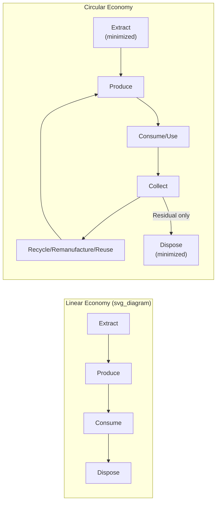
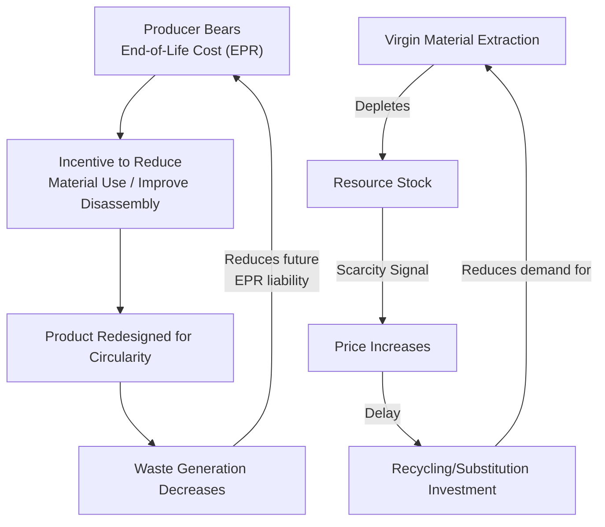

## Systems Thinking for Sustainability and the Circular Economy

### Overview

Sustainability and circular economy thinking apply systems concepts to the material, energy, and economic flows connecting human production and consumption with the ecological systems that supply resources and absorb waste. Where the linear "take-make-dispose" industrial model treats material flows as one-directional and largely ignores end-of-life feedback, systems thinking reframes production and consumption as a closed-loop system nested within finite planetary boundaries — extending the stock-flow and feedback concepts introduced in environmental systems thinking to explicitly redesign economic structures around regenerative rather than depletive material cycles.

### The Linear vs. Circular Systems Model

**Key Points**

- The linear economy model (extract → produce → consume → dispose) treats natural resource stocks as effectively infinite inputs and waste sinks as effectively infinite outputs — an assumption inconsistent with finite planetary stocks and absorption capacities
- The circular economy model closes the loop by treating end-of-life materials as inputs to new production cycles, reducing net extraction and net waste flows
- This reframing is fundamentally a systems boundary redefinition: the linear model draws the system boundary around a single production-consumption pass, while the circular model draws the boundary around the full material lifecycle, including multiple reuse cycles

### Stocks and Flows in Material and Energy Systems

Sustainability systems analysis explicitly tracks material and energy as stocks (accumulated quantities: virgin resource reserves, in-use product stock, landfilled waste, atmospheric carbon) connected by flows (extraction rate, production rate, consumption rate, disposal rate, recycling rate).

$$\frac{dS_{\text{virgin}}}{dt} = -\text{Extraction Rate}(t)$$

$$\frac{dS_{\text{in-use}}}{dt} = \text{Production Rate}(t) - \text{Retirement Rate}(t)$$

$$\frac{dS_{\text{waste}}}{dt} = \text{Retirement Rate}(t) - \text{Recycling Rate}(t) - \text{Landfill/Incineration Rate}(t)$$

**Example**

A material flow analysis (MFA) of aluminum in a national economy would track: virgin bauxite ore reserves (a depleting stock), aluminum embedded in in-use products (buildings, vehicles, packaging — a growing stock as production continues), and end-of-life aluminum scrap (a stock that can flow either to recycling, closing the loop with relatively low energy cost compared to virgin extraction, or to landfill, representing a lost material flow). Because aluminum recycling requires substantially less energy than primary smelting, the recycling rate is a high-leverage flow: increasing it reduces pressure on both the virgin-extraction stock and the associated energy/emissions flow simultaneously.

### Feedback Loops in Sustainability Systems

#### Reinforcing Loops

- **Resource scarcity-price-innovation loop**: resource depletion increases scarcity → increases price → incentivizes substitution, efficiency innovation, and recycling investment → can reduce net demand pressure on the depleting resource (this loop can be either reinforcing toward depletion if response is slow, or self-correcting if price signals transmit efficiently and quickly — a good example of how loop polarity outcomes depend critically on feedback delay length)
- **Consumption-marketing-consumption loop**: increased production capacity requires increased sales → marketing/planned obsolescence drives faster replacement cycles → increased consumption → justifies further production capacity → further marketing pressure — a reinforcing loop central to critiques of the linear economy's structural growth dependency
- **Circular business model network effects**: as more circular infrastructure (collection, sorting, remanufacturing facilities) is built, the cost of circular material inputs decreases, making circular design more economically competitive, attracting further circular infrastructure investment — a reinforcing loop favorable to system transition once a critical mass is reached

#### Balancing Loops

- **Extended producer responsibility (EPR) regulation**: producers required to bear end-of-life management costs for their products → incentivizes product design changes that reduce disposal cost (design for disassembly, material reduction) → reduces waste generation flow — an explicitly engineered balancing loop, correcting a market failure where disposal costs were previously externalized away from the producer
- **Carbon pricing as a balancing mechanism**: emissions-intensive activity incurs a cost proportional to emissions → reduces relative economic attractiveness of high-emission processes → shifts production toward lower-emission alternatives → emissions flow decreases (analogous to the carbon-cycle balancing loop discussed in environmental systems thinking, but implemented as a deliberate economic-policy balancing mechanism rather than a natural biogeochemical process)

### System Archetypes in Sustainability Contexts

| Archetype | Sustainability Example | Structural Pattern |
| --- | --- | --- |
| Tragedy of the Commons | Overexploitation of shared atmospheric carbon sink capacity, ocean plastic accumulation | Shared finite absorptive/resource capacity, individually rational extraction/pollution behavior degrades it collectively |
| Limits to Growth | Global material extraction growth eventually constrained by finite reserves and ecological absorption capacity (the core structural argument of the original *Limits to Growth* study) | Reinforcing economic growth loop meets balancing planetary-boundary constraints |
| Shifting the Burden | Carbon offsetting used as a substitute for direct emissions reduction at the source | Symptomatic fix reduces pressure for fundamental fix (structural decarbonization), which may be delayed or underinvested |
| Success to the Successful | Established linear-economy incumbents (with existing extraction/production infrastructure) outcompeting circular-economy entrants for capital and regulatory favor | Two competing production models draw from the same capital/regulatory resource pool; incumbent advantage compounds |
| Eroding Goals | Progressive weakening of corporate sustainability targets when initial targets prove difficult to meet | Repeated downward adjustment of a goal in response to a persistent gap between goal and performance |
| Fixes that Fail | Single-use plastic bans without corresponding investment in reusable-system infrastructure, shifting rather than reducing net material/energy footprint | Short-term visible fix, underlying material-flow problem persists or relocates |

### The Circular Economy Framework: R-Strategies Hierarchy

Circular economy practice formalizes a hierarchy of intervention strategies, analogous in structure to Meadows' leverage-points hierarchy, ranked from lowest to highest circularity impact:

1. **Refuse**: eliminate the product's function entirely (lowest material/energy footprint by definition)
2. **Rethink**: intensify product use (e.g., sharing/subscription models replacing individual ownership)
3. **Reduce**: increase efficiency in manufacturing or use, reducing material/energy input per unit of function
4. **Reuse**: a discarded but still-functional product is reused for its original purpose
5. **Repair**: maintenance and repair extend the in-use stock lifetime, reducing retirement-flow rate
6. **Refurbish/Remanufacture**: restore an aging product or its components to as-new specification
7. **Repurpose**: use discarded product/components for a different function than originally intended
8. **Recycle**: process materials to obtain the same or lower quality, closing the material loop at the raw-material level
9. **Recover**: energy recovery from materials that cannot be recycled (lowest circularity, though still preferable to landfill/incineration without recovery)

**Key Points**

- Strategies higher in this hierarchy (Refuse, Rethink, Reduce) generally correspond to higher-leverage, more structural interventions (closer to Meadows' rule/paradigm level), since they reduce the underlying stock-flow volume rather than managing end-of-life material after the fact
- Strategies lower in the hierarchy (Recycle, Recover) correspond to lower-leverage, more remedial interventions, since they operate on the outflow of an already-generated stock rather than reducing the stock's generation rate
- Circular economy policy has historically emphasized recycling (a lower-leverage intervention with high public visibility) over higher-leverage strategies like product-as-service business models or absolute material-throughput reduction, mirroring the general pattern (observed across other domains in this chapter) of policy gravitating toward tractable, visible, low-leverage interventions

### Planetary Boundaries as a System Boundary Framework

The planetary boundaries framework (Rockström et al., Stockholm Resilience Centre) formalizes nine Earth-system processes (climate change, biodiversity loss, biogeochemical flows, ocean acidification, land-system change, freshwater use, stratospheric ozone depletion, atmospheric aerosol loading, novel entities/chemical pollution) as balancing constraints defining a "safe operating space" for human economic activity — directly extending the ecological carrying-capacity concept to the scale of the entire biosphere, and functioning as an explicit system-boundary redefinition for economic systems analysis (analogous to Kate Raworth's "doughnut economics," which combines these ecological ceiling boundaries with a social foundation floor).

[Inference] Several of the nine planetary boundaries (notably biodiversity loss and biogeochemical flows, particularly nitrogen and phosphorus cycles) are assessed by the framework's proponents as already exceeded at a global scale, though the precise thresholds, measurement methodologies, and policy implications of specific boundary assessments remain subjects of ongoing scientific refinement and some debate within the earth-system science community.

### Life Cycle Assessment (LCA) as a Systems Methodology

Life cycle assessment is the primary quantitative methodology for evaluating the full-system environmental impact of a product or process across its entire stock-flow chain (raw material extraction, manufacturing, distribution, use, end-of-life), preventing burden-shifting — a specific failure mode where an intervention reduces impact at one lifecycle stage while increasing it at another (e.g., a lightweight material reducing use-phase fuel consumption but requiring more energy-intensive extraction).

$$\text{Total Impact} = \sum_{i=1}^{n} \left( \text{Activity Data}_i \times \text{Impact Factor}_i \right)$$

Summed across all lifecycle stages $i$, where activity data represents the flow quantity (e.g., kg of material, kWh of energy) at each stage and impact factors translate that flow into environmental impact categories (global warming potential, resource depletion, eutrophication).

**Key Points**

- LCA methodology is explicitly systems-boundary-dependent: results can vary substantially depending on whether the analysis boundary is "cradle-to-gate" (extraction through manufacturing), "cradle-to-grave" (through disposal), or "cradle-to-cradle" (through recycling back into new production)
- Burden-shifting analysis via LCA is a direct methodological tool for detecting the "fixes that fail" and "shifting the burden" archetypes at the product/process level, since narrow-boundary analysis can obscure impact displacement to another lifecycle stage or impact category

### Leverage Points in Sustainability System Design

Applying Meadows' leverage-points hierarchy (a framework Meadows herself developed substantially in the context of the original *Limits to Growth* sustainability analysis) to circular economy and sustainability intervention:

- **Low leverage (parameters)**: recycling rate targets, landfill tax rates, individual product efficiency standards
- **Mid leverage (feedback loop strength)**: extended producer responsibility regulation, carbon pricing mechanisms (strengthening balancing loops that internalize previously externalized costs)
- **High leverage (rules/structure)**: redesigning product standards to mandate design-for-disassembly and modularity; restructuring economic accounting to include natural capital depletion (rather than treating it as a cost-free externality)
- **Highest leverage (paradigm)**: shifting from a GDP-growth-maximization paradigm to a paradigm bounded by planetary limits (degrowth, doughnut economics, steady-state economics) — reframing the fundamental goal the economic system is optimized to pursue, directly paralleling the paradigm-level leverage point identified in the economics systems thinking domain

### Practical Applications by Sub-Domain

| Sub-Domain | Systemic Challenge | Systems Thinking Application |
| --- | --- | --- |
| Waste management | Linear disposal flows overwhelming landfill/absorption capacity | Circular economy R-strategy hierarchy, EPR regulation design |
| Corporate sustainability | Burden-shifting between lifecycle stages or impact categories | Life cycle assessment, systems-boundary-explicit impact accounting |
| Climate policy | Reinforcing emissions-growth loops exceeding planetary boundary limits | Carbon pricing balancing mechanisms, planetary boundaries framework (cross-reference: environmental systems thinking) |
| Product design | Products designed for obsolescence rather than longevity/circularity | Design-for-disassembly standards, product-as-service business models |
| Urban material flows | City-scale resource consumption and waste generation | Urban metabolism analysis (material flow analysis applied at city scale) |
| Supply chain management | Extended, opaque global material flow chains obscuring impact | Material flow analysis, supply chain traceability systems |

### Limitations and Critiques

**Key Points**

- Circular economy metrics (recycling rates, material circularity indicators) can create measurement incentives that favor easily quantifiable low-leverage strategies (recycling) over harder-to-measure high-leverage strategies (absolute consumption reduction), a monitoring-design challenge with parallels to metric-gaming issues observed in healthcare and technology systems thinking
- Life cycle assessment results are sensitive to system-boundary choices, data quality, and impact-factor methodology, meaning LCA comparisons between studies using different boundary assumptions can be misleading if not carefully reconciled
- Some circular economy critiques argue that circularity alone, without addressing absolute material and energy throughput volume, may be insufficient to remain within planetary boundaries if overall consumption continues growing (a "relative decoupling vs. absolute decoupling" debate within sustainability economics)
- [Speculation] The degree to which circular economy transition can occur within existing growth-oriented economic paradigms, versus requiring the higher-leverage paradigm shift toward degrowth or steady-state economic models, remains a substantively contested question among sustainability researchers and economists, reflecting genuine unresolved disagreement rather than a settled technical matter

### Related Topics

- Systems thinking in environmental and ecological systems (cross-reference: planetary boundaries, resource stock-flow modeling)
- Life cycle assessment (LCA) methodology and burden-shifting analysis
- Material flow analysis (MFA) and urban metabolism
- Extended producer responsibility (EPR) policy design
- Planetary boundaries framework (Rockström et al.) and doughnut economics (Kate Raworth)
- Degrowth and steady-state economics (cross-reference: economics systems thinking paradigm-level leverage)
- Product-as-service and sharing-economy business models
- Systems thinking in public policy and governance (cross-reference: regulatory leverage points)
- Carbon pricing mechanism design
- Design for disassembly and circular product design standards