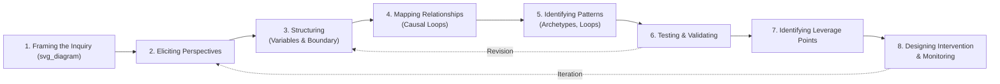

## Designing a Systems Inquiry Process

### Overview

A systems inquiry process is the structured methodology by which a facilitator or analyst guides individuals or groups through the investigation of a complex problem using systems thinking tools and concepts. Unlike ad hoc problem-solving, a well-designed inquiry process follows a deliberate sequence — from establishing a shared problem definition through to identifying actionable leverage points — while remaining iterative rather than strictly linear, since systems understanding typically deepens through repeated cycles of modeling, testing, and revision rather than a single pass. This item addresses the practical craft of designing and facilitating such a process, distinct from the conceptual and mathematical content of systems thinking itself covered elsewhere in this material.

### Why Process Design Matters

**Key Points**

- Systems thinking tools (causal loop diagrams, stock-flow models, archetype identification) are only as useful as the process that elicits accurate, shared understanding from participants who each hold partial, often conflicting, mental models of the system
- A poorly designed inquiry process can produce a technically correct-looking diagram that reflects the facilitator's assumptions rather than the group's actual collective understanding, undermining both accuracy and stakeholder buy-in
- Groups new to systems thinking frequently default to linear, single-cause explanations under time pressure; the inquiry process must actively create space for surfacing feedback and delay structures that are not intuitively salient
- The sequence and pacing of an inquiry process directly affects whether participants move prematurely to solutions before adequately understanding problem structure — a common failure mode sometimes described as "leaping to interventions"

### Core Phases of a Systems Inquiry Process

#### Phase 1: Framing the Inquiry

The inquiry begins by establishing the problem statement, the purpose of the analysis, and the boundary of concern — decisions that shape everything downstream. A poorly framed inquiry (too narrow a boundary, a symptom-level rather than structural problem statement) will produce a technically competent but practically unhelpful analysis.

- Establish a **reference behavior pattern**: a description (often as a rough graph over time) of how the key variable(s) of concern have behaved historically and are expected to behave if nothing changes — this behavior-over-time framing (a foundational system dynamics technique) shifts participants from asking "who/what caused this event" to "what structure produces this pattern"
- Define the **time horizon** and **spatial/organizational boundary** of the inquiry explicitly and revisit them as an early group decision rather than an implicit default
- Clarify the inquiry's **purpose**: whether the goal is shared understanding, policy design, model-based simulation, or organizational alignment, since this affects the appropriate level of rigor and the tools selected in later phases

**Example**

For an inquiry into rising employee turnover, a poor framing asks "why did three senior engineers quit last quarter?" (event-level, narrow). A well-structured framing asks "why has voluntary turnover in the engineering department increased from 8% to 22% annually over the past three years, and what pattern do we expect if nothing changes?" (behavior-over-time framing, explicit time horizon, quantified reference pattern).

#### Phase 2: Eliciting Diverse Perspectives

Because complex systems are experienced differently from different vantage points (a frontline operator, a manager, a customer, a regulator each perceive different parts of the system and different feedback delays), the inquiry process must deliberately surface multiple perspectives before converging on a single model.

- **Individual elicitation before group convergence**: gathering each participant's initial causal beliefs privately (via structured interviews or written elicitation) before group discussion reduces anchoring on the first-voiced or highest-status opinion (a group-dynamics failure mode sometimes called groupthink convergence)
- **Divergent stakeholder sampling**: deliberately include perspectives from multiple positions in the system (not only decision-makers, but also those who experience the system's operational or downstream effects), since structurally important feedback loops are frequently visible only from specific vantage points
- **Documented disagreement as data**: points of disagreement between participants about causal structure are treated as valuable signal about genuine model uncertainty or genuinely differing sub-system experience, not as noise to be immediately resolved

#### Phase 3: Structuring the Inquiry — Variable and Boundary Selection

Before relationships can be mapped, the group must converge on the set of variables considered relevant to the inquiry and confirm the system boundary agreed upon in Phase 1.

- Distinguish **stocks** (accumulations: things that can be measured at a point in time — inventory, morale, trust, population) from **flows** (rates: things measured over an interval — hiring rate, attrition rate, production rate) early, since this distinction is foundational to correct causal loop construction later
- Apply an explicit **boundary test**: for each candidate variable, ask whether it is meaningfully influenced by variables inside the boundary and whether excluding it materially changes the group's understanding of the reference behavior pattern: this prevents both excessive scope creep (every inquiry eventually touches the entire economy) and excessive narrowness (omitting a variable that closes a critical feedback loop)
- Maintain a **variable list with operational definitions**: ambiguous or overloaded terms (e.g., "quality," "engagement," "efficiency") should be given explicit working definitions agreed upon by the group, since much downstream disagreement in causal mapping stems from participants using the same word to mean different underlying variables

#### Phase 4: Mapping Relationships — Causal Loop Construction

This is the phase most associated with visible systems-thinking artifacts (causal loop diagrams), but the value lies substantially in the facilitated process of construction, not merely the resulting diagram.

**Key Points**

- Build the diagram incrementally, starting from the reference behavior pattern's key variable and working outward one link at a time, confirming each proposed causal link's polarity (does A increase B, or decrease B, holding other factors constant) explicitly with the group rather than allowing implicit assumptions
- Distinguish **correlation raised by a participant** from **proposed causal mechanism**: a facilitator should probe "what is the mechanism by which A affects B" for each proposed link, since unexamined correlational claims are a common source of causal loop diagram errors
- Explicitly mark **time delays** on causal links where relevant (often with a double hash mark `//` convention on the causal arrow), since delay length is frequently the single most important structural feature determining whether a loop produces stable, oscillating, or runaway behavior
- Close loops explicitly: when a chain of causal links returns to affect its own starting variable, explicitly label the loop as reinforcing (R) or balancing (B) and verify the label by counting negative links (an odd number of negative/decreasing links produces a balancing loop; an even number, including zero, produces a reinforcing loop)

#### Phase 5: Identifying Patterns — Archetypes and Loop Dominance

Once a causal loop diagram has stabilized, the group examines it for recognizable archetypal structures (as catalogued across the domain-specific items in the preceding chapter) and reasons about which loops are currently dominant in producing the observed reference behavior pattern.

- **Archetype pattern-matching**: compare the emerging diagram structure against known archetypes (shifting the burden, limits to growth, tragedy of the commons, escalation, success to the successful) to leverage pre-existing intervention insight associated with each archetype, rather than treating every inquiry as structurally novel
- **Loop dominance discussion**: in systems with multiple interacting loops, behavior over time is typically driven by whichever loop(s) are currently dominant; a facilitator should guide the group to reason about why a particular loop might currently dominate and under what conditions dominance could shift to a different loop (a key mechanism behind many "fixes that fail" and unexpected policy resistance patterns)

#### Phase 6: Testing and Validating the Model

A causal loop diagram or more formal model should be stress-tested against known historical behavior and alternative explanations before being used as a basis for intervention design.

- **Historical behavior reproduction test**: does the proposed causal structure, reasoned through qualitatively (or simulated quantitatively if a stock-flow model has been built), plausibly reproduce the reference behavior pattern established in Phase 1? A structure that cannot explain known historical behavior is unlikely to reliably predict future or intervention-driven behavior
- **Alternative hypothesis testing**: explicitly ask whether a simpler, non-systemic explanation (a single external shock, an individual decision) could equally well explain the observed pattern, and only proceed with the systemic explanation where it demonstrates genuinely superior explanatory power
- **Stakeholder validation**: circulate the emerging model back to a broader stakeholder group beyond the original inquiry participants to surface blind spots or omitted feedback loops before finalizing

#### Phase 7: Identifying Leverage Points

Drawing on the leverage-points hierarchy (parameters → buffers → structure → delays → balancing loop strength → reinforcing loop strength → information flows → rules → self-organization → goals → paradigms), the group evaluates candidate intervention points within the validated model.

- Map each candidate intervention explicitly onto the leverage-points hierarchy level it targets, since this framing helps groups recognize when they are defaulting to low-leverage, high-visibility interventions (a common bias documented across the domain-specific items in this chapter) without deliberately considering higher-leverage structural options
- Evaluate interventions against **feasibility** and **leverage** as two distinct axes, since the highest-leverage intervention is not always the most immediately actionable, and a well-designed inquiry process makes this tradeoff explicit rather than implicitly defaulting to whichever intervention is easiest to implement

#### Phase 8: Designing Intervention and Monitoring

The final phase translates the selected leverage-point intervention into a concrete action plan paired with an explicit monitoring feedback loop, since without deliberate monitoring, the group cannot distinguish whether an intervention succeeded, failed, or was overtaken by another dominant loop shift.

- Define **leading indicators** (early, fast-feedback signals of whether the intervention is having the intended directional effect) distinct from **lagging indicators** (the ultimate reference behavior pattern metric, which may take considerably longer to shift)
- Build in an explicit **review cycle** with a predetermined revisit date, treating the intervention itself as a hypothesis to be tested against the model rather than a final, fixed solution — closing the loop back to Phase 6 (testing and validating) as new data becomes available

### Facilitation Techniques Supporting the Inquiry Process

| Technique | Purpose | Typical Phase |
| --- | --- | --- |
| Structured individual interviews | Elicit unbiased initial perspectives before group anchoring | Phase 2 |
| Behavior-over-time graphing | Establish shared reference pattern, shift focus from events to patterns | Phase 1 |
| Nominal group technique | Structured idea generation with reduced dominance by vocal participants | Phase 2, Phase 4 |
| Facilitated causal mapping workshops | Collaboratively construct and validate causal loop diagrams | Phase 4, Phase 5 |
| "Five whys" or mechanism probing | Force explicit articulation of proposed causal mechanisms, not just correlations | Phase 4 |
| Scenario/what-if questioning | Stress-test model structure against hypothetical alternative conditions | Phase 6 |
| Leverage-point mapping exercise | Explicitly categorize candidate interventions by leverage level | Phase 7 |

### Common Process Design Failure Modes

**Key Points**

- **Premature convergence**: the group settles on a single causal structure too quickly, often anchored on the most senior or vocal participant's initial framing, before adequately surfacing divergent perspectives from Phase 2
- **Boundary creep or boundary paralysis**: either the inquiry scope expands indefinitely as new tangential variables are proposed, or the group becomes unable to finalize a boundary at all, both of which stall progress through subsequent phases
- **Diagram fetishism**: treating the causal loop diagram itself as the deliverable, rather than as a working tool supporting the group's evolving shared understanding, can result in an aesthetically polished but practically unused artifact
- **Skipping validation (Phase 6)**: moving directly from an initial causal mapping to intervention design without testing the model against historical behavior or alternative explanations, risking intervention designs based on an unvalidated or incomplete causal structure
- **Leverage-point neglect**: treating every identified causal link as an equally valid intervention target without explicitly reasoning about leverage level, resulting in interventions clustered at low-leverage parameters even when the model itself points toward higher-leverage structural opportunities

### Adapting the Process to Context

**Key Points**

- **Time-constrained settings** (a single 90-minute workshop) require compressing Phases 1–5 into abbreviated versions (e.g., a pre-circulated reference behavior pattern, rapid individual sticky-note elicitation instead of full structured interviews) while preserving the core sequence rather than skipping phases entirely
- **High-stakes or highly technical domains** (e.g., safety-critical engineering systems, public health policy) generally warrant a more rigorous Phase 6 validation step, potentially including quantitative stock-flow simulation rather than qualitative causal loop reasoning alone, given the higher cost of an incorrect model informing intervention design
- **Politically contentious inquiries** (e.g., public policy topics with entrenched stakeholder positions) require particular care in Phase 2 (perspective elicitation) to ensure marginalized or lower-power stakeholder perspectives are genuinely surfaced rather than dominated by higher-power participants, and in Phase 7 (leverage point identification) to transparently acknowledge where technically identified high-leverage points face political rather than technical feasibility barriers

### Related Topics

- Causal loop diagram construction techniques and notation conventions
- Facilitation techniques for group model building
- Donella Meadows' leverage points framework (deep-dive cross-reference)
- Behavior-over-time graphing methodology
- Group model building and participatory system dynamics
- Stakeholder mapping and perspective elicitation methods
- System archetype pattern library (cross-reference to domain-specific chapter items)
- Distinguishing correlation from causal mechanism in systems mapping
- Monitoring and leading/lagging indicator design for interventions
- Common cognitive biases in group systems reasoning (anchoring, groupthink, premature closure)