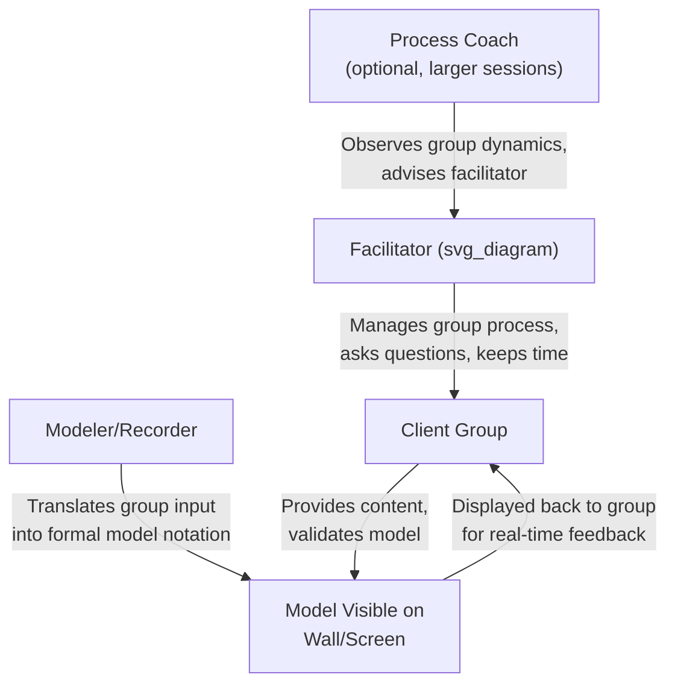

## Facilitating Group Model Building Sessions

### Overview

Group model building (GMB) is a specialized facilitation methodology in which a diverse group of stakeholders collaboratively constructs a systems model — typically a causal loop diagram or a full stock-flow simulation model — as a means of building shared understanding, surfacing mental model differences, and generating stakeholder ownership of subsequent policy or intervention decisions. GMB differs from the general systems inquiry process (covered in the preceding item) in that it is a specific, more heavily structured facilitation discipline with its own established scripting techniques, group dynamics management practices, and a substantial academic and practitioner literature (most notably associated with the system dynamics community, including work by George Richardson, David Andersen, and colleagues at the University at Albany). This item addresses the practical craft of running effective GMB sessions rather than the general inquiry sequence.

### What Distinguishes Group Model Building from General Facilitation

**Key Points**

- GMB explicitly treats the process of model construction as equally important as the resulting model artifact, since the primary output is often improved shared mental models and group alignment, with the technical model serving as a boundary object that supports this social process
- GMB sessions typically involve a **client group** (the stakeholders who own the problem and will act on the resulting insight) working with one or more **facilitators** in defined roles (distinct from a single facilitator wearing all hats), reflecting the discipline's roots in operations research consulting practice
- Unlike a single analyst building a model in isolation and presenting it to stakeholders afterward, GMB builds the model live, in the room, with the group — a deliberate choice that trades some technical modeling efficiency for substantially higher stakeholder buy-in and mental-model surfacing
- GMB is most valuable for **messy, contested problems** where stakeholders hold genuinely different views of the system's structure, rather than for problems where the causal structure is already well understood and simply needs quantification

### The Standard GMB Facilitator Team Roles

- **Facilitator**: manages the group process — asking questions, managing time, ensuring balanced participation, and maintaining focus on the agreed inquiry boundary. The facilitator generally does not simultaneously operate modeling software, since divided attention between group dynamics and technical model-building degrades both
- **Modeler/recorder**: translates the group's verbal input into formal diagram or model notation in real time, visible to the group (on a whiteboard, sticky-note wall, or projected software), enabling immediate group validation or correction of the modeler's interpretation
- **Process coach** (in larger or higher-stakes sessions): observes group dynamics from outside the direct facilitation flow, watching for participation imbalances, unaddressed conflict, or fatigue, and advises the facilitator during breaks
- **Gatekeeper/recorder of parking-lot items**: tracks issues raised that are relevant but outside the current session's scope, ensuring they are acknowledged rather than lost, which helps participants feel heard without derailing the working session's focus

### Core GMB Scripting Techniques

GMB practice has developed a library of "scripts" — structured, repeatable facilitation sequences for specific sub-tasks within a session, allowing facilitators to draw on tested techniques rather than improvising process design for each recurring need.

#### Nominal Group Technique for Variable Elicitation

A structured method for generating an initial list of variables or issues while minimizing the dominance of vocal participants:

1. Each participant individually and silently writes down variables they believe are relevant to the problem (typically one variable per sticky note or index card)
2. Participants take turns sharing one item at a time in round-robin fashion (not all at once), with the facilitator or modeler recording each item without immediate discussion or evaluation
3. Only after all items are collected does open discussion, clarification, and initial grouping/clustering of similar items begin
4. The group then collectively narrows or prioritizes the list against the inquiry boundary established earlier

This sequencing (individual generation before group discussion) is specifically designed to prevent early anchoring on the first-voiced idea and to ensure quieter or lower-status participants' contributions are captured before group dynamics can suppress them.

#### Graphs-Over-Time Elicitation

Before causal structure is discussed, participants are asked to individually sketch how they believe the key variable(s) of concern have behaved over a specified historical time period and how they expect it to behave going forward absent intervention. Comparing these individually drawn graphs across participants frequently reveals that stakeholders do not even agree on the basic historical pattern before any causal discussion begins — a valuable and sometimes surprising early finding that reframes subsequent discussion.

#### Structured Causal Loop Construction ("Hexagon" or Sticky-Note Method)

Physical or digital sticky notes (or hexagon-shaped cards, which tile together more flexibly than rectangles for freeform clustering) are used to represent individual variables, which participants physically arrange and connect with drawn arrows to represent causal links, allowing the group to see and physically manipulate the emerging structure collaboratively rather than watching a single person build a diagram unilaterally on a screen.

#### Model Fragment Small-Group Breakouts

For complex problems with many candidate sub-structures, the full group is divided into smaller breakout groups, each assigned to develop one plausible causal loop fragment addressing a specific piece of the reference behavior pattern, before reconvening to integrate the fragments into a unified diagram — a technique that increases parallel participation and can surface a wider variety of candidate structures than a single full-group discussion would generate in the same time.

### Managing Group Dynamics in GMB Sessions

**Key Points**

- **Participation balance**: facilitators actively monitor for participants who dominate discussion (often those with positional authority) and participants who remain silent (often those with less positional power but potentially critical operational knowledge), using techniques like direct invitation ("what's your view on this from where you sit") or structured round-robin turn-taking to rebalance
- **Depersonalizing disagreement**: framing disagreements about causal structure as differences in mental models to be jointly explored ("it sounds like we have two different views of how A affects B — let's map both and see which better explains what we've observed") rather than as debates to be won, reduces defensiveness and encourages genuine information sharing
- **Managing authority dynamics**: when senior stakeholders are present, their causal claims can be disproportionately weighted by other participants regardless of actual system knowledge; facilitators may use techniques like eliciting junior/frontline perspectives first, before senior stakeholders speak, to reduce anchoring
- **Handling scope disputes**: when participants disagree about whether a variable belongs inside the model boundary, the facilitator can defer the decision by placing the contested variable at the boundary as an exogenous input initially, revisiting its status once the group has more shared context from building out the interior structure
- **Fatigue and session pacing**: model-building work is cognitively demanding; well-designed GMB sessions build in explicit breaks and vary activity type (individual writing, small-group discussion, full-group review) to sustain productive engagement across multi-hour or multi-day sessions

### Structuring a Multi-Session GMB Engagement

**Key Points**

- Single-session GMB workshops (half-day to full-day) are appropriate for moderately complex problems where a qualitative causal loop diagram is the target output
- Multi-session engagements (typically 3–5 sessions over several weeks) are warranted when the target output is a quantified, simulatable stock-flow model, since between-session time is needed for the facilitation/modeling team to formalize group input into simulation-ready structure and for data collection to parameterize the model
- A typical multi-session sequence: Session 1 (problem framing and reference behavior pattern), Session 2 (variable elicitation and initial causal structure), Session 3 (structure refinement and stock-flow formalization, often with facilitator team doing significant between-session work), Session 4 (model validation and initial scenario testing with the group), Session 5 (policy/intervention scenario exploration using the completed model)
- Maintaining group continuity and momentum across a multi-session engagement requires deliberate between-session communication (e.g., a written summary of progress and open questions circulated to participants) to prevent the group from losing shared context between sessions

### Common Pitfalls in GMB Facilitation

| Pitfall | Description | Mitigation |
| --- | --- | --- |
| Facilitator over-modeling | The facilitator or modeler inserts their own causal assumptions into the diagram rather than eliciting them from the group | Explicitly ask "is this how the group sees it" before finalizing any link; treat facilitator-proposed links as hypotheses requiring group confirmation |
| Silent-majority capture | A vocal minority's views dominate the visible model while quieter participants' differing views go unrecorded | Use nominal group technique and individual elicitation before group discussion; actively solicit input from quiet participants |
| Premature quantification | Group pushes toward numerical parameter values before qualitative structure is validated | Explicitly sequence structure validation (Phase 6 of the general inquiry process) before any quantification discussion |
| Loss of client ownership | The facilitation team takes the model away for extensive between-session refinement, returning a substantially different model the group no longer recognizes as their own | Keep between-session changes clearly traceable to group-generated content; present changes as "formalizing what you said" rather than new analysis |
| Scope explosion | The live, generative nature of GMB causes the model boundary to expand faster than the session timeframe allows for productive resolution | Maintain a visible "parking lot" for out-of-scope but valid issues; revisit the agreed boundary explicitly when scope pressure arises |
| Diagram complexity overload | The causal loop diagram grows so large and interconnected that the group can no longer collectively reason about it | Periodically simplify by identifying and separately displaying dominant loops; consider splitting into multiple linked sub-diagrams |

### Preparing for a GMB Session

**Key Points**

- **Pre-session stakeholder interviews**: conducting brief individual interviews with key participants before the session helps the facilitation team anticipate likely areas of disagreement, sensitive topics requiring careful handling, and existing data or prior analysis that should inform the session design
- **Physical/virtual space design**: in-person sessions benefit from ample wall space for sticky-note/hexagon work and seating arrangements that avoid reinforcing existing hierarchy (e.g., avoiding a boardroom table with the most senior person at the head); virtual sessions require selecting collaborative whiteboard tools that support simultaneous multi-participant interaction rather than single-presenter screen-sharing
- **Materials preparation**: preparing (but not distributing in advance, to avoid anchoring) a reference behavior pattern graph based on available data, blank variable cards, and a clear agenda with time allocations for each phase
- **Setting explicit session norms**: establishing at the outset that disagreement is expected and valuable, that all causal claims will be treated as hypotheses rather than accepted facts, and that the facilitator (not any single participant) manages time and process

### Adapting GMB for Virtual and Hybrid Settings

**Key Points**

- Virtual GMB sessions require substituting physical sticky-note/hexagon techniques with digital collaborative whiteboard tools that support simultaneous multi-cursor interaction, since a single shared screen controlled by one person recreates the facilitator-over-modeling pitfall at a structural level
- Turn-taking and participation-balance techniques (round-robin nominal group technique, direct invitation of quieter participants) require more deliberate facilitator effort in virtual settings, since video-call dynamics tend to further amplify dominant-speaker effects compared to in-person settings
- Session length should generally be shorter and more frequent in virtual formats (e.g., multiple 90-minute sessions rather than a single full-day session) to manage videoconferencing fatigue, with corresponding attention to maintaining momentum and shared context across the resulting larger number of sessions
- Hybrid sessions (some participants in-person, some remote) present a specific dynamics risk where remote participants are more easily overlooked during spontaneous in-room discussion; facilitators in hybrid settings often assign a dedicated team member to actively monitor and surface remote participant input

### Evaluating GMB Session Success

**Key Points**

- Success in GMB is generally evaluated across multiple dimensions beyond the technical quality of the resulting model: whether participants report improved mutual understanding of differing perspectives, whether the group reaches genuine (not merely surface) consensus on model structure, and whether the resulting model or insight is subsequently used to inform actual decisions rather than being shelved
- [Inference] Because GMB's value proposition rests substantially on process outcomes (shared understanding, stakeholder buy-in) rather than purely technical model accuracy, evaluating GMB session effectiveness often relies on participant self-report and post-session behavioral follow-up (whether recommended interventions were actually implemented) rather than purely quantitative model-validation metrics, which introduces more subjectivity into effectiveness assessment compared to purely technical modeling work
- Follow-up sessions or check-ins after initial intervention implementation help assess whether the shared model continues to hold explanatory power as new data emerges, closing the loop back to the broader systems inquiry process's iterative validation phase

### Related Topics

- Designing a systems inquiry process (cross-reference: general inquiry sequence GMB specializes)
- Causal loop diagram notation and construction technique
- Nominal group technique and structured elicitation methods
- Facilitator role design and group process management
- System dynamics simulation software for live model building (Vensim, Stella)
- Managing power dynamics and psychological safety in group workshops
- Virtual collaboration tools for participatory modeling
- Behavior-over-time graphing as an elicitation technique
- Stakeholder interview design for pre-session preparation
- Change management and stakeholder buy-in strategies for model-informed decisions