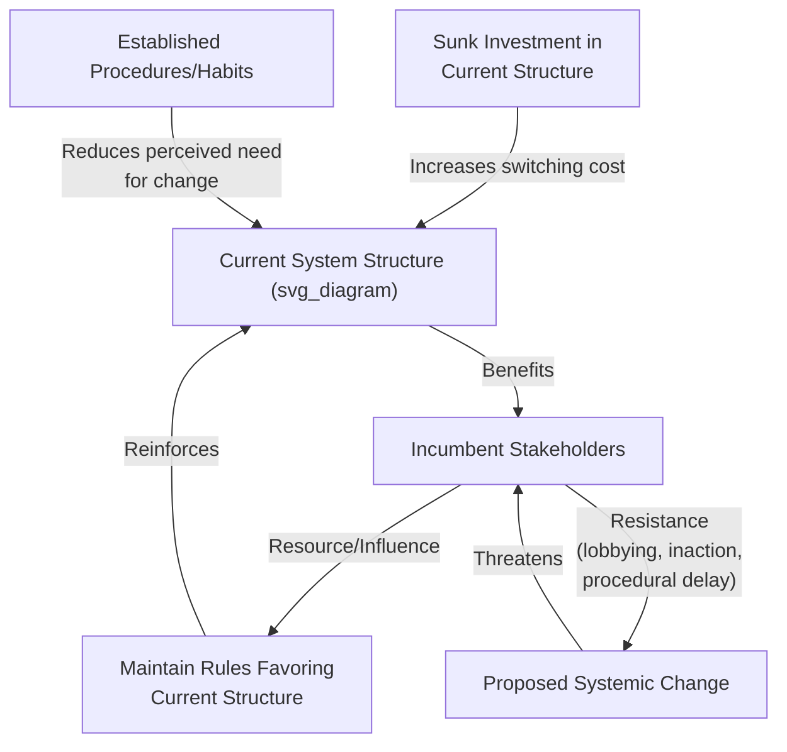
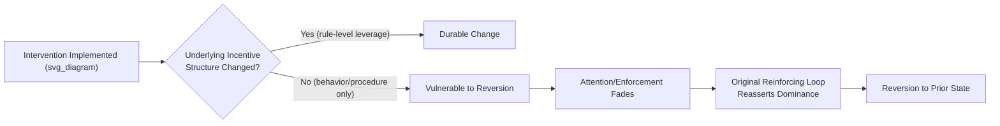

## Overcoming Resistance to Systemic Change

### Overview

Even a technically sound systems analysis, well communicated to stakeholders, frequently encounters resistance when the recommended intervention requires structural or paradigm-level change rather than a low-leverage parameter adjustment. This resistance is not necessarily irrational: it often reflects genuine structural forces — vested interests benefiting from the current system configuration, organizational inertia, legitimate uncertainty about intervention outcomes, and the political-economic reality that high-leverage interventions (per Meadows' hierarchy) are precisely the interventions most likely to threaten existing power distributions. This item addresses resistance to systemic change as itself a systems phenomenon worth analyzing structurally, along with practical facilitation and change-management strategies for navigating it, building directly on the leverage-points concept and communication techniques introduced in preceding items.

### Resistance as a Systemic Phenomenon, Not Merely an Obstacle

**Key Points**

- A core systems-thinking insight is that resistance to change is frequently itself a balancing feedback loop: the current system configuration exists in part because forces maintaining it (incumbent advantage, established procedures, entrenched incentive structures) are stronger than forces pushing for change — meaning resistance is a structural feature of the system being analyzed, not an external nuisance to the analysis
- Treating resistance analytically (mapping who benefits from the current structure, what balancing loops maintain it, what would need to change for those loops to weaken) is itself a systems-thinking application, distinct from treating resistance as a purely psychological or communication problem to be overcome through better messaging alone
- [Inference] Interventions designed without accounting for the structural sources of resistance are more likely to trigger policy resistance (the system compensating to neutralize the intervention, as discussed in the public policy systems thinking domain) than interventions designed with explicit awareness of, and strategy for, the forces maintaining the status quo

### Mapping the Forces Maintaining the Status Quo

Before attempting to overcome resistance, a structural mapping of why the current system persists provides a more reliable foundation for intervention design than assuming resistance stems primarily from misunderstanding or inertia alone.

**Key Points**

- **Vested interest mapping**: identify which stakeholders derive tangible benefit (financial, positional, reputational) from the current system configuration, since these stakeholders are structurally incentivized to resist changes that would reduce that benefit, regardless of the change's broader systemic merit
- **Sunk cost and switching cost analysis**: prior investment in the current structure (infrastructure, training, established relationships, sunk capital) raises the practical cost of transition independent of whether the new structure would be superior once established, a factor distinct from and additional to stakeholder self-interest
- **Habitual and procedural inertia**: some resistance stems not from active opposition but from the accumulated weight of established procedures, informal norms, and habitual practice that simply persists absent an active, deliberate reason to change — a lower-intensity but often more pervasive form of resistance than active opposition
- **Legitimate uncertainty**: some resistance reflects genuinely reasonable skepticism about whether a proposed high-leverage intervention will actually produce the intended effect, given the inherent uncertainty in complex systems modeling discussed throughout this material — this form of resistance should be distinguished from self-interested resistance, since it calls for a different response (addressing the uncertainty through piloting and monitoring, rather than negotiating around vested interest)

### System Archetypes Underlying Resistance Patterns

| Archetype | Resistance Manifestation | Structural Pattern |
| --- | --- | --- |
| Shifting the Burden | Organization repeatedly applies symptomatic fixes rather than the higher-leverage structural fix, because the structural fix threatens an internal group's established role or authority | The symptomatic-fix-dependent group has a vested interest in the fundamental fix continuing to be deferred |
| Eroding Goals | Change initiative's ambition is progressively watered down through a series of compromises in response to sustained resistance | Repeated concession to resistance gradually resets the effective goal downward until it no longer represents genuine structural change |
| Success to the Successful | Incumbent structure's beneficiaries have accumulated disproportionate resources/influence, which they deploy specifically to resist structural change that would redistribute that advantage | Compounding advantage is defended by the very resource accumulation the advantage produced |
| Escalation | Change proponents and resistant incumbents engage in mutually escalating advocacy/counter-advocacy, consuming energy that could otherwise go toward substantive negotiation | Mutual reactive response between two opposing camps |
| Drift to Low Performance | Repeated failed change attempts gradually lower the organization's collective belief that structural change is achievable at all, reducing future change effort | Each failed attempt reinforces a norm of accepting the current (degraded) baseline as unavoidable |

### Distinguishing Types of Resistance and Matching Response Strategy

Effective resistance management requires diagnosing which type of resistance is actually operating, since a mismatched response strategy (e.g., addressing self-interested resistance purely through better communication) is unlikely to succeed.

| Resistance Type | Underlying Driver | More Effective Response Strategy |
| --- | --- | --- |
| Interest-based | Stakeholder genuinely stands to lose tangible benefit | Negotiate compensating arrangements, phased transition, or redesign to reduce the specific loss where feasible; transparent acknowledgment of the tradeoff rather than denying it exists |
| Uncertainty-based | Genuine skepticism about intervention efficacy given complex-system unpredictability | Propose piloting at smaller scale with clear monitoring indicators before full-scale commitment; share the model's validation evidence from Phase 6 of the systems inquiry process |
| Identity/values-based | Change conflicts with a stakeholder's sense of professional identity, values, or "the way things are properly done" | Engage in dialogue that respects the underlying value while reframing how the value is served by the new structure; avoid framing that implies the prior approach was simply wrong |
| Habitual/procedural | No active objection, simply the inertia of established routine | Reduce the friction/effort cost of adopting new procedures; provide structured support and repetition rather than persuasion, since the barrier is not attitudinal |
| Capacity-based | Stakeholder agrees with the change in principle but lacks the resources, skills, or time to implement it | Provide training, resources, or phased implementation timelines; address the capacity gap directly rather than treating it as attitudinal resistance |

**Key Points**

- Misdiagnosing interest-based resistance as merely communication-based (assuming "if they just understood the data, they'd support this") frequently fails, since the resistant stakeholder may understand the systemic case perfectly well and rationally oppose it anyway because of the personal cost involved
- Conversely, misdiagnosing genuine uncertainty-based resistance as pure self-interest can unnecessarily antagonize a stakeholder raising legitimate, good-faith concerns about intervention reliability

### Building Coalitions and Sequencing Change

**Key Points**

- **Coalition mapping**: identifying which stakeholders would benefit from the proposed systemic change (not only those who would lose from it) allows the facilitator to build an active coalition of support rather than relying solely on neutralizing opposition
- **Combining low-leverage and high-leverage interventions**: as noted in the leverage-points discussions throughout this material, pairing a visible, low-leverage action (which builds credibility and demonstrates responsiveness) with a higher-leverage structural intervention (which addresses root causes) can build the political capital needed to sustain support for the harder structural change over time
- **Sequencing for early wins**: implementing a change in stages, beginning where resistance is weakest or where early positive results are most likely and visible, can build momentum and demonstrated credibility before attempting the most resistance-heavy portions of the change
- **Piloting to de-risk uncertainty-based resistance**: a well-designed, appropriately scoped pilot (with clear success criteria agreed upon in advance with skeptical stakeholders) can convert uncertainty-based resistance into evidence-based support or, alternatively, provide legitimate evidence that a specific intervention design needs revision — both outcomes representing genuine progress compared to unresolved standoff

### Working With, Rather Than Only Against, Resistance

**Key Points**

- Resistance frequently contains valuable information about model incompleteness: a stakeholder's strong objection to a proposed intervention may reveal a feedback loop or constraint the original systems inquiry (see the "Testing and Validating" and "Stakeholder validation" phases of the systems inquiry process) failed to adequately capture, meaning resistance should be treated partly as a data source for model refinement, not solely an obstacle to be overcome
- Genuinely revisiting and, where warranted, revising the proposed intervention in response to substantive resistance-based objections (as opposed to simply persisting with the original plan despite valid critique) both improves intervention quality and builds trust that the process is genuinely collaborative rather than predetermined
- [Speculation] Organizations with a demonstrated track record of genuinely incorporating resistance-based feedback into revised interventions may experience less resistance to subsequent change initiatives, since stakeholders learn that raising concerns leads to genuine consideration rather than being overridden — though this relationship is plausible rather than rigorously established across the systems-thinking and change-management literature broadly

### Sustaining Change Against Loop Reversion

A frequently underestimated challenge is that even a successfully implemented systemic intervention can erode over time if the original reinforcing loops that produced the problem are not durably weakened, rather than merely temporarily suppressed.

- **Institutionalizing the change in rules and structure** (higher-leverage, per Meadows' hierarchy) rather than relying on sustained individual vigilance or leadership attention (lower-leverage) makes reversion less likely once the initial change-implementation attention fades
- **Monitoring for loop-dominance shifts**: consistent with the general systems inquiry process's monitoring phase, tracking whether the previously dominant problematic loop begins reasserting dominance (e.g., a previously reduced but not eliminated reinforcing loop regaining strength as attention moves elsewhere) allows early corrective action before full reversion occurs
- **Addressing incentive structures directly**: if the underlying incentive structure that originally reinforced the problematic pattern is not itself changed, individual behavioral or procedural changes are more vulnerable to reversion as soon as circumstances (personnel turnover, leadership change, competing priorities) reduce active enforcement of the new pattern

### Ethical Considerations in Managing Resistance

**Key Points**

- Facilitators and change agents hold a position of some influence over how resistance is framed and managed, and should be attentive to the risk of using systems-thinking framing (e.g., labeling legitimate stakeholder concern as mere "resistance" or "inertia") to dismiss substantive, good-faith objections rather than genuinely engaging with them
- Power asymmetries between stakeholders mean that "overcoming resistance" framed purely as a technique for achieving a predetermined intervention can, if applied uncritically, function to override legitimately affected parties' interests rather than achieving genuine collective problem-solving — a concern particularly relevant in public policy and organizational contexts with significant power imbalances between decision-makers and those affected by decisions
- Distinguishing between resistance that reflects narrow self-interest at the expense of broader systemic benefit, versus resistance that reflects legitimate representation of a stakeholder group's genuine interests that a proposed "systemic" solution has simply externalized onto them, requires careful, honest analysis rather than assuming all resistance is equally illegitimate simply because it opposes a technically well-supported intervention

### Related Topics

- Communicating systemic insights to stakeholders (cross-reference: framing techniques that reduce defensiveness)
- Donella Meadows' leverage points framework (cross-reference: why high-leverage change faces more resistance)
- Stakeholder and coalition mapping techniques
- Change management theory (Kotter's model, ADKAR, and related frameworks)
- Piloting and phased implementation strategies
- Organizational incentive structure redesign
- Power dynamics and ethical facilitation practice
- System archetypes underlying organizational resistance patterns
- Designing a systems inquiry process (cross-reference: incorporating resistance as model-validation feedback)
- Monitoring for policy resistance and loop-dominance shifts post-intervention