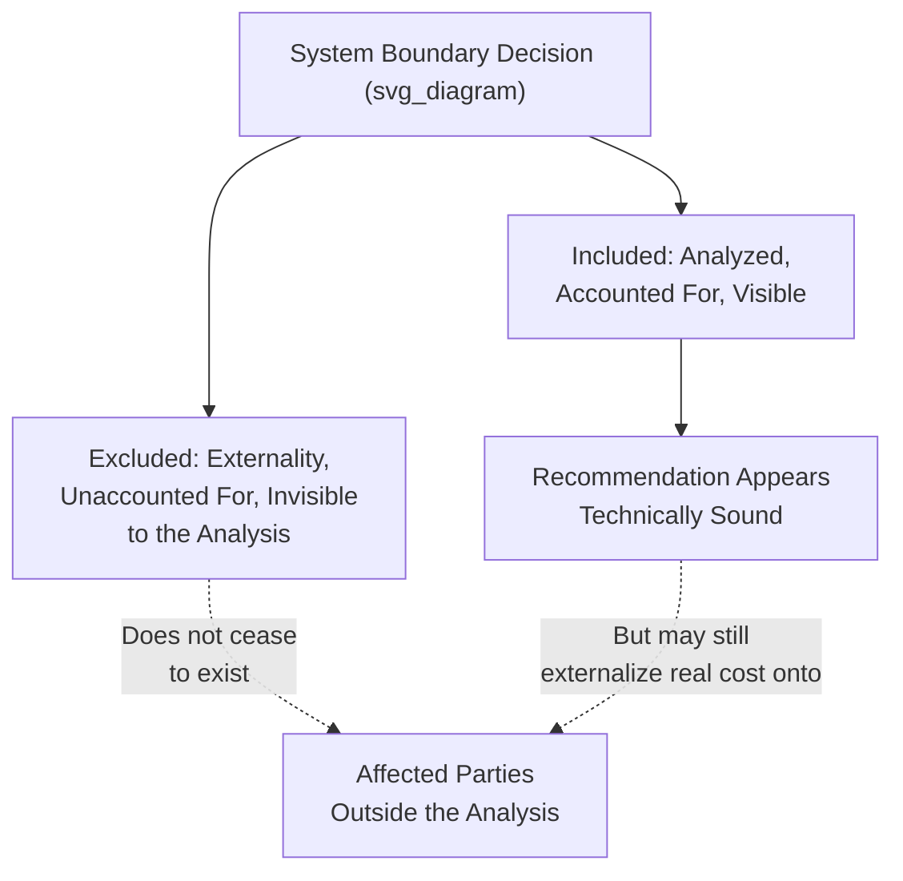

## Ethics and Responsibility in Systems Interventions

### Overview

Intervening in a complex system carries ethical weight distinct from ordinary technical decision-making, because systemic interventions affect stakeholders who may not have consented to or even been aware of the analysis, produce consequences that ripple beyond the intended target through feedback loops, and often involve genuine uncertainty about outcomes despite confident-sounding recommendations. This item addresses the ethical responsibilities of those who conduct systems analysis and design interventions — facilitators, analysts, consultants, policymakers — building on the practical facilitation and resistance-management material in preceding items but focusing specifically on the normative question of what practitioners owe to the people and systems they analyze and intervene upon.

### Why Systems Interventions Carry Distinct Ethical Weight

**Key Points**

- Because systemic interventions operate through feedback loops rather than isolated, contained effects, their consequences frequently extend beyond the immediately targeted variable or stakeholder group to affect parties who were not part of the original inquiry process and may have had no opportunity to consent or object
- The inherent complexity and delay characteristic of systems (discussed throughout this material) means that intervention effects are often only fully observable well after the intervention has been implemented and the practitioner may have moved on, creating an accountability gap between decision and consequence
- Systems analysis can lend an appearance of rigor and objectivity to recommendations that nonetheless embed significant value judgments (which reference behavior pattern matters, which system boundary to draw, which stakeholder perspectives to weight) — obscuring these embedded judgments behind technical-looking diagrams carries a distinct risk of false authority
- [Inference] Because leverage-point interventions are, by definition, more consequential the higher their leverage, the ethical stakes of a recommendation scale with its leverage level: a parameter adjustment recommendation carries different ethical weight than a recommendation to change a system's fundamental goal or paradigm, even though both may emerge from the same technically sound analysis

### System Boundary Choices as Ethical Choices

**Key Points**

- The boundary decisions made during Phase 1 and Phase 3 of the systems inquiry process (what is included in the analysis, what time horizon is considered, whose perspective defines the reference behavior pattern) are not merely technical convenience choices — they determine whose interests and which consequences are visible to the analysis and which are rendered invisible
- Externalities excluded by a narrow system boundary do not cease to exist; they are simply not accounted for in the resulting recommendation, meaning a technically valid analysis within a narrow boundary can still produce ethically problematic recommendations if the boundary was drawn to exclude affected parties or long-term consequences
- A recurring historical pattern across the domains covered in this material (environmental externalities excluded from economic models, social costs excluded from technology deployment analysis, downstream community impact excluded from infrastructure engineering analysis) illustrates that boundary-drawing has frequently, if often unintentionally, served to externalize costs onto parties without power to influence the boundary decision
- Practitioners bear responsibility for making boundary choices explicit and for actively considering whether a narrower boundary is being chosen for genuine analytical tractability versus for convenience in avoiding inconvenient complexity or accountability

### Whose Perspective Defines the Problem

**Key Points**

- The systems inquiry process's Phase 2 (eliciting diverse perspectives) has direct ethical significance: whose reference behavior pattern is treated as the problem to be solved, and whose is treated as a secondary consideration or ignored entirely, embeds a value judgment about whose experience of the system matters
- Analysts and facilitators typically work on behalf of a specific client (an organization, government agency, or funder), which creates a structural incentive to weight that client's framing of the problem more heavily than the framing of stakeholders without a seat at the table — a power asymmetry inherent to most applied systems work that practitioners should acknowledge rather than treat as neutral
- Genuinely representing marginalized or lower-power stakeholder perspectives in the inquiry process (as discussed in the group model building item's guidance on divergent stakeholder sampling) is both a methodological best practice for analytical accuracy and an ethical responsibility, since excluded perspectives are more likely to correspond to excluded costs in the final analysis
- [Speculation] The degree to which formal systems inquiry processes in practice succeed in genuinely incorporating lower-power stakeholder perspectives, as opposed to nominally including them while still weighting client-organization framing most heavily in final recommendations, likely varies substantially across practitioners and institutional contexts, and is not a question that can be resolved by methodology alone without genuine practitioner commitment

### The Problem of Confident Uncertainty

**Key Points**

- Systems models, especially qualitative causal loop diagrams and even calibrated quantitative simulations, carry irreducible uncertainty (discussed in the limitations sections throughout the domain-specific items in this material), yet the visual authority of a well-constructed diagram or the numerical output of a simulation can convey more certainty to stakeholders than is analytically warranted
- Practitioners have a distinct ethical responsibility to communicate uncertainty honestly (per the "framing interventions as testable hypotheses" technique discussed in the stakeholder communication item) rather than allowing the professional authority of systems thinking methodology to imply a confidence level the underlying analysis does not support
- This responsibility is particularly acute for high-leverage, high-consequence interventions (structural policy change, paradigm shifts) where the cost of an incorrect recommendation, confidently delivered, is substantially higher than for a low-leverage parameter adjustment that can be more easily reversed if wrong
- Distinguishing between well-established structural relationships (backed by strong historical evidence or physical/biological mechanism) and more speculative or contested causal claims within the same model, rather than presenting all elements of a causal loop diagram with uniform apparent confidence, is a specific practical technique for honoring this responsibility

### Responsibility for Downstream and Long-Term Consequences

**Key Points**

- Because systemic effects frequently manifest after significant delay (a recurring theme across the healthcare, economic, environmental, and engineering domains covered in this material), the practitioner who designs an intervention is often no longer professionally engaged with the system by the time delayed consequences — positive or negative — become observable, creating a structural accountability gap
- Building explicit monitoring and review mechanisms into intervention design (as discussed in the systems inquiry process's Phase 8) is partly a technical best practice and partly an ethical commitment to remaining accountable for consequences that unfold over a longer horizon than the practitioner's direct engagement
- Where a practitioner's professional engagement genuinely must end before delayed consequences are observable (a common practical reality in consulting and time-limited engagements), an ethical practice involves transferring monitoring responsibility explicitly and documented to a remaining stakeholder, rather than allowing monitoring responsibility to silently disappear along with the departing practitioner
- Second-order and third-order effects propagating through feedback loops not fully captured in the original model boundary (the same boundary-exclusion concern discussed above) mean that practitioners should communicate the limits of what consequences the analysis can be expected to anticipate, rather than implying comprehensive foresight

### Power, Neutrality, and the Myth of the Objective Facilitator

**Key Points**

- Facilitators and analysts often present themselves, and are perceived by stakeholders, as neutral parties simply helping a group discover its own shared understanding — but facilitation choices (which techniques to use, how to frame disagreement, which perspectives to actively solicit versus passively accept if offered) are not neutral and inevitably shape the resulting analysis and recommendation
- Acknowledging this lack of pure neutrality, rather than claiming an unattainable objectivity, allows practitioners to be more transparent about the judgment calls embedded in their facilitation choices and more open to stakeholder challenge of those choices
- Practitioners working for a paying client (common in consulting, corporate, and government-contracted systems work) hold a specific dual responsibility: professional obligation to the paying client and a broader ethical responsibility to stakeholders affected by the resulting analysis who may not be the paying party — these responsibilities can come into tension, and practitioners should have a considered position on how they navigate this tension rather than treating it as automatically resolved in the client's favor by default professional norms
- Genuine conflicts of interest (e.g., a practitioner whose future engagement depends on producing a recommendation favorable to a specific stakeholder's pre-existing position) should be disclosed, since undisclosed conflicts of interest undermine the legitimacy of systems analysis specifically because its apparent technical objectivity can mask such influence more effectively than an openly acknowledged position would

### Ethical Considerations Specific to High-Leverage Interventions

Because Meadows' leverage-points hierarchy identifies paradigm and goal-level interventions as highest-leverage, and because these interventions by definition reshape what a system is fundamentally oriented toward, they carry distinct ethical considerations beyond those relevant to lower-leverage parameter adjustments:

- **Legitimacy of authority to change goals/paradigms**: a technical systems analysis can identify that a paradigm shift would be structurally effective, but the legitimate authority to actually change a system's fundamental goal (e.g., a nation's economic paradigm, an organization's core mission) typically rests with a broader constituency than the practitioners conducting the analysis — systems analysis can inform this decision but should not be treated as itself conferring the authority to make it
- **Irreversibility considerations**: paradigm and rule-level changes are frequently harder to reverse than parameter adjustments, meaning the practitioner's responsibility to communicate uncertainty honestly (discussed above) is especially weighty for high-leverage recommendations where an incorrect intervention is more costly to undo
- **Distributional consequences of paradigm change**: a paradigm shift that is structurally beneficial in aggregate (e.g., a shift toward ecological-limit-respecting economic paradigms, discussed in the sustainability domain item) may still produce concentrated costs for specific stakeholder groups during the transition, and ethical practice requires explicitly surfacing these distributional consequences rather than allowing an aggregate-benefit framing to obscure them

### A Practical Framework for Ethical Reflection During Systems Work

| Reflection Question | Purpose |
| --- | --- |
| Whose reference behavior pattern defined this inquiry, and whose was excluded or subordinated? | Surfaces whose problem is actually being solved |
| What system boundary was chosen, and what costs or affected parties fall outside it? | Surfaces potential externalities the analysis will not account for |
| What is my (the practitioner's) relationship to the parties affected by this analysis, and does it create any conflict of interest? | Surfaces potential undisclosed bias in framing or recommendation |
| How confident is this specific claim, genuinely, and is that confidence level being communicated accurately to stakeholders? | Addresses the confident-uncertainty problem |
| Who has legitimate authority to act on this recommendation, particularly if it is high-leverage? | Addresses paradigm/goal-level authority and legitimacy |
| Who bears the transition cost if this intervention is implemented, and has that been made explicit? | Surfaces distributional consequences |
| What monitoring or accountability mechanism persists after my direct engagement ends? | Addresses the downstream-consequence accountability gap |

**Key Points**

- This reflection framework is not a formulaic checklist guaranteeing ethical practice, but a structured prompt for the kind of explicit consideration that can otherwise be implicitly skipped under time pressure or client expectation to deliver a confident, actionable recommendation
- Genuinely engaging with these questions may sometimes lead a practitioner to decline a specific engagement, recommend a different (possibly less immediately actionable) scope, or explicitly flag limitations that a client did not request — professional courage to do so, when warranted, is itself part of the ethical responsibility this item addresses

### Related Topics

- Overcoming resistance to systemic change (cross-reference: distinguishing legitimate stakeholder concern from self-interested resistance)
- Communicating systemic insights to stakeholders (cross-reference: honest uncertainty communication techniques)
- Designing a systems inquiry process (cross-reference: boundary-setting as an ethically significant methodological step)
- Facilitating group model building sessions (cross-reference: representing marginalized perspectives in elicitation)
- Donella Meadows' leverage points framework (cross-reference: ethical weight scaling with leverage level)
- Stakeholder power analysis and conflict-of-interest disclosure practice
- Externalities and boundary-drawing in economic and environmental analysis (cross-reference to domain items)
- Professional ethics in consulting and applied social science
- Distributional justice considerations in policy transition design
- Accountability mechanisms for long-horizon intervention consequences