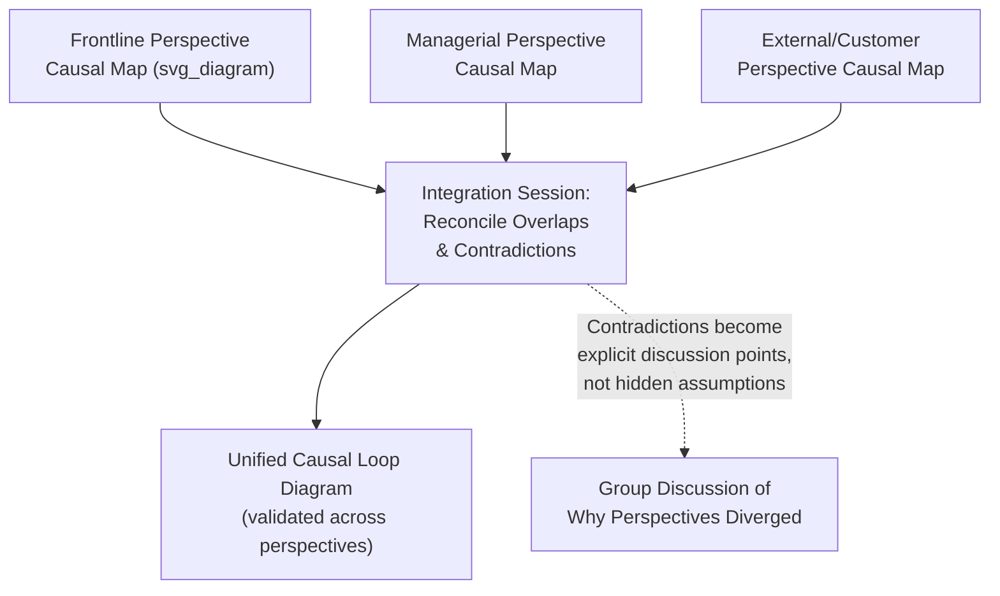

## Working with Diverse Stakeholder Perspectives

### Overview

Every complex system is perceived differently depending on where a stakeholder sits within it — a frontline worker, a senior executive, a regulator, and an end customer each hold partial, experientially grounded mental models shaped by their specific vantage point, incentives, and available information. Working effectively with this diversity of perspective is not a peripheral facilitation nicety but a core epistemic requirement of systems thinking: because no single stakeholder can directly observe an entire complex system, the practitioner's ability to synthesize multiple partial perspectives into a more complete structural understanding is fundamental to analytical accuracy, not merely to stakeholder buy-in. This item consolidates and extends perspective-related material introduced across the preceding facilitation items, focusing specifically on the practical methodology for eliciting, reconciling, and integrating divergent stakeholder viewpoints.

### Why No Single Perspective Is Sufficient

**Key Points**

- Structural position within a system determines which feedback loops and delays a stakeholder can directly observe: a frontline call-center employee experiences customer frustration signals in real time but rarely sees the executive-level budget decisions driving understaffing, while an executive sees budget and headcount data but rarely experiences the operational consequences directly
- Mental models are shaped not only by observable position but also by professional training, incentive structure, and organizational culture, meaning stakeholders in structurally similar positions can still hold meaningfully different causal beliefs about the same system
- The "blind men and the elephant" parable is frequently invoked in systems thinking literature precisely because it captures this dynamic: each stakeholder's partial, locally accurate perception can lead to confidently held but incomplete or even contradictory conclusions about the same underlying system
- A systems inquiry that draws exclusively from a single stakeholder category (e.g., only management perspectives, or only technical specialists) risks systematically missing feedback loops and constraints only visible from excluded vantage points — this is a methodological accuracy risk, not solely a representation or fairness concern (though it is also that, as discussed in the ethics item)

### Categories of Stakeholder Perspective Relevant to Systems Inquiry

| Perspective Category | Typical Vantage Point | Commonly Visible System Elements | Commonly Invisible/Underweighted Elements |
| --- | --- | --- | --- |
| Frontline operational | Direct, real-time interaction with the system's operational processes | Immediate operational friction, workarounds, short-delay feedback | Upstream strategic decisions, long-delay systemic consequences |
| Managerial/administrative | Aggregated data, resource allocation authority | Cross-unit patterns, budget and resource-flow constraints | Ground-level operational nuance, informal workarounds masking underlying problems |
| Technical/specialist | Deep domain expertise in a specific subsystem | Detailed mechanism within their specialty | Interactions with adjacent subsystems outside their specialty |
| External/customer or affected party | Experience of the system's outputs or externalities | Direct experienced consequences of system behavior | Internal structural causes producing those consequences |
| Regulatory/oversight | Compliance and systemic risk framing | Formal rule structure, aggregate risk indicators | Day-to-day operational reality of compliance implementation |
| Historical/institutional memory | Long tenure, exposure to prior interventions and their outcomes | How the system has previously responded to similar interventions | May underweight how current conditions differ from historical precedent |

**Key Points**

- This table is illustrative rather than exhaustive; specific inquiries will identify context-specific perspective categories relevant to their particular system boundary
- A given individual stakeholder often holds a blend of these categories rather than fitting purely into one (e.g., a manager who was previously a frontline worker retains some frontline-perspective visibility), meaning the categorization is a useful elicitation planning tool rather than a rigid classification of people

### Techniques for Eliciting Divergent Perspectives

Several specific elicitation techniques (some previously introduced in the group model building item) directly address the challenge of surfacing genuine perspective diversity rather than converging prematurely on a dominant viewpoint:

- **Structured individual interviews before group sessions**: conducting private interviews with representatives from each identified perspective category, using open-ended, mechanism-probing questions ("walk me through what happens when X occurs from where you sit") before any group convergence activity, captures perspectives less susceptible to social pressure or status-based suppression that would occur in a group setting
- **Deliberate sampling across the perspective spectrum**: actively recruiting participants from lower-visibility perspective categories (frontline, external/customer, historically marginalized stakeholder groups) rather than defaulting to a convenience sample of readily available or higher-status participants
- **Graphs-over-time comparison across perspectives**: as introduced in the group model building item, having each perspective category independently sketch the reference behavior pattern before group discussion frequently reveals that different stakeholder groups do not even perceive the same historical pattern, let alone agree on its causes — a finding that itself constitutes valuable systemic insight
- **Perspective-specific causal mapping before integration**: allowing each perspective group to independently construct a partial causal loop diagram reflecting their own vantage point, before a subsequent integration phase reconciles the separate maps into a unified structure, can surface structurally important loops that a single, prematurely unified group discussion might have missed

### Reconciling Contradictory Perspectives

When perspective-specific elicitation surfaces genuinely contradictory causal claims (Stakeholder A believes X causes Y; Stakeholder B believes X has no effect on Y, or the reverse effect), the facilitator's task is reconciliation, not premature resolution in favor of the more senior, more vocal, or more technically credentialed party.

**Key Points**

- **Treat contradiction as a signal to probe mechanism, not merely a disagreement to average or vote on**: asking each party to articulate the specific mechanism underlying their causal belief ("what have you observed that leads you to that conclusion") frequently reveals that both are correct within different scope conditions (e.g., X causes Y under condition Z, but not otherwise) rather than one party simply being wrong
- **Consider whether the contradiction reflects genuinely different sub-system experience**: two stakeholders in different organizational units, regions, or time periods may both accurately describe their own local experience of the system, with the apparent contradiction actually reflecting legitimate variation across sub-systems rather than a factual dispute requiring resolution to a single answer
- **Distinguish disagreement about facts from disagreement about values or priorities**: some apparent causal disagreements are actually disagreements about which outcome matters most (a values disagreement) disguised as a disagreement about causal mechanism (a factual disagreement) — the facilitator should help the group recognize which type of disagreement is actually occurring, since these require different resolution approaches
- **Where genuine factual disagreement persists after mechanism-probing, treat both claims as competing hypotheses to be tested** (via the model validation techniques discussed in the systems inquiry process) rather than resolved by facilitator fiat or majority sentiment in the room

### Managing Power Asymmetry in Perspective Integration

**Key Points**

- Even with deliberate elicitation techniques, integrating diverse perspectives into a single group-validated model risks systematically underweighting lower-power perspectives during the integration and reconciliation phase, even if those perspectives were adequately captured during initial elicitation
- Explicitly returning to lower-power stakeholders during the integration phase to confirm their perspective has been accurately and proportionately represented in the emerging unified model (rather than assuming initial elicitation alone suffices) helps counteract this risk
- Facilitators should be attentive to instances where a perspective is nominally included in the model (a variable or link exists) but functionally marginalized (positioned as a minor, easily-overridden factor rather than genuinely integrated into the dominant loop structure the group treats as explanatory) — inclusion in the diagram does not guarantee genuine integration into the group's operative shared understanding
- Where genuine, persistent power asymmetry prevents adequate integration of a stakeholder perspective within a single facilitated process, this limitation should be explicitly documented (connecting to the boundary-and-limitation transparency practice discussed in the stakeholder communication and ethics items) rather than presented as if full perspective integration was achieved when it was not

### Perspective Diversity and Model Validation

**Key Points**

- Returning to a diverse stakeholder group for model validation (Phase 6 of the systems inquiry process) after an initial causal structure has been drafted serves a distinct function from initial elicitation: it tests whether the integrated model, as constructed, remains recognizable and credible to each perspective category, or whether the integration process inadvertently dropped or distorted a perspective-specific insight
- A validated model that a frontline stakeholder group finds unrecognizable relative to their operational experience, even if it satisfies managerial or technical stakeholders, indicates an incomplete integration requiring further revision before the model can be considered genuinely representative of the full system rather than merely of its more visible or vocal contributors
- This validation-across-perspectives step is distinct from, and in addition to, the historical-behavior-reproduction validation test discussed in the systems inquiry process item, since a model can accurately reproduce aggregate historical data while still misrepresenting the lived structural experience of specific stakeholder groups within that aggregate

### Common Failure Patterns in Handling Stakeholder Diversity

| Failure Pattern | Description | Mitigation |
| --- | --- | --- |
| Convenience sampling | Only readily available or high-status stakeholders are consulted, systematically excluding structurally important but lower-access perspectives | Deliberate perspective-category mapping and active recruitment across the full spectrum before beginning elicitation |
| Premature synthesis | Divergent perspectives are averaged or blended into a single narrative before genuine contradiction has been explored and understood | Perspective-specific mapping before integration; explicit mechanism-probing of contradictions |
| Token inclusion | A marginalized perspective is nominally represented (invited, included in a diagram) without genuine influence on the resulting model's dominant structure | Return to lower-power stakeholders during integration/validation specifically to confirm proportionate representation |
| False consensus | Facilitator interprets polite agreement or silence as genuine consensus, when it may reflect social pressure, fatigue, or perceived futility of continued disagreement | Explicit, low-stakes solicitation of dissent ("what would someone who disagrees with this diagram say"); anonymous input channels where appropriate |
| Perspective essentialism | Assuming all members of a perspective category (e.g., "frontline workers") hold identical views, missing genuine diversity within the category itself | Sample multiple individuals within each perspective category rather than treating one representative as capturing the entire category's view |

### Related Topics

- Facilitating group model building sessions (cross-reference: elicitation techniques for perspective diversity)
- Designing a systems inquiry process (cross-reference: Phase 2 perspective elicitation and Phase 6 validation)
- Ethics and responsibility in systems interventions (cross-reference: whose perspective defines the problem)
- Communicating systemic insights to stakeholders (cross-reference: audience-tailored communication)
- Overcoming resistance to systemic change (cross-reference: distinguishing legitimate perspective from self-interested resistance)
- Stakeholder power analysis and mapping techniques
- Cognitive bias in group perspective integration (false consensus, groupthink, status-based anchoring)
- Participatory research methodology and community-based inquiry
- Mental models and cognitive frameworks in systems thinking
- Qualitative data reconciliation and triangulation methods