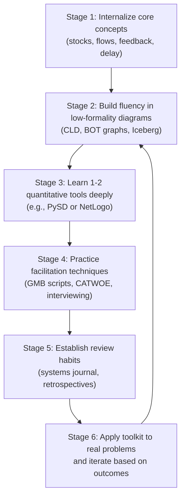

## Building a Personal Systems Thinking Toolkit


### Overview

A personal systems thinking toolkit is the curated set of mental models, diagramming techniques, software tools, heuristics, and habits a practitioner assembles over time to analyze, communicate about, and intervene in complex systems. Unlike a single-method course module, this is a synthesis competency: it concerns *selection* (which tools for which situations), *fluency* (ability to apply tools quickly and correctly), and *integration* (combining tools coherently into a personal practice) rather than any one technique in isolation.

### Why a Personal Toolkit Matters

**Key Points**

- No single systems method covers all situations; a practitioner needs a repertoire, not a single tool, to avoid what Abraham Maslow described as "the law of the instrument" (if the only tool you have is a hammer, every problem looks like a nail).
- A toolkit built through repeated practice becomes tacit skill — pattern recognition of feedback loops, delays, and archetypes happens faster with a well-practiced toolkit than by starting analysis from scratch each time.
- Toolkits enable rapid triage: recognizing quickly whether a problem needs a quick CLD sketch, a full System Dynamics model, a stakeholder-facing Rich Picture, or simply an archetype match.

### Core Categories of a Systems Thinking Toolkit

A robust toolkit typically spans five categories:

1. **Conceptual/mental models** — frameworks for thinking, independent of any drawing or software.
2. **Diagramming and visual techniques** — ways to externalize structure for yourself and others.
3. **Quantitative/simulation tools** — software and methods for formal modeling.
4. **Facilitation and elicitation techniques** — for working with groups and stakeholders.
5. **Personal habits and review practices** — routines that keep the toolkit sharp and current.

### 1. Conceptual and Mental Models

**Foundational concepts to internalize:**

- Stocks and flows — the fundamental structural distinction between accumulations and rates of change.
- Feedback loops — reinforcing (R) loops that amplify, balancing (B) loops that seek equilibrium.
- Delays — the gap between action and consequence, a primary source of oscillation and overshoot.
- Emergence — system-level behavior arising from component interactions, not reducible to any single component.
- Leverage points — Donella Meadows' hierarchy of places to intervene in a system, ranging from low-leverage parameter tweaks to high-leverage shifts in paradigm.
- System archetypes — recurring generic structures (e.g., "Limits to Growth," "Shifting the Burden," "Tragedy of the Commons," "Fixes that Fail," "Escalation") that recur across domains and can be pattern-matched quickly.

**Example**

A practitioner facing a recurring organizational complaint ("every time we hire more support staff, ticket backlog temporarily drops, then rises again") can recognize this immediately as a "Shifting the Burden" or "Fixes that Fail" archetype, without building a formal model, simply by having internalized the archetype library.

### 2. Diagramming and Visual Techniques

| Technique | Best for | Formality |
| --- | --- | --- |
| Rich Picture | Early-stage problem exploration, multiple worldviews | Low |
| Causal Loop Diagram (CLD) | Mapping feedback structure and polarity | Low–Medium |
| Stock-and-Flow Diagram | Precise structural specification prior to simulation | Medium–High |
| Behavior-over-Time (BOT) graph | Sketching expected/observed dynamic patterns | Low |
| Iceberg Model | Moving from events to patterns to structure to mental models | Low |
| Connection Circle / Systemigram | Showing relationships and narrative flow together | Medium |

**Personal practice recommendation:** default to the *lowest-formality tool that captures the needed structure*. Escalate formality only when precision or quantification is genuinely required — this avoids the common failure mode of over-modeling simple problems.

### 3. Quantitative and Simulation Tools

**Software categories to have working familiarity with:**

- **System Dynamics platforms** — Vensim, Stella, or the open-source Python library `PySD` for translating stock-flow diagrams into simulations.
- **Agent-Based Modeling platforms** — NetLogo (accessible, education-oriented) or AnyLogic (industrial-grade, multi-paradigm).
- **Network analysis** — Python's `networkx` or Gephi for visualizing and computing graph metrics (centrality, clustering, path length) on system structure.
- **General scripting** — Python or R for custom data analysis, statistical validation of model behavior, and Monte Carlo experimentation.

**Example — minimal PySD workflow**

```python
import pysd

# Load a Vensim-authored stock-flow model
model = pysd.read_vensim('inventory_system.mdl')

# Run simulation with a modified parameter
results = model.run(params={'Desired_Inventory': 500})

print(results[['Inventory', 'Order_Rate']].tail())
```

[Unverified] Specific `PySD` API method names and supported file formats may change across library versions; consult current `PySD` documentation before relying on exact syntax in a live project.

### 4. Facilitation and Elicitation Techniques

Tools for working with other people, not just models:

- **Group Model Building (GMB) scripts** — structured facilitation sequences (hexagon mapping, graphs-over-time elicitation) for building shared CLDs live with stakeholders.
- **CATWOE analysis** (from Soft Systems Methodology) — Customers, Actors, Transformation, Worldview, Owner, Environmental constraints — a checklist for surfacing whose perspective a system definition privileges.
- **The "Five Whys"** — simple root-cause drilling technique, useful as a lightweight entry point before full causal-loop mapping.
- **Structured interviewing and thematic coding** — for eliciting mental models from stakeholders systematically rather than anecdotally.

### 5. Personal Habits and Review Practices

**Key Points**

- **Systems journal** — maintaining a running log of CLDs, archetype-matches, and behavior-over-time sketches encountered in daily life, work, or news, to build pattern-recognition speed over time.
- **Deliberate archetype practice** — periodically re-examining a known problem and asking "which archetype(s) apply here, and did I miss one?"
- **Boundary critique habit** — routinely asking "what did I leave outside this system's boundary, and why?" to counteract the natural tendency to under-scope.
- **Retrospective model review** — revisiting past models or CLDs after enough time has passed to see whether real-world behavior matched the structure predicted, closing the feedback loop on one's own modeling skill.
- **Cross-domain reading** — deliberately exposing the toolkit to ecology, engineering, economics, and organizational behavior, since system archetypes recur across all of these domains.

### A Suggested Personal Toolkit-Building Progression



### Decision Heuristic: Choosing the Right Tool for the Situation

**Example**

A practical selection heuristic a practitioner can apply in the moment:

- Is the goal to *explore* a messy, contested problem with multiple stakeholders? → Start with a **Rich Picture** or **CATWOE**.
- Is the goal to *explain* why a recurring pattern keeps happening? → Sketch a **CLD**, check against the **archetype library**.
- Is the goal to *predict* magnitude, timing, or the effect of a specific policy change? → Escalate to a **stock-and-flow model** and simulate.
- Is the goal to understand *emergent* behavior from many interacting heterogeneous actors? → Consider an **agent-based model**.
- Is the goal to understand *structural position and influence* within a network of relationships? → Apply **network analysis** metrics.
- Is the goal to *build shared understanding* across a divided stakeholder group? → Use **Group Model Building** facilitation.

### Common Pitfalls in Toolkit-Building

- **Tool hoarding without depth** — collecting many methods superficially rather than developing genuine fluency in a smaller, well-practiced core set.
- **Premature formalization** — jumping to a quantitative model before qualitative boundary-setting and stakeholder framing are adequate, producing a precise answer to the wrong question.
- **Static toolkit** — treating the toolkit as "finished" rather than as an evolving practice updated through retrospective review and new domain exposure.
- **Software substituting for concepts** — becoming proficient in simulation software syntax without a correspondingly strong grasp of the underlying stock-flow and feedback concepts, leading to models that run but are structurally unsound.
- [Inference] Practitioners who skip the habit-building category (journaling, retrospectives) in favor of only accumulating techniques often report slower pattern-recognition development, though the rate of this varies by individual and cannot be quantified as a general rule.

### Sample Personal Toolkit Checklist

**Next Steps**

- [ ] Can I sketch a correct stock-and-flow diagram from a verbal problem description within 10 minutes?
- [ ] Can I name at least 5 system archetypes from memory and give a real-world example of each?
- [ ] Do I have working fluency in at least one quantitative simulation tool (SD or ABM)?
- [ ] Have I facilitated (or participated meaningfully in) at least one Group Model Building session?
- [ ] Do I maintain an ongoing systems journal or equivalent review habit?
- [ ] Have I revisited an old model or CLD to check its predictions against what actually happened?

### Related Topics

- Donella Meadows' leverage points and where to apply them
- System archetypes: identification and case studies
- Group Model Building facilitation in depth
- Soft Systems Methodology and CATWOE analysis
- Introductory System Dynamics modeling with PySD or Vensim
- Network analysis fundamentals for systems structure
- Reflective practice and expertise development in complex problem-solving
- Integrating qualitative and quantitative systems methods