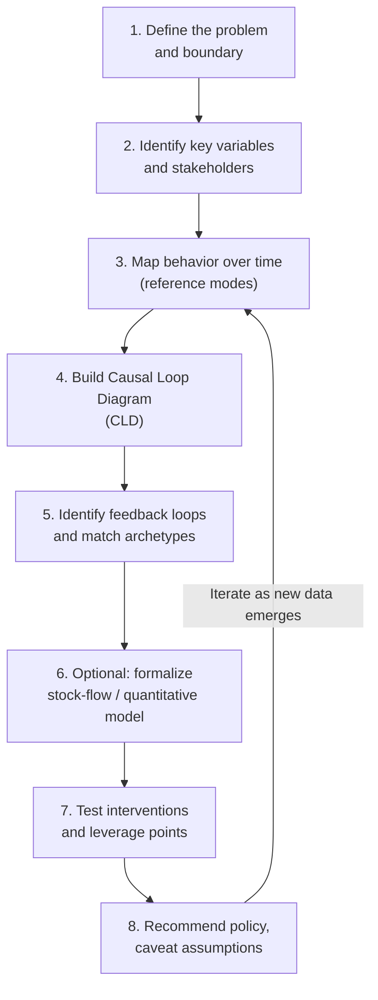

## Case Study Analysis Using Systems Thinking

### Overview

Case study analysis using systems thinking is the applied capstone practice of taking a real or realistic complex situation and working through it end-to-end with systems methods: framing the problem, mapping structure, identifying feedback and archetypes, optionally formalizing a quantitative model, and deriving intervention recommendations. Unlike studying individual tools in isolation, case analysis requires sequencing and integrating multiple techniques against a single, often messy, real-world narrative — making it the primary vehicle for demonstrating mastery.

### The General Case Analysis Process

A repeatable process structure applicable across domains:

### Step 1: Define the Problem and Boundary

**Key Points**

- Start from a *problem statement*, not a *solution statement* — "customer churn keeps rising despite retention campaigns" rather than "we need a better loyalty program."
- Explicitly state what is inside and outside the system boundary; boundary choices determine which feedback loops are visible and which appear as unexplained "external" disturbances.
- Identify the time horizon of interest — a boundary appropriate for a one-quarter operational question is usually too narrow for a multi-year strategic question.

**Example**

For a case on urban traffic congestion, one boundary choice includes only road capacity and vehicle volume (narrow, engineering-focused); a wider boundary includes land-use policy, public transit funding, and residential development patterns (broader, more accurate, but harder to model).

### Step 2: Identify Key Variables and Stakeholders

- List the stocks (accumulations) that matter: e.g., "Customer base," "Employee morale," "Inventory," "Housing units."
- List stakeholders and their differing perspectives on what the "problem" even is — a technique borrowed from Soft Systems Methodology's CATWOE (Customers, Actors, Transformation, Worldview, Owner, Environmental constraints).
- Distinguish variables that are directly measurable (quantitative-friendly) from variables that are perceptual or attitudinal (qualitative-friendly, e.g., "trust," "morale," "reputation").

### Step 3: Map Behavior Over Time (Reference Modes)

Before drawing causal structure, sketch how key variables have actually behaved historically and how stakeholders expect them to behave — this is the "reference mode" in System Dynamics practice, and it anchors the rest of the analysis in observed reality rather than assumption.

**Example — textual behavior-over-time description**

"Sales grew steadily for 18 months, plateaued for 6 months despite continued marketing spend, then began a slow decline over the following year" — this single sentence already hints at a balancing loop reaching a limit (a "Limits to Growth" pattern) rather than a purely reinforcing dynamic.

### Step 4: Build the Causal Loop Diagram

The CLD translates the qualitative narrative into explicit causal links with polarity (`+` for same-direction effect, `-` for opposite-direction effect).

**Illustration: Case CLD for the "Sales Plateau" Example**

<svg xmlns="http://www.w3.org/2000/svg" viewBox="0 0 700 460">
\<style\>
.title { font: bold 15px sans-serif; fill: #1a1a1a; }
.label { font: 13px sans-serif; fill: #1a1a1a; }
.small { font: 11px sans-serif; fill: #555; }
.node { fill: #eef3fb; stroke: #2a5d9f; stroke-width: 2; }
.arrow { stroke: #333; stroke-width: 2; fill: none; marker-end: url(#arrow2); }
.loopR { fill: none; stroke: #1a7a3a; stroke-width: 2; stroke-dasharray: 4 3; }
.loopB { fill: none; stroke: #b02a2a; stroke-width: 2; stroke-dasharray: 4 3; }
\</style\>
<text x="350" y="28" text-anchor="middle" class="title">Sales Plateau Causal Loop Diagram (svg_diagram)</text>
<rect x="270" y="70" width="160" height="50" rx="6" class="node" />
<text x="350" y="100" text-anchor="middle" class="label">Marketing Spend</text>
<rect x="270" y="180" width="160" height="50" rx="6" class="node" />
<text x="350" y="210" text-anchor="middle" class="label">Sales</text>
<rect x="60" y="290" width="160" height="50" rx="6" class="node" />
<text x="140" y="320" text-anchor="middle" class="label">Revenue</text>
<rect x="480" y="290" width="180" height="50" rx="6" class="node" />
<text x="570" y="313" text-anchor="middle" class="label">Market Saturation</text>
<text x="570" y="328" text-anchor="middle" class="small">(remaining prospects)</text>
<path d="M350,120 L350,180" class="arrow" />
<text x="365" y="150" class="small">+</text>
<path d="M270,205 L220,300" class="arrow" />
<text x="230" y="260" class="small">+</text>
<path d="M140,290 Q140,140 270,95" class="arrow" />
<text x="150" y="180" class="small">+ (reinvest)</text>
<path d="M430,205 L480,300" class="arrow" />
<text x="460" y="260" class="small">-</text>
<path d="M480,320 Q350,400 350,230" class="arrow" />
<text x="380" y="380" class="small">- (fewer new customers left)</text>

<text x="140" y="150" text-anchor="middle" class="small" fill="`#1a7a3a`">R1: Reinvestment loop</text>

<text x="500" y="400" text-anchor="middle" class="small" fill="`#b02a2a`">B1: Saturation loop</text>

</svg>

### Step 5: Identify Feedback Loops and Match Archetypes

**Key Points**

- **R1 (reinforcing):** Marketing Spend → Sales → Revenue → Marketing Spend — growth-driving loop.
- **B1 (balancing):** Sales → Market Saturation → Sales — growth-limiting loop that becomes dominant as saturation approaches.
- This structure matches the **"Limits to Growth"** archetype: a reinforcing loop drives growth until a balancing loop, tied to a finite resource or capacity, begins to dominate and flattens the trajectory.
- Archetype-matching accelerates diagnosis: recognizing "Limits to Growth" immediately suggests the intervention is to either expand the limiting condition (new markets) or shift strategy away from the now-exhausted growth loop, rather than simply increasing marketing spend further (which would be treating a symptom).

### Step 6: Optional Quantitative Formalization

For cases where magnitude, timing, or policy-testing precision matters, the CLD becomes a stock-and-flow model:

$$\frac{d(\text{Sales})}{dt} = \text{Conversion\_Rate} \times \text{Marketing\_Spend} \times \left(1 - \frac{\text{Cumulative\_Customers}}{\text{Total\_Addressable\_Market}}\right)$$

This single equation formalizes the archetype: as `Cumulative_Customers` approaches `Total_Addressable_Market`, the growth term shrinks toward zero, producing the observed plateau — even with constant `Marketing_Spend`.

[Inference] Real-world saturation dynamics are rarely as clean as a single multiplicative term; case analyses commonly need additional terms (e.g., competitor response, market growth, churn) to fit observed data closely, and the appropriate functional form is domain-specific rather than universal.

### Step 7: Test Interventions Using Leverage Points

Applying Donella Meadows' leverage-points hierarchy to the case:

| Leverage Point (low → high) | Example Intervention | Likely Impact |
| --- | --- | --- |
| Parameters | Increase marketing budget | Low — reinforces a loop already saturating |
| Buffer sizes | Build larger sales pipeline / backlog | Low–Medium |
| Feedback loop strength | Improve conversion rate via better targeting | Medium |
| Information flows | Give sales team real-time saturation data per segment | Medium–High |
| Rules of the system | Change compensation structure to reward new-market entry over existing-market volume | High |
| Goals of the system | Shift company goal from "maximize sales in current market" to "diversify total addressable market" | Very High |
| Paradigm | Reframe from "growth via volume" to "growth via retention and expansion" | Highest |

**Next Steps**

- Recommend testing a **high-leverage, low-cost** intervention first where feasible (e.g., information-flow changes) before committing to costly structural changes.
- Explicitly flag which recommended interventions depend on assumptions not yet validated against real data.

### Step 8: Recommend Policy and Caveat Assumptions

A rigorous case write-up separates:

- **What the model/analysis shows** (structural implications given stated assumptions).
- **What is empirically confirmed** (validated against real historical data).
- **What remains assumption or stakeholder belief** (not yet tested).

**Behavioral disclaimer:** [Unverified] Any recommended intervention's real-world effect depends on organizational, competitive, and behavioral factors outside the model's boundary; simulated or diagrammed outcomes should be treated as hypotheses for testing, not guaranteed results.

### Common Case Analysis Pitfalls

- **Jumping straight to solutions** before adequately mapping structure — leads to treating symptoms (e.g., "spend more on marketing") rather than root causes (loop-level saturation).
- **Single-loop tunnel vision** — analyzing only the most visible reinforcing loop and missing the balancing loop that will eventually dominate.
- **Archetype mis-matching** — forcing a case into a familiar archetype pattern that doesn't actually fit the causal evidence, rather than letting the data and stakeholder narrative determine the structure.
- **Boundary too narrow** — excluding an actor or feedback path (e.g., competitor response, regulatory change) that later turns out to be decisive.
- **Quantitative over-precision** — presenting simulation output with unwarranted numerical confidence when key parameters were rough estimates.
- **Ignoring stakeholder disagreement** — treating the CLD as objectively "the" system structure when in fact different stakeholders would draw meaningfully different diagrams (a core insight from Soft Systems Methodology).

### A Template for Structuring a Written Case Study Report

1. Executive summary of the problem and headline recommendation.
2. Problem definition and boundary rationale.
3. Stakeholder perspectives (brief CATWOE or equivalent).
4. Behavior-over-time / reference mode description.
5. Causal Loop Diagram with named loops (R1, B1, etc.) and archetype identification.
6. (If applicable) Quantitative model description, key equations, and validation results.
7. Leverage point analysis and ranked intervention options.
8. Recommendations with explicit assumptions and confidence caveats.
9. Suggested monitoring metrics to test whether the recommended intervention is working as predicted (closing the case's own feedback loop).

### Related Topics

- System archetypes: identification and case studies
- Donella Meadows' leverage points in depth
- Group Model Building for collaborative case analysis
- Integrating qualitative and quantitative systems methods
- Soft Systems Methodology and CATWOE analysis
- Building a personal systems thinking toolkit
- Validation techniques for System Dynamics models
- Writing and presenting systems-based policy recommendations