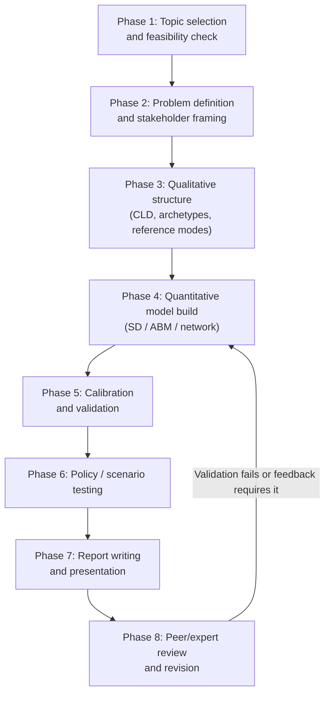

## Capstone Systems Modeling Project


### Overview

A capstone systems modeling project is the culminating deliverable of a systems thinking curriculum: an end-to-end, independently executed modeling effort that requires the practitioner to select a real or realistic complex problem, apply the full toolkit (conceptual, qualitative, and quantitative), build and validate a model, and derive actionable, defensible recommendations. It differs from a case study analysis in scope and ownership — a capstone is typically self-directed, original, and expected to demonstrate integrated mastery across the entire curriculum rather than working through a pre-given example.

### Purpose and Learning Objectives

**Key Points**

- Demonstrate the ability to independently scope an ambiguous, real-world problem into a tractable modeling boundary.
- Demonstrate fluency across the qualitative-to-quantitative pipeline: problem framing → CLD → stock-flow (or ABM/network model) → simulation → validation → policy recommendation.
- Demonstrate critical self-assessment: identifying the model's own limitations, untested assumptions, and boundaries of applicability.
- Produce an artifact (report, model file, presentation) suitable for a portfolio or professional audience.

### Capstone Project Lifecycle



### Phase 1: Topic Selection and Feasibility

A good capstone topic satisfies several practical constraints simultaneously:

- **Genuine complexity** — contains feedback loops, delays, or emergent behavior, not just a simple linear cause-effect chain.
- **Bounded scope** — narrow enough to complete within the project timeframe; a common failure mode is choosing a topic so broad ("climate change," "the economy") that no tractable boundary can be drawn.
- **Data or expert access** — at least some quantitative data or informed stakeholder/expert input must be obtainable, even if imperfect, to allow model calibration and validation.
- **Personal or professional relevance** — topics connected to the practitioner's own domain (workplace, community, industry) tend to produce deeper, better-validated models because tacit knowledge substitutes for missing data.

**Example candidate topics** (illustrative, not prescriptive):

- Employee attrition dynamics in a mid-sized organization.
- Local public transit ridership and service-cut feedback loops.
- Subscription-business customer churn and retention-investment tradeoffs.
- Supply chain bullwhip effect in a specific product category.
- Community health clinic patient no-show and capacity dynamics.

### Phase 2: Problem Definition and Stakeholder Framing

- Write an explicit problem statement in dynamic terms — describe a *pattern of behavior over time*, not a static fact ("membership grew rapidly, then began declining 18 months after a pricing change" rather than "we have a churn problem").
- Identify at least 2-3 distinct stakeholder perspectives on the problem, using a lightweight CATWOE-style pass even if full Soft Systems Methodology isn't applied formally.
- Draw an explicit system boundary and justify what is excluded — capstone evaluators typically weight boundary justification heavily, since unjustified boundaries are the most common source of weak models.

### Phase 3: Qualitative Structure

Deliverables expected at this phase:

1. **Behavior-over-time (reference mode) graph** — hand-sketched or plotted, showing historical and/or expected future behavior of the key variable(s).
2. **Causal Loop Diagram** — with explicitly labeled reinforcing (R) and balancing (B) loops and polarity signs on every link.
3. **Archetype identification** — naming which system archetype(s), if any, the structure resembles (e.g., "Limits to Growth," "Shifting the Burden," "Tragedy of the Commons," "Success to the Successful," "Escalation," "Fixes that Fail").

**Example — minimal CLD narrative for a churn capstone**

"Higher churn → lower revenue → smaller customer success team → slower response to at-risk customers → higher churn" describes a reinforcing loop (R1); "Higher churn → more urgency from leadership → increased retention budget → improved response time → lower churn" describes a competing balancing loop (B1) — together suggesting a "Fixes that Fail" or "Shifting the Burden" dynamic depending on whether the balancing response addresses root cause or only symptoms.

### Phase 4: Quantitative Model Build

Choice of modeling paradigm should be justified by the nature of the dynamics, not by tool familiarity alone:

| Paradigm | Choose when… |
| --- | --- |
| System Dynamics (stock-flow) | Aggregate, continuous quantities dominate (populations, inventories, budgets) and feedback structure is the central question |
| Agent-Based Modeling | Heterogeneous individual behavior and emergent patterns from local interaction are central |
| Network Analysis | Relationships, structure, and influence/position within a network are central |
| Discrete-event/statistical | Discrete events, queues, or purely empirical time-series patterns dominate |

**Example — minimal stock-flow specification for a churn capstone (conceptual pseudocode)**

```python
# Simplified System Dynamics-style specification (illustrative, not a specific library's syntax)
Customers = Customers + (Acquisition_Rate - Churn_Rate) * dt

Churn_Rate = Customers * Base_Churn_Fraction * Service_Quality_Multiplier

Service_Quality_Multiplier = f(CS_Team_Size / Customers)  
# e.g., degrades as ratio of support staff to customers falls
```

$$\text{Churn\_Rate}(t) = \text{Customers}(t) \times \text{Base\_Churn\_Fraction} \times g\!\left(\frac{\text{CS\_Team\_Size}(t)}{\text{Customers}(t)}\right)$$

where $g(\cdot)$ is a nonlinear function (e.g., a lookup table or logistic curve) capturing how service quality degrades as the support-staff-to-customer ratio falls.

[Inference] The exact functional form of $g(\cdot)$ is rarely known precisely in a capstone context; a reasonable practice is to start with a simple monotonic assumption, test model sensitivity to its shape, and treat the specific curve as a documented assumption rather than a validated fact unless supporting data exists.

### Phase 5: Calibration and Validation

**Key Points**

- **Parameter estimation** — use available historical data (regression, curve-fitting) or, where data is unavailable, structured expert elicitation with explicitly documented reasoning.
- **Behavioral validation** — run the model and compare simulated output against the historical reference mode from Phase 3; discrepancies should be explained, not hidden.
- **Sensitivity analysis** — systematically vary uncertain parameters to identify which assumptions the conclusions most depend on; this is often more valuable in a capstone than achieving a single "best fit," since it demonstrates rigor about uncertainty.
- **Extreme conditions test** — check that the model behaves sensibly at boundary conditions (e.g., does `Churn_Rate` misbehave if `Customers` approaches zero?), a standard System Dynamics model-quality check.

### Phase 6: Policy and Scenario Testing

Apply the model to test 2-4 distinct policy scenarios, ideally spanning different leverage points (per Donella Meadows' hierarchy):

**Example scenario table**

| Scenario | Leverage Point Type | Simulated Outcome (illustrative) |
| --- | --- | --- |
| Baseline (no change) | — | Churn continues rising past historical peak |
| +20% CS team budget | Parameter | Modest, temporary churn reduction |
| Proactive at-risk customer alerts (information flow) | Information flow | Larger, more durable churn reduction |
| Shift incentive structure toward retention over acquisition | Rules of the system | Largest structural improvement, slower to materialize |

**Next Steps**

- Rank scenarios not only by simulated magnitude of improvement but by implementation feasibility and confidence level.
- Explicitly identify which scenario's projected benefit is most sensitive to the uncertain parameters found in Phase 5.

### Phase 7: Report and Presentation Structure

A typical capstone report/deliverable includes:

1. Executive summary and problem statement.
2. System boundary and stakeholder framing (with justification).
3. Qualitative structure: reference modes, CLD, archetype analysis.
4. Quantitative model: equations/logic, data sources, key assumptions.
5. Validation results, including sensitivity analysis and any known model weaknesses.
6. Scenario/policy testing results.
7. Recommendations, explicitly separated into "well-supported," "plausible but uncertain," and "speculative."
8. Reflection section — what the practitioner would do differently, what further data would most improve the model.
9. Appendix — full model documentation sufficient for another practitioner to reproduce or extend the work.

### Phase 8: Peer/Expert Review and Revision

- Present the CLD and/or model to someone unfamiliar with the project and check whether they can follow the causal logic without additional explanation — a strong test of diagram clarity.
- Where possible, present findings to an actual stakeholder from the modeled domain and treat their reaction as a validity check, not just a courtesy.
- Revise based on identified structural gaps or misinterpretations before finalizing.

### Common Capstone Pitfalls

- **Scope creep** — continuously expanding the model boundary mid-project as "just one more variable" seems relevant, delaying completion and diluting focus.
- **Model complexity for its own sake** — adding stocks, flows, or agent rules that don't materially change model behavior or conclusions, at the cost of clarity and tractability.
- **Insufficient qualitative grounding** — jumping to equations before adequately mapping stakeholder perspectives and causal structure, producing a technically functional but conceptually shallow model.
- **Validation skipped or superficial** — presenting simulation output as conclusive without sensitivity analysis or comparison to historical behavior.
- **Overclaiming certainty** — presenting policy recommendations with more confidence than the model's assumptions and data quality actually support.
- [Unverified] The specific evaluation rubric, required deliverable format, and grading weight of each phase vary by program or instructor; practitioners should confirm exact capstone requirements with their own course guidelines rather than assuming this generic structure is prescriptive.

### Capstone Self-Assessment Checklist

- [ ] Is the problem defined dynamically (behavior over time), not statically?
- [ ] Is the system boundary explicitly justified, including what was excluded?
- [ ] Does the CLD have clearly labeled, correctly signed feedback loops?
- [ ] Has at least one system archetype been identified and justified against the evidence?
- [ ] Is the quantitative model's paradigm choice justified by the nature of the dynamics?
- [ ] Has the model been validated against historical behavior, not just run once and accepted?
- [ ] Has sensitivity analysis identified which assumptions the conclusions depend on most?
- [ ] Are recommendations explicitly graded by confidence level?
- [ ] Has the model been reviewed by someone outside the project for clarity and plausibility?

### Related Topics

- Case study analysis using systems thinking
- System Dynamics model validation techniques in depth
- Building a personal systems thinking toolkit
- Integrating qualitative and quantitative systems methods
- Donella Meadows' leverage points hierarchy
- Sensitivity analysis and uncertainty quantification in simulation models
- Group Model Building for stakeholder-informed capstones
- Presenting technical systems findings to non-technical audiences