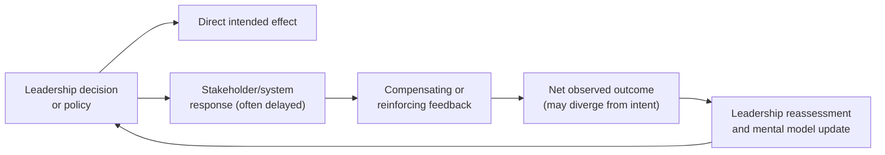

## Systems Leadership and Lifelong Systemic Practice

### Overview

Systems leadership and lifelong systemic practice concerns the sustained, ongoing application of systems thinking beyond formal training or a single project — treating systemic literacy as a durable leadership capability and personal discipline rather than a course-completion event. It addresses two intertwined threads: (1) how systems thinking changes what effective leadership looks like in complex organizations, and (2) how a practitioner maintains, deepens, and adapts systemic skill across a career.

### Why Systems Leadership Differs from Conventional Leadership

**Key Points**

- Conventional leadership models often emphasize individual decision authority, linear planning, and direct cause-effect accountability; systems leadership emphasizes shared understanding, feedback awareness, and influence over structures rather than sole control over outcomes.
- Complex systems frequently exhibit **policy resistance** — well-intentioned interventions triggering compensating feedback that erodes or reverses the intended effect. Systems-literate leaders anticipate this rather than being repeatedly surprised by it.
- Leadership in a systems context requires comfort with **delayed and indirect causality** — outcomes of a decision may not appear for months or years, and cause and effect may be separated across organizational boundaries.
- Peter Senge's concept of the "learning organization" frames systems leadership explicitly around building organizational capacity for collective learning and adaptation, not just individual expert decision-making.

### Core Competencies of Systems Leadership

1. **Seeing structure, not just events** — habitually asking "what pattern is this event part of, and what structure produces that pattern?" (the Iceberg Model applied to leadership judgment in real time).
2. **Distributed sense-making** — actively eliciting and reconciling different stakeholders' mental models rather than assuming a single "correct" view of the situation (echoing Soft Systems Methodology's multiple-worldviews stance).
3. **Leverage-point judgment** — recognizing that some interventions (changing incentive structures, information flows, or goals) will have outsized effect compared to others (adjusting a single parameter), per Donella Meadows' leverage-points hierarchy.
4. **Tolerance for emergent, non-linear outcomes** — resisting the urge to demand precise, linear predictions from inherently complex, adaptive systems, while still holding rigor about testable assumptions.
5. **Facilitating shared models** — using techniques like Group Model Building to build genuinely shared understanding across a team or organization, rather than relying on top-down explanation alone.
6. **Systemic humility** — actively watching for and correcting one's own boundary blindness, since every leader's mental model necessarily excludes some relevant structure.

### Senge's Five Disciplines as a Leadership Frame

Peter Senge's *The Fifth Discipline* frames organizational systems leadership around five interlocking disciplines:

| Discipline | Leadership Application |
| --- | --- |
| Systems Thinking | The integrating discipline — seeing interrelationships and patterns rather than isolated events |
| Personal Mastery | Continually clarifying and deepening personal vision and objective view of current reality |
| Mental Models | Surfacing and testing deeply held assumptions that shape decisions, rather than acting on them unconsciously |
| Shared Vision | Building genuine, not merely compliant, commitment to a common future state |
| Team Learning | Practicing dialogue and collective inquiry that produces insight beyond what any individual member could reach alone |

[Inference] While Senge's framework remains widely referenced in organizational systems-thinking literature, the degree to which any specific organization successfully institutionalizes all five disciplines in practice varies considerably and is not something that can be asserted as a general outcome.

### Recognizing Policy Resistance in Leadership Practice

**Example**

A leadership team introduces a strict return-to-office mandate to increase in-person collaboration. Employees who value flexibility respond by seeking new employment; attrition rises among the most mobile (often highest-performing) staff; management responds by loosening enforcement informally; overall in-person collaboration ends up lower than before the mandate, alongside elevated turnover costs. This is a textbook case of **policy resistance**: a balancing feedback loop (employee response to perceived rigidity) offsetting the intended reinforcing effect of the policy. Systems-literate leadership anticipates this class of dynamic before implementation, rather than discovering it only after attrition data arrives.

### The Leadership-Level Diagram: Decision → Feedback → Adaptation Loop

Systems leadership treats this loop as continuous and expected, building in deliberate monitoring and reassessment stages rather than treating a single decision as a one-time, closed action.

### Lifelong Systemic Practice: Sustaining the Skill Over a Career

**Key Points**

- **Deliberate practice, not passive exposure** — systemic pattern-recognition (spotting archetypes, feedback structures, delays) improves through repeated, reflective application, similar to expertise development in other complex-judgment domains; casual familiarity with concepts is not the same as practiced fluency.
- **Cross-domain transfer** — actively studying systems dynamics in fields outside one's own (ecology, epidemiology, engineering, economics) strengthens general archetype recognition, since the same structures (e.g., "Tragedy of the Commons," "Limits to Growth") recur across domains.
- **Community of practice** — engaging with other systems practitioners (through professional societies such as the System Dynamics Society, reading groups, or informal peer review of models) provides external challenge to one's own mental models, counteracting the natural tendency toward self-confirming analysis.
- **Retrospective calibration** — periodically revisiting past decisions or models to check whether predicted dynamics actually played out, closing the personal feedback loop on one's own judgment over time.
- **Continued formal learning** — systems thinking as a field continues to develop (e.g., advances in agent-based modeling, network science, and complexity economics); sustained practice includes staying current with methodological developments, not just applying a fixed toolkit learned once.

### A Personal Practice Cadence (Illustrative Structure)

| Cadence | Practice |
| --- | --- |
| Daily/Weekly | Systems journal entries on patterns noticed in work or life; quick CLD sketches for recurring frustrations |
| Monthly | Revisit one past decision or prediction; assess whether the anticipated feedback structure played out as expected |
| Quarterly | Read or discuss a case study or archetype example from a domain outside one's own field |
| Annually | Formal retrospective on a completed project or model; update personal toolkit based on what worked or failed |
| Ongoing | Participate in a community of practice; seek external review of significant models or recommendations |

### Systems Leadership in Organizational Design

- **Incentive and information architecture** — a systems-literate leader treats redesigning what information flows to whom, and what behavior incentive structures actually reward, as higher-leverage tools than direct exhortation or one-off directives.
- **Building institutional memory of past feedback dynamics** — documenting previously observed policy resistance or archetype instances so future leaders in the organization don't have to rediscover the same dynamic from scratch.
- **Psychological safety for surfacing mental models** — team learning (per Senge) depends on people being willing to voice differing views of "how the system actually works," which requires a leadership climate where such disagreement is treated as useful data, not disloyalty.

### Common Pitfalls in Systems Leadership Practice

- **Analysis without authority to act** — building sophisticated systemic understanding but failing to translate it into organizational decision-making power or influence, leaving insight unused.
- **Treating systems thinking as a one-time training event** — attending a workshop or completing a curriculum and considering the skill "acquired," rather than sustaining deliberate practice over years.
- **Over-intellectualizing at the expense of action** — endlessly mapping structure without committing to testable interventions, sometimes called "analysis paralysis" in a systemic-leadership context.
- **Ignoring one's own position in the system** — failing to recognize that the leader themselves, and their own decisions and incentives, are part of the feedback structure being analyzed, not an external observer of it.
- [Unverified] Claims that systems-literate leadership reliably produces superior organizational performance compared to conventional leadership approaches are difficult to verify rigorously at scale, given confounding factors in real organizational settings; such claims should be treated as plausible but not established fact.

### Related Topics

- Peter Senge's "The Fifth Discipline" and the learning organization
- Policy resistance and its relationship to system archetypes
- Group Model Building and shared mental model facilitation
- Donella Meadows' leverage points hierarchy
- Building a personal systems thinking toolkit
- Organizational incentive design and feedback-aware policy-making
- Communities of practice in systems dynamics and complexity science
- Reflective practice and long-term expertise development