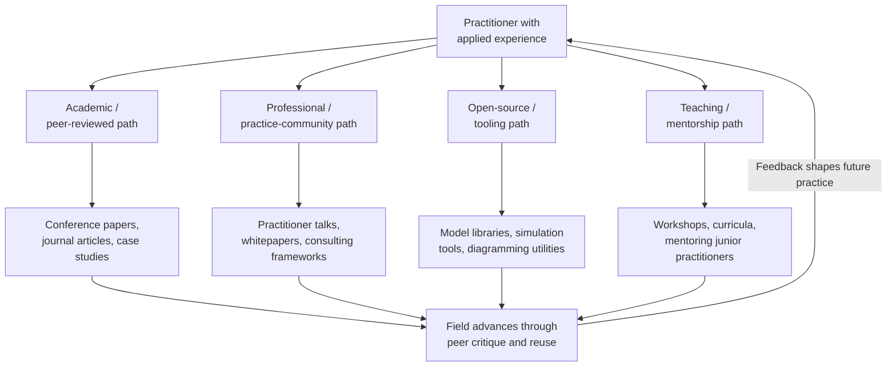

## Contributing to the Systems Thinking Community and Literature


### Overview

Contributing to the systems thinking community and literature is the practice of moving from being a consumer of systems methods to an active participant in the field's ongoing development — through publishing, presenting, teaching, open-source tool-building, peer review, and community engagement. This closes the loop on a systems thinking education: the field itself is a system that improves through feedback from practitioners applying, critiquing, and extending its methods, and sustained mastery is demonstrated partly by contributing back to that feedback loop rather than only consuming it.

### Why Contribution Matters for the Field and the Practitioner

**Key Points**

- The systems thinking field advances through documented case applications, methodological critique, and tool development contributed by practitioners across many domains — it is not a fixed body of knowledge but an actively evolving discipline.
- Contributing forces a higher standard of rigor than private practice alone: writing for peer review or public presentation requires making assumptions explicit and defensible in a way that internal, undocumented modeling often does not.
- Teaching and explaining systems concepts to others is a well-documented mechanism for deepening one's own understanding (the "protégé effect"), making community contribution a form of continued personal skill development, not simply altruism.
- Systems thinking as a field spans academic (System Dynamics Society, complexity science journals), professional (consulting, organizational practice), and grassroots/open-source communities; different contribution paths suit different practitioner contexts.

### Pathways for Contribution



### 1. Academic and Peer-Reviewed Contribution

**Key venues and formats:**

- **System Dynamics Society** — the primary international academic/professional body for System Dynamics, hosting an annual International Conference of the System Dynamics Society and publishing the *System Dynamics Review* journal.
- **Complexity science journals** — outlets covering agent-based modeling, network science, and complex adaptive systems research more broadly.
- **Case study submissions** — many systems thinking venues explicitly welcome applied case studies, not only theoretical or methodological papers, making practitioner contribution accessible without requiring a purely academic research agenda.

**Typical academic contribution format:**

1. Problem context and literature grounding (how does this case relate to existing archetype or methodological literature?).
2. Methodology (qualitative elicitation process, quantitative model structure, validation approach).
3. Results and model behavior.
4. Discussion of limitations, generalizability, and implications for the broader field.
5. Peer review and revision cycle before publication.

[Unverified] Specific submission requirements, review timelines, and acceptance criteria vary by venue and change over time; practitioners should consult a target journal's or conference's current author guidelines directly rather than assuming a fixed universal format.

### 2. Professional and Practice-Community Contribution

- **Practitioner conferences and meetups** — presenting applied case studies or lessons learned to other consultants, analysts, or organizational leaders, often less formally structured than academic venues.
- **Whitepapers and consulting frameworks** — codifying a firm's or individual's applied methodology (e.g., a specific Group Model Building facilitation script variant) into a publicly shareable framework.
- **Professional certifications and communities** — organizations offering systems thinking or System Dynamics credentials often maintain practitioner forums, mentorship programs, or study groups that benefit from experienced-practitioner contribution.

**Example**

A practitioner who developed a novel facilitation adaptation of Group Model Building for fully remote, asynchronous stakeholder groups (a genuinely emerging practice challenge) could contribute this as a practitioner blog post, conference talk, or professional-body case submission — filling a documented gap between traditional in-person GMB literature and contemporary distributed-work realities.

### 3. Open-Source and Tooling Contribution

Systems thinking increasingly benefits from open-source software contribution, an area where technically-inclined practitioners can add significant value:

- **Simulation libraries** — contributing to or extending open-source System Dynamics tools such as `PySD` (Python), or agent-based modeling platforms such as NetLogo, through bug fixes, documentation, or new feature development.
- **Diagramming and visualization tools** — contributing templates, plugins, or integrations for CLD/stock-flow diagramming tools (e.g., Kumu integrations, Mermaid.js systems-diagram extensions).
- **Model libraries and repositories** — publishing well-documented, reusable model structures (e.g., a validated "Bass diffusion" adoption model or a generic "Limits to Growth" archetype template) for others to adapt, often via GitHub.
- **Reproducibility practice** — publishing model code and data alongside written case studies so other practitioners can verify, critique, and extend the work, consistent with broader open-science norms.

**Example — minimal contribution workflow for an open-source SD model repository**

```bash
# Fork and clone a community model repository
git clone https://github.com/example-org/sd-model-library.git
cd sd-model-library

# Add a new, well-documented model contribution
mkdir models/customer-churn-limits-to-growth
# Include: model file, README with assumptions, validation notes, and data sources

git checkout -b add-churn-limits-to-growth-model
git add models/customer-churn-limits-to-growth
git commit -m "Add documented Limits to Growth churn model with validation notes"
git push origin add-churn-limits-to-growth-model
# Open a pull request for community review
```

[Unverified] This workflow illustrates standard open-source contribution practice generically; actual repository structure, contribution guidelines, and review processes are specific to each project and should be confirmed against that project's own `CONTRIBUTING.md` or equivalent documentation.

### 4. Teaching and Mentorship Contribution

- **Formal teaching** — developing or delivering systems thinking curricula, workshops, or university coursework.
- **Mentorship** — guiding less-experienced practitioners through their first case studies or capstone-style projects, providing the kind of critical external review that strengthens model quality.
- **Public explanatory writing** — blog posts, explainer articles, or accessible video content translating systems concepts (archetypes, leverage points, feedback structures) for broader, non-specialist audiences, expanding the field's overall literacy base.

### What Makes a Contribution Valuable to the Field

**Key Points**

- **Documented assumptions** — a contribution's value is substantially higher when reasoning, data sources, and uncertainty are made explicit, rather than presenting only polished conclusions.
- **Genuine novelty or synthesis** — either a new domain application of existing methods, a methodological refinement, or a useful synthesis/critique of existing literature; pure repetition of well-documented archetypes without new insight adds little.
- **Reproducibility** — sharing enough model detail (equations, code, or diagrams) that another practitioner could evaluate or extend the work independently.
- **Honest limitation reporting** — explicitly stating where a model or case study's conclusions do not generalize, which paradoxically increases a contribution's credibility and long-term value to the field.

### Common Pitfalls in Community Contribution

- **Overclaiming generalizability** — presenting a single case's findings as if they establish a universal rule, rather than a domain-specific, context-bound instance.
- **Underdocumenting methodology** — publishing conclusions or diagrams without enough process detail for peer evaluation, reducing scientific and practical value.
- **Reinventing without literature review** — presenting a "novel" archetype or method that is actually a known pattern already well-documented in existing systems thinking literature, due to insufficient engagement with the field's existing body of work.
- **One-way contribution without engagement** — publishing or presenting without engaging with resulting critique or questions, missing the feedback-loop benefit that makes community contribution valuable for the contributor's own growth.
- [Inference] Practitioners who contribute early and iteratively (smaller, more frequent contributions with feedback incorporated) tend to develop stronger field engagement over time than those who wait for a single large, "finished" contribution, though this pattern is based on general professional-development observation rather than a specific measured study.

### A Practical Starting Checklist for First-Time Contributors

**Next Steps**

- [ ] Identify one applied case, model, or facilitation technique from your own practice that is well-documented enough to share.
- [ ] Choose an appropriate venue matching your goals: academic (System Dynamics Society/journal), professional (conference/blog), open-source (model or tool repository), or teaching (workshop/mentorship).
- [ ] Explicitly document assumptions, data sources, and limitations before sharing.
- [ ] Seek informal peer feedback before formal submission or publication.
- [ ] Engage with resulting questions or critique as part of the contribution, not as an afterthought.
- [ ] Revisit the contribution after a year to assess what you would revise given subsequent experience.

### Related Topics

- The System Dynamics Society and major systems thinking academic venues
- Open-source System Dynamics and agent-based modeling tools (PySD, NetLogo)
- Group Model Building facilitation innovations
- Building a personal systems thinking toolkit
- Systems leadership and lifelong systemic practice
- Reproducibility and documentation standards in simulation modeling
- Teaching systems thinking: curriculum design and workshop facilitation
- Case study analysis using systems thinking