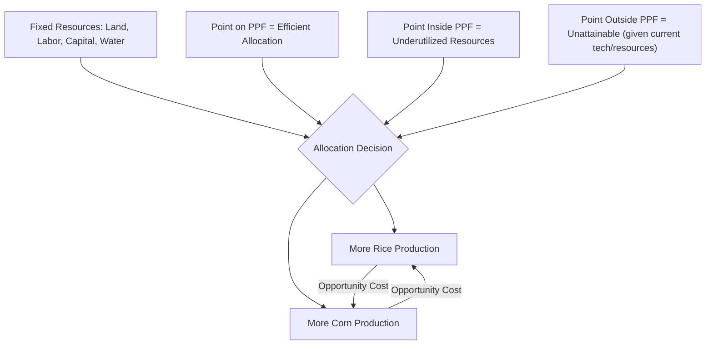

## Scarcity, Choice, and Opportunity Cost

### Definition and Conceptual Foundations

**Scarcity** refers to the fundamental economic condition in which human wants and needs exceed the finite resources available to satisfy them. In agricultural economics, scarcity applies to land, water, labor, capital, seeds, fertilizer, and time — all of which exist in limited supply relative to the demands placed on them by farmers, agribusinesses, and society at large.

Scarcity is distinct from *shortage*. A shortage is a temporary market condition (e.g., a fertilizer shortage caused by supply chain disruption), whereas scarcity is a permanent, structural feature of economic life arising from the basic mismatch between limited resources and unlimited wants.

Because resources are scarce, **choice** becomes unavoidable. Every economic agent — a smallholder farmer, an agribusiness firm, or a national government — must decide how to allocate limited resources among competing uses. This necessity of choosing is what gives rise to **opportunity cost**: the value of the next-best alternative forgone when a choice is made.

$$OC = \text{Value of Best Forgone Alternative}$$

### The Three Basic Economic Questions

Scarcity forces every economic system — including agricultural systems — to answer three interrelated questions:

- **What to produce?** (e.g., allocate hectares to rice versus corn versus vegetables)
- **How to produce it?** (e.g., labor-intensive versus mechanized farming methods)
- **For whom to produce?** (e.g., domestic consumption versus export markets)

These questions are not unique to agriculture, but agricultural resource allocation is often the clearest illustration of them, since land and growing seasons impose hard physical constraints on how many of these questions can be simultaneously satisfied.

### Opportunity Cost: Mechanics and Measurement

Opportunity cost is not always a monetary figure. It is the *value* of the forgone alternative, which may be measured in money, output, time, or utility.

**Key Points**

- Opportunity cost always involves a comparison between the chosen option and only the *single best* alternative not chosen — not the sum of all alternatives forgone.
- Explicit costs (direct monetary outlays) and implicit costs (forgone income or value, such as unpaid family labor or owner-occupied land) together make up **economic cost**, which is broader than **accounting cost**.
- Economic profit subtracts both explicit and implicit costs from revenue, while accounting profit subtracts only explicit costs.

$$\text{Economic Profit} = \text{Total Revenue} - (\text{Explicit Costs} + \text{Implicit Costs})$$

**Example**

A rice farmer owns 2 hectares of land. She can plant rice, expected to yield a net return of ₱80,000 per hectare per season, or lease the land out to a neighbor for ₱65,000 per hectare per season with no labor input required.

If she chooses to plant rice herself:

- Explicit costs: seeds, fertilizer, hired labor, irrigation fees
- Implicit cost: the ₱65,000 per hectare in forgone lease income, plus the value of her own labor and management time she could have spent elsewhere

Her opportunity cost of farming the land herself is the ₱65,000/hectare lease income she forgoes (assuming leasing is her next-best alternative), not the sum of leasing plus any other hypothetical use of the land.

### Opportunity Cost in Agricultural Production Decisions

Agricultural decision-making is a continuous exercise in comparing opportunity costs across competing uses of the same scarce inputs.

**Land Allocation**

A farmer with fixed arable land choosing between rice, corn, and cash crops (e.g., high-value vegetables) faces an opportunity cost equal to the net return of the best forgone crop. This is central to **crop choice models** in farm management economics.

**Labor Allocation**

Farm household labor can be deployed toward on-farm production, off-farm wage employment, or migration for remittance income. The opportunity cost of a family member's labor on the farm is the wage or income they could have earned elsewhere (off-farm or urban labor markets), a concept central to the **new household economics** literature on farm labor supply (e.g., the work of scholars building on Chayanov's peasant farm household model).

**Capital Allocation**

Investing limited capital in irrigation infrastructure versus mechanized equipment versus livestock involves comparing the expected marginal returns of each investment, discounted for risk and time.

**Time and Seasonality**

Agriculture is uniquely constrained by biological time (growing seasons, gestation periods, harvest windows). A decision to plant one crop often forecloses the option to plant an alternative crop within the same season on the same plot, making opportunity cost highly time-sensitive in farm planning.

### The Production Possibilities Frontier (PPF)

The **Production Possibilities Frontier** is the standard graphical tool for illustrating scarcity, choice, and opportunity cost simultaneously. It shows the maximum combinations of two goods (e.g., rice and corn) that can be produced with fixed resources and technology.

- Points **on** the curve represent efficient, fully utilized resource allocations.
- Points **inside** the curve represent inefficiency or underutilized resources (e.g., idle land, underemployed labor).
- Points **outside** the curve are unattainable given current resources and technology.
- The **slope** of the PPF at any point represents the **marginal opportunity cost** — how much of one good must be sacrificed to produce one more unit of the other.

A PPF that is **bowed outward (concave to the origin)** reflects the **law of increasing opportunity cost**: as more resources shift into producing one good, increasingly less-suited resources must be reallocated, so each additional unit costs more of the other good. This occurs in agriculture because land, labor, and climate suitability are not uniformly adaptable across all crops (e.g., converting land ideal for rice paddies into corn fields yields diminishing corn output gains as the best-suited rice paddies are converted last).

Below is an SVG illustrating a bowed-out PPF between Rice and Corn, with an efficient point, an inefficient (interior) point, and an unattainable (exterior) point marked.

<svg xmlns="http://www.w3.org/2000/svg" viewBox="0 0 600 480" font-family="Arial, sans-serif">
<text x="300" y="30" font-size="18" font-weight="bold" text-anchor="middle">Production Possibilities Frontier: Rice vs. Corn (svg_diagram)</text>

<line x1="80" y1="420" x2="80" y2="60" stroke="black" stroke-width="2" />
<line x1="80" y1="420" x2="540" y2="420" stroke="black" stroke-width="2" />

<text x="40" y="240" font-size="14" text-anchor="middle" transform="rotate(-90 40 240)">Corn (metric tons)</text>

<text x="310" y="455" font-size="14" text-anchor="middle">Rice (metric tons)</text>

<polygon points="80,55 75,68 85,68" fill="black" />
<polygon points="545,420 532,415 532,425" fill="black" />

<path d="M 80 90 C 160 95, 260 130, 340 220 C 400 290, 460 360, 520 410" fill="none" stroke="`#2E7D32`" stroke-width="3" />

<circle cx="220" cy="140" r="6" fill="#1565C0" />
<text x="230" y="130" font-size="13" fill="#1565C0">A (Efficient)</text>

<circle cx="220" cy="260" r="6" fill="#C62828" />
<text x="230" y="275" font-size="13" fill="#C62828">B (Underutilized Resources)</text>

<circle cx="420" cy="150" r="6" fill="#6A1B9A" />
<text x="360" y="135" font-size="13" fill="#6A1B9A">C (Unattainable)</text>

<line x1="80" y1="260" x2="220" y2="260" stroke="#C62828" stroke-width="1" stroke-dasharray="4" />
<line x1="220" y1="260" x2="220" y2="420" stroke="#C62828" stroke-width="1" stroke-dasharray="4" />

<text x="70" y="435" font-size="12" text-anchor="end">0</text>

</svg>

### Marginal Analysis and Decision Rules

Because opportunity cost operates at the margin, rational agricultural decision-makers apply **marginal analysis**: comparing the **marginal benefit (MB)** of an action to its **marginal cost (MC)**, where marginal cost properly includes opportunity cost.

$$\text{Optimal Allocation Rule: } MB = MC$$

For example, a farmer decides how many additional bags of fertilizer to apply by comparing the marginal value product of the next bag (additional yield × output price) to its marginal cost (purchase price plus the opportunity cost of capital tied up). Application continues until marginal benefit equals marginal cost; beyond that point, resources would generate more value in an alternative use.

### Comparative Advantage and Opportunity Cost

Opportunity cost is the foundation of the theory of **comparative advantage**, which explains why regions or countries specialize in and trade specific agricultural commodities rather than attempting self-sufficiency in all goods.

A producer or country has a comparative advantage in producing a good if it can do so at a **lower opportunity cost** than another producer, even if it is not the most efficient producer in absolute terms (absolute advantage).

**Example**

|  | Rice (tons/hectare-season) | Corn (tons/hectare-season) |
| --- | --- | --- |
| Region A | 6 | 4 |
| Region B | 3 | 3 |

- Region A's opportunity cost of 1 ton of rice = 4/6 = 0.67 tons of corn
- Region B's opportunity cost of 1 ton of rice = 3/3 = 1.0 ton of corn

Region A has the *lower* opportunity cost in rice, so it holds comparative advantage in rice, even though it is also more productive in corn (absolute advantage in both). Region B should specialize in corn, since its opportunity cost of corn (1 ton of rice per ton of corn) is lower than Region A's (1.5 tons of rice per ton of corn). Specialization according to comparative advantage and subsequent trade allows both regions to consume combinations of rice and corn beyond what either could produce alone — a result formalized in Ricardian trade theory and widely applied in agricultural trade policy analysis.

### Applications to Agricultural Policy

- **Land Use Policy**: Government decisions to preserve agricultural land versus permit conversion to industrial or residential use involve weighing the opportunity cost of forgone future agricultural output against the value of alternative land uses.
- **Subsidy and Support Programs**: Government budgets are themselves scarce; funds spent subsidizing one crop (e.g., rice price supports) carry an opportunity cost of programs not funded (e.g., irrigation infrastructure, agricultural extension services, or rural healthcare).
- **Farmer Crop-Switching Decisions**: Policies affecting relative crop prices (e.g., minimum support prices, import tariffs) alter the opportunity cost calculus farmers use when choosing between crops each season.
- **Resource Conservation**: Decisions to allocate water toward irrigation versus other uses (municipal supply, industrial use, environmental flows) require evaluating opportunity costs across sectors, a central issue in water resource economics.

### Common Misconceptions

- **Misconception**: Opportunity cost only applies when money changes hands.

  **Clarification**: Opportunity cost applies to any scarce resource, including time and unpaid family labor, even without a direct cash transaction.
- **Misconception**: Sunk costs should factor into opportunity cost calculations.

  **Clarification**: Sunk costs (already incurred and unrecoverable, such as money already spent on seeds that failed to germinate) are irrelevant to forward-looking opportunity cost decisions, which should be based only on future costs and benefits.
- **Misconception**: A larger PPF area is inherently "better" regardless of shape.

  **Clarification**: The shape of the PPF (its curvature) governs the rate of trade-off, which matters as much as its overall size when assessing efficient specialization.

### Related Topics

- Marginal analysis and marginal utility in farm decision-making
- Comparative advantage and the Ricardian trade model in agricultural trade
- The circular flow model and resource allocation in agricultural markets
- Diminishing marginal returns and the law of variable proportions
- Farm household economic models (Chayanovian peasant economics)
- Cost-benefit analysis in agricultural investment decisions
- Land use economics and the economics of land conversion
- Risk and uncertainty in agricultural decision-making under scarcity