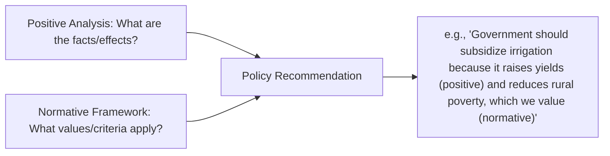

## Positive versus Normative Economics

### Definition and Conceptual Foundations

**Positive economics** is the branch of economic analysis concerned with objective, fact-based statements about how the economy actually works — descriptions and predictions that can, in principle, be tested against evidence and shown to be true or false. Positive statements answer the question "what is" or "what will be."

**Normative economics** is concerned with value judgments about how the economy *should* work or what policy *ought* to be pursued. Normative statements incorporate ethical, political, or subjective preferences and cannot be settled by data or evidence alone. Normative statements answer the question "what ought to be."

The distinction originates in the philosophy of science (the fact-value distinction, associated with David Hume's is-ought problem) and was formalized in economics by John Neville Keynes in *The Scope and Method of Political Economy* (1891), later popularized by Milton Friedman's 1953 essay "The Methodology of Positive Economics."

### Core Distinguishing Criteria

| Criterion | Positive Economics | Normative Economics |
| --- | --- | --- |
| Nature of statement | Descriptive, factual | Prescriptive, evaluative |
| Testability | Verifiable/falsifiable via data | Not empirically testable |
| Key phrasing | "is," "will," "causes," "results in" | "should," "ought," "better," "fair" |
| Value judgment involved | No (in principle) | Yes |
| Example question | "What effect does a price ceiling on rice have on supply?" | "Should the government impose a price ceiling on rice?" |

**Key Points**

- A statement can be empirically false and still be positive — testability, not correctness, is the defining feature. "Fertilizer subsidies increase national rice yield by 15%" is a positive statement even if the true figure turns out to be 5%.
- Most real-world agricultural policy debates blend both: a positive analysis of *effects* (e.g., of a subsidy or tariff) typically precedes and informs a normative judgment about whether that policy is *desirable*.
- Economists can agree entirely on the positive analysis of a policy's effects while disagreing sharply on its normative desirability, because the disagreement rests on differing value premises (e.g., how much weight to place on producer welfare versus consumer welfare versus government budget cost).

### Illustrative Examples in Agricultural Economics

**Positive statements:**

- "Imposing a price floor above the market equilibrium price for corn creates a persistent surplus of corn."
- "A 10% increase in fertilizer prices reduces fertilizer application rates among smallholder rice farmers by approximately 6%." *[Inference: exact elasticity figures are context- and study-dependent and would require citation of a specific empirical study.]*
- "Farm households with access to crop insurance are less likely to under-invest in yield-enhancing inputs during years of drought risk."

**Normative statements:**

- "The government should set a minimum support price for palay (unmilled rice) to protect farmer incomes."
- "Agricultural subsidies are an unfair use of taxpayer money."
- "Land reform ought to prioritize equity over production efficiency."

**Example**

Consider the debate over rice tariffication policy (the shift from quantitative import restrictions to tariffs on rice imports, as implemented in the Philippines under the Rice Tariffication Law of 2019):

- *Positive claim*: "Rice tariffication increased the volume of rice imports and lowered the domestic retail price of rice for consumers."
- *Normative claim*: "Rice tariffication was a good policy because it benefited consumers more than it harmed farmers."

The first claim can be investigated using trade data, price series, and econometric analysis. The second claim requires a value judgment about how to weigh consumer gains against farmer losses — a judgment that depends on ethical and political priorities, not solely on data.

### The Interaction Between Positive and Normative Analysis

Positive and normative economics are not fully separable in practice; they interact in a structured way in policy analysis:

1. **Positive analysis** establishes the facts: what a policy does, who gains, who loses, and by how much (often via cost-benefit analysis, welfare analysis, or econometric estimation).
2. **Normative framework** supplies the criteria for judging those facts as good or bad (e.g., utilitarian welfare maximization, Rawlsian concern for the worst-off, libertarian emphasis on property rights and voluntary exchange, or food-security-based sufficiency criteria).
3. **Policy recommendation** emerges from combining the positive findings with the chosen normative framework.

This interaction explains why economists who agree on the positive science of a policy can still disagree profoundly on its normative merit, and why economic policy debates are rarely resolved purely by "getting the data right."

### Welfare Economics as the Bridge

**Welfare economics** is the subfield most explicitly built at the intersection of positive and normative economics. It uses positive tools (supply and demand analysis, consumer and producer surplus, general equilibrium models) to evaluate outcomes against normative criteria such as:

- **Pareto efficiency**: an allocation is Pareto efficient if no one can be made better off without making someone else worse off. This is often treated as a "weak" normative criterion because it does not require interpersonal comparisons of well-being.
- **Kaldor-Hicks efficiency**: an allocation is an improvement if the gainers could hypothetically compensate the losers and still be better off, even if compensation does not actually occur. This is commonly used in agricultural policy cost-benefit analysis (e.g., evaluating whether a trade liberalization policy increases total surplus even though it creates losers among domestic farmers).
- **Equity criteria**: normative standards concerning the fairness of the distribution of income, land, or resources, which fall outside efficiency-based criteria entirely.

$$\text{Total Surplus} = \text{Consumer Surplus} + \text{Producer Surplus}$$

Positive economics can measure whether total surplus rises or falls under a given policy (e.g., a rice import tariff). Whether a resulting redistribution — such as gains to consumers and losses to rice farmers — is *acceptable* is a normative question that surplus calculations alone cannot answer.

### Why the Distinction Matters for Policy Analysis

**Key Points**

- Failing to separate positive from normative claims is a common source of confused or manipulative policy argumentation — e.g., presenting a value-laden policy preference ("we should protect farmers") as if it were an empirical fact ("protecting farmers is economically optimal").
- Recognizing the distinction allows analysts to isolate empirical disagreements (which can be resolved through better data or research design) from value disagreements (which require political or ethical deliberation, not additional data).
- Agricultural economists frequently serve a technocratic role of supplying rigorous *positive* analysis (e.g., estimating the yield and income effects of a proposed subsidy) to inform *normative* decisions made by policymakers and the public.

### Limitations and Critiques of the Distinction

- **[Inference]** Some methodologists (e.g., in the tradition of Gunnar Myrdal and later value-laden-science critiques) argue that the positive-normative distinction is never fully clean in practice, because the choice of what to study, which variables to measure, and how to frame a model already embeds implicit value judgments (e.g., choosing to measure "efficiency" rather than "equity" as the primary outcome of interest).
- Data collection, model assumptions, and even the definition of variables (e.g., what counts as "poverty" or "food security") can carry normative content, even when the resulting statements are framed as positive.
- Despite these critiques, the positive-normative distinction remains a foundational organizing principle in economics education and policy analysis, useful primarily as a discipline for clarifying which parts of an argument are testable claims and which are value premises.

### Related Topics

- Welfare economics and Pareto efficiency
- Cost-benefit analysis in agricultural policy evaluation
- Consumer and producer surplus analysis
- The is-ought problem in philosophy and its relevance to economic methodology
- Agricultural policy analysis: price floors, price ceilings, and tariffs
- Externalities and market failure as positive phenomena requiring normative policy response
- Political economy of agricultural subsidies and protectionism