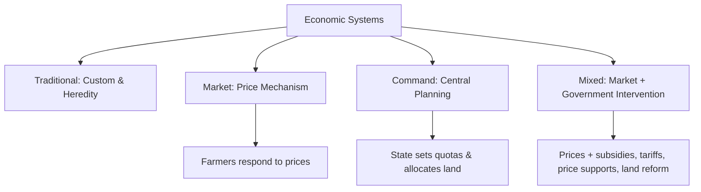

## Economic Systems and Resource Allocation

### Definition and Conceptual Foundations

An **economic system** is the institutional arrangement through which a society organizes the production, distribution, and consumption of scarce goods and services. Every economic system must resolve the same fundamental scarcity-driven questions — what to produce, how to produce it, and for whom to produce it — but different systems answer these questions through different mechanisms of **resource allocation**: the process by which land, labor, capital, and entrepreneurship are directed toward competing uses.

In agricultural economics, the choice of economic system shapes how land is owned and used, how farm labor is deployed, how agricultural output is priced and distributed, and how investment in irrigation, mechanization, and research is financed.

### The Three Classic Economic Questions Revisited

- **What to produce?** Which crops, livestock, or agricultural commodities receive land and resources.
- **How to produce it?** Labor-intensive smallholder farming versus capital-intensive mechanized agribusiness.
- **For whom to produce?** Subsistence consumption, domestic markets, or export markets, and how the resulting output and income are distributed among farmers, laborers, landowners, and consumers.

### Major Types of Economic Systems

**Traditional Economy**

Resource allocation is governed by custom, heredity, and long-standing social norms rather than markets or central planning. Farming practices, land inheritance, and crop choices are passed down through generations with limited responsiveness to price signals.

- Historically dominant in subsistence agricultural societies.
- Resource allocation decisions (which land a family farms, what crops are grown) are determined by tradition rather than profit maximization or state directive.
- **[Inference]** Remains present today primarily in isolated or indigenous agricultural communities operating largely outside formal market integration, though most modern economies exhibit only residual traditional elements layered onto market or mixed systems.

**Market Economy (Capitalism)**

Resource allocation is coordinated through the **price mechanism**: the interaction of supply and demand in decentralized markets, with resources flowing toward their most profitable (and, under competitive conditions, most valued) uses without central direction.

- Private ownership of land, capital, and farm enterprises.
- Farmers respond to market price signals to decide what to plant, how much to invest, and where to sell.
- Resource allocation is "automatic" in the sense that no central authority explicitly directs it — Adam Smith's "invisible hand" metaphor from *The Wealth of Nations* (1776) describes this coordinating function of self-interested exchange in competitive markets.
- Agricultural commodity markets (rice, corn, wheat, soybeans, coffee) are frequently used as textbook illustrations of price-driven resource allocation, since prices respond quickly to shifts in weather-driven supply or demand shocks.

**Command (Planned) Economy**

Resource allocation is directed by a central government authority rather than by market prices, typically through state ownership of land and production quotas.

- Historical agricultural examples include Soviet collectivization (kolkhoz and sovkhoz systems) and pre-reform Chinese agricultural communes, where the state determined what crops to plant, set production quotas, and controlled distribution.
- **[Inference]** Command allocation in agriculture is often associated with documented historical inefficiencies (e.g., misallocation of land to unsuitable crops, weak incentives for productivity) relative to market-based alternatives, though outcomes varied significantly by country, period, and implementation, and this is a matter of substantial historical and economic debate rather than a uniform empirical law.

**Mixed Economy**

Most real-world economies, including virtually all contemporary agricultural sectors, combine market mechanisms with government intervention. Resource allocation is primarily driven by markets and prices, but government policy actively shapes agricultural outcomes through:

- Price supports and minimum support prices (e.g., government-guaranteed farmgate prices for palay/unmilled rice)
- Subsidies for inputs (fertilizer, seed, irrigation)
- Import tariffs and quotas (e.g., rice tariffication policy)
- Public provision of agricultural extension services, research, and infrastructure
- Land reform programs redistributing land ownership
- Regulation of food safety, environmental standards, and land use

**Key Points**

- Virtually every modern national agricultural sector operates as a mixed economy: market prices govern most day-to-day production and consumption decisions, while government policy intervenes to correct market failures, stabilize prices, ensure food security, or pursue equity goals.
- The *degree* of government intervention (light-touch regulation versus extensive planning and subsidy) varies substantially across countries and is itself a normative and political question, not solely a technical economic one.

### Comparing Allocation Mechanisms: A Structured View

| Feature | Market Economy | Command Economy | Mixed Economy |
| --- | --- | --- | --- |
| Resource ownership | Private | State | Private + public |
| Allocation signal | Prices | Central directives/quotas | Prices + policy intervention |
| Farmer decision autonomy | High | Low | Moderate to high |
| Responsiveness to shocks (drought, price shifts) | Fast (via price adjustment) | Slow (requires plan revision) | Variable, often faster than pure command |
| Risk of market failure | Present (externalities, information asymmetry, monopoly power) | Present (misallocation, weak incentives) | Intervention aims to correct market failure but risks government failure |
| Typical agricultural examples | Competitive commodity markets | Historical Soviet/Chinese collectivized agriculture | Most contemporary national agricultural sectors |

### The Price Mechanism as Allocation Tool

In market-based allocation, prices perform three interlinked functions:

1. **Signaling function**: Prices convey information about relative scarcity. A rising price for a crop (e.g., due to drought reducing supply) signals to producers that more resources should shift toward that crop.
2. **Incentive function**: Higher prices incentivize producers to increase output and consumers to economize on consumption; lower prices do the reverse.
3. **Rationing function**: Prices allocate the available (scarce) quantity of a good among those willing and able to pay, without requiring explicit administrative rationing.

$$Q_D(P) = Q_S(P) \implies P^*, Q^*$$

At equilibrium price $P^*$, the quantity demanded equals the quantity supplied, and resources are allocated without persistent surplus or shortage — a condition disrupted when governments impose price floors (e.g., minimum farmgate prices, which can create persistent surpluses) or price ceilings (e.g., retail price caps on staple foods, which can create shortages).

### Sources of Market Failure Requiring Non-Market Allocation

Even within predominantly market-based systems, certain features of agricultural markets justify government intervention in resource allocation:

- **Externalities**: Pesticide runoff imposing costs on downstream water users (negative externality); agricultural R&D and extension services generating benefits beyond the individual farmer (positive externality with underinvestment risk).
- **Public goods**: Agricultural research, weather forecasting, and rural infrastructure are often underprovided by private markets due to non-excludability and non-rivalry, justifying public investment.
- **Information asymmetry**: Farmers and buyers may have unequal access to information about crop quality, market prices, or weather forecasts, distorting efficient allocation.
- **Market power**: Concentration among agricultural input suppliers (seed, fertilizer) or commodity buyers/processors can distort prices away from competitive levels.
- **Price volatility and risk**: Agricultural commodity prices are subject to high volatility from weather and global market shocks, motivating government stabilization schemes, buffer stock programs, or crop insurance.

### Land Ownership Systems and Resource Allocation

Because land is the defining fixed resource in agriculture, the institutional arrangement of land ownership fundamentally shapes allocation outcomes:

- **Private freehold ownership**: Individual farmers or firms own and control land, generally associated with stronger investment incentives due to secure tenure.
- **Communal/customary tenure**: Land is collectively held by a community, common in many traditional and some indigenous agricultural systems; allocation of use rights follows customary rules rather than market transactions.
- **State ownership with use rights**: The state retains formal ownership while granting long-term use rights to farmers (e.g., historically under China's Household Responsibility System reforms).
- **Land reform and redistribution**: Government-directed reallocation of land ownership (e.g., agrarian reform programs) intended to address historical inequities in land distribution, often trading off short-run productivity effects against longer-run equity and social-stability goals.

**Example**

The **Comprehensive Agrarian Reform Program (CARP)** in the Philippines redistributed agricultural land from large landholdings to landless farmers and farmworkers, illustrating a mixed-economy resource allocation mechanism: the state actively intervened in the market-based allocation of land ownership to pursue an equity-driven normative goal, with resulting positive-economics debates over its effects on farm productivity, investment incentives, and rural incomes. *[Inference: overall productivity and welfare effects of CARP have been the subject of extensive, and at times conflicting, empirical research; a definitive consensus figure would require citation of specific studies.]*

### Efficiency versus Equity in Resource Allocation

A recurring tension across all economic systems is the trade-off between **allocative efficiency** (resources flowing to their highest-valued use, typically associated with market mechanisms) and **equity** (a fair or just distribution of resources and outcomes, often requiring non-market intervention).

- Market systems tend to allocate resources efficiently under competitive conditions but can produce highly unequal outcomes (e.g., concentration of land ownership, disparities between smallholders and agribusiness).
- Command and heavily interventionist systems can pursue equity goals directly (e.g., guaranteed land access, price stabilization for consumers) but often at a cost to production efficiency and incentive strength.
- This trade-off is fundamentally a blend of positive analysis (measuring the efficiency-equity trade-off empirically) and normative judgment (deciding how much efficiency to sacrifice for equity, or vice versa) — see the related distinction between positive and normative economics.

### Related Topics

- Positive versus normative economics
- Scarcity, choice, and opportunity cost
- Market failure and the case for government intervention
- Price mechanisms: price floors, price ceilings, and market equilibrium
- Land tenure systems and agrarian reform
- Public goods and externalities in agricultural markets
- Comparative economic systems: historical case studies (Soviet collectivization, Chinese agricultural reform, Philippine CARP)
- Agricultural price stabilization and buffer stock policy