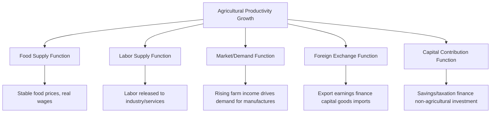

## The Role of Agriculture in Economic Development

### Definition and Conceptual Foundations

**Economic development** refers to the sustained improvement in an economy's productive capacity, living standards, and structural composition over time, typically encompassing rising per capita income, poverty reduction, improved human capital, and structural transformation away from low-productivity sectors toward higher-productivity ones. Agriculture occupies a distinctive and historically foundational position in this process: it is typically the dominant sector in low-income economies and undergoes profound relative decline (though not necessarily absolute decline) as economies develop — a pattern documented extensively in development economics and known as **structural transformation**.

Agricultural economics examines both the *contributions* agriculture makes to broader economic development and the *transformation* agriculture itself undergoes as development proceeds.

### The Multifunctional Role of Agriculture in Development

Development economists, notably Bruce Johnston and John Mellor in their influential 1961 framework, identified several interlinked functions agriculture performs in the early and intermediate stages of economic development.

**1. Food Supply Function**

Agriculture must supply adequate food to a growing population, including a growing non-agricultural workforce, at prices that do not erode real wages or trigger social instability. Insufficient agricultural productivity growth can constrain overall development by forcing costly food imports or provoking inflationary pressure.

**2. Labor Supply Function**

As agricultural productivity rises, agriculture releases surplus labor that can be absorbed into expanding industrial and service sectors. This is the mechanism at the heart of dual-economy models of development.

**3. Market (Demand) Function**

Rising farm incomes create domestic demand for non-agricultural goods (consumer products, agricultural inputs, farm equipment), supporting the growth of manufacturing and services — sometimes termed **agricultural demand linkages**.

**4. Foreign Exchange Function**

Agricultural exports (cash crops, commodities) generate foreign exchange earnings that can finance imports of capital goods, technology, and industrial inputs needed for broader industrialization.

**5. Capital Contribution Function**

Agriculture can be a net source of capital for the rest of the economy through mechanisms such as taxation of agricultural surplus, savings mobilized from farm households, or terms-of-trade transfers, financing investment in industry and infrastructure.

**Key Points**

- These functions are interdependent: labor cannot be released from agriculture without productivity growth sufficient to maintain food supply with fewer farm workers.
- The relative importance of each function varies by country context, historical period, and development strategy; not every economy relies equally on all five channels.

### Structural Transformation and the Changing Share of Agriculture

A well-documented empirical regularity in development economics — sometimes associated with the work of Simon Kuznets and later Hollis Chenery — is that agriculture's share of GDP and employment declines as per-capita income rises, even as absolute agricultural output typically continues to grow.

$$\text{Agricultural Share of GDP} = \frac{\text{Agricultural Value Added}}{\text{Total GDP}}$$

- In low-income economies, agriculture often accounts for a large share of both GDP and employment.
- As development proceeds, industry and then services grow faster than agriculture, and labor migrates from farms to factories and urban service jobs.
- **[Inference]** The pace and pattern of this transformation vary considerably by country, and premature deindustrialization or stalled structural transformation (labor exiting agriculture without being absorbed into productive industrial or service jobs) has been observed and debated in some developing economies in recent decades, making this an active area of empirical research rather than a uniform, mechanical process.

### Dual-Economy Models

**The Lewis Model (Arthur Lewis, 1954)**

Lewis's model of "economic development with unlimited supplies of labor" conceptualizes a developing economy as having two sectors:

- A **traditional agricultural sector** characterized by low productivity, disguised unemployment (a portion of farm labor contributing near-zero marginal product), and subsistence wages.
- A **modern industrial sector** that can absorb surplus agricultural labor at a roughly constant wage (slightly above the subsistence agricultural wage), because labor supply to industry is highly elastic given the surplus in agriculture.

Industrial profits are reinvested, driving capital accumulation and continued absorption of agricultural labor, until the surplus labor pool is exhausted — a turning point often called the **Lewis turning point**, after which agricultural wages begin rising and labor becomes scarcer.

**The Fei-Ranis Extension**

T.C. Fei and Gustav Ranis extended the Lewis model by giving more explicit attention to the need for continued agricultural productivity growth to support the labor transferred out of agriculture; without such productivity growth, food supply constraints can choke off industrial expansion (the "Ranis-Fei agricultural surplus" condition).

**Key Points**

- Dual-economy models emphasize that agricultural productivity growth is not merely a byproduct of development but a *precondition* for successful labor reallocation and industrialization.
- Critics note that these classical models assume relatively frictionless labor mobility and constant industrial wages, assumptions that do not always hold given labor market rigidities, migration costs, or skill mismatches in real economies.

### The Green Revolution and Productivity-Led Development

The **Green Revolution** (roughly the 1960s–1970s) is a central historical case illustrating agriculture's developmental role: the introduction of high-yielding variety (HYV) seeds (notably for wheat and rice, associated with the work of Norman Borlaug and International agricultural research centers such as IRRI, the International Rice Research Institute), combined with expanded irrigation and fertilizer use, produced substantial yield increases across parts of Asia and Latin America.

- Countries such as India and the Philippines saw major increases in staple grain yields, contributing to improved food security and, in several cases, transitions from food importers to self-sufficient or exporting status for key staples.
- **[Inference]** The Green Revolution's benefits were not evenly distributed; documented critiques point to disparities in gains between farmers with access to irrigation and credit versus those without, as well as environmental costs of intensive fertilizer and pesticide use, and its overall distributional and environmental legacy remains debated in the development literature.

### Agriculture, Poverty Reduction, and Rural Development

- Because a large share of the poor in developing economies is concentrated in rural, agriculture-dependent households, agricultural productivity growth has historically had a strong association with poverty reduction — often cited as having a larger poverty-reduction effect per unit of GDP growth than growth originating in other sectors. *[Inference: this "agriculture-led growth is more pro-poor" finding is a recurring result in the empirical development literature, notably associated with World Bank and IFPRI research, but magnitudes vary by country and time period and should not be treated as a universal constant.]*
- Rural non-farm income (small agribusiness, processing, trade) often grows alongside agricultural productivity gains, diversifying rural livelihoods beyond direct farming.
- Agricultural growth can also have significant **income multiplier effects** in rural economies through backward linkages (demand for farm inputs) and forward linkages (demand for agro-processing and marketing services).

### Agriculture's Role in Contemporary Development Debates

- **Industrialization-first versus agriculture-first strategies**: Some historical development strategies (e.g., import-substitution industrialization pursued by several Latin American and Asian economies in the mid-20th century) prioritized industrial development, sometimes at the expense of agricultural terms of trade; more recent development thinking often emphasizes balanced or agriculture-led growth strategies, particularly for low-income, agriculture-dependent economies.
- **Climate change and agricultural resilience**: Agriculture's developmental role is increasingly analyzed alongside its vulnerability to climate variability, requiring investment in climate-resilient crop varieties, irrigation, and risk-management instruments (e.g., weather-indexed crop insurance) to sustain its contribution to development.
- **Global value chains and agricultural exports**: Integration into global agricultural value chains (e.g., high-value horticulture, coffee, or seafood exports) offers contemporary pathways for foreign exchange earnings and rural income growth, distinct from the traditional bulk commodity export model.
- **Structural transformation without industrialization**: Some contemporary development economists have raised concerns about economies where labor exits agriculture into low-productivity informal services rather than into productive manufacturing, complicating the classical dual-economy growth narrative. *[Inference: this remains an evolving and debated area of the development economics literature.]*

### Related Topics

- Economic systems and resource allocation
- The Lewis dual-sector model and structural transformation
- Green Revolution technology and agricultural productivity growth
- Rural poverty, income distribution, and agricultural growth linkages
- Agricultural trade, comparative advantage, and export-led development
- Land reform and its developmental implications
- Climate change adaptation in agricultural development strategy
- Global value chains in agricultural and agribusiness sectors