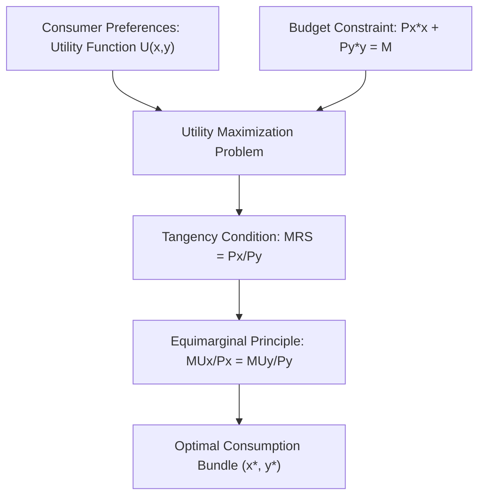

## Consumer Theory and Utility Maximization

### Definition and Conceptual Foundations

**Consumer theory** models how individuals allocate limited income among competing goods and services to achieve the highest possible level of satisfaction, or **utility**, given prevailing prices and a fixed budget. In agricultural economics, consumer theory underlies the analysis of food demand, dietary choices, farmer household consumption decisions, and the welfare effects of agricultural and food policies (price supports, subsidies, food assistance programs).

**Utility** is a numerical representation of the satisfaction or well-being a consumer derives from consuming goods and services. Utility is **ordinal** in modern microeconomic theory — it ranks bundles of goods from most to least preferred — rather than **cardinal**, meaning the specific numerical values themselves carry no inherent meaning beyond their ranking.

### Assumptions of Rational Consumer Behavior

Standard consumer theory rests on a set of axioms describing consumer preferences:

- **Completeness**: For any two bundles A and B, a consumer can state a preference (A ≻ B, B ≻ A, or indifference A ~ B).
- **Transitivity**: If A ≻ B and B ≻ C, then A ≻ C, ensuring internally consistent rankings.
- **Non-satiation (more is better)**: Consumers generally prefer more of a good to less, holding other goods constant.
- **Convexity of preferences**: Consumers prefer diversified bundles to extreme ones, reflected in a diminishing marginal rate of substitution between goods.

**Key Points**

- These axioms are simplifying assumptions that make utility maximization mathematically tractable; behavioral economics research has documented systematic departures from some of these axioms in real consumer behavior (see: behavioral agricultural economics).
- In agricultural applications, these axioms underpin standard demand estimation for food commodities, even though real dietary choices are also shaped by habit, cultural norms, and imperfect information.

### The Utility Function

A utility function $U(x_1, x_2, \ldots, x_n)$ assigns a satisfaction value to a bundle of goods $x_1, x_2, \ldots, x_n$ (e.g., rice, vegetables, meat, and a composite "all other goods").

**Marginal utility (MU)** is the additional satisfaction gained from consuming one more unit of a good, holding consumption of other goods constant:

$$MU_i = \frac{\partial U}{\partial x_i}$$

**The Law of Diminishing Marginal Utility** states that as consumption of a good increases (holding other goods fixed), the marginal utility derived from each additional unit eventually declines. This explains, for example, why a household's satisfaction gain from an additional kilogram of rice diminishes as total rice consumption rises, motivating dietary diversification as income grows (a pattern closely tied to Engel's Law in food demand analysis).

### Indifference Curves and the Marginal Rate of Substitution

An **indifference curve** represents all combinations of two goods that yield the same level of utility to the consumer. Key properties:

- Indifference curves slope downward, reflecting the trade-off between goods at constant utility.
- Higher indifference curves represent higher utility levels.
- Indifference curves are typically convex to the origin, reflecting a diminishing willingness to trade one good for another as more of it is consumed.
- Indifference curves for the same consumer never cross, a direct consequence of the transitivity assumption.

The **marginal rate of substitution (MRS)** measures the rate at which a consumer is willing to trade one good for another while maintaining constant utility, equal to the slope of the indifference curve:

$$MRS_{xy} = -\frac{dy}{dx}\bigg|_{U = \bar{U}} = \frac{MU_x}{MU_y}$$

### The Budget Constraint

The **budget constraint** represents all combinations of goods a consumer can afford given income $M$ and prices $P_x$ and $P_y$:

$$P_x \cdot x + P_y \cdot y \leq M$$

The budget line's slope is $-P_x/P_y$, representing the market rate at which good $x$ can be traded for good $y$ given prevailing prices — the opportunity cost of one good in terms of the other, expressed through market prices rather than the consumer's own preferences.

### The Utility Maximization Problem

The consumer's optimization problem is to choose the bundle of goods that maximizes utility subject to the budget constraint:

$$\max_{x,y} U(x,y) \quad \text{subject to} \quad P_x x + P_y y = M$$

**The tangency condition** for an interior optimum requires that the indifference curve be tangent to the budget line, meaning the consumer's subjective trade-off rate equals the market's objective trade-off rate:

$$MRS_{xy} = \frac{MU_x}{MU_y} = \frac{P_x}{P_y}$$

Equivalently, at the optimum, the marginal utility per currency unit spent must be equal across all goods (the **equimarginal principle**):

$$\frac{MU_x}{P_x} = \frac{MU_y}{P_y}$$

This condition states that a consumer cannot increase total utility by reallocating spending between goods — every peso spent on rice yields the same marginal utility as every peso spent on vegetables at the optimum.

Below is an SVG depicting the tangency solution between an indifference curve and a budget line for a consumer choosing between rice and "all other goods."

<svg xmlns="http://www.w3.org/2000/svg" viewBox="0 0 600 480" font-family="Arial, sans-serif">
<text x="300" y="30" font-size="18" font-weight="bold" text-anchor="middle">Utility Maximization: Tangency Solution (svg_diagram)</text>
<line x1="80" y1="420" x2="80" y2="60" stroke="black" stroke-width="2" />
<line x1="80" y1="420" x2="540" y2="420" stroke="black" stroke-width="2" />
<polygon points="80,55 75,68 85,68" fill="black" />
<polygon points="545,420 532,415 532,425" fill="black" />

<text x="40" y="240" font-size="14" text-anchor="middle" transform="rotate(-90 40 240)">All Other Goods (y)</text>

<text x="310" y="455" font-size="14" text-anchor="middle">Rice, kg (x)</text>

<line x1="100" y1="100" x2="480" y2="400" stroke="#1565C0" stroke-width="2.5" />
<text x="420" y="380" font-size="12" fill="#1565C0">Budget Line (slope = -Px/Py)</text>

<path d="M 130 380 Q 250 260, 420 260 Q 300 320, 170 400" fill="none" stroke="#9E9E9E" stroke-width="1.5" stroke-dasharray="3" />

<path d="M 150 320 Q 270 200, 460 210 Q 320 270, 200 340" fill="none" stroke="#2E7D32" stroke-width="2.5" />
<text x="380" y="205" font-size="12" fill="#2E7D32">Indifference Curve U*</text>

<circle cx="290" cy="250" r="6" fill="#C62828" />
<text x="300" y="240" font-size="13" fill="#C62828">Optimal Bundle (x*, y*)</text>
<line x1="290" y1="250" x2="290" y2="420" stroke="#C62828" stroke-width="1" stroke-dasharray="4" />
<line x1="80" y1="250" x2="290" y2="250" stroke="#C62828" stroke-width="1" stroke-dasharray="4" />

<text x="70" y="435" font-size="12" text-anchor="end">0</text>

</svg>

### Corner Solutions

When goods are imperfect substitutes with strong preferences (or in cases of perfect substitutes/complements), the utility-maximizing bundle may occur at a **corner solution**, where the consumer spends the entire budget on a single good rather than at an interior tangency point. This can arise, for example, in extreme subsistence conditions where a household allocates its entire limited food budget to the single cheapest calorie source available.

### Deriving Demand Curves from Utility Maximization

Solving the utility maximization problem for varying prices, holding income and other prices constant, generates the consumer's **demand function**:

$$x^* = x(P_x, P_y, M)$$

This is the theoretical microeconomic foundation of the market demand curves used throughout agricultural commodity market analysis (see: demand elasticity in food markets).

**Comparative statics** — how the optimal bundle changes with income or price — decompose into:

- **Income effect**: The change in consumption due to a change in real purchasing power resulting from a price change.
- **Substitution effect**: The change in consumption due to a change in relative prices, holding utility (real purchasing power) constant.

$$\underbrace{\frac{\partial x}{\partial P_x}}_{\text{Total Effect}} = \underbrace{\frac{\partial x}{\partial P_x}\bigg|_{U=\bar{U}}}_{\text{Substitution Effect}} - x \cdot \underbrace{\frac{\partial x}{\partial M}}_{\text{Income Effect}}$$

This decomposition, formalized as the **Slutsky equation**, explains anomalies such as **Giffen goods** — inferior staple foods (historically discussed in relation to goods such as potatoes during the Irish famine, or rice/wheat in some subsistence-consumption contexts) for which a price *increase* can, in principle, lead to increased quantity demanded because the strong negative income effect on a dominant food staple outweighs the standard negative substitution effect. *[Inference: empirically confirmed Giffen behavior is rare and context-specific; most staple food demand studies find standard downward-sloping demand even for inferior goods, so Giffen good examples should be treated as a theoretical limiting case rather than a common empirical finding.]*

### Applications to Agricultural and Food Economics

**Engel's Law and Food Demand**

As household income rises, the proportion of income spent on food tends to decline, even as absolute food expenditure may rise — a foundational empirical regularity in food demand analysis (Ernst Engel, 1857), directly derivable from utility-maximization models with non-homothetic preferences (where the income elasticity of food differs from that of non-food goods).

**Example**

A rural household with fixed monthly income allocates spending between rice and "other goods" (clothing, education, discretionary items). Applying the equimarginal principle: if the marginal utility per peso spent on rice exceeds that spent on other goods, the household is not optimizing and should reallocate spending toward rice until $\frac{MU_{rice}}{P_{rice}} = \frac{MU_{other}}{P_{other}}$. A government rice subsidy that lowers $P_{rice}$ shifts this equilibrium, inducing both a substitution effect (more rice relative to other goods, holding utility constant) and an income effect (greater real purchasing power, allowing more of both goods, assuming both are normal goods).

**Welfare Analysis of Food Policy**

Utility-maximization theory underlies the calculation of **compensating variation** and **equivalent variation** — money-metric measures of the welfare impact of price changes (e.g., from a food subsidy, tariff, or price control) — which are more theoretically precise than simple consumer surplus measures when income effects are significant, as is often the case for necessities like staple food grains.

### Related Topics

- Demand elasticity and its application to food markets
- Engel's Law and the income elasticity of food demand
- Producer theory, cost minimization, and profit maximization
- Consumer and producer surplus in agricultural market analysis
- Behavioral economics and departures from rational choice in food consumption
- Welfare measures: compensating and equivalent variation
- Household production models and farm household consumption-production linkages