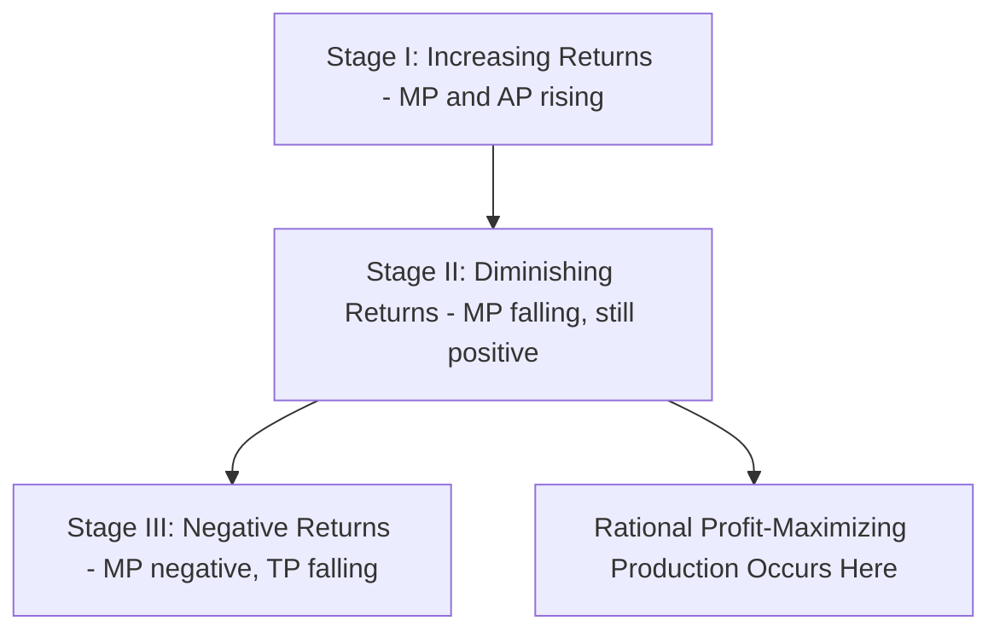
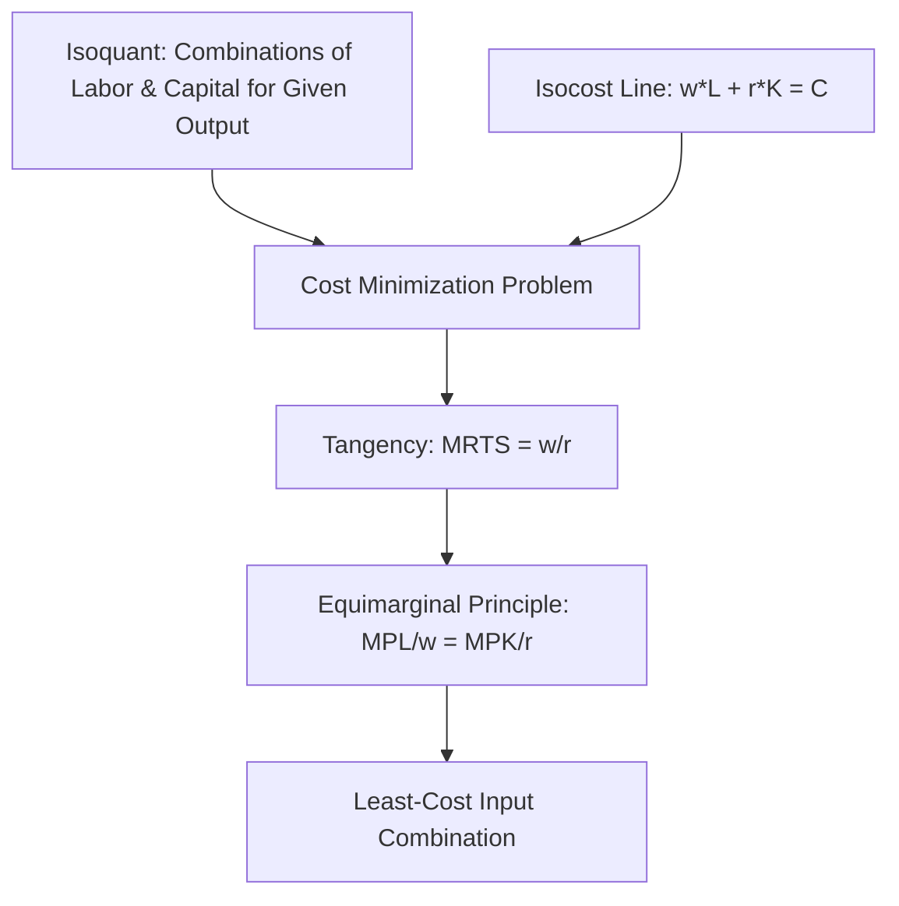

## Theory of the Firm and Production Functions

### Definition and Conceptual Foundations

The **theory of the firm** models how a productive enterprise — such as a farm — combines inputs to produce output, and how it makes decisions regarding input use, output levels, and scale of operation in pursuit of profit maximization or cost minimization. A **production function** is the mathematical relationship describing the maximum quantity of output obtainable from a given combination of inputs, given existing technology.

$$Q = f(L, K, N, \ldots)$$

where $Q$ is output (e.g., tons of rice), $L$ is labor, $K$ is capital (machinery, equipment), and $N$ may represent land or other fixed factors, depending on model specification. In agricultural economics, production functions are used to analyze farm-level input decisions, estimate technical efficiency, and evaluate the impact of technology (e.g., improved seed varieties, fertilizer, irrigation) on yield.

### Short Run versus Long Run in Farm Production

- **Short run**: At least one input is fixed (classically, land, in agricultural contexts, is often treated as the fixed factor in the short run because it cannot be quickly expanded or contracted).
- **Long run**: All inputs are variable, including land itself (through purchase, lease, or land-use conversion), allowing the firm to adjust its entire scale of operation.

This distinction is central to agricultural production because land, unlike labor or fertilizer, is a particularly rigid fixed factor even over moderately long planning horizons, shaping much of the discipline's emphasis on diminishing returns to variable inputs applied to fixed land.

### Total, Average, and Marginal Product

For a single variable input (e.g., labor, $L$) applied to fixed land, three related output measures are defined:

- **Total Product (TP)**: $TP = Q = f(L)$, the total output produced.
- **Average Product (AP)**: $AP_L = \dfrac{Q}{L}$, output per unit of the variable input.
- **Marginal Product (MP)**: $MP_L = \dfrac{\partial Q}{\partial L}$, the additional output from one more unit of the variable input.

**The Law of Diminishing Marginal Returns** states that as successive units of a variable input (e.g., labor or fertilizer) are added to a fixed input (e.g., land), the marginal product of the variable input eventually declines, holding technology constant. This is among the most empirically robust and foundational principles in agricultural production economics, directly explaining why fertilizer application, irrigation intensity, and labor input per hectare all have optimal (finite) levels rather than being profitably increased without bound.

$$\frac{\partial MP_L}{\partial L} < 0 \quad \text{(beyond some point)}$$

**Key Points**

- The relationship between MP and AP follows a standard pattern: MP intersects AP at its maximum point; when MP > AP, AP is rising; when MP < AP, AP is falling.
- Three classical stages of production are typically distinguished: Stage I (increasing MP and AP, land underutilized relative to labor), Stage II (diminishing but positive MP, where rational profit-maximizing production occurs), and Stage III (negative MP, where additional input reduces total output — irrational to operate here).

### Isoquants and the Marginal Rate of Technical Substitution

When two or more inputs are variable (e.g., labor and machinery, or fertilizer and irrigation), an **isoquant** shows all combinations of inputs that produce the same level of output.

- Isoquants slope downward, reflecting the trade-off between inputs at a constant output level.
- Isoquants further from the origin represent higher output levels.
- Isoquants are typically convex to the origin, reflecting diminishing returns to substituting one input for another.

The **marginal rate of technical substitution (MRTS)** measures the rate at which one input can be substituted for another while holding output constant:

$$MRTS_{LK} = -\frac{dK}{dL}\bigg|_{Q=\bar{Q}} = \frac{MP_L}{MP_K}$$

### Cost Minimization and the Least-Cost Input Combination

Given an isocost line representing all input combinations attainable for a given total expenditure $C = w \cdot L + r \cdot K$ (where $w$ is the wage rate and $r$ is the rental price of capital), the cost-minimizing input combination for a given output level occurs where the isoquant is tangent to the isocost line:

$$MRTS_{LK} = \frac{MP_L}{MP_K} = \frac{w}{r}$$

Equivalently, cost minimization requires that the marginal product per currency unit spent be equalized across all inputs:

$$\frac{MP_L}{w} = \frac{MP_K}{r}$$

This is the production-side analog of the equimarginal principle in consumer theory (see: consumer theory and utility maximization), and it underlies farm-level decisions such as choosing the optimal ratio of hired labor to mechanized equipment given relative wage and machinery rental rates.

### Common Functional Forms of Production Functions

**Cobb-Douglas Production Function**

The most widely used functional form in agricultural production analysis, due to its mathematical tractability and reasonably good empirical fit for many agricultural technologies:

$$Q = A \cdot L^{\alpha} K^{\beta}$$

where $A$ represents total factor productivity (technology level), and $\alpha$ and $\beta$ are output elasticities with respect to labor and capital, respectively. The sum $\alpha + \beta$ indicates returns to scale:

- $\alpha + \beta > 1$: increasing returns to scale
- $\alpha + \beta = 1$: constant returns to scale
- $\alpha + \beta < 1$: decreasing returns to scale

**Leontief (Fixed-Proportions) Production Function**

$$Q = \min\left(\frac{L}{a}, \frac{K}{b}\right)$$

Represents production processes with no substitutability between inputs (e.g., a strict fixed ratio of a particular machine to a required number of operators). Agricultural processes with rigid technical requirements (e.g., a combine harvester requiring exactly one operator) approximate this form.

**Constant Elasticity of Substitution (CES) Production Function**

$$Q = A\left[\delta L^{-\rho} + (1-\delta)K^{-\rho}\right]^{-1/\rho}$$

Generalizes Cobb-Douglas and Leontief forms by allowing the elasticity of substitution between inputs to take any constant value, offering greater flexibility for empirical estimation of agricultural technologies where the ease of substituting, say, labor for machinery may differ from the Cobb-Douglas assumption of unit elasticity.

**Key Points**

- **[Inference]** Choice of functional form in applied agricultural production studies typically depends on the empirical context, data availability, and the specific substitution or scale properties the researcher wishes to test; no single functional form is universally superior across all agricultural production settings.
- Translog (transcendental logarithmic) production functions are also common in applied agricultural economics research as a flexible functional form that does not impose the restrictive elasticity-of-substitution assumptions of Cobb-Douglas.

### Returns to Scale

**Returns to scale** describe how output responds when *all* inputs are increased proportionally, distinct from diminishing marginal returns (which apply when only one input varies, others fixed).

$$f(\lambda L, \lambda K) \begin{cases} > \lambda Q & \text{increasing returns to scale} \\ = \lambda Q & \text{constant returns to scale} \\ < \lambda Q & \text{decreasing returns to scale} \end{cases}$$

In agricultural economics, returns to scale are central to debates over optimal farm size: **[Inference]** empirical evidence on farm-size productivity relationships is mixed and context-dependent, with some studies documenting an "inverse farm size-productivity relationship" (smaller farms achieving higher output per hectare, often attributed to more intensive family labor use and monitoring advantages), while other contexts show economies of scale favoring larger, more mechanized operations; this remains an actively researched empirical question rather than a settled universal finding.

### Profit Maximization

A profit-maximizing firm chooses output and input levels to maximize:

$$\pi = TR - TC = P \cdot Q - (w \cdot L + r \cdot K)$$

The first-order condition for profit-maximizing input use requires that each input be employed up to the point where its **marginal revenue product (MRP)** equals its **marginal factor cost (MFC)**:

$$MRP_L = P \cdot MP_L = w$$

This condition states that a farmer should keep hiring labor (or applying fertilizer, or any variable input) as long as the value of the additional output produced exceeds the cost of the additional input, stopping at the point where they are exactly equal — the same marginal-analysis logic underlying the broader $MB = MC$ decision rule (see: scarcity, choice, and opportunity cost).

**Example**

A farmer applying nitrogen fertilizer to a corn field observes that the fertilizer costs ₱25 per kilogram, and corn sells at ₱18 per kilogram. If the marginal product of the next kilogram of fertilizer is estimated at 2 kilograms of additional corn output, the marginal revenue product is $18 \times 2 = ₱36$, which exceeds the ₱25 marginal cost, so applying that unit of fertilizer increases profit. The farmer should continue increasing fertilizer application until the marginal revenue product falls to ₱25 (the fertilizer price), at which point $MRP = MFC$ and profit is maximized.

### Application: The Agricultural Production Function and Technology Adoption

Production function estimation is a core empirical tool in agricultural economics for measuring the impact of technology adoption:

- Comparing estimated total factor productivity ($A$ in the Cobb-Douglas form) across farms adopting high-yielding variety seeds versus traditional varieties quantifies technology's contribution to output, holding conventional input levels constant.
- Production function residuals (unexplained variation in output after accounting for measured inputs) are frequently used as proxies for technical efficiency or managerial ability differences across farms, a foundation of **stochastic frontier analysis**, a specialized extension of production function estimation widely used in farm efficiency studies.

### Related Topics

- Cost curves and short-run/long-run cost structures
- Consumer theory and utility maximization (equimarginal principle analog)
- Technical efficiency and stochastic frontier analysis in farm studies
- Returns to scale and the farm size-productivity debate
- Technology adoption and total factor productivity in agriculture
- Scarcity, choice, and opportunity cost (marginal decision-making)
- Input demand and derived demand for agricultural factors of production