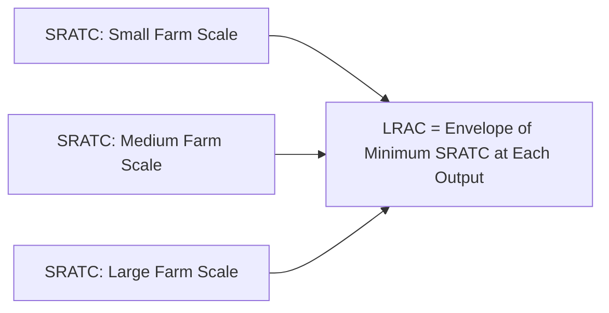

## Cost Curves and Short-Run versus Long-Run Decisions


### Definition and Conceptual Foundations

**Cost curves** translate the technical relationships embedded in a production function (see: theory of the firm and production functions) into monetary terms, showing how a farm's total, average, and marginal costs vary with output level. The distinction between the **short run** (at least one input, typically land, fixed) and the **long run** (all inputs variable) fundamentally shapes the structure and behavior of these cost curves, and consequently the farm's optimal production, exit, and scale decisions.

### Short-Run Cost Concepts

In the short run, total cost separates into two components based on whether they vary with output:

$$TC = TFC + TVC$$

- **Total Fixed Cost (TFC)**: Costs that do not vary with output level in the short run — e.g., land rent or property tax obligations, depreciation on owned machinery, and other costs incurred regardless of how much is produced (including zero output).
- **Total Variable Cost (TVC)**: Costs that vary directly with the level of output — e.g., seed, fertilizer, hired labor, fuel, and irrigation water charged by usage.

From these, the following per-unit cost measures are derived:

$$AFC = \frac{TFC}{Q}, \quad AVC = \frac{TVC}{Q}, \quad ATC = \frac{TC}{Q} = AFC + AVC$$

**Marginal Cost (MC)** is the cost of producing one additional unit of output:

$$MC = \frac{\partial TC}{\partial Q} = \frac{\partial TVC}{\partial Q}$$

(Marginal cost derives only from variable costs, since fixed costs do not change with output.)

**Key Points**

- $AFC$ continuously declines as output rises, since a fixed total is spread over more units — this is the principle behind "spreading overhead," relevant to a farmer's incentive to maximize utilization of owned land and equipment.
- $MC$ typically follows a U-shape, first declining (reflecting increasing marginal returns to the variable input at low output levels) and then rising (reflecting diminishing marginal returns, per the law of diminishing marginal returns), directly mirroring the inverse relationship between marginal product and marginal cost:

$$MC = \frac{w}{MP_L}$$

where $w$ is the price of the variable input (e.g., the wage rate or fertilizer price) and $MP_L$ is its marginal product. As $MP_L$ rises, $MC$ falls; as $MP_L$ falls (diminishing returns), $MC$ rises.

### The Relationship Between MC, AVC, and ATC

A standard and important geometric property of these cost curves: the marginal cost curve intersects both the average variable cost curve and the average total cost curve at their respective minimum points.

- When $MC < AVC$ (or $ATC$), the average curve is falling.
- When $MC > AVC$ (or $ATC$), the average curve is rising.
- $MC = AVC$ at $AVC$'s minimum; $MC = ATC$ at $ATC$'s minimum.

This relationship is analogous to the relationship between marginal product and average product discussed in production theory, and follows directly from it through the cost-production duality.

```mermaid
flowchart TD
    A["Production Function: Diminishing Marginal Returns"] --> B["Rising Marginal Cost (MC)"]
    B --> C["MC intersects AVC at AVC minimum"]
    B --> D["MC intersects ATC at ATC minimum"]
    C --> E["Short-Run Supply Curve = MC above AVC minimum (shutdown point)"]
```

Below is an SVG depicting the standard U-shaped short-run cost curve configuration.

<svg xmlns="http://www.w3.org/2000/svg" viewBox="0 0 600 460" font-family="Arial, sans-serif">
<text x="300" y="30" font-size="18" font-weight="bold" text-anchor="middle">Short-Run Cost Curves: MC, AVC, ATC (svg_diagram)</text>
<line x1="80" y1="400" x2="80" y2="60" stroke="black" stroke-width="2" />
<line x1="80" y1="400" x2="540" y2="400" stroke="black" stroke-width="2" />
<polygon points="80,55 75,68 85,68" fill="black" />
<polygon points="545,400 532,395 532,405" fill="black" />

<text x="40" y="230" font-size="14" text-anchor="middle" transform="rotate(-90 40 230)">Cost per Unit (₱)</text>

<text x="310" y="435" font-size="14" text-anchor="middle">Output (Q)</text>


<path d="M 130 380 C 200 220, 260 190, 320 210 C 400 240, 460 300, 500 360" fill="none" stroke="`#C62828`" stroke-width="2.5" />

<text x="500" y="340" font-size="12" fill="`#C62828`">MC</text>


<path d="M 150 340 C 230 260, 300 245, 370 255 C 430 265, 470 290, 500 320" fill="none" stroke="`#1565C0`" stroke-width="2.5" />

<text x="500" y="300" font-size="12" fill="`#1565C0`">AVC</text>


<path d="M 170 400 C 250 280, 330 265, 400 275 C 450 285, 480 310, 505 340" fill="none" stroke="`#2E7D32`" stroke-width="2.5" />

<text x="500" y="360" font-size="12" fill="`#2E7D32`">ATC</text>


<circle cx="320" cy="210" r="5" fill="#1565C0" />
<text x="330" y="200" font-size="11" fill="#1565C0">MC = AVC (min)</text>
<circle cx="370" cy="255" r="5" fill="#2E7D32" />
<text x="380" y="245" font-size="11" fill="#2E7D32">MC = ATC (min)</text>

<text x="70" y="415" font-size="12" text-anchor="end">0</text>

</svg>

### Short-Run Shutdown Decision

A profit-maximizing farm operating in the short run should continue producing as long as revenue covers variable costs, even if it does not cover total costs, because fixed costs are incurred regardless of the production decision (a form of sunk cost in the short run).

**Decision rule:**

- **Produce** if $P \geq AVC$ (price covers at least average variable cost; any excess over $AVC$ contributes toward covering fixed costs).
- **Shut down** if $P < AVC$ (price does not even cover variable costs; producing would lose more money than shutting down and losing only the fixed cost).

$$\text{Shutdown Point: } P = \min(AVC)$$

The portion of the $MC$ curve at or above the minimum of $AVC$ constitutes the farm's **short-run supply curve**.

**Example**

A vegetable farmer faces a market price of ₱15/kg. Average variable cost (seed, labor, fertilizer) at the current output level is ₱12/kg, while average total cost (including land rent already paid for the season) is ₱18/kg. Even though price does not cover average total cost (the farmer is making a short-run economic loss), price exceeds average variable cost, so continuing to harvest and sell is still the loss-minimizing choice: the ₱3/kg margin over variable cost partially offsets the already-committed fixed land rent, whereas shutting down would forfeit that contribution entirely while the land rent obligation remains unavoidable in the short run.

### Long-Run Cost Concepts

In the long run, all inputs — including land, which is fixed in the short run — become variable. There is no distinction between fixed and variable costs; all costs are variable, and the farm can freely adjust its scale of operation, enter, or exit an industry entirely.

The **long-run average cost (LRAC)** curve is derived as the lower envelope of all possible short-run average total cost (SRATC) curves, each corresponding to a different scale (e.g., farm size or level of capital investment):

$$LRAC(Q) = \min_{K} SRATC(Q; K)$$



### Economies and Diseconomies of Scale

The shape of the LRAC curve reflects **returns to scale** in production (see: theory of the firm and production functions):

- **Economies of scale** (declining LRAC): Occur when expanding scale reduces average cost, often due to specialization of labor, bulk input purchasing discounts, more efficient use of large machinery, or spreading fixed investment costs (e.g., irrigation infrastructure) over greater output.
- **Constant returns to scale** (flat LRAC): Average cost remains unchanged as scale expands.
- **Diseconomies of scale** (rising LRAC): Occur when expanding scale increases average cost, potentially due to managerial coordination difficulties, overextension of supervisory capacity, or logistical challenges in very large or geographically dispersed farm operations.

The point of transition, typically at the minimum of the LRAC curve, is termed the **minimum efficient scale (MES)** — the smallest output level at which long-run average cost is minimized.

**Key Points**

- **[Inference]** Empirical findings on economies of scale in agriculture vary substantially by crop type, technology, and country context; some studies find modest economies of scale for grain crops amenable to mechanization, while labor-intensive crops (e.g., certain fruits and vegetables) show less pronounced scale economies, and this remains an active area of applied agricultural economics research rather than a settled universal pattern.
- Access to capital and credit constraints can prevent smallholder farmers from reaching minimum efficient scale even where technical economies of scale exist, a distinct issue from the production technology itself.

### Long-Run Equilibrium and Entry/Exit Decisions

In a competitive agricultural market, the long-run equilibrium price tends toward the minimum point of the LRAC curve, because:

- If price exceeds minimum LRAC, economic profits attract new entrants (or existing farmers expanding output), increasing market supply and driving price down.
- If price falls below minimum LRAC, farms exit or reduce production, decreasing market supply and driving price back up.
- In long-run competitive equilibrium: $P = MC = \min(LRAC)$, and economic profit is zero (though normal accounting profit, reflecting the opportunity cost of the farmer's own labor and capital, may still be positive).

This dynamic explains recurring boom-bust cycles observed in many agricultural commodity markets (see: history of agricultural economic thought — cobweb model), where periods of high prices induce entry or expanded planting, subsequently driving prices back down as supply catches up.

### Summary Comparison: Short Run versus Long Run

| Feature | Short Run | Long Run |
| --- | --- | --- |
| Fixed inputs | At least one (e.g., land) | None — all inputs variable |
| Cost structure | Fixed cost + variable cost | All costs variable |
| Entry/exit possible | No (farm operates or shuts down temporarily) | Yes (farm can permanently enter/exit) |
| Relevant decision rule | Shut down if $P < AVC$ | Exit if $P < \min(LRAC)$ persistently |
| Economic profit | Can be positive, negative, or zero | Tends toward zero under perfect competition |
| Scale adjustment | Fixed by existing land/capital | Fully adjustable |

### Application to Agricultural Policy and Farm Planning

- **Price support programs**: Understanding the shutdown point clarifies why price floors set above $AVC$ but below $ATC$ may keep farmers producing in the short run without resolving underlying long-run unprofitability, potentially delaying necessary structural adjustment.
- **Farm consolidation trends**: Long-run cost curve analysis, combined with evidence on economies of scale, informs debates over farm consolidation and the economic pressures driving smaller farms toward exit or expansion in competitive commodity markets.
- **Investment timing**: A farmer's decision to invest in expanding land, irrigation, or machinery capacity is fundamentally a long-run decision, requiring comparison of expected LRAC at different scales against anticipated future prices — distinct from short-run input decisions on an already-fixed land base.

### Related Topics

- Theory of the firm and production functions
- Market structures: perfect competition in agricultural commodity markets
- Farm size, economies of scale, and consolidation trends
- Agricultural price cycles and the cobweb model
- Price supports, price floors, and their long-run structural effects
- Scarcity, choice, and opportunity cost (sunk versus avoidable costs)