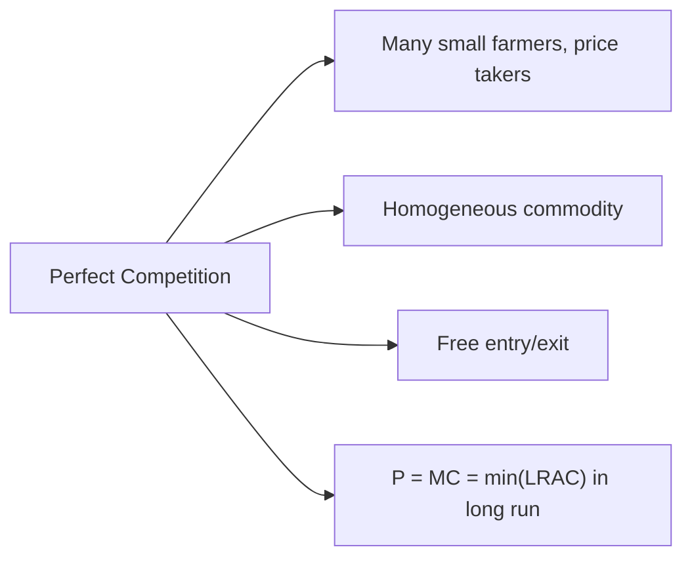
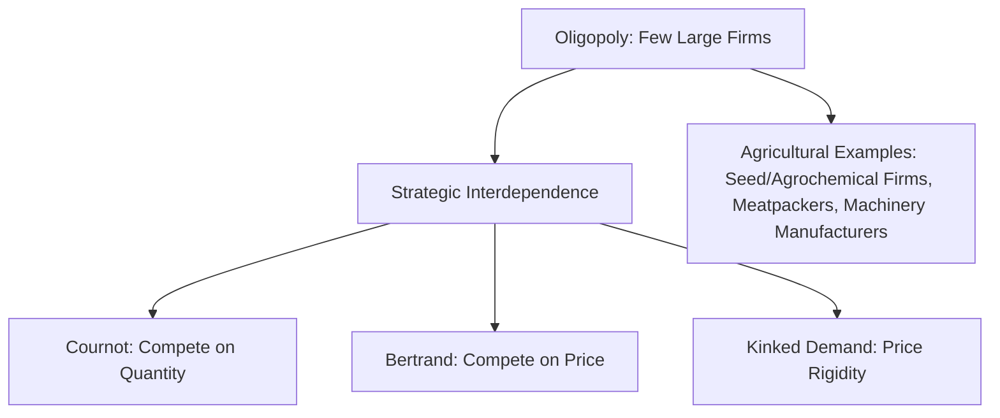
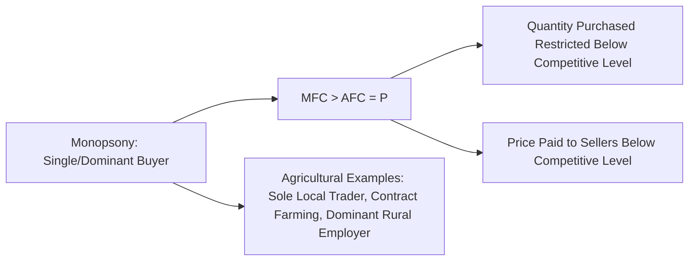

## Market Structures: Perfect Competition, Monopoly, Oligopoly, Monopsony

### Definition and Conceptual Foundations

**Market structure** describes the organizational and competitive characteristics of an industry — the number of buyers and sellers, the degree of product differentiation, barriers to entry, and the extent of control any individual participant has over price. Agricultural markets span nearly the full spectrum of market structures, from highly competitive commodity markets at the farm-gate level to concentrated input supply and processing sectors further along the value chain, making market structure analysis essential for understanding price formation, farmer bargaining power, and policy design.

### Perfect Competition

**Perfect competition** is characterized by:

- **Many buyers and sellers**, each too small individually to influence market price (**price takers**).
- **Homogeneous (undifferentiated) product**, such that buyers are indifferent among sellers.
- **Free entry and exit**, with no significant barriers preventing firms from entering or leaving the market.
- **Perfect information**, with all participants aware of prevailing prices and product characteristics.

Because individual farms are price takers, the firm's demand curve is perfectly elastic (horizontal) at the market price:

$$P = MR = AR$$

Profit maximization occurs where $P = MC$, and in long-run equilibrium, $P = MC = \min(LRAC)$, driving economic profit to zero (see: cost curves and short-run versus long-run decisions).

**Agricultural relevance**: Farm-gate markets for many staple commodities — rice, corn, wheat, and other bulk grains produced by numerous smallholders selling an essentially homogeneous product — are the textbook real-world approximation of perfect competition, though **[Inference]** perfect information and entirely frictionless entry/exit are rarely fully satisfied in practice (e.g., due to land access constraints, transport costs, and information gaps), so most agricultural commodity markets are best understood as close approximations rather than literal instances of the theoretical model.

### Monopoly

**Monopoly** describes a market with a single seller facing the entire market demand curve, typically sustained by significant barriers to entry (legal restrictions, control of essential inputs, network effects, or substantial economies of scale relative to market size).

- Because the monopolist faces the downward-sloping market demand curve, marginal revenue is less than price at every quantity beyond the first unit:

$$MR = P\left(1 + \frac{1}{\varepsilon_d}\right)$$

where $\varepsilon_d$ is the price elasticity of demand (negative for a downward-sloping demand curve).

- Profit maximization occurs at $MR = MC$, with price set above marginal cost, generating positive economic profit that can persist into the long run due to entry barriers.
- This results in a **deadweight loss** relative to the competitive outcome, since output is restricted below the socially efficient level where $P = MC$.

**Agricultural relevance**: Pure monopoly is uncommon at the farm production level but can arise in specific input markets (e.g., a patented genetically modified seed technology with exclusive licensing rights) or in single-buyer government marketing boards historically used in some countries for certain export crops (e.g., historical state cocoa or coffee marketing boards in parts of Africa, which functioned as monopoly sellers to export markets even while acting as monopsony buyers from domestic farmers).

### Oligopoly

**Oligopoly** describes a market with a small number of large firms, each of whom recognizes that its output and pricing decisions materially affect, and are affected by, the decisions of rival firms — a condition termed **strategic interdependence**.

Key oligopoly models relevant to agricultural input and processing markets include:

- **Cournot competition**: Firms simultaneously choose output quantities, anticipating rivals' output choices; equilibrium output and price fall between the competitive and monopoly outcomes, converging toward competitive levels as the number of firms increases.
- **Bertrand competition**: Firms compete on price rather than quantity; under standard assumptions (homogeneous product, no capacity constraints), even two firms can drive price to marginal cost (the "Bertrand paradox"), though real-world oligopolies rarely exhibit this outcome due to capacity constraints, product differentiation, or repeated-game dynamics.
- **Kinked demand curve model**: Explains price rigidity observed in some oligopolistic markets, where firms are reluctant to raise prices (fearing rivals will not follow, losing market share) or lower prices (fearing rivals will match, triggering a price war with no gain in market share).

**Agricultural relevance**: Oligopolistic structures are prominent in several segments of modern agricultural value chains:

- **Input supply markets**: Global seed, agrochemical, and fertilizer markets have historically exhibited significant concentration among a small number of large multinational firms, a matter of ongoing antitrust and competition-policy scrutiny in several jurisdictions. *[Unverified: specific current market share figures require verification via current industry data, as concentration levels and company positions change over time through mergers, acquisitions, and market entry.]*
- **Processing and food manufacturing**: Grain milling, meatpacking, and dairy processing industries in several countries exhibit oligopolistic concentration, giving processors meaningful pricing power relative to numerous small upstream farm suppliers.
- **Agricultural machinery**: The market for large farm equipment (tractors, combine harvesters) is often characterized by a relatively small number of major global manufacturers.

### Monopsony

A **monopsony** is a market with a single (or dominant) *buyer*, giving that buyer market power over the price paid to sellers, analogous to how a monopoly exercises power over the price charged to buyers. **Oligopsony** refers to the more common real-world case of a small number of dominant buyers.

- A monopsonist's marginal factor cost (MFC) of purchasing an input (e.g., raw agricultural commodities from farmers, or farm labor) exceeds the average factor cost (the price paid), because purchasing more requires paying a higher price for *all* units purchased (assuming an upward-sloping supply curve faced by the buyer, not just the marginal unit):

$$MFC > AFC = P$$

- A profit-maximizing monopsonist purchases the quantity where $MFC = MRP$ (marginal revenue product) but pays a price below the level that would prevail under competitive buying, resulting in a lower quantity purchased and a lower price paid to sellers than the competitive equilibrium — analogous to the monopoly's output restriction and price markup, but operating on the buying side.

**Agricultural relevance**: Monopsony power is a particularly significant concern in agricultural economics because farmers, especially smallholders in remote areas, frequently face very few buyers for their output:

- **Local/regional buyer concentration**: A single dominant trader, cooperative, or processing plant in a remote agricultural area may be the only feasible buyer for perishable produce, giving that buyer substantial monopsony power over farm-gate prices.
- **Agricultural labor markets**: In some contexts, a dominant large agribusiness employer in a rural labor market may exercise monopsony power over farm worker wages, a topic of active research and policy debate, particularly regarding minimum wage effects in monopsonistic labor markets. *[Inference: the empirical extent of agricultural labor monopsony varies significantly by region and labor market structure and is context-dependent rather than a universal condition.]*
- **Contract farming arrangements**: Vertically integrated agribusiness firms (e.g., in poultry or certain fruit/vegetable value chains) that contract directly with farmers can exercise monopsony-like bargaining power in setting contract terms, particularly where farmers have made relationship-specific investments (e.g., specialized housing or equipment) that limit their ability to switch buyers.

### Comparative Summary

| Feature | Perfect Competition | Monopoly | Oligopoly | Monopsony |
| --- | --- | --- | --- | --- |
| Number of sellers | Many | One | Few (large) | Many (sellers); one/few buyers |
| Market power | None (price taker) | Full (over price) | Partial, interdependent | Full/partial (over input price) |
| Product | Homogeneous | Unique, no close substitutes | Homogeneous or differentiated | N/A (buyer-side power) |
| Entry barriers | None | High | Moderate to high | N/A |
| Efficiency outcome | Allocatively efficient ($P=MC$) | Deadweight loss ($P > MC$) | Deadweight loss (variable degree) | Deadweight loss (quantity/price below competitive level) |
| Agricultural example | Smallholder grain/rice farm-gate sales | Historical export marketing boards; patented input technology | Global seed/agrochemical firms, meatpackers | Sole local produce trader, contract farming |

### Policy Implications for Agricultural Markets

- **Antitrust and competition policy**: Concerns about concentration in seed, agrochemical, and food processing industries have motivated regulatory scrutiny of mergers and acquisitions in several countries, aimed at preserving competitive dynamics in input and output markets.
- **Cooperative formation as a countervailing response**: Farmer cooperatives and marketing associations are frequently promoted as a mechanism for smallholder farmers to aggregate bargaining power against monopsonistic buyers, effectively converting many small, individually powerless sellers into a single larger negotiating entity.
- **Price regulation and minimum farm-gate prices**: Government-mandated minimum purchase prices are sometimes proposed as a direct countermeasure to monopsony power in specific commodity value chains, though such policies carry their own efficiency trade-offs (see: cost curves — price floors and long-run structural effects).
- **Market information systems**: Public investment in agricultural market price information systems (e.g., mobile-based price reporting services) can reduce information asymmetries that contribute to buyer market power in remote or fragmented markets.

### Related Topics

- Cost curves and short-run versus long-run decisions
- Theory of the firm and production functions
- Agricultural value chains and vertical integration
- Contract farming and relationship-specific investment
- Antitrust and competition policy in food and agribusiness
- Cooperative economics and collective bargaining in agriculture
- Price supports, price floors, and government market intervention