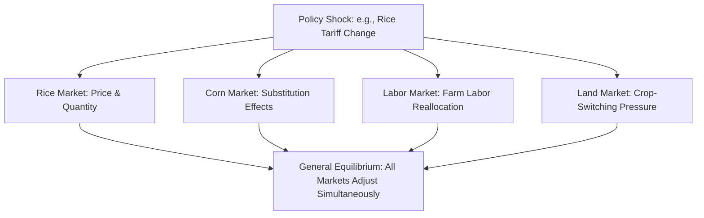

## General Equilibrium and Welfare Economics

### Definition and Conceptual Foundations

**General equilibrium analysis** examines how multiple markets simultaneously reach equilibrium, accounting for the interdependencies among them — in contrast to **partial equilibrium analysis**, which examines a single market in isolation, holding conditions in all other markets constant (the standard approach in most single-commodity supply-and-demand analysis, such as the rice or corn market). **Welfare economics** builds upon general (and partial) equilibrium tools to evaluate the desirability of different resource allocations according to explicit normative criteria (see: positive versus normative economics).

In agricultural economics, general equilibrium reasoning is essential whenever a policy or shock in one market (e.g., a rice price change) has significant spillover effects into related markets (e.g., corn, labor, land, or downstream food processing), which partial equilibrium analysis by construction cannot capture.

### Partial versus General Equilibrium

| Feature | Partial Equilibrium | General Equilibrium |
| --- | --- | --- |
| Scope | Single market analyzed in isolation | Multiple interconnected markets analyzed jointly |
| Assumption | Other markets held constant ("ceteris paribus") | Feedback effects across markets incorporated |
| Typical tool | Simple supply and demand diagram | Systems of simultaneous equations; computable general equilibrium (CGE) models |
| Best suited for | Small policy changes with limited spillovers | Large or economy-wide shocks (trade liberalization, major subsidy reform) |
| Agricultural example | Effect of a fertilizer subsidy on the fertilizer market alone | Effect of rice tariff removal on rice, corn, labor markets, and rural household income simultaneously |

**Key Points**

- Partial equilibrium analysis is appropriate and computationally simpler when a policy's effects are largely confined to one market with limited cross-market feedback.
- General equilibrium analysis becomes necessary when cross-market linkages are substantial — for instance, a major rice trade policy change in a rice-dependent economy can shift labor away from or toward rice farming, affecting wages and output in other agricultural and non-agricultural sectors.

### Walrasian General Equilibrium

The formal theory of general equilibrium originates with **Léon Walras** (1874) and was later rigorously proven by **Kenneth Arrow and Gérard Debreu** (1954), who established conditions under which a competitive general equilibrium — a set of prices at which all markets clear simultaneously — exists.

A general equilibrium is a set of prices $(p_1, p_2, \ldots, p_n)$ for all goods such that, given these prices, the quantity demanded equals the quantity supplied in every market simultaneously:

$$\sum_i \text{demand}_i(p_1, \ldots, p_n) = \sum_i \text{supply}_i(p_1, \ldots, p_n) \quad \text{for all markets}$$

**Walras's Law** states that if all markets but one are in equilibrium, the remaining market must also be in equilibrium, given the economy-wide budget constraint linking all markets.

### The Edgeworth Box and Exchange Efficiency

The **Edgeworth box** is a graphical device illustrating general equilibrium in a simple two-good, two-consumer (or two-input, two-firm) exchange economy, used to visualize the conditions for **Pareto efficiency in exchange**.

- Points inside the box off the **contract curve** are Pareto inefficient — a reallocation exists that makes at least one party better off without making the other worse off.
- The **contract curve** traces all Pareto-efficient allocations, where the indifference curves (or isoquants, in a production context) of the two parties are tangent, implying equal marginal rates of substitution (or technical substitution) across parties.

$$MRS^A_{xy} = MRS^B_{xy} \quad \text{(efficiency in exchange)}$$

**Agricultural relevance**: The Edgeworth box framework can illustrate, for example, gains from trade between two farming regions with different relative resource endowments (e.g., one region with abundant land suited to rice, another with abundant land suited to corn), showing how both regions can reach a jointly preferable outcome through exchange relative to autarky (no trade).

### The Three Conditions for Overall (Pareto) Efficiency

A general competitive equilibrium under standard assumptions (perfect competition, no externalities, complete markets) satisfies three simultaneous efficiency conditions, jointly known as the requirements for a **Pareto-efficient allocation**:

1. **Efficiency in exchange**: $MRS^A_{xy} = MRS^B_{xy}$ for all consumers — no further gains from trade between consumers are possible.
2. **Efficiency in production**: $MRTS^{rice}_{LK} = MRTS^{corn}_{LK}$ for all producers — no further gains from reallocating inputs between production activities are possible.
3. **Overall (product-mix) efficiency**: The marginal rate of transformation (MRT) along the production possibilities frontier equals the marginal rate of substitution in consumption:

$$MRT_{xy} = MRS_{xy}$$

This condition ensures that the economy is not only producing efficiently and distributing goods efficiently, but is also producing the *right mix* of goods that consumers actually want at the margin.

### The First and Second Fundamental Theorems of Welfare Economics

**First Fundamental Theorem of Welfare Economics**: Under standard assumptions (perfect competition, no externalities, complete information, complete markets), any competitive general equilibrium is Pareto efficient.

**Second Fundamental Theorem of Welfare Economics**: Under similar assumptions (plus convexity of preferences and production sets), any Pareto-efficient allocation can be achieved as a competitive equilibrium through an appropriate initial redistribution of endowments (e.g., lump-sum transfers), followed by unfettered market exchange.

**Key Points**

- The first theorem provides the formal theoretical foundation for the claim that competitive markets, absent market failure, allocate resources efficiently without need for central coordination — directly linking back to Adam Smith's "invisible hand" (see: history of agricultural economic thought).
- The second theorem is significant for policy design because it implies that equity concerns can, in principle, be addressed through redistribution of initial endowments (e.g., land reform, cash transfers) *prior to* market exchange, rather than through direct price controls or production mandates, potentially achieving both efficiency and a desired equity outcome — an important theoretical argument in debates over land redistribution versus price intervention as tools for addressing rural inequality.
- Both theorems depend critically on the assumptions holding; agricultural markets frequently violate one or more of these assumptions (externalities from pesticide runoff, incomplete insurance markets for weather risk, imperfect competition in input/output markets — see: market structures), which is precisely why government intervention is often justified on efficiency, not just equity, grounds.

### Market Failure and Departures from General Equilibrium Efficiency

Agricultural markets commonly exhibit conditions that violate the assumptions underlying the welfare theorems, providing an efficiency-based rationale for policy intervention distinct from purely redistributive motives:

- **Externalities**: Agricultural production frequently generates externalities not reflected in market prices — e.g., negative externalities from agrochemical runoff affecting water quality, or positive externalities from agricultural research and extension knowledge spillovers.
- **Incomplete markets**: Markets for certain agricultural risks (weather, price volatility) are often incomplete or entirely absent in many developing-country contexts, motivating public crop insurance schemes or price stabilization programs.
- **Imperfect competition**: Monopoly, oligopoly, or monopsony power in input, processing, or labor markets (see: market structures) prevents prices from reflecting true marginal costs and benefits.
- **Public goods**: Agricultural research, weather forecasting, and rural infrastructure exhibit non-excludability and non-rivalry, leading to underprovision by private markets alone.

### Computable General Equilibrium (CGE) Models

**Computable General Equilibrium (CGE) models** are the primary applied tool for conducting empirical general equilibrium analysis of agricultural and trade policy, translating the theoretical Walrasian framework into large-scale numerical simulation models calibrated to real economic data (typically via a **Social Accounting Matrix**, or SAM).

- CGE models simulate how a policy shock (e.g., removal of agricultural export subsidies, a major trade agreement, or a large fertilizer subsidy program) propagates through interconnected markets for goods, factors (labor, land, capital), and household incomes across the entire economy.
- Widely used by international organizations (e.g., the World Bank, the International Food Policy Research Institute (IFPRI), and the OECD) to evaluate the economy-wide impacts of agricultural trade liberalization, biofuel mandates, and climate policy on production, prices, and household welfare across income groups.
- **[Inference]** CGE model results are sensitive to underlying structural assumptions, elasticity parameters, and model closure rules (how savings, investment, and government balances are assumed to adjust), meaning results can vary meaningfully across different modeling choices even for the same policy question, a widely acknowledged methodological consideration in the applied CGE literature.

### Welfare Measurement Tools in Applied General Equilibrium Analysis

- **Equivalent Variation (EV)** and **Compensating Variation (CV)**: Money-metric measures of the welfare change experienced by consumers from a price or policy change, more precise than simple consumer surplus when income effects are non-negligible (see: consumer theory and utility maximization).
- **Social welfare functions**: Aggregate individual utilities into a single social welfare measure according to a chosen normative weighting scheme (e.g., utilitarian, which sums utilities equally; or Rawlsian/maximin, which focuses exclusively on the welfare of the worst-off individual) — an explicitly normative step required to move from efficiency analysis (Pareto criteria alone cannot rank most real-world policy alternatives, since virtually every policy creates both winners and losers).
- **Kaldor-Hicks compensation criterion**: A policy is deemed to improve social welfare if the gainers *could* hypothetically compensate the losers and still be better off, regardless of whether compensation actually occurs — widely used in agricultural trade and cost-benefit policy analysis, though it has been criticized precisely because it does not require actual compensation, raising distinct equity concerns.

### Application to Agricultural Trade Policy

**Example**

Removing a rice import tariff in a rice-importing economy lowers the domestic rice price. Partial equilibrium analysis of the rice market alone shows consumer surplus gains exceeding producer surplus losses (a net welfare gain in the rice market). However, general equilibrium analysis reveals additional effects: rice farmers facing lower income may reduce fertilizer purchases (affecting the fertilizer market), some farm labor may shift toward other crops or leave agriculture entirely (affecting labor markets and wages in other sectors), and reduced rural income may lower demand for rural non-farm goods and services. A CGE model incorporating these linkages provides a more complete picture of the tariff removal's welfare effects across the whole economy, informing normative judgments about the policy's overall desirability, including its distributional consequences between urban consumers and rural rice-farming households.

### Related Topics

- Positive versus normative economics
- Market structures: perfect competition, monopoly, oligopoly, monopsony
- Consumer theory and utility maximization
- Externalities and public goods in agriculture
- Agricultural trade policy and computable general equilibrium modeling
- Cost-benefit analysis and the Kaldor-Hicks criterion
- Land reform as a redistributive policy tool (Second Welfare Theorem application)