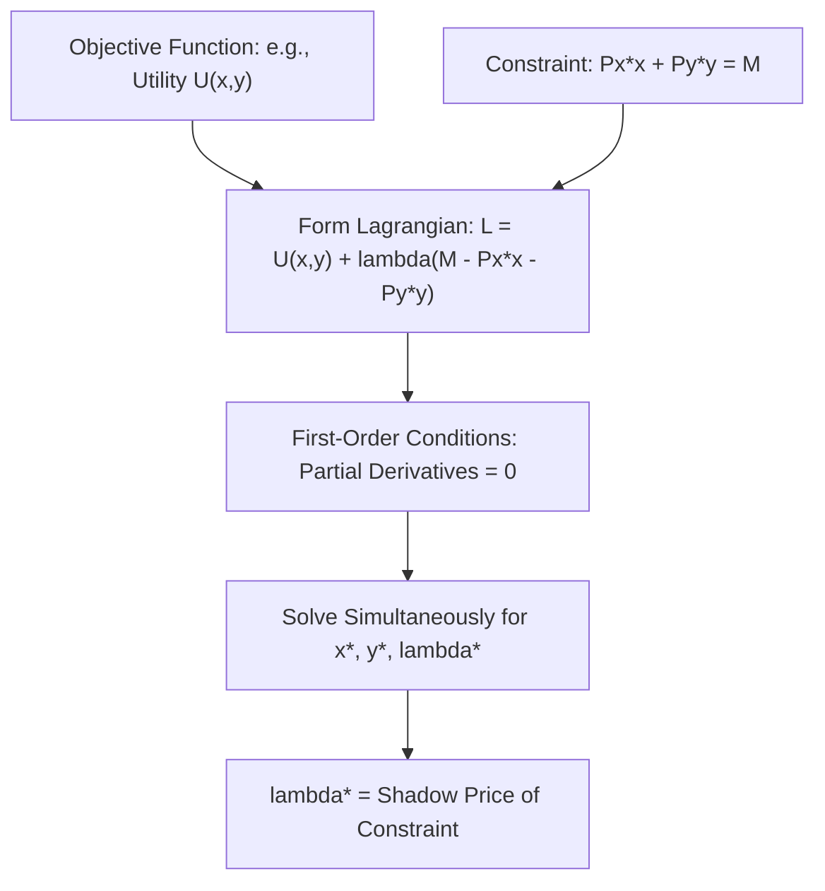

## Calculus for Optimization Problems

### Definition and Conceptual Foundations

**Optimization** is the mathematical process of finding the maximum or minimum value of a function, subject to given conditions. Calculus provides the formal toolkit for solving optimization problems that recur throughout agricultural economics: profit maximization, cost minimization, utility maximization, and optimal resource allocation under constraints. Nearly every marginal-analysis decision rule encountered elsewhere in agricultural economics (e.g., $MB = MC$, $MRP = MFC$, the equimarginal principle) is a direct application of calculus-based optimization.

### Unconstrained Optimization: First and Second Derivatives

For a function $f(x)$ representing, for example, a farm's profit as a function of output level $Q$, the **first-order condition (FOC)** for an interior maximum or minimum requires the first derivative to equal zero:

$$f'(x^*) = 0$$

This identifies **critical points** — candidate maxima, minima, or inflection points. To distinguish among them, the **second-order condition (SOC)** examines the second derivative:

$$f''(x^*) < 0 \implies \text{local maximum}$$

$$f''(x^*) > 0 \implies \text{local minimum}$$

$$f''(x^*) = 0 \implies \text{inconclusive (requires further investigation)}$$

**Example**

A farm's profit function is given by $\pi(Q) = 100Q - 2Q^2 - 50$, where $Q$ is output in tons. To find the profit-maximizing output level:

$$\pi'(Q) = 100 - 4Q = 0 \implies Q^* = 25$$

Checking the second-order condition: $\pi''(Q) = -4 < 0$, confirming $Q^* = 25$ is a maximum. Maximum profit is $\pi(25) = 100(25) - 2(625) - 50 = 2500 - 1250 - 50 = ₱1{,}200$.

### Marginal Analysis as Applied Calculus

Marginal concepts throughout agricultural economics are formally derivatives of underlying total functions:

$$MC = \frac{d(TC)}{dQ}, \quad MR = \frac{d(TR)}{dQ}, \quad MP_L = \frac{\partial Q}{\partial L}, \quad MU_x = \frac{\partial U}{\partial x}$$

The standard profit-maximization rule, $MR = MC$, is derived directly from the first-order condition of the profit function $\pi(Q) = TR(Q) - TC(Q)$:

$$\pi'(Q) = TR'(Q) - TC'(Q) = 0 \implies MR = MC$$

**Key Points**

- This calculus-based derivation is the rigorous foundation underlying every "set marginal benefit equal to marginal cost" decision rule used throughout production, consumption, and resource-allocation analysis in agricultural economics.
- The second-order condition ($TR''(Q) < TC''(Q)$, i.e., marginal cost cutting marginal revenue from below) confirms that the identified quantity is indeed profit-maximizing rather than profit-minimizing.

### Constrained Optimization: The Lagrange Multiplier Method

Many core problems in agricultural economics involve maximizing or minimizing a function *subject to a constraint* — for example, maximizing utility subject to a budget constraint, or minimizing production cost subject to an output target. The **Lagrange multiplier method** provides the standard technique for solving such problems.

To maximize $f(x, y)$ subject to constraint $g(x, y) = c$, form the **Lagrangian function**:

$$\mathcal{L}(x, y, \lambda) = f(x, y) + \lambda \left[c - g(x, y)\right]$$

The first-order conditions require setting all partial derivatives equal to zero:

$$\frac{\partial \mathcal{L}}{\partial x} = 0, \quad \frac{\partial \mathcal{L}}{\partial y} = 0, \quad \frac{\partial \mathcal{L}}{\partial \lambda} = 0$$

The **Lagrange multiplier** $\lambda^*$ has an important economic interpretation: it measures the marginal value of relaxing the constraint by one unit (the **shadow price** of the constraint) — for instance, in a utility-maximization problem, $\lambda^*$ represents the marginal utility of an additional peso of income.

**Example: Utility Maximization via Lagrange Multipliers**

Maximize $U(x, y) = x^{0.5}y^{0.5}$ subject to the budget constraint $P_x x + P_y y = M$.

$$\mathcal{L} = x^{0.5}y^{0.5} + \lambda(M - P_x x - P_y y)$$

First-order conditions:

$$\frac{\partial \mathcal{L}}{\partial x} = 0.5x^{-0.5}y^{0.5} - \lambda P_x = 0$$

$$\frac{\partial \mathcal{L}}{\partial y} = 0.5x^{0.5}y^{-0.5} - \lambda P_y = 0$$

Dividing these two conditions eliminates $\lambda$ and yields the familiar tangency condition:

$$\frac{MU_x}{MU_y} = \frac{P_x}{P_y}$$

confirming that the Lagrange method reproduces the standard tangency (equimarginal) condition derived graphically in consumer theory (see: consumer theory and utility maximization).

### Constrained Cost Minimization

The dual problem — minimizing cost subject to an output constraint — follows the identical mathematical structure. To minimize $C = wL + rK$ subject to producing output level $\bar{Q} = f(L, K)$:

$$\mathcal{L} = wL + rK + \mu\left[\bar{Q} - f(L,K)\right]$$

Solving the first-order conditions yields the least-cost condition:

$$\frac{MP_L}{w} = \frac{MP_K}{r}$$

directly reproducing the cost-minimization tangency condition from producer theory (see: theory of the firm and production functions).

### Multivariable Optimization and Partial Derivatives

Agricultural production and profit functions typically involve multiple inputs simultaneously (e.g., labor, fertilizer, irrigation water). For a multivariable function $f(x_1, x_2, \ldots, x_n)$, the first-order conditions for an unconstrained interior optimum require **all partial derivatives** to equal zero simultaneously:

$$\frac{\partial f}{\partial x_1} = \frac{\partial f}{\partial x_2} = \cdots = \frac{\partial f}{\partial x_n} = 0$$

The **second-order conditions** for a multivariable maximum require the **Hessian matrix** of second partial derivatives to be negative semi-definite (for a maximum) — a generalization of the single-variable requirement that $f''(x) < 0$.

### Constrained Optimization with Inequality Constraints: Kuhn-Tucker Conditions

Many realistic agricultural optimization problems involve inequality constraints rather than strict equalities — for example, a farmer cannot use *more* land than available (an upper bound), but may choose to use less. The **Kuhn-Tucker (KKT) conditions** generalize the Lagrange method to handle such inequality constraints, incorporating **complementary slackness conditions** that determine whether a constraint binds (is exactly satisfied) or is slack (not fully utilized) at the optimum.

**Key Points**

- KKT conditions are essential in **linear programming** and farm planning models where resource constraints (land, labor, capital, water) are naturally expressed as inequalities (e.g., $L \leq \bar{L}$, available labor), rather than fixed equalities.
- A key output of such models is identifying which constraints are **binding** at the optimal solution — these binding constraints represent the resources that are fully utilized and therefore limiting further gains, directly informing which resource a farm should prioritize acquiring more of to increase output or profit.

### Comparative Statics

**Comparative statics** uses calculus (specifically, the **implicit function theorem** and total differentiation) to analyze how the optimal solution to an optimization problem changes in response to a change in a parameter — for example, how optimal fertilizer use changes in response to a fertilizer price increase, or how optimal consumption bundles change with income (see: consumer theory — income and substitution effects, and the Slutsky equation).

Given a first-order condition $F(x^*, \alpha) = 0$ where $\alpha$ is an exogenous parameter (e.g., a price), differentiating implicitly:

$$\frac{dx^*}{d\alpha} = -\frac{\partial F/\partial \alpha}{\partial F/\partial x}$$

This technique underlies the derivation of demand and supply response functions throughout agricultural economics, showing precisely how optimal choices shift when prices, income, or technology parameters change.

### Applications Summary Table

| Economic Problem | Objective Function | Constraint | Calculus Tool |
| --- | --- | --- | --- |
| Profit maximization | $\pi(Q) = TR(Q) - TC(Q)$ | None (unconstrained) | First/second derivative |
| Utility maximization | $U(x,y)$ | Budget: $P_xx + P_yy = M$ | Lagrange multiplier |
| Cost minimization | $C = wL + rK$ | Output: $f(L,K) = \bar{Q}$ | Lagrange multiplier |
| Farm resource allocation | Profit or output | Land, labor, capital ≤ availability | Kuhn-Tucker conditions |
| Price/policy response | Optimal choice function | Parameter change (price, income) | Comparative statics / implicit differentiation |

### Related Topics

- Consumer theory and utility maximization
- Theory of the firm and production functions
- Linear programming and farm planning models
- Comparative statics and the Slutsky equation
- Cost curves and short-run versus long-run decisions
- Statistical and econometric tools for agricultural data analysis