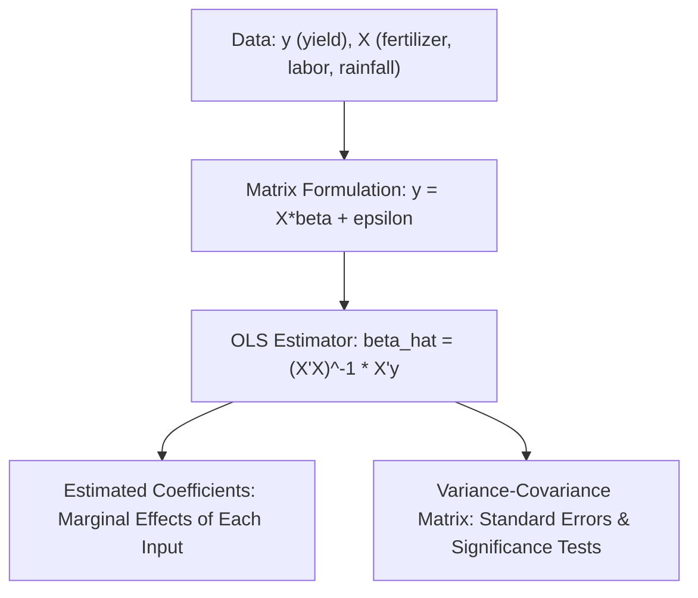

## Linear Algebra and Matrix Methods

### Definition and Conceptual Foundations

**Linear algebra** provides the mathematical language for representing and solving systems involving multiple variables and multiple equations simultaneously — a structure that arises pervasively in agricultural economics whenever a problem involves several inputs, several outputs, several markets, or several time periods interacting at once. **Matrix methods** offer a compact and computationally tractable notation for organizing such systems, and underpin much of applied econometrics, input-output analysis, and farm planning optimization.

### Basic Matrix Concepts

A **matrix** is a rectangular array of numbers arranged in rows and columns, denoted $A_{m \times n}$ for a matrix with $m$ rows and $n$ columns. A **vector** is a special case of a matrix with a single row (row vector) or single column (column vector).

**Key matrix operations relevant to agricultural economic modeling:**

- **Matrix addition/subtraction**: Requires matrices of identical dimensions; performed element-by-element.
- **Scalar multiplication**: Multiplying every element of a matrix by a constant.
- **Matrix multiplication**: For $A_{m \times n}$ and $B_{n \times p}$, the product $AB$ is an $m \times p$ matrix, requiring the number of columns in $A$ to equal the number of rows in $B$.
- **Transpose** ($A^T$): Interchanges the rows and columns of a matrix.
- **Inverse** ($A^{-1}$): For a square matrix $A$, the inverse satisfies $AA^{-1} = A^{-1}A = I$ (the identity matrix), and exists only if $A$ is **non-singular** (its determinant is non-zero).
- **Determinant** ($|A|$ or $\det(A)$): A scalar value computed from a square matrix, used to determine invertibility and to solve systems via Cramer's rule.

### Systems of Linear Equations in Matrix Form

Many economic models reduce to solving a system of simultaneous linear equations. In matrix notation, a system such as:

$$a_{11}x_1 + a_{12}x_2 = b_1$$

$$a_{21}x_1 + a_{22}x_2 = b_2$$

is written compactly as:

$$A\mathbf{x} = \mathbf{b}$$

where $A$ is the coefficient matrix, $\mathbf{x}$ is the vector of unknowns, and $\mathbf{b}$ is the vector of constants. If $A$ is invertible, the solution is:

$$\mathbf{x} = A^{-1}\mathbf{b}$$

**Agricultural relevance**: This structure underlies the solution of **market equilibrium systems** with multiple interrelated commodities (e.g., simultaneously solving for equilibrium prices and quantities in rice and corn markets that are linked through cross-price elasticities of demand or shared land resources) and is the computational backbone of the general equilibrium and computable general equilibrium (CGE) models discussed in general equilibrium and welfare economics.

### Ordinary Least Squares (OLS) in Matrix Form

Matrix algebra provides the standard formulation for **ordinary least squares regression**, the workhorse estimation technique for empirical agricultural economics (e.g., estimating a production function, a demand function, or the effect of fertilizer use on yield).

For a linear regression model $\mathbf{y} = X\boldsymbol{\beta} + \boldsymbol{\varepsilon}$, where $\mathbf{y}$ is an $n \times 1$ vector of observations on the dependent variable (e.g., crop yield), $X$ is an $n \times k$ matrix of explanatory variables (e.g., fertilizer, labor, rainfall), and $\boldsymbol{\beta}$ is the vector of coefficients to be estimated, the OLS estimator is:

$$\hat{\boldsymbol{\beta}} = (X^TX)^{-1}X^T\mathbf{y}$$

**Key Points**

- This closed-form matrix solution minimizes the sum of squared residuals across all observations simultaneously, generalizing the single-variable regression formula to any number of explanatory variables.
- The requirement that $(X^TX)^{-1}$ exist (i.e., $X^TX$ must be non-singular) corresponds to the econometric requirement of **no perfect multicollinearity** among explanatory variables — if two input variables are perfectly linearly related (e.g., total land area and cultivated land area when they always move together in the sample), the matrix cannot be inverted and OLS coefficients cannot be uniquely estimated.
- The variance-covariance matrix of the estimated coefficients, $\text{Var}(\hat{\boldsymbol{\beta}}) = \sigma^2(X^TX)^{-1}$, is used to construct standard errors, confidence intervals, and hypothesis tests for the estimated relationships (e.g., testing whether fertilizer has a statistically significant effect on yield).

### Input-Output Analysis (Leontief Models)

**Input-output analysis**, developed by Wassily Leontief (Nobel Memorial Prize, 1973), uses matrix methods to model the interdependencies among sectors of an economy, where the output of one sector (e.g., agriculture) serves as an input to other sectors (e.g., food processing, textiles from cotton), and vice versa.

The core **Leontief model** is expressed as:

$$\mathbf{x} = A\mathbf{x} + \mathbf{d}$$

where $\mathbf{x}$ is the vector of total output by sector, $A$ is the **technical coefficients matrix** (each element $a_{ij}$ representing the amount of sector $i$'s output required as input to produce one unit of sector $j$'s output), and $\mathbf{d}$ is the vector of final demand. Solving for total output required to meet a given final demand:

$$\mathbf{x} = (I - A)^{-1}\mathbf{d}$$

The matrix $(I-A)^{-1}$ is known as the **Leontief inverse**, which captures both the direct and indirect (multiplier) requirements across all interlinked sectors.

**Agricultural relevance**: Input-output models are widely used to estimate the **economy-wide multiplier effects** of agricultural sector growth or shocks — for example, quantifying how a rise in rice production not only directly increases agricultural GDP but also indirectly stimulates output in fertilizer manufacturing, transport, milling, and retail sectors that supply or process agricultural inputs and outputs. This provides the underlying computational structure for the **Social Accounting Matrix (SAM)** framework used to calibrate computable general equilibrium models (see: general equilibrium and welfare economics).

### Linear Programming and Matrix Formulation

**Linear programming (LP)** — used extensively in farm planning to determine the optimal combination of crops, inputs, or activities that maximizes profit (or minimizes cost) subject to resource constraints — is naturally expressed in matrix notation:

$$\max \; \mathbf{c}^T\mathbf{x} \quad \text{subject to} \quad A\mathbf{x} \leq \mathbf{b}, \quad \mathbf{x} \geq 0$$

where $\mathbf{x}$ is the vector of decision variables (e.g., hectares allocated to each crop), $\mathbf{c}$ is the vector of profit coefficients per unit of each activity, $A$ is the matrix of resource requirements per unit of each activity (e.g., labor-hours and water required per hectare of each crop), and $\mathbf{b}$ is the vector of available resources (total land, labor, water).

**Example**

A farm planning model might allocate land between rice and corn to maximize profit subject to land, labor, and water constraints:

$$\max \; 8000x_1 + 6000x_2$$

$$\text{subject to:} \quad x_1 + x_2 \leq 10 \; (\text{hectares}), \quad 40x_1 + 25x_2 \leq 350 \; (\text{labor-days}), \quad x_1, x_2 \geq 0$$

where $x_1$ is hectares of rice and $x_2$ is hectares of corn. The **simplex method**, the standard algorithm for solving such linear programs, relies fundamentally on matrix row operations (similar to Gaussian elimination) to iteratively identify the optimal vertex of the feasible region defined by the constraints.

### Eigenvalues and Eigenvectors

For a square matrix $A$, an **eigenvector** $\mathbf{v}$ and corresponding **eigenvalue** $\lambda$ satisfy:

$$A\mathbf{v} = \lambda\mathbf{v}$$

**Agricultural relevance**:

- **Dynamic systems and stability analysis**: Eigenvalues determine the stability of dynamic economic models, such as whether agricultural commodity price cycles (see: the cobweb model, in history of agricultural economic thought) converge toward equilibrium, oscillate persistently, or diverge over time, depending on the magnitude of the relevant eigenvalue(s) relative to one.
- **Principal Component Analysis (PCA)**: A statistical technique built on eigenvalue decomposition, used in agricultural data analysis to reduce a large number of correlated variables (e.g., multiple soil quality indicators, or multiple climate variables) into a smaller number of composite indices capturing most of the underlying variation.

### Quadratic Forms and Second-Order Conditions

Matrix algebra also generalizes the second-order conditions for optimization (see: calculus for optimization problems) to multivariable settings. A **quadratic form** $\mathbf{x}^TH\mathbf{x}$, where $H$ is the **Hessian matrix** of second partial derivatives, determines whether a critical point of a multivariable function is a maximum, minimum, or saddle point:

- $H$ **negative definite** → local maximum (relevant for confirming multi-input profit or utility maximization)
- $H$ **positive definite** → local minimum (relevant for confirming multi-input cost minimization)
- $H$ **indefinite** → saddle point (neither a maximum nor minimum)

### Applications Summary Table

| Application | Matrix Structure | Agricultural Economics Use |
| --- | --- | --- |
| OLS regression | $\hat{\boldsymbol{\beta}} = (X^TX)^{-1}X^T\mathbf{y}$ | Estimating production/demand functions, yield response to inputs |
| Input-output analysis | $\mathbf{x} = (I-A)^{-1}\mathbf{d}$ | Sector interdependency and multiplier effects of agricultural growth |
| Linear programming | $\max \mathbf{c}^T\mathbf{x}$ s.t. $A\mathbf{x} \leq \mathbf{b}$ | Optimal farm crop/resource allocation planning |
| Multi-market equilibrium | $A\mathbf{x} = \mathbf{b}$ | Simultaneous equilibrium prices across related commodity markets |
| Stability/dynamic analysis | Eigenvalues of system matrix | Convergence/divergence of price cycles (cobweb dynamics) |
| Dimension reduction | Eigen-decomposition (PCA) | Summarizing multiple soil, climate, or farm characteristic variables |

### Related Topics

- Calculus for optimization problems
- General equilibrium and welfare economics
- Linear programming and farm planning models
- Econometric methods for agricultural data analysis
- Agricultural price cycles and the cobweb model
- Input-output analysis and agricultural sector multipliers