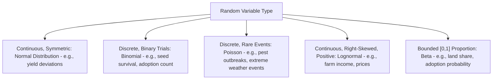

## Probability Theory and Distributions

### Definition and Conceptual Foundations

**Probability theory** provides the mathematical framework for quantifying uncertainty — an especially central concern in agricultural economics, where outcomes such as crop yields, commodity prices, rainfall, and pest infestations are inherently subject to random variation. **Probability distributions** describe the likelihood of different possible values a random variable can take, forming the statistical foundation for risk analysis, crop insurance design, econometric inference, and decision-making under uncertainty in agriculture.

### Basic Probability Concepts

- **Random variable**: A variable whose value is determined by the outcome of a random or uncertain process (e.g., rainfall in a given season, or a farm's yield per hectare).
- **Probability distribution**: A function describing the probabilities associated with the possible values of a random variable, either a **probability mass function (PMF)** for discrete variables (e.g., number of pest outbreaks in a season) or a **probability density function (PDF)** for continuous variables (e.g., rainfall in millimeters).
- **Cumulative distribution function (CDF)**: $F(x) = P(X \leq x)$, giving the probability that a random variable takes a value less than or equal to $x$.
- **Expected value (mean)**: The probability-weighted average value of a random variable, denoted $E(X)$ or $\mu$.

$$E(X) = \sum_i x_i P(x_i) \quad \text{(discrete)} \qquad E(X) = \int_{-\infty}^{\infty} x f(x)\,dx \quad \text{(continuous)}$$

- **Variance**: A measure of the dispersion or spread of a random variable around its mean, central to quantifying risk.

$$\text{Var}(X) = E\left[(X-\mu)^2\right] = \sigma^2$$

- **Standard deviation**: $\sigma = \sqrt{\text{Var}(X)}$, expressed in the same units as the original variable, often more interpretable than variance in applied risk discussions (e.g., "yield varies by ±0.5 tons per hectare").

**Key Points**

- In agricultural risk analysis, the mean represents the *expected* or average outcome (e.g., expected yield), while the variance/standard deviation captures the *riskiness* of that outcome — two crop varieties can have identical expected yield but very different risk profiles if one has substantially higher yield variance across seasons.
- **Coefficient of variation** ($CV = \sigma/\mu$) is frequently used to compare relative riskiness across variables with different units or scales (e.g., comparing yield risk across crops with very different average yields).

### Conditional Probability and Bayes' Theorem

**Conditional probability** measures the probability of an event given that another event has occurred:

$$P(A \mid B) = \frac{P(A \cap B)}{P(B)}$$

**Bayes' Theorem** allows updating probability estimates in light of new information:

$$P(A \mid B) = \frac{P(B \mid A)P(A)}{P(B)}$$

**Agricultural relevance**: Bayes' theorem underlies **updating yield or weather forecasts** as new information becomes available during a growing season (e.g., updating the probability of drought conditions given early-season rainfall data), and forms the statistical basis for Bayesian econometric methods increasingly used in agricultural data analysis with limited sample sizes (common in farm-level surveys in developing-country contexts).

### Key Probability Distributions in Agricultural Economics

**Normal (Gaussian) Distribution**

$$f(x) = \frac{1}{\sigma\sqrt{2\pi}}e^{-\frac{(x-\mu)^2}{2\sigma^2}}$$

The normal distribution is the most widely assumed distribution in applied econometrics (underlying standard OLS inference, hypothesis tests, and confidence intervals — see: linear algebra and matrix methods). It is symmetric and fully characterized by its mean $\mu$ and standard deviation $\sigma$. Many continuous agricultural variables (e.g., yields aggregated across many independent plots) are often approximated as normally distributed, following from the **Central Limit Theorem**, though **[Inference]** yield distributions can sometimes exhibit skewness (e.g., left-skewed due to downside weather risk truncating maximum attainable yield less than it truncates minimum yield), and normality should be checked empirically rather than assumed by default in specific applications.

**Binomial Distribution**

$$P(X = k) = \binom{n}{k}p^k(1-p)^{n-k}$$

Describes the number of "successes" in $n$ independent trials, each with success probability $p$. Agricultural applications include modeling the number of plants surviving out of a planted batch, or the number of farmers in a sample who adopt a new technology, each treated as an independent binary (success/failure) outcome.

**Poisson Distribution**

$$P(X=k) = \frac{\lambda^k e^{-\lambda}}{k!}$$

Models the number of discrete events occurring in a fixed interval of time or space, given a known average rate $\lambda$. Commonly used to model rare-event counts such as the number of pest outbreak incidents per season or the number of extreme weather events (droughts, typhoons) affecting a region over a given period.

**Lognormal Distribution**

A variable $X$ is lognormally distributed if $\ln(X)$ is normally distributed. Frequently used to model variables that are strictly positive and right-skewed, such as farm income or commodity prices, which cannot take negative values and often exhibit a long right tail (a small number of very high values).

**Beta Distribution**

Defined on the interval $[0,1]$, the Beta distribution is often used to model proportions or probabilities themselves — such as the proportion of a farmer's land allocated to a particular crop, or the probability of technology adoption — because its flexible shape can represent a wide range of skewed or symmetric patterns bounded between 0 and 1.

**Key Points**

- **[Inference]** The choice of distribution for modeling a specific agricultural variable (yield, price, adoption rate) should be guided by both the variable's theoretical properties (e.g., whether negative values are possible, whether it is a count or a continuous measure) and empirical goodness-of-fit testing on the specific dataset at hand, rather than a fixed rule applicable to all contexts.

### The Central Limit Theorem and Law of Large Numbers

The **Law of Large Numbers** states that as sample size increases, the sample mean converges toward the true population mean — providing the statistical justification for using average yields or prices across many farms/seasons as reliable estimates of underlying expected values.

The **Central Limit Theorem (CLT)** states that the sampling distribution of the mean of a sufficiently large number of independent, identically distributed random variables approaches a normal distribution, *regardless of the underlying distribution of the individual variables*. This theorem justifies the widespread use of normal-distribution-based inference (confidence intervals, hypothesis tests) in agricultural econometrics even when underlying farm-level data (e.g., individual plot yields) are not themselves normally distributed.

### Risk Analysis and Decision-Making Under Uncertainty

Probability distributions are foundational to modeling farmer decision-making under risk, particularly in **expected utility theory**:

$$E[U(X)] = \sum_i U(x_i)P(x_i)$$

A **risk-averse** farmer's utility function is concave ($U''(X) < 0$), implying they prefer a certain outcome over a risky prospect with the same expected value — explaining, for example, why farmers may accept a lower expected return from a diversified cropping strategy in exchange for reduced yield variance, or why demand exists for formal crop insurance products even when actuarially priced at (or slightly above) expected loss.

**Example**

A farmer chooses between planting a single high-yielding but drought-sensitive rice variety (expected yield 5 tons/hectare, but only 2 tons/hectare in a drought year occurring with probability 0.3) versus a lower-yielding but drought-resistant variety (constant yield of 4 tons/hectare regardless of rainfall).

Expected yield, drought-sensitive variety: $E(X) = 0.7(5) + 0.3(2) = 4.1$ tons/hectare

Expected yield, drought-resistant variety: $E(X) = 4.0$ tons/hectare (certain)

Although the drought-sensitive variety has a higher expected yield (4.1 vs. 4.0 tons/hectare), a sufficiently risk-averse farmer may still prefer the drought-resistant variety because it eliminates yield variance entirely, illustrating the standard risk-return trade-off central to agricultural technology and crop choice decisions under uncertainty.

### Applications in Agricultural Economics

- **Crop insurance and index-based insurance design**: Actuarially fair insurance premiums are calculated using the expected value of losses under an assumed probability distribution of yields or weather outcomes (e.g., rainfall index insurance products priced using historical rainfall distribution data).
- **Value at Risk (VaR) and downside risk measures**: Used in farm financial risk management to quantify the probability and magnitude of losses exceeding a given threshold, informing credit and lending decisions for agricultural loans.
- **Stochastic simulation and Monte Carlo methods**: Used in farm planning and agricultural policy analysis to simulate a wide range of possible future price and yield outcomes (drawn from assumed probability distributions) to evaluate the robustness of a farm plan or policy under uncertainty.
- **Statistical inference in econometrics**: Probability distributions underpin hypothesis testing (e.g., testing whether a fertilizer subsidy program significantly increased yields), confidence interval construction, and standard error calculation throughout applied agricultural econometrics (see: linear algebra and matrix methods — OLS estimation).

### Related Topics

- Linear algebra and matrix methods (OLS estimation and inference)
- Calculus for optimization problems (expected utility maximization)
- Risk management and crop insurance in agriculture
- Econometric methods for agricultural data analysis
- Expected utility theory and farmer risk preferences
- Consumer theory and utility maximization