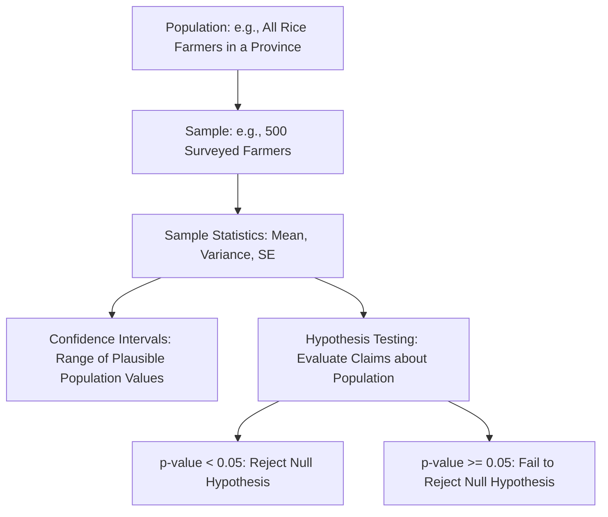

## Descriptive Statistics and Inference

### Definition and Conceptual Foundations

**Descriptive statistics** summarize and organize the key features of a dataset — such as farm survey data on yields, input use, or household income — without drawing conclusions beyond the data itself. **Statistical inference** extends beyond description to draw conclusions about a broader population (e.g., all rice farmers in a region) based on a sample (e.g., a survey of 500 rice farmers), incorporating explicit measures of uncertainty about those conclusions. Together, these tools form the empirical backbone of applied agricultural economics, enabling researchers and policymakers to characterize farm conditions, test hypotheses about agricultural interventions, and quantify the reliability of their conclusions.

### Measures of Central Tendency

- **Mean**: The arithmetic average, $\bar{x} = \frac{1}{n}\sum_{i=1}^n x_i$, e.g., average yield per hectare across sampled farms.
- **Median**: The middle value when data are ordered, less sensitive to extreme outliers than the mean — often preferred when summarizing farm income or landholding size, which can be heavily right-skewed by a small number of very large farms.
- **Mode**: The most frequently occurring value, useful for categorical data (e.g., the most common crop grown in a surveyed region).

**Key Points**

- **[Inference]** In agricultural household survey data, the mean and median often diverge meaningfully for variables like income or landholding size due to skewness; reporting both (or the median alone) can give a more representative picture of the "typical" farm household than the mean alone, which can be pulled upward by a small number of large landholders.

### Measures of Dispersion

- **Range**: The difference between the maximum and minimum values.
- **Variance**: $s^2 = \frac{1}{n-1}\sum_{i=1}^n (x_i - \bar{x})^2$, measuring average squared deviation from the mean (the $n-1$ denominator, rather than $n$, applies **Bessel's correction**, which ensures the sample variance is an unbiased estimator of the population variance).
- **Standard deviation**: $s = \sqrt{s^2}$, expressed in the original units of the variable (e.g., tons per hectare), generally more interpretable than variance.
- **Coefficient of variation**: $CV = s/\bar{x}$, a unit-free measure enabling comparison of relative variability across variables with different scales (e.g., comparing yield variability for rice versus mango, which have very different average output units).
- **Interquartile range (IQR)**: The difference between the 75th and 25th percentiles, a robust measure of spread less sensitive to outliers than the standard deviation.

### Measures of Shape

- **Skewness**: Measures asymmetry in a distribution. Positive (right) skewness, common in farm income and landholding size data, indicates a long right tail with a small number of very high values pulling the mean above the median.
- **Kurtosis**: Measures the "tailedness" of a distribution relative to a normal distribution; high kurtosis indicates more extreme outliers than a normal distribution would predict, relevant when assessing the frequency of extreme yield or price shocks in agricultural data.

### Visualizing Data Distributions

Common descriptive tools for agricultural datasets include:

- **Histograms**: Show the frequency distribution of a continuous variable (e.g., the distribution of yields across sampled farm plots).
- **Box plots**: Display the median, quartiles, and outliers, useful for comparing yield or income distributions across different regions, crop types, or treatment groups (e.g., comparing yields between farms using improved seed varieties versus traditional varieties).
- **Scatter plots**: Show the relationship between two continuous variables (e.g., fertilizer application rate versus yield), often a first step before formal regression analysis.

### From Description to Inference: Sampling and Estimation

Statistical inference relies on the relationship between a **sample** (the data actually collected, e.g., a survey of farms) and the **population** (the entire group the sample is intended to represent, e.g., all farms in a province). Key concepts:

- **Sampling distribution**: The probability distribution of a statistic (e.g., the sample mean) computed from repeated random samples of the same size from the population.
- **Standard error (SE)**: The standard deviation of a sampling distribution, quantifying how much a sample statistic (e.g., the sample mean yield) is expected to vary from sample to sample due to random sampling variation:

$$SE(\bar{x}) = \frac{s}{\sqrt{n}}$$

- Larger sample sizes ($n$) reduce the standard error, reflecting the intuitive principle that estimates based on larger, more representative surveys are more precise.

### Confidence Intervals

A **confidence interval** provides a range of plausible values for a population parameter, along with a stated confidence level (typically 95%), based on sample data:

$$\bar{x} \pm z_{\alpha/2} \cdot SE(\bar{x})$$

**Key Points**

- A 95% confidence interval does *not* mean there is a 95% probability the true population parameter lies within the specific calculated interval; rather, it means that if the sampling procedure were repeated many times, approximately 95% of the resulting confidence intervals would contain the true population parameter. This distinction, while subtle, is a well-established point of statistical interpretation.
- Wider confidence intervals indicate greater uncertainty about the true population value, often resulting from smaller sample sizes or higher underlying data variability — directly relevant when interpreting agricultural survey results based on limited sample sizes (common in resource-constrained rural surveys).

### Hypothesis Testing

**Hypothesis testing** provides a formal framework for evaluating claims about a population using sample data.

- **Null hypothesis ($H_0$)**: The default assumption of no effect or no difference (e.g., "a fertilizer subsidy program has no effect on average yield").
- **Alternative hypothesis ($H_1$)**: The claim being tested against the null (e.g., "the fertilizer subsidy program increases average yield").
- **Test statistic**: A standardized value (e.g., a $t$-statistic) computed from sample data, used to assess how far the observed result is from what would be expected under the null hypothesis.
- **p-value**: The probability of observing a test statistic at least as extreme as the one calculated, *assuming the null hypothesis is true*. A small p-value (conventionally below 0.05) is typically interpreted as evidence against the null hypothesis.
- **Type I error** (false positive): Rejecting a true null hypothesis (e.g., concluding a subsidy program works when it actually has no effect).
- **Type II error** (false negative): Failing to reject a false null hypothesis (e.g., concluding a subsidy program has no effect when it actually does).

$$t = \frac{\bar{x} - \mu_0}{SE(\bar{x})}$$

**Key Points**

- A statistically significant result (low p-value) is not automatically the same as an economically or agronomically *meaningful* result — a very large sample size can produce statistical significance for an effect that is too small to matter for farm decision-making (e.g., a fertilizer program shown to increase yield by a statistically significant but practically trivial 0.5%).
- Conversely, failing to find statistical significance does not prove "no effect" exists; it may simply reflect insufficient statistical power (often due to small sample size), a distinction frequently important when interpreting agricultural field trial results with limited numbers of plots or farms.

### Comparing Two Groups: t-tests and ANOVA

Agricultural field experiments and program evaluations frequently compare outcomes between two or more groups:

- **Two-sample t-test**: Tests whether the means of two groups differ significantly — e.g., comparing average yield between farms that adopted a new seed variety and farms that did not.
- **Paired t-test**: Used when comparing the same units under two conditions (e.g., the same plots before and after a soil treatment).
- **Analysis of Variance (ANOVA)**: Extends the two-group comparison to three or more groups — e.g., comparing average yield across farms using three different fertilizer application rates — testing whether at least one group mean differs significantly from the others.

**Example**

A researcher conducts a field trial comparing yields between 40 plots using a new drought-resistant rice variety and 40 plots using the traditional variety. The new variety shows a mean yield of 4.8 tons/hectare (standard deviation 0.6) versus 4.2 tons/hectare (standard deviation 0.7) for the traditional variety. A two-sample t-test comparing these means yields a p-value of 0.01, below the conventional 0.05 threshold, providing statistical evidence that the observed yield difference is unlikely to be due to random sampling variation alone, supporting (though not definitively proving, given the possibility of confounding factors in a non-randomized trial) the conclusion that the new variety outperforms the traditional one under the trial conditions.

### Correlation versus Causation

**Correlation** measures the strength and direction of a linear association between two variables, quantified by the **correlation coefficient** ($r$, ranging from $-1$ to $+1$). A strong correlation between two agricultural variables (e.g., fertilizer use and yield) does *not* by itself establish that one causes the other — a foundational caution in applied agricultural economics, since observed correlations can arise from confounding factors (e.g., farmers with better soil quality may both use more fertilizer *and* achieve higher yields independent of the fertilizer's own causal effect), reverse causation, or coincidence.

**Key Points**

- Establishing causal relationships in agricultural economics (e.g., the true causal effect of a subsidy, technology, or policy on farm outcomes) typically requires more rigorous econometric identification strategies (e.g., randomized controlled trials, instrumental variables, difference-in-differences designs) beyond simple correlation or descriptive comparison, an active and central methodological concern in modern applied agricultural economics research.

### Applications in Agricultural Economics

- **Farm survey analysis**: Descriptive statistics summarize baseline conditions (average landholding, yield, input use, income) across a sampled farming population, informing program design and targeting.
- **Program impact evaluation**: Hypothesis testing and confidence intervals assess whether observed differences between treatment and control groups (e.g., in a subsidy or extension program evaluation) reflect genuine program effects rather than random sampling variation.
- **Market and price analysis**: Descriptive statistics (mean, variance, coefficient of variation) characterize historical price volatility for agricultural commodities, informing risk management and insurance product design.
- **Quality control and grading**: Statistical process control methods, grounded in descriptive statistics, are used in agricultural product grading and quality assurance systems (e.g., moisture content variability in grain storage).

### Related Topics

- Probability theory and distributions
- Econometric methods for agricultural data analysis
- Linear algebra and matrix methods (OLS regression foundations)
- Risk management and crop insurance in agriculture
- Impact evaluation methods: randomized controlled trials and quasi-experimental designs
- Agricultural field trial design and experimental methods