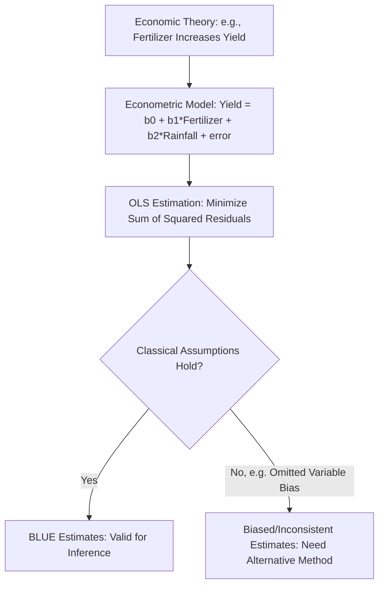

## Introduction to Econometrics

### Definition and Conceptual Foundations

**Econometrics** is the application of statistical and mathematical methods to economic data with the goal of testing economic theories, estimating economic relationships, and evaluating policy interventions. In agricultural economics, econometrics is the primary empirical toolkit used to quantify relationships such as the effect of fertilizer on yield, the price responsiveness of food demand, the impact of a subsidy program on farm income, or the determinants of technology adoption — translating the theoretical models covered elsewhere (production functions, consumer demand, cost curves) into estimable, testable relationships using real-world farm and market data.

Econometrics integrates three disciplines: economic theory (which relationships to specify and expect), mathematics (functional forms and optimization, see: calculus for optimization problems and linear algebra and matrix methods), and statistics (inference and uncertainty quantification, see: descriptive statistics and inference, and probability theory and distributions).

### The Econometric Model

A typical econometric model specifies a relationship between a **dependent variable** (the outcome being explained, e.g., crop yield) and one or more **independent (explanatory) variables** (factors expected to influence the outcome, e.g., fertilizer, rainfall, labor):

$$Y_i = \beta_0 + \beta_1 X_{1i} + \beta_2 X_{2i} + \cdots + \beta_k X_{ki} + \varepsilon_i$$

- $\beta_0$: the **intercept**, representing the expected value of $Y$ when all explanatory variables equal zero.
- $\beta_1, \ldots, \beta_k$: **coefficients**, representing the estimated marginal effect of each explanatory variable on $Y$, holding other variables constant.
- $\varepsilon_i$: the **error term**, capturing all factors affecting $Y$ not explicitly included in the model (measurement error, omitted variables, inherent randomness).

**Key Points**

- The error term is a critical and often underappreciated component: it reflects the reality that no economic model perfectly captures all determinants of an outcome, and much of econometric methodology is concerned with ensuring the error term behaves in ways (see below) that permit valid inference about the coefficients of interest.

### Ordinary Least Squares (OLS) Estimation

**Ordinary Least Squares (OLS)** is the foundational estimation method in econometrics, chosen to minimize the sum of squared differences between observed and predicted values of the dependent variable:

$$\min_{\hat{\beta}} \sum_{i=1}^n (Y_i - \hat{Y}_i)^2$$

In matrix notation (see: linear algebra and matrix methods), the OLS estimator is:

$$\hat{\boldsymbol{\beta}} = (X^TX)^{-1}X^T\mathbf{Y}$$

**The Gauss-Markov Theorem** establishes that, under a specific set of assumptions (detailed below), the OLS estimator is the **Best Linear Unbiased Estimator (BLUE)** — meaning it has the lowest variance among all linear unbiased estimators of the coefficients.

### Classical OLS Assumptions

For OLS estimates to be unbiased and efficient (BLUE), several assumptions must hold:

1. **Linearity**: The model is linear in parameters (though variables themselves can be transformed, e.g., logged).
2. **Random sampling**: The data represent a random sample from the population of interest (e.g., a representative sample of farms, not a self-selected group).
3. **No perfect multicollinearity**: No explanatory variable is a perfect linear function of others (see: linear algebra and matrix methods — invertibility of $X^TX$).
4. **Zero conditional mean (exogeneity)**: $E(\varepsilon_i \mid X_i) = 0$ — the error term is uncorrelated with the explanatory variables, meaning no systematic relationship exists between unobserved factors and the included regressors.
5. **Homoskedasticity**: The variance of the error term is constant across all observations, $\text{Var}(\varepsilon_i) = \sigma^2$.
6. **No autocorrelation**: Error terms are uncorrelated across observations (particularly relevant for time-series agricultural price or yield data).
7. **Normality of errors** (needed specifically for small-sample hypothesis testing, though large-sample inference can rely on the Central Limit Theorem instead).

**Key Points**

- Assumption 4 (exogeneity/zero conditional mean) is typically the most consequential and most frequently violated assumption in applied agricultural economics — for example, farmers who choose to apply more fertilizer may also differ systematically in unobserved managerial skill, soil quality, or access to credit, all of which are captured in the error term and correlated with fertilizer use, biasing the estimated fertilizer coefficient (a case of **omitted variable bias**).

### Threats to Valid Causal Inference

**Omitted Variable Bias**

Occurs when a variable that affects both the dependent variable and an included explanatory variable is left out of the model, causing the estimated coefficient on the included variable to capture both its true effect and the confounding influence of the omitted factor. Classic agricultural example: estimating the effect of fertilizer on yield without controlling for soil quality, when farmers with better soil may also apply more fertilizer.

**Reverse Causality (Simultaneity)**

Occurs when the dependent variable also causally affects an explanatory variable, rather than (or in addition to) the reverse. Example: higher farm income may enable greater fertilizer purchases (income → fertilizer), while fertilizer also raises yield and thus income (fertilizer → income), creating a simultaneous relationship that a simple OLS regression of income on fertilizer cannot cleanly disentangle.

**Measurement Error**

Imprecisely measured variables (common in farm surveys relying on farmer recall of input quantities or self-reported yields) can bias coefficient estimates, typically (though not universally) biasing them toward zero when the error is in an explanatory variable (**attenuation bias**).

**Selection Bias**

Occurs when the sample analyzed is not representative of the population of interest due to a non-random selection process — e.g., evaluating a voluntary extension program using only farmers who chose to participate, when those farmers may differ systematically (in motivation, resources, or ability) from non-participants.

### Common Remedies and Extensions

**Multiple Regression with Control Variables**

Including additional relevant explanatory variables (e.g., soil quality indices, farmer education, access to irrigation) to reduce omitted variable bias, though this remedy is limited to *observable* confounders that can be measured and included.

**Instrumental Variables (IV) Estimation**

Addresses endogeneity (omitted variables, reverse causality, or measurement error) by using an **instrument** — a variable correlated with the endogenous explanatory variable but uncorrelated with the error term (affecting the outcome only through its effect on the explanatory variable). For example, rainfall shocks have been used as instruments for agricultural income in some studies, since rainfall plausibly affects income primarily through its effect on agricultural production rather than through other unobserved channels. *[Inference: the validity of any specific instrument depends on context-specific arguments about the exclusion restriction, and is a matter that must be justified and often contested in each individual application rather than assumed generically.]*

**Difference-in-Differences (DiD)**

Compares the change in outcomes over time between a group affected by a policy or program (treatment group) and a comparable unaffected group (control group), controlling for time-invariant differences between groups and common time trends. Widely used to evaluate agricultural policy interventions (e.g., comparing yield changes before and after a subsidy program's rollout between adopting and non-adopting regions).

$$\hat{\delta}_{DiD} = (\bar{Y}^{treat}_{after} - \bar{Y}^{treat}_{before}) - (\bar{Y}^{control}_{after} - \bar{Y}^{control}_{before})$$

**Randomized Controlled Trials (RCTs)**

Randomly assign farmers or plots to treatment (e.g., receiving a new seed variety, fertilizer subsidy, or training program) and control groups, ensuring that, on average, treatment and control groups are comparable in both observed and unobserved characteristics, allowing the estimated treatment effect to be interpreted causally. RCTs have become increasingly prominent in agricultural development economics research since the 2000s. *[Inference: while RCTs address many identification concerns effectively within their study context, questions of external validity — whether results generalize to other regions, crops, or scaled-up implementation — remain an active and debated methodological consideration in the literature.]*

**Panel Data Methods (Fixed Effects)**

When the same farms or households are observed over multiple time periods, **fixed effects models** can control for all time-invariant unobserved farm characteristics (e.g., inherent soil quality or managerial ability that does not change over the study period), isolating the effect of variables that do change over time (e.g., fertilizer application rates from year to year).

### Model Specification and Functional Form

Agricultural econometric models frequently use transformed variables to better capture economic relationships:

- **Log-linear models**: $\ln(Y) = \beta_0 + \beta_1 X + \varepsilon$, where $\beta_1$ approximates the percentage change in $Y$ for a one-unit change in $X$.
- **Log-log models**: $\ln(Y) = \beta_0 + \beta_1\ln(X) + \varepsilon$, where $\beta_1$ is directly interpretable as an **elasticity** — the percentage change in $Y$ for a 1% change in $X$, a specification frequently used to estimate demand elasticities or production function parameters (see: theory of the firm and production functions — Cobb-Douglas form).
- **Quadratic terms**: Including $X^2$ alongside $X$ allows for non-linear relationships, such as diminishing (or eventually negative) marginal returns to fertilizer application, consistent with the law of diminishing marginal returns.

### Diagnostic Testing

Applied econometric practice typically involves testing whether classical assumptions hold and addressing violations found:

- **Heteroskedasticity tests** (e.g., the Breusch-Pagan test): Detect non-constant error variance, common in cross-sectional farm data where larger farms may exhibit greater absolute variability in outcomes; addressed using robust standard errors.
- **Multicollinearity diagnostics** (e.g., the Variance Inflation Factor, VIF): Detect high correlation among explanatory variables that can inflate standard errors and make individual coefficients difficult to estimate precisely.
- **Autocorrelation tests** (e.g., the Durbin-Watson statistic): Detect correlated error terms in time-series data, relevant for analyzing agricultural price or yield series over time.
- **Specification tests** (e.g., the RESET test): Assess whether the chosen functional form adequately captures the true underlying relationship.

### Applications Summary in Agricultural Economics

| Research Question | Typical Econometric Approach |
| --- | --- |
| Effect of fertilizer on yield | Multiple regression with control variables; production function estimation |
| Price elasticity of food demand | Log-log regression using time-series or cross-sectional price/quantity data |
| Impact of a subsidy program on income | Difference-in-differences or randomized controlled trial |
| Determinants of technology adoption | Binary choice models (probit/logit) with farmer/farm characteristics |
| Farm technical efficiency | Stochastic frontier analysis (an extension of production function estimation) |
| Effect of weather shocks on production | Panel fixed-effects models using multi-year farm/regional data |

### Related Topics

- Descriptive statistics and inference
- Probability theory and distributions
- Linear algebra and matrix methods
- Theory of the firm and production functions (production function estimation)
- Impact evaluation methods: randomized controlled trials and quasi-experimental designs
- Technical efficiency and stochastic frontier analysis in farm studies