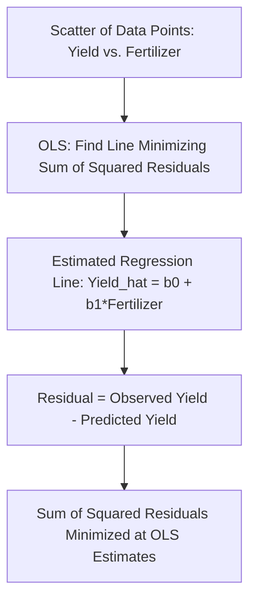

## Regression Analysis Fundamentals

### Definition and Conceptual Foundations

**Regression analysis** is the statistical technique for estimating the relationship between a dependent variable and one or more independent (explanatory) variables. While closely related to and overlapping with econometrics (see: introduction to econometrics), this topic focuses specifically on the mechanics, interpretation, and practical application of regression models — the workhorse empirical tool for quantifying relationships such as yield response to inputs, price effects on demand, and factors driving farm income in agricultural economics.

### Simple Linear Regression

The simplest regression model relates a dependent variable $Y$ to a single explanatory variable $X$:

$$Y_i = \beta_0 + \beta_1 X_i + \varepsilon_i$$

- $\beta_0$ (intercept): the predicted value of $Y$ when $X = 0$.
- $\beta_1$ (slope coefficient): the estimated change in $Y$ for a one-unit increase in $X$, holding all else constant.
- $\varepsilon_i$: the error term, capturing the portion of $Y$ not explained by $X$.

**Example**

A researcher regresses rice yield (tons/hectare) on nitrogen fertilizer application (kg/hectare) using data from 100 farm plots, obtaining:

$$\widehat{Yield} = 2.1 + 0.015 \times Fertilizer$$

This estimated equation indicates that, on average, each additional kilogram of nitrogen fertilizer per hectare is associated with a 0.015-ton increase in yield per hectare, holding other factors constant within the model's scope. The intercept (2.1 tons/hectare) represents the predicted yield when no fertilizer is applied, though this extrapolation should be interpreted cautiously if the sample data does not include observations near zero fertilizer use.

### Multiple Linear Regression

**Multiple regression** extends the model to include several explanatory variables simultaneously, allowing the analyst to estimate the effect of one variable while **holding others constant** — a critical feature for isolating the specific contribution of, say, fertilizer from other factors like rainfall or labor that also affect yield:

$$Y_i = \beta_0 + \beta_1X_{1i} + \beta_2X_{2i} + \beta_3X_{3i} + \cdots + \varepsilon_i$$

**Key Points**

- Each coefficient $\beta_k$ in a multiple regression represents the **partial effect** of $X_k$ on $Y$, controlling for all other included variables — a distinctly different (and generally more useful for causal interpretation) quantity than the simple correlation between $X_k$ and $Y$ alone, which would not account for confounding from the other variables.
- Adding relevant control variables is one of the primary tools for addressing **omitted variable bias** (see: introduction to econometrics), though it can only control for variables that are actually observed and included in the dataset.

### Estimation via Ordinary Least Squares

Regression coefficients are typically estimated via **Ordinary Least Squares (OLS)**, which selects the coefficient values that minimize the sum of squared residuals (the squared differences between observed and predicted values of $Y$):

$$\min_{\hat{\beta}_0, \hat{\beta}_1} \sum_{i=1}^{n} \left(Y_i - \hat{\beta}_0 - \hat{\beta}_1 X_i\right)^2$$

The closed-form solutions for simple linear regression are:

$$\hat{\beta}_1 = \frac{\sum(X_i - \bar{X})(Y_i - \bar{Y})}{\sum(X_i - \bar{X})^2}, \qquad \hat{\beta}_0 = \bar{Y} - \hat{\beta}_1\bar{X}$$

For multiple regression, the matrix form $\hat{\boldsymbol{\beta}} = (X^TX)^{-1}X^T\mathbf{Y}$ (see: linear algebra and matrix methods) generalizes this estimation to any number of explanatory variables.

Below is an SVG illustrating a simple regression fit with residuals shown for a sample of data points.

<svg xmlns="http://www.w3.org/2000/svg" viewBox="0 0 600 460" font-family="Arial, sans-serif">
<text x="300" y="30" font-size="18" font-weight="bold" text-anchor="middle">Simple Linear Regression: Yield vs. Fertilizer (svg_diagram)</text>
<line x1="80" y1="400" x2="80" y2="60" stroke="black" stroke-width="2" />
<line x1="80" y1="400" x2="540" y2="400" stroke="black" stroke-width="2" />
<polygon points="80,55 75,68 85,68" fill="black" />
<polygon points="545,400 532,395 532,405" fill="black" />

<text x="40" y="230" font-size="14" text-anchor="middle" transform="rotate(-90 40 230)">Yield (tons/ha)</text>

<text x="310" y="435" font-size="14" text-anchor="middle">Fertilizer (kg/ha)</text>

<line x1="100" y1="360" x2="500" y2="130" stroke="#1565C0" stroke-width="2.5" />
<text x="420" y="160" font-size="12" fill="#1565C0">Fitted Line: Y_hat = b0 + b1*X</text>

<circle cx="150" cy="330" r="5" fill="#C62828" />
<line x1="150" y1="330" x2="150" y2="345" stroke="#9E9E9E" stroke-width="1" stroke-dasharray="3" />
<circle cx="230" cy="250" r="5" fill="#C62828" />
<line x1="230" y1="250" x2="230" y2="275" stroke="#9E9E9E" stroke-width="1" stroke-dasharray="3" />
<circle cx="310" cy="245" r="5" fill="#C62828" />
<line x1="310" y1="230" x2="310" y2="245" stroke="#9E9E9E" stroke-width="1" stroke-dasharray="3" />
<circle cx="390" cy="180" r="5" fill="#C62828" />
<line x1="390" y1="180" x2="390" y2="195" stroke="#9E9E9E" stroke-width="1" stroke-dasharray="3" />
<circle cx="450" cy="160" r="5" fill="#C62828" />
<line x1="450" y1="145" x2="450" y2="160" stroke="#9E9E9E" stroke-width="1" stroke-dasharray="3" />

<text x="70" y="415" font-size="12" text-anchor="end">0</text>

</svg>

### Goodness of Fit: R-squared

**R-squared ($R^2$)** measures the proportion of total variation in the dependent variable explained by the regression model:

$$R^2 = 1 - \frac{SSR}{SST} = \frac{SSE}{SST}$$

where $SST$ (total sum of squares) measures total variation in $Y$, $SSE$ (explained sum of squares) measures variation explained by the model, and $SSR$ (residual sum of squares) measures unexplained variation. $R^2$ ranges from 0 (model explains none of the variation) to 1 (model explains all variation).

**Adjusted R-squared** modifies $R^2$ to penalize the inclusion of additional explanatory variables that do not meaningfully improve model fit, addressing the mechanical property that ordinary $R^2$ never decreases when more variables are added, regardless of their relevance:

$$\bar{R}^2 = 1 - (1-R^2)\frac{n-1}{n-k-1}$$

**Key Points**

- A high $R^2$ indicates the model explains a large share of variation in the sample, but does **not** by itself establish that the estimated relationships are causal, correctly specified, or generalizable beyond the sample — a common point of confusion. A model can have a high $R^2$ while still suffering from omitted variable bias or other specification problems (see: introduction to econometrics).
- In agricultural economics applications with substantial inherent biological and weather-driven variability (e.g., plot-level yield data), $R^2$ values considerably lower than in some other economic domains are commonly observed and do not necessarily indicate a poorly specified model. *[Inference: acceptable $R^2$ benchmarks are highly context- and data-type-dependent (e.g., cross-sectional farm survey data typically exhibits lower $R^2$ than aggregated time-series data), so no single universal threshold for a "good" $R^2$ applies across all agricultural applications.]*

### Statistical Significance of Coefficients

Each estimated coefficient is accompanied by a **standard error**, used to construct a **t-statistic** testing whether the coefficient differs significantly from zero (the typical null hypothesis of "no effect"):

$$t = \frac{\hat{\beta}_k}{SE(\hat{\beta}_k)}$$

The associated **p-value** indicates the probability of observing a coefficient this large (in absolute value) if the true effect were actually zero. Coefficients with p-values below a chosen threshold (conventionally 0.05) are typically described as **statistically significant**.

**Key Points**

- A regression's overall significance can also be tested via the **F-test**, which assesses whether the explanatory variables *jointly* explain a statistically significant share of variation in the dependent variable, distinct from testing each coefficient individually.
- As emphasized in econometric methodology more broadly, statistical significance should always be interpreted alongside **economic significance** (the practical magnitude of the estimated effect) — a coefficient can be statistically significant yet economically negligible, or vice versa in cases of limited statistical power.

### Dummy (Indicator) Variables

**Dummy variables** encode categorical information (e.g., region, crop type, gender of farm household head, or program participation status) into a regression model using binary (0/1) coding:

$$Y_i = \beta_0 + \beta_1 X_i + \beta_2 D_i + \varepsilon_i$$

where $D_i = 1$ if a farm belongs to a particular category (e.g., participated in an extension program) and $D_i = 0$ otherwise. The coefficient $\beta_2$ represents the estimated difference in the dependent variable's average level between the two categories, holding $X_i$ constant.

**Interaction terms** ($X_i \times D_i$) allow the *slope* of the relationship between $X$ and $Y$ to differ across categories, useful for testing whether, for example, the yield response to fertilizer differs between irrigated and rain-fed plots.

### Common Regression Extensions Relevant to Agricultural Data

- **Log-transformed models**: Used to estimate elasticities directly and to address right-skewness common in agricultural income, price, and farm-size data (see: introduction to econometrics — log-log specification).
- **Polynomial (quadratic) terms**: Capture non-linear relationships, such as diminishing or eventually negative marginal returns to fertilizer application, consistent with the law of diminishing marginal returns (see: theory of the firm and production functions).
- **Binary choice models (probit/logit)**: Used when the dependent variable itself is binary (e.g., whether a farmer adopts a new technology), rather than continuous — ordinary linear regression is generally inappropriate for binary outcomes since it can predict probabilities outside the [0,1] range.
- **Panel/fixed-effects regression**: Used with data observed across multiple farms and multiple time periods, controlling for time-invariant unobserved farm characteristics (see: introduction to econometrics).

### Regression Diagnostics and Common Pitfalls

- **Multicollinearity**: Highly correlated explanatory variables (e.g., total farm size and cultivated area) can inflate standard errors, making it difficult to precisely estimate individual coefficients even if the overall model fits well.
- **Heteroskedasticity**: Non-constant error variance across observations (common when comparing very small and very large farms in the same sample) does not bias coefficient estimates themselves but can produce incorrect standard errors and invalid hypothesis tests unless addressed (e.g., via robust standard errors).
- **Outliers and influential observations**: A small number of extreme data points (e.g., an unusually large commercial farm within a sample of mostly smallholders) can disproportionately influence estimated coefficients, warranting diagnostic checks such as examining leverage and studentized residuals.
- **Extrapolation beyond the data range**: Regression predictions become increasingly unreliable when applied to values of explanatory variables well outside the range observed in the original data (e.g., predicting yield at fertilizer application rates far exceeding those in the sample).

### Applications Summary in Agricultural Economics

| Application | Typical Regression Specification |
| --- | --- |
| Yield response to fertilizer | Simple or quadratic regression of yield on fertilizer, controlling for rainfall/soil |
| Price elasticity of demand | Log-log regression of quantity demanded on price and income |
| Effect of irrigation access | Multiple regression with irrigation as a dummy variable |
| Technology adoption determinants | Logit/probit regression on farmer/farm characteristics |
| Program impact evaluation | Regression with treatment dummy, potentially combined with difference-in-differences |
| Farm income determinants | Multiple regression with land, labor, capital, and household characteristics |

### Related Topics

- Introduction to econometrics
- Descriptive statistics and inference
- Linear algebra and matrix methods
- Probability theory and distributions
- Theory of the firm and production functions (production function estimation)
- Impact evaluation methods: randomized controlled trials and quasi-experimental designs