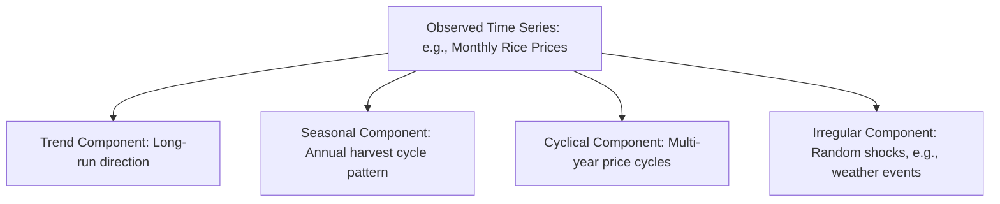
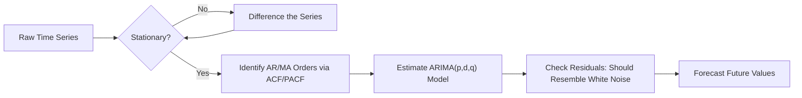

## Time Series Methods

### Definition and Conceptual Foundations

**Time series analysis** examines data observed sequentially over time — such as monthly rice prices, annual crop yields, or quarterly agricultural export volumes — with methods specifically designed to account for the temporal dependence between observations. Unlike cross-sectional data (where observations are typically assumed independent), time series data usually exhibit **autocorrelation**: the value of a variable in one period is related to its value in previous periods, requiring specialized statistical techniques distinct from the standard cross-sectional regression methods covered in regression analysis fundamentals.

Time series methods are central to agricultural economics for forecasting commodity prices, analyzing seasonal production patterns, modeling price volatility, and evaluating the dynamic effects of policy changes over time.

### Components of a Time Series

A time series is typically decomposed into several underlying components:

- **Trend**: The long-run, gradual movement in the series over time (e.g., a persistent upward trend in rice yields due to technology adoption over decades).
- **Seasonality**: Regular, predictable fluctuations tied to a fixed calendar cycle (e.g., agricultural commodity prices that consistently rise before harvest season and fall immediately after, reflecting the annual production cycle).
- **Cyclical component**: Longer-term fluctuations not tied to a fixed calendar period, often related to broader business cycles or multi-year agricultural price cycles (see: history of agricultural economic thought — the cobweb model).
- **Irregular (random) component**: Unpredictable, short-term fluctuations not explained by trend, seasonality, or cycles (e.g., a sudden price spike due to an unexpected weather shock or trade disruption).

$$Y_t = T_t + S_t + C_t + I_t \quad \text{(additive decomposition)}$$

$$Y_t = T_t \times S_t \times C_t \times I_t \quad \text{(multiplicative decomposition)}$$

**Key Points**

- Multiplicative decomposition is often more appropriate for agricultural price and production series where seasonal fluctuations scale with the overall level of the series (e.g., seasonal price swings are proportionally larger when the general price level is higher), while additive decomposition assumes seasonal effects are constant in absolute magnitude regardless of the series' level.

### Stationarity

A time series is **stationary** if its statistical properties (mean, variance, autocorrelation structure) do not change over time. Stationarity is a foundational requirement for many classical time series models, since a non-stationary series (e.g., one with a persistent trend) can produce misleading or **spurious regression** results when analyzed using standard techniques designed for stationary data.

- **Weak (covariance) stationarity**: Constant mean, constant variance, and autocovariance depending only on the time lag between observations, not on the specific time period itself.
- **Unit root**: A key form of non-stationarity, where shocks to the series have a permanent effect rather than dying out over time (a "random walk" pattern), commonly tested using the **Augmented Dickey-Fuller (ADF) test**.
- **Differencing**: A common transformation to induce stationarity in a non-stationary series, computing the change between consecutive periods, $\Delta Y_t = Y_t - Y_{t-1}$, rather than analyzing the level series directly.

**Key Points**

- Many agricultural commodity price series exhibit non-stationary behavior (e.g., a unit root or stochastic trend), particularly over long time horizons affected by structural changes in technology, trade policy, and global market integration, making stationarity testing an important preliminary step before applying standard time series regression techniques. **[Inference]** The specific stationarity properties of any given agricultural price or yield series should be tested empirically rather than assumed, as they vary by commodity, market, and time period studied.

### Autocorrelation and Partial Autocorrelation

**Autocorrelation** measures the correlation between a time series and a lagged version of itself:

$$\rho_k = \text{Corr}(Y_t, Y_{t-k})$$

The **autocorrelation function (ACF)** plots $\rho_k$ across different lags $k$, revealing patterns such as seasonality (spikes at seasonal lags, e.g., lag 12 for monthly data with annual seasonality) or persistence (slowly declining autocorrelation indicating a trending or non-stationary series).

The **partial autocorrelation function (PACF)** measures the correlation between $Y_t$ and $Y_{t-k}$ after removing the influence of the intervening lags, useful for identifying the appropriate order of autoregressive models.

### Autoregressive (AR) and Moving Average (MA) Models

**Autoregressive Model, AR(p)**

Models the current value of a series as a linear function of its own past values:

$$Y_t = c + \phi_1 Y_{t-1} + \phi_2 Y_{t-2} + \cdots + \phi_p Y_{t-p} + \varepsilon_t$$

**Moving Average Model, MA(q)**

Models the current value as a linear function of past forecast errors (shocks):

$$Y_t = \mu + \varepsilon_t + \theta_1\varepsilon_{t-1} + \cdots + \theta_q\varepsilon_{t-q}$$

**ARMA and ARIMA Models**

Combining autoregressive and moving average components yields an **ARMA(p,q)** model. When applied to a differenced (non-stationary) series to achieve stationarity, the resulting model is termed **ARIMA(p,d,q)**, where $d$ is the number of differencing operations applied — a widely used family of models developed by Box and Jenkins for time series forecasting, including agricultural price and production forecasting applications.

**Key Points**

- The **Box-Jenkins methodology** provides a systematic approach to ARIMA model building: identifying appropriate $p$, $d$, $q$ orders using ACF/PACF patterns, estimating model parameters, and validating the model through residual diagnostic checks (residuals should resemble white noise if the model is well-specified).

### Seasonal Time Series Models

Agricultural time series frequently exhibit strong seasonality tied to planting and harvest cycles. **SARIMA (Seasonal ARIMA)** models extend the ARIMA framework to explicitly incorporate seasonal autoregressive and moving average terms alongside the standard (non-seasonal) components, appropriate for series such as monthly agricultural commodity prices with a clear annual seasonal pattern.

### Volatility Modeling: ARCH and GARCH

Agricultural commodity prices frequently exhibit **volatility clustering** — periods of high price volatility tend to be followed by continued high volatility, and calm periods tend to persist, rather than volatility being constant over time (violating the homoskedasticity assumption common in standard regression, see: introduction to econometrics).

**Autoregressive Conditional Heteroskedasticity (ARCH)** and its generalization **GARCH (Generalized ARCH)** models explicitly model the time-varying variance of a series:

$$\sigma_t^2 = \omega + \alpha \varepsilon_{t-1}^2 + \beta \sigma_{t-1}^2 \quad \text{(GARCH(1,1))}$$

**Agricultural relevance**: GARCH-family models are used to analyze and forecast agricultural commodity price volatility, informing risk management decisions, crop insurance pricing, and the design of price stabilization or hedging instruments, since periods of elevated volatility carry distinct risk-management implications for farmers, traders, and policymakers relative to calmer periods, even if the average price level is unchanged.

### Vector Autoregression (VAR) and Multi-Series Analysis

When multiple related time series interact dynamically — for example, rice prices, corn prices, and fertilizer prices, which may influence one another over time — a **Vector Autoregression (VAR)** model treats each series as a function of its own past values *and* the past values of the other related series:

$$\mathbf{Y}_t = \mathbf{c} + A_1\mathbf{Y}_{t-1} + A_2\mathbf{Y}_{t-2} + \cdots + A_p\mathbf{Y}_{t-p} + \boldsymbol{\varepsilon}_t$$

**Granger causality tests**, commonly applied within a VAR framework, assess whether past values of one series help predict another series beyond what the second series' own past values already explain — a statistical (predictive) rather than strictly philosophical notion of causality, frequently used to examine, for example, whether changes in fertilizer prices "Granger-cause" changes in farm input use, or whether international commodity prices Granger-cause domestic agricultural prices.

### Cointegration

Two or more non-stationary time series are said to be **cointegrated** if a linear combination of them is stationary, implying a stable long-run equilibrium relationship even though the individual series wander over time. **Error Correction Models (ECM)** are used to jointly model both the long-run cointegrating relationship and short-run dynamic adjustments toward that equilibrium.

**Agricultural relevance**: Cointegration analysis is frequently applied to examine long-run price transmission relationships — for example, testing whether domestic rice prices and international rice prices move together in a stable long-run relationship despite short-run deviations, informing analysis of market integration and the effectiveness of price transmission across different segments of an agricultural supply chain (e.g., farm-gate to wholesale to retail prices).

### Applications in Agricultural Economics

| Application | Typical Time Series Method |
| --- | --- |
| Commodity price forecasting | ARIMA/SARIMA models |
| Price volatility analysis and risk management | ARCH/GARCH models |
| Multi-market price relationships | VAR models and Granger causality tests |
| Long-run market integration analysis | Cointegration and error correction models |
| Seasonal harvest-cycle price patterns | Seasonal decomposition, SARIMA |
| Impact of policy changes over time | Intervention analysis within a time series framework |

### Related Topics

- Introduction to econometrics
- Descriptive statistics and inference
- Probability theory and distributions
- Agricultural price cycles and the cobweb model
- Risk management and crop insurance in agriculture
- Market structures: perfect competition, monopoly, oligopoly, monopsony (price transmission and market integration)