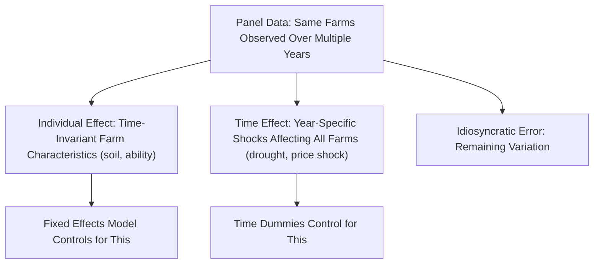
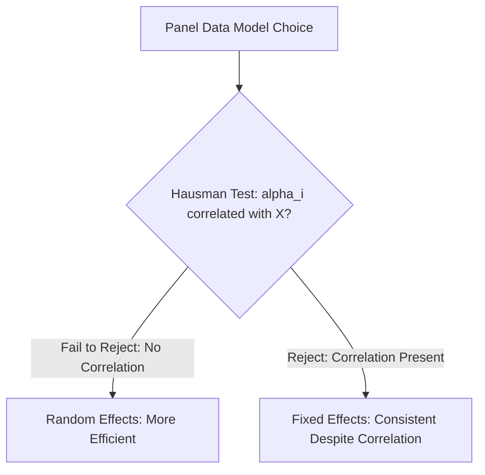

## Panel Data Methods

### Definition and Conceptual Foundations

**Panel data** (also called longitudinal data) combines both cross-sectional and time-series dimensions, observing the same units — such as the same set of farms, households, or regions — repeatedly over multiple time periods. This structure ($N$ units observed over $T$ periods, denoted $Y_{it}$ for unit $i$ at time $t$) offers substantial advantages over pure cross-sectional or pure time-series data for agricultural economics research, particularly its ability to control for unobserved, time-invariant differences across farms that would otherwise bias estimates in a single cross-section (see: introduction to econometrics — omitted variable bias).

### Why Panel Data Matters for Agricultural Economics

Agricultural outcomes are shaped by many farm-specific factors that are difficult or impossible to measure directly — inherent soil quality, managerial ability, local microclimate, or social network access — yet these factors are often correlated with the explanatory variables of interest (e.g., a more skilled farmer may both apply fertilizer more effectively *and* achieve higher yield independent of the fertilizer's own effect). A single cross-sectional survey cannot separate these unobserved factors from the true causal effect of interest. Panel data, by observing the *same* farms over time, allows researchers to control for anything about each farm that does not change over the observation period.

**Key Points**

- Panel data is especially valuable in agricultural economics because many important unobserved confounders (soil quality, farmer ability, land quality) are plausibly time-invariant over the relatively short panels typical of agricultural surveys (a few years to a decade), making the fixed-effects approach (below) particularly well-suited to this domain.
- Panel data also enables analysis of dynamics — how farms adjust behavior over time in response to policy changes, price shocks, or technology introduction — which cross-sectional data cannot capture.

### The Panel Data Model

A general panel data model is written as:

$$Y_{it} = \beta_0 + \beta_1 X_{it} + \alpha_i + \lambda_t + \varepsilon_{it}$$

- $\alpha_i$: an **individual (unit) effect**, capturing all time-invariant unobserved characteristics specific to unit $i$ (e.g., a farm's inherent soil quality or a farmer's fixed managerial skill).
- $\lambda_t$: a **time effect**, capturing factors common to all units in a given period but varying over time (e.g., a nationwide drought, or a change in global commodity prices affecting all farms simultaneously).
- $\varepsilon_{it}$: the idiosyncratic error term, varying across both units and time.

### Pooled OLS: The Naive Baseline

The simplest approach to panel data, **pooled OLS**, ignores the panel structure entirely and treats all observations (across both units and time) as an ordinary cross-section, estimating a single set of coefficients using all available data:

$$Y_{it} = \beta_0 + \beta_1 X_{it} + u_{it}$$

**Key Points**

- Pooled OLS is only valid if the unobserved individual effect $\alpha_i$ is either absent or uncorrelated with the explanatory variables — an assumption frequently violated in agricultural applications (e.g., if farms with better inherent soil quality also systematically apply more fertilizer), making pooled OLS estimates potentially biased in exactly the situations where panel data's advantages would otherwise be most valuable.

### Fixed Effects (Within) Estimation

The **fixed effects model** treats $\alpha_i$ as a fixed, unit-specific parameter to be controlled for (rather than estimated directly), effectively removing all time-invariant unobserved heterogeneity from the estimation. This is most commonly implemented via the **within transformation**, which subtracts each unit's mean (across time) from its observations:

$$(Y_{it} - \bar{Y}_i) = \beta_1(X_{it} - \bar{X}_i) + (\varepsilon_{it} - \bar{\varepsilon}_i)$$

Because $\alpha_i$ is constant over time for each unit, it is differenced out entirely, and $\beta_1$ is estimated using only the *within-unit variation* over time — effectively asking, "when this specific farm's fertilizer use changed from one year to the next, how did its yield change?" rather than comparing fertilizer use *across* different farms.

**Key Points**

- Fixed effects estimation controls for **all** time-invariant confounders, whether observed or unobserved — a substantial advantage over cross-sectional regression, which can only control for confounders the researcher explicitly measures and includes.
- A critical limitation: fixed effects models cannot estimate the effect of any variable that does *not* vary over time within a unit (e.g., a farm's fixed total land area if it never changes during the panel, or a time-invariant characteristic like the region a farm is located in), since such variables are also differenced out along with $\alpha_i$.
- Fixed effects estimation relies on **within-unit variation**; if an explanatory variable changes very little over time for most units in the sample (e.g., fertilizer application rates that are fairly stable year to year for individual farms), the fixed effects estimate can be imprecise (large standard errors) even with a large overall sample size.

### Random Effects Estimation

The **random effects model** treats $\alpha_i$ as a random variable, drawn from a probability distribution, rather than as a fixed parameter to control away — assuming $\alpha_i$ is **uncorrelated** with the explanatory variables:

$$Y_{it} = \beta_0 + \beta_1 X_{it} + \alpha_i + \varepsilon_{it}, \quad \alpha_i \sim \text{i.i.d.}(0, \sigma_\alpha^2)$$

Random effects estimation is more statistically efficient than fixed effects (it uses both within-unit and between-unit variation) and, unlike fixed effects, *can* estimate the effects of time-invariant variables (e.g., region, gender of household head) — but only remains unbiased if the key assumption of no correlation between $\alpha_i$ and the explanatory variables holds.

### The Hausman Test: Choosing Between Fixed and Random Effects

The **Hausman test** provides a formal statistical procedure for choosing between fixed and random effects specifications, testing the null hypothesis that the random effects assumption (no correlation between $\alpha_i$ and the regressors) holds:

- If the null hypothesis is **not rejected**, random effects is preferred (more efficient, and valid under the maintained assumption).
- If the null hypothesis **is rejected**, fixed effects is preferred, since random effects would be biased and inconsistent under this circumstance, while fixed effects remains valid regardless.

**Key Points**

- **[Inference]** In applied agricultural economics research, fixed effects models are frequently favored by default over random effects specifically because the assumption of no correlation between unobserved farm characteristics (soil quality, managerial ability) and key explanatory variables (input use decisions) is often considered implausible on economic grounds, even before formal Hausman testing is conducted, though the test remains standard practice to formally justify this choice.

### Difference-in-Differences as a Panel Application

**Difference-in-differences (DiD)** designs (introduced in introduction to econometrics) are a special case of panel/fixed-effects methodology, commonly used to evaluate agricultural policy interventions with a natural treatment and control group structure across two or more time periods:

$$Y_{it} = \beta_0 + \beta_1 Treat_i + \beta_2 Post_t + \beta_3(Treat_i \times Post_t) + \varepsilon_{it}$$

where $\beta_3$, the coefficient on the interaction term, captures the estimated causal effect of the treatment (e.g., a subsidy program's introduction) under the **parallel trends assumption**: that, absent treatment, the treatment and control groups would have followed similar trends over time.

**Example**

A researcher evaluates an irrigation infrastructure program using panel data on 200 farms observed over 5 years, with the program rolled out to 100 "treatment" farms in year 3. Using a fixed-effects DiD specification, the researcher controls for each farm's time-invariant characteristics (fixed effects) and for common shocks affecting all farms in a given year (time effects), isolating the program's effect from both persistent cross-farm differences and economy-wide shocks (e.g., a national drought affecting all farms in a given year regardless of program participation).

### Dynamic Panel Data Models

When a panel model includes the **lagged dependent variable** as an explanatory variable (e.g., modeling current yield as a function of past yield plus current inputs, to capture persistence or adjustment dynamics), standard fixed-effects estimation becomes biased in short panels (a problem known as **Nickell bias**), because the within-transformation induces a mechanical correlation between the transformed lagged dependent variable and the transformed error term.

**Generalized Method of Moments (GMM) estimators** — notably the **Arellano-Bond** and related **Blundell-Bond (system GMM)** estimators — are standard solutions to this problem, using appropriately lagged levels or differences of variables as instruments to obtain consistent estimates in dynamic panel settings. **[Inference]** These dynamic panel GMM methods are technically demanding and sensitive to instrument choice and specification, and their appropriate application in specific agricultural panel datasets (e.g., with limited time periods) is a matter requiring careful econometric judgment rather than routine default application.

### Advantages and Limitations of Panel Data Summarized

| Aspect | Advantage | Limitation |
| --- | --- | --- |
| Unobserved heterogeneity | Fixed effects control for all time-invariant confounders | Cannot estimate effects of time-invariant variables |
| Sample size / statistical power | More observations ($N \times T$) than a single cross-section | Requires tracking the same units over time (attrition risk) |
| Dynamics | Can study behavior change and adjustment over time | Dynamic panel models require specialized (GMM) estimators |
| Data collection | — | More costly and logistically complex than a single cross-sectional survey; farm/household attrition between survey rounds is a common practical challenge in agricultural panel datasets |

### Applications in Agricultural Economics

- **Technology adoption and productivity impacts**: Tracking the same farms before and after adopting a new seed variety, irrigation technology, or farming practice, controlling for persistent farm-level differences.
- **Policy impact evaluation**: Evaluating subsidy programs, extension services, or land reform initiatives using multi-year panel surveys of the same farm households.
- **Climate and weather shock analysis**: Using panel variation in weather realizations across years for the same farms/regions to estimate the causal effect of rainfall or temperature shocks on yield and income, since this approach can control for time-invariant regional characteristics that a purely cross-sectional comparison across regions could not.
- **Farm household dynamics**: Studying how household composition, land access, or off-farm income opportunities evolve over time and affect farm production decisions.

### Related Topics

- Introduction to econometrics
- Time series methods
- Regression analysis fundamentals
- Impact evaluation methods: randomized controlled trials and quasi-experimental designs
- Descriptive statistics and inference
- Technical efficiency and stochastic frontier analysis in farm studies