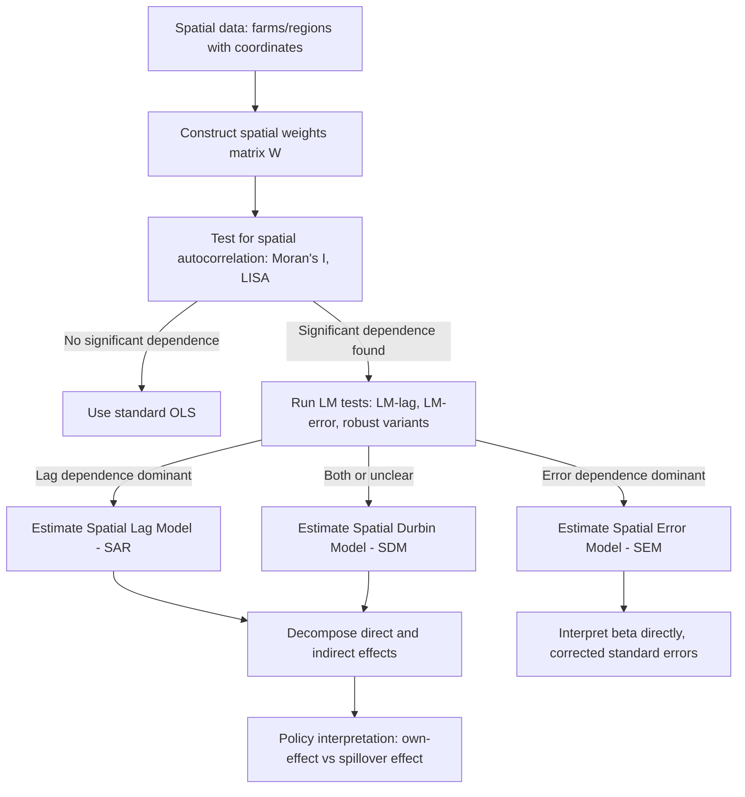

## Spatial Econometrics


### Definition and Scope

Spatial econometrics is the branch of econometrics concerned with modeling data that carry a location dimension, where observations tied to nearby units tend to influence each other. In agricultural economics, this arises naturally: farm yields, land values, adoption of technology, and price transmission across markets are all influenced by geographic proximity, shared climate, common infrastructure, and spillovers between neighboring plots or regions.

Standard OLS regression assumes independent observations. When spatial dependence exists but is ignored, estimates become biased, inefficient, or both, and inference (standard errors, hypothesis tests) becomes invalid. Spatial econometrics provides the tools to detect, model, and correct for this dependence.

### Why Spatial Dependence Matters in Agricultural Economics

**Key Points**

- Agro-climatic conditions (rainfall, soil quality, temperature) are spatially correlated, so nearby farms share unobserved shocks.
- Technology adoption (e.g., improved seed varieties, irrigation methods) spreads through farmer networks and imitation, creating spillovers between neighboring farms.
- Land prices reflect not only a parcel's own characteristics but also those of surrounding parcels (proximity to markets, roads, water sources).
- Pest and disease outbreaks spread spatially, meaning yield shocks in one region affect adjacent regions.
- Market integration studies examine how price shocks in one market transmit to spatially connected markets.

Two distinct sources of spatial dependence are typically distinguished:

1. **Spatial dependence (substantive/true)** — actual interaction or spillover between units (e.g., a farmer's adoption decision genuinely depends on neighbors' adoption).
2. **Spatial heterogeneity / nuisance dependence** — dependence arising because of shared but unmeasured factors (e.g., unobserved soil quality that is spatially clustered), which shows up as correlated errors rather than genuine interaction.

### The Spatial Weights Matrix

Central to all spatial econometric models is the **spatial weights matrix** $W$, an $n \times n$ matrix encoding the "neighbor" relationship between $n$ spatial units (farms, districts, provinces).

$$W_{ij} = \begin{cases} w_{ij} & \text{if } i \neq j \text{ and } i, j \text{ are neighbors} \\ 0 & \text{otherwise} \end{cases}$$

By convention, the diagonal is set to zero ($W_{ii} = 0$): a unit is not its own neighbor.

Common specifications of $W$:

- **Contiguity-based**: $w_{ij} = 1$ if regions $i$ and $j$ share a border (rook contiguity, sharing an edge) or share a border/vertex (queen contiguity).
- **Distance-based**: $w_{ij} = 1/d_{ij}^\alpha$ for units within a threshold distance, or an inverse-distance decay for all pairs.
- **k-Nearest Neighbors (k-NN)**: each unit is connected to its $k$ closest units, useful when unit density is uneven (e.g., farms clustered near roads vs. sparse rural areas).
- **Economic/social distance**: weights based on trade flow volume, transportation cost, or market linkage rather than pure geography — relevant for agricultural market integration studies.

$W$ is almost always **row-standardized**, so each row sums to 1:

$$w_{ij}^{std} = \frac{w_{ij}}{\sum_j w_{ij}}$$

This makes $Wy$ interpretable as the (weighted) average outcome of a unit's neighbors, which simplifies coefficient interpretation.

**Choice of $W$ is a modeling decision, not a data-driven estimate** — different reasonable choices of $W$ can produce different substantive conclusions. Robustness checks across multiple weight specifications are standard practice. [Inference: the "correct" $W$ is rarely known with certainty in applied agricultural economics settings; sensitivity analysis is recommended.]

### Testing for Spatial Dependence

Before modeling, researchers test whether spatial dependence is present at all.

#### Moran's I

The most widely used global test statistic for spatial autocorrelation:

$$I = \frac{n}{\sum_i \sum_j w_{ij}} \cdot \frac{\sum_i \sum_j w_{ij}(x_i - \bar{x})(x_j - \bar{x})}{\sum_i (x_i - \bar{x})^2}$$

- $I > 0$ indicates positive spatial autocorrelation (similar values cluster together — e.g., high-yield farms near other high-yield farms).
- $I < 0$ indicates negative spatial autocorrelation (dissimilar values cluster — a checkerboard pattern).
- $I \approx -1/(n-1)$ indicates no spatial autocorrelation (the expected value under the null).

Significance is assessed via a z-test against the expected value under spatial randomness, or via permutation-based inference.

#### Local Indicators of Spatial Association (LISA)

Moran's I is global; **LISA** statistics (Anselin, 1995) decompose spatial autocorrelation unit-by-unit, identifying local clusters:

- **High-High**: a high-value unit surrounded by high-value neighbors (e.g., a cluster of high-productivity farming districts).
- **Low-Low**: a low-value unit surrounded by low-value neighbors.
- **High-Low / Low-High**: spatial outliers.

LISA maps are commonly used in agricultural economics to visually identify "hotspots" of yield, poverty, or adoption rates.

#### Lagrange Multiplier (LM) Tests

Once dependence is confirmed, LM tests (Anselin, Florax) help discriminate between competing model specifications:

- **LM-lag** and **robust LM-lag** test for a spatially lagged dependent variable.
- **LM-error** and **robust LM-error** test for spatially correlated error terms.

The decision rule (informally, the "Anselin-Florax" rule of thumb): if only one of the robust LM tests is significant, that indicates the appropriate model; if both are significant, the one with the larger test statistic is typically preferred, though this heuristic has known limitations. [Inference: this classical testing-based specification search has been increasingly supplemented or replaced by Bayesian model comparison and general nesting model approaches in contemporary practice.]

### Core Model Specifications

#### Spatial Lag Model (SAR / Spatial Autoregressive Model)

Models spillovers in the **outcome variable** itself — a farm's yield depends directly on neighboring farms' yields.

$$y = \rho W y + X\beta + \varepsilon$$

- $\rho$: spatial autoregressive coefficient, capturing the strength of the outcome spillover.
- $Wy$: the spatially lagged dependent variable (weighted average of neighbors' outcomes).
- Interpretation: a shock to one unit propagates through the system via a **global multiplier effect**, since $y = (I - \rho W)^{-1}(X\beta + \varepsilon)$.

This is appropriate when the theoretical mechanism is genuine interdependence — e.g., technology adoption spreading through observed neighbor behavior, or price co-movement between spatially linked markets.

#### Spatial Error Model (SEM)

Models spillovers through **unobserved, spatially correlated shocks** rather than the outcome variable directly.

$$y = X\beta + u, \qquad u = \lambda W u + \varepsilon$$

- $\lambda$: spatial error coefficient.
- Appropriate when spatial dependence reflects nuisance factors — e.g., unmeasured soil quality or microclimate that is spatially clustered but not itself a behavioral spillover.
- OLS point estimates of $\beta$ remain unbiased under pure spatial error dependence, but standard errors are incorrect without correction.

#### Spatial Durbin Model (SDM)

A general specification nesting both the lag structure and spatially lagged explanatory variables:

$$y = \rho W y + X\beta + WX\theta + \varepsilon$$

- Includes both the spatial lag of $y$ and spatial lags of the regressors $X$.
- Allows testing whether the simpler SAR or SEM models are valid restrictions (SDM reduces to SAR if $\theta = 0$, and to SEM under a specific parameter restriction — the "common factor" restriction — linking $\theta$ and $\beta$).
- Frequently recommended as a general starting specification in contemporary spatial econometrics practice (LeSage & Pace, 2009), since it avoids ex-ante commitment to a narrower functional form.

#### Spatial Durbin Error Model (SDEM) and General Nesting Spatial Model (GNS)

- **SDEM**: adds $WX$ to the spatial error model.
- **GNS**: the most general form, nesting SAR, SEM, SDM, and SDEM as special cases, though rarely used directly in practice due to identification and interpretability challenges.

#### Summary Comparison Table

| Model | Lag in $y$ | Lag in $X$ | Lag in error | Typical agri-econ use case |
| --- | --- | --- | --- | --- |
| OLS | No | No | No | Baseline, no spatial structure |
| SAR | Yes | No | No | Yield/price spillovers between adjacent farms/markets |
| SEM | No | No | Yes | Unobserved spatially clustered shocks (soil, microclimate) |
| SDM | Yes | Yes | No | General spillovers in outcomes and neighbor characteristics |
| SDEM | No | Yes | Yes | Neighbor characteristics matter, errors spatially clustered |
| GNS | Yes | Yes | Yes | Fully general (rarely estimated directly) |

### Estimation Methods

**Maximum Likelihood (ML)**: the standard estimator for SAR/SEM/SDM in small-to-moderate samples. Because of the $(I - \rho W)^{-1}$ term, the log-likelihood includes a Jacobian term that must be computed, historically a computational bottleneck for large $n$ but now efficiently handled via sparse matrix methods.

**Generalized Method of Moments (GMM)**: an alternative to ML, often more computationally tractable for large datasets, and does not require a normality assumption on errors (Kelejian & Prucha).

**Instrumental Variables (IV/2SLS)**: since $Wy$ is endogenous (correlated with $\varepsilon$), spatial lags of $X$ ($WX$, $W^2X$, ...) are natural instruments.

**Bayesian MCMC estimation**: commonly used for SDM and large spatial panels, particularly convenient for computing the marginal effects decomposition below (LeSage & Pace popularized this approach).

**Key Points**

- OLS on a spatial-lag model is biased and inconsistent because $Wy$ is correlated with the error term (simultaneity).
- OLS on a spatial-error model remains unbiased for $\beta$ but gives incorrect standard errors.
- ML/GMM/Bayesian estimation correct for these issues; the choice among them depends on sample size, panel structure, and desired inference framework.

### Interpreting Coefficients: Direct, Indirect, and Total Effects

A critical and frequently misunderstood aspect of spatial lag models (SAR, SDM): **raw coefficients cannot be interpreted like OLS coefficients**, because a change in one unit's $X$ propagates through $(I-\rho W)^{-1}$ to affect all other units.

LeSage and Pace (2009) formalize the decomposition:

$$\frac{\partial y}{\partial x_k} = (I - \rho W)^{-1}(I\beta_k + W\theta_k)$$

- **Direct effect**: the average impact of a unit's own $X$ on its own $y$ (includes feedback loops through neighbors and back).
- **Indirect effect (spillover effect)**: the average impact of a change in one unit's $X$ on the outcomes of *all other* units.
- **Total effect**: the sum of direct and indirect effects.

**Example**

In a study of irrigation infrastructure and rice yield across districts, the direct effect might show that a district's own irrigation investment raises its yield by 0.3 units, while the indirect effect shows that neighboring districts' irrigation investment (through shared water table effects or knowledge spillovers) raises a given district's yield by an additional 0.15 units on average — a total effect of 0.45. Reporting only the raw $\beta$ coefficient would understate the full policy-relevant impact of a irrigation investment program.

### Spatial Panel Data Models

Agricultural economics frequently involves panel data (repeated observations across farms/regions over time), motivating **spatial panel models** that combine spatial dependence with fixed or random effects:

$$y_{it} = \rho \sum_j w_{ij} y_{jt} + X_{it}\beta + \mu_i + \varepsilon_{it}$$

- $\mu_i$: unit-specific fixed or random effects, controlling for time-invariant unobserved heterogeneity (e.g., persistent soil quality differences across districts).
- Fixed-effects spatial panels are estimated via a within-transformation adapted for the spatial structure; random-effects versions use GLS-type transformations.
- **Spatial Durbin panel models** are common in cross-country or cross-region agricultural productivity and land-use studies, since they allow testing which restricted specification (SAR/SEM) is appropriate while also controlling for unobserved heterogeneity.

### Geographically Weighted Regression (GWR)

A related but conceptually distinct technique: rather than assuming a **global** spatial dependence parameter ($\rho$ or $\lambda$ constant across the whole sample), **GWR** allows coefficients to vary spatially:

$$y_i = \beta_{0}(u_i, v_i) + \sum_k \beta_k(u_i, v_i) x_{ik} + \varepsilon_i$$

where $(u_i, v_i)$ are the coordinates of unit $i$, and each $\beta_k$ is estimated locally using a kernel-weighted regression centered on that location.

- Useful in agricultural economics for detecting **spatial non-stationarity** — e.g., the effect of fertilizer use on yield may differ substantially between a semi-arid region and a high-rainfall region, and GWR estimates region-specific coefficients rather than a single average effect.
- Distinct from SAR/SEM: GWR addresses **heterogeneity** in relationships, while SAR/SEM address **dependence** in levels or errors. The two are complementary, not substitutes, and a full analysis sometimes combines both (e.g., Geographically Weighted Panel Regression, or mixed GWR-spatial-error specifications).

### Illustrative Diagram: Spatial Dependence Modeling Workflow



### Illustration: Contiguity-Based Neighbor Structure (svg_diagram)

<svg xmlns="http://www.w3.org/2000/svg" viewBox="0 0 480 260">
<text x="240" y="24" text-anchor="middle" font-size="15" font-weight="bold" fill="#222">Rook Contiguity Weights Matrix (svg_diagram)</text>

<g stroke="#333" stroke-width="1.5" fill="#eaf4ea">
<rect x="60" y="60" width="80" height="80" />
<rect x="140" y="60" width="80" height="80" fill="#cfe8cf" />
<rect x="220" y="60" width="80" height="80" />
<rect x="60" y="140" width="80" height="80" fill="#cfe8cf" />
<rect x="140" y="140" width="80" height="80" fill="#8fc98f" />
<rect x="220" y="140" width="80" height="80" fill="#cfe8cf" />
<rect x="60" y="220" width="80" height="60" />
<rect x="140" y="220" width="80" height="60" fill="#cfe8cf" />
<rect x="220" y="220" width="80" height="60" />
</g>

<text x="100" y="105" text-anchor="middle" font-size="12">A</text>

<text x="180" y="105" text-anchor="middle" font-size="12">B</text>

<text x="260" y="105" text-anchor="middle" font-size="12">C</text>

<text x="100" y="185" text-anchor="middle" font-size="12">D</text>

<text x="180" y="185" text-anchor="middle" font-size="12">E (region i)</text>

<text x="260" y="185" text-anchor="middle" font-size="12">F</text>

<text x="345" y="90" font-size="12" fill="#333">Dark = region i</text>

<text x="345" y="110" font-size="12" fill="#333">Medium = neighbors</text>

<text x="345" y="130" font-size="12" fill="#333">(share an edge with i)</text>

<text x="345" y="150" font-size="12" fill="#333">Light = non-neighbors</text>

<text x="240" y="255" text-anchor="middle" font-size="12" fill="#333">w(E,B)=w(E,D)=w(E,F)=1; w(E,A)=w(E,C)=0 (row-standardized: each = 1/4)</text>

</svg>

### Practical Software Implementation

**Key Points**

- **R**: `spdep` (weights construction, Moran's I, LM tests), `spatialreg` (SAR/SEM/SDM ML and GMM estimation), `splm` (spatial panel models), `GWmodel` (geographically weighted regression).
- **Python**: `PySAL` / `spreg` submodule (comprehensive spatial regression suite), `libpysal` (weights construction), `esda` (exploratory spatial data analysis, Moran's I, LISA), `mgwr` (multiscale GWR).
- **Stata**: `spregress`, `spivregress`, and the `sppack` suite (native commands since Stata 15/16).

**Example**

A minimal PySAL-based workflow for testing and estimating a spatial lag model on farm-level yield data:

```python
import libpysal as lps
from esda.moran import Moran
from spreg import ML_Lag

# Construct queen contiguity weights and row-standardize
w = lps.weights.Queen.from_dataframe(gdf)
w.transform = 'r'

# Test global spatial autocorrelation in yield residuals
moran = Moran(y, w)
print(moran.I, moran.p_sim)

# Estimate spatial lag model
model = ML_Lag(y, X, w=w, name_y='yield', name_x=['fertilizer', 'irrigation', 'rainfall'])
print(model.summary)
```

[Unverified: exact function signatures and default arguments may differ across `spreg` versions; consult current package documentation before production use.]

### Applications Specific to Agricultural Economics

1. **Land value / hedonic pricing models**: parcel prices depend on neighboring land use, proximity to irrigation infrastructure, and regional zoning — classic SDM application.
2. **Technology and input adoption diffusion**: modeling how adoption of hybrid seeds, precision agriculture, or conservation tillage spreads spatially through farmer networks and demonstration effects.
3. **Agricultural market integration**: testing whether price shocks in one wholesale market transmit to spatially or economically linked markets (using trade-flow-based $W$ rather than pure geographic distance).
4. **Yield risk and climate spillovers**: modeling how drought or flood shocks in one agro-ecological zone correlate with output in neighboring zones through shared water systems or pest migration.
5. **Land-use change and deforestation**: spatial panel models examining how deforestation or land conversion in one district is correlated with conversion in adjacent districts (agricultural frontier expansion).
6. **Rural poverty and agricultural income convergence**: LISA cluster maps identifying persistent poverty "hotspots" tied to agro-climatic disadvantage.

### Common Pitfalls

- **Ignoring spatial dependence entirely**, leading to inflated Type I error rates in significance testing.
- **Mechanically choosing $W$** without theoretical justification, then over-interpreting results as robust when they are sensitive to the weights specification.
- **Interpreting SAR coefficients as OLS-style marginal effects** without the direct/indirect effect decomposition, leading to incorrect policy conclusions about the magnitude of spillovers.
- **Confusing spatial heterogeneity (GWR's domain) with spatial dependence (SAR/SEM's domain)** — applying the wrong tool to the wrong problem.
- **Endogeneity from omitted spatially-correlated variables** can masquerade as spatial error dependence, so spatial diagnostics do not substitute for careful theoretical model specification.

### Related Topics

- Exploratory Spatial Data Analysis (ESDA) and LISA cluster mapping
- Spatial panel data econometrics (fixed vs. random effects with spatial lags)
- Geographically Weighted Regression (GWR) and Multiscale GWR (MGWR)
- Spatial econometrics of technology diffusion and network effects
- Hedonic pricing models for agricultural land valuation
- Market integration and price transmission analysis
- Remote sensing and GIS data integration with econometric models
- Bayesian spatial hierarchical models for agricultural risk assessment
- Spatiotemporal models for climate-yield relationships