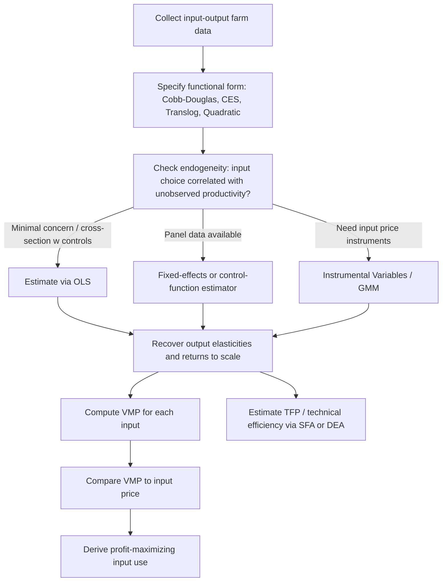

## Production Functions and Factor Productivity

### Definition and Conceptual Foundation

A production function describes the technical relationship between quantities of inputs (factors of production) and the maximum quantity of output obtainable from them, given the state of technology. In agricultural economics, the standard form is:

$$Q = f(L, K, M, N, ...)$$

where $Q$ is output (e.g., crop yield in kg/ha or total farm output), and inputs commonly include $L$ (labor), $K$ (capital, including machinery), $M$ (materials such as fertilizer and seed), and $N$ (land). The function $f(\cdot)$ represents the current technology and encodes the maximum output technically achievable from a given input bundle — it is a **technical**, not economic, relationship, though it underlies all subsequent economic optimization (cost minimization, profit maximization).

Agricultural production functions have distinctive features relative to general microeconomic treatments:

- **Land** is treated as a distinct, often fixed, factor of production rather than folded into capital.
- **Biological and climatic constraints** introduce diminishing returns more sharply and predictably than in many industrial processes (e.g., excess fertilizer eventually depresses yield — a phenomenon not typically seen with generic capital inputs).
- **Stochastic elements** (weather, pests, disease) mean realized output is often modeled as $Q = f(X)\cdot \varepsilon$ or $Q = f(X) + \varepsilon$, distinguishing "frontier" (best-practice) production functions from average ones.

### The Three Stages of Production

For a single variable input (holding others fixed), the short-run production function exhibits three classical stages, central to agricultural resource-use decisions:

- **Stage I**: Marginal Product (MP) exceeds Average Product (AP), both rising or MP above AP — the input is under-utilized relative to fixed factors (e.g., too little labor per hectare of land).
- **Stage II**: MP is positive but declining, and MP < AP — this is the **economically rational** range of production; all profit-maximizing input use occurs here.
- **Stage III**: MP becomes negative — total output declines with further input use (e.g., overcrowding of labor, or excessive irrigation causing waterlogging).

$$MP_L = \frac{\partial Q}{\partial L}, \qquad AP_L = \frac{Q}{L}$$

A rational farm operator never knowingly operates in Stage III (negative marginal returns) or Stage I (where average product is still rising, implying underuse of the variable input relative to fixed factors) if unconstrained; Stage II is the theoretically efficient operating range. [Inference: in practice, farmers may operate outside Stage II due to credit constraints, risk aversion, information gaps, or the difficulty of finely adjusting fixed factors like land, so the three-stage framework should be understood as a benchmark rather than a description of universal observed behavior.]

### Illustration: Three Stages of Production (svg_diagram)

<svg xmlns="http://www.w3.org/2000/svg" viewBox="0 0 520 320">
<text x="260" y="22" text-anchor="middle" font-size="15" font-weight="bold" fill="#222">Total, Average, and Marginal Product Curves (svg_diagram)</text>

<line x1="60" y1="280" x2="480" y2="280" stroke="#333" stroke-width="1.5" />
<line x1="60" y1="280" x2="60" y2="40" stroke="#333" stroke-width="1.5" />
<text x="480" y="298" font-size="12">Variable Input (X)</text>
<text x="30" y="45" font-size="12">Output</text>

<path d="M 60 280 C 150 220, 200 90, 280 70 C 340 60, 400 90, 440 140" stroke="#2c6e2c" stroke-width="2.5" fill="none" />
<text x="445" y="140" font-size="12" fill="#2c6e2c">TP</text>

<path d="M 60 280 C 140 200, 230 170, 320 175 C 380 178, 420 195, 450 220" stroke="#2255aa" stroke-width="2" fill="none" />
<text x="455" y="222" font-size="12" fill="#2255aa">AP</text>

<path d="M 60 280 C 120 150, 180 100, 230 100 C 280 100, 340 190, 400 260 C 420 280, 440 290, 460 300" stroke="#aa3322" stroke-width="2" fill="none" />
<text x="463" y="300" font-size="12" fill="#aa3322">MP</text>

<line x1="205" y1="40" x2="205" y2="280" stroke="#888" stroke-dasharray="4,3" />
<line x1="340" y1="40" x2="340" y2="280" stroke="#888" stroke-dasharray="4,3" />

<text x="130" y="60" font-size="12" fill="#555">Stage I</text>

<text x="265" y="60" font-size="12" fill="#555">Stage II</text>

<text x="400" y="60" font-size="12" fill="#555">Stage III</text>

</svg>

### Marginal Product, Average Product, and the Law of Diminishing Returns

The **Law of Diminishing Marginal Returns** states that as successive units of a variable input are added to fixed quantities of other inputs, the marginal product of the variable input eventually declines. This is a near-universal empirical regularity in agricultural production (e.g., successive units of nitrogen fertilizer yield progressively smaller output increases, holding land and other inputs fixed) and underlies the concavity typically imposed on agricultural production function specifications.

Relationship between TP, AP, and MP:

- $MP > AP \Rightarrow AP$ is rising.
- $MP < AP \Rightarrow AP$ is falling.
- $MP = AP$ at the maximum point of the AP curve.
- $MP = 0$ at the maximum point of the TP curve.

### Common Functional Forms

#### Cobb-Douglas Production Function

The most widely used specification in applied agricultural production economics due to its analytical tractability and direct elasticity interpretation:

$$Q = A \, L^{\alpha} K^{\beta} M^{\gamma}$$

Taking logs linearizes it for estimation:

$$\ln Q = \ln A + \alpha \ln L + \beta \ln K + \gamma \ln M + \varepsilon$$

- $A$: total factor productivity (TFP), capturing technology, management quality, and factors not explicitly modeled.
- Exponents ($\alpha, \beta, \gamma$) are directly interpretable as **output elasticities**: a 1% increase in $L$ raises $Q$ by $\alpha$%, holding other inputs fixed.
- **Returns to scale**: if $\alpha + \beta + \gamma = 1$, constant returns to scale (CRS); $> 1$, increasing returns to scale (IRS); $< 1$, decreasing returns to scale (DRS).
- **Limitation**: imposes a constant elasticity of substitution equal to 1 between every pair of inputs, and constant output elasticities regardless of input levels — restrictive assumptions that may not hold across the full range of agricultural input use.

#### Constant Elasticity of Substitution (CES) Production Function

Relaxes the unitary substitution elasticity assumption:

$$Q = A\left[\delta K^{-\rho} + (1-\delta) L^{-\rho}\right]^{-\nu/\rho}$$

- The elasticity of substitution $\sigma = 1/(1+\rho)$ is constant but not necessarily equal to 1, allowing inputs to be more or less substitutable than the Cobb-Douglas case implies.
- Nests Cobb-Douglas ($\sigma = 1$), Leontief/fixed-proportions ($\sigma = 0$), and linear/perfect-substitutes ($\sigma \to \infty$) as special cases.

#### Translog (Transcendental Logarithmic) Production Function

A flexible functional form that does not impose constant elasticities or constant substitution elasticities, making it a second-order approximation to any underlying technology:

$$\ln Q = \ln A + \sum_i \beta_i \ln X_i + \frac{1}{2}\sum_i \sum_j \gamma_{ij} \ln X_i \ln X_j + \varepsilon$$

- Widely used in agricultural productivity and efficiency studies because it permits input-specific and non-constant elasticities and readily nests Cobb-Douglas as a restricted special case ($\gamma_{ij} = 0$ for all $i,j$).
- **Trade-off**: greater flexibility comes at the cost of more parameters to estimate, higher multicollinearity risk among the interaction terms, and less direct interpretability.

#### Quadratic and Polynomial Forms

Common in fertilizer response and agronomic yield studies, since they naturally capture the rising-then-declining output response characteristic of biological input-yield relationships:

$$Q = a + bX - cX^2$$

This form directly generates the three-stage TP/MP/AP structure and yields a straightforward closed-form solution for the profit-maximizing input level (see below).

#### Leontief (Fixed-Proportions) Production Function

$$Q = \min\left(\frac{L}{a}, \frac{K}{b}\right)$$

Used where inputs must be combined in fixed ratios with no substitution possible — relevant for certain mechanized operations or precise agronomic input recipes (e.g., specific seed-to-fertilizer ratios in some cropping systems), though rarely realistic as a description of whole-farm technology.

### Summary Comparison of Functional Forms

| Form | Elasticity of substitution | Returns to scale flexibility | Typical agri-econ use |
| --- | --- | --- | --- |
| Cobb-Douglas | Fixed at 1 | Single global parameter (sum of exponents) | Cross-farm productivity comparisons, TFP estimation |
| CES | Fixed, not necessarily 1 | Adjustable via scale parameter | Input substitution studies (e.g., labor vs. machinery) |
| Translog | Variable, non-constant | Fully flexible, varies by input level | Efficiency and multi-input productivity analysis |
| Quadratic | N/A (single-input focus) | N/A | Fertilizer/pesticide response functions |
| Leontief | Zero (no substitution) | Constant by construction | Fixed-recipe input systems |

### Marginal Productivity Theory and Optimal Input Use

Profit maximization requires equating the **value of the marginal product (VMP)** of each input to its price:

$$VMP_X = P_Q \times MP_X = P_X$$

where $P_Q$ is output price and $P_X$ is input price. Rearranging gives the profit-maximizing input level.

**Example**

Suppose a quadratic yield response function for nitrogen fertilizer is estimated as:

$$Q = 2000 + 40N - 0.2N^2 \quad (\text{kg maize/ha, } N \text{ in kg/ha})$$

With maize price $P_Q = \$0.30/\text{kg}$ and nitrogen price $P_N = \$1.20/\text{kg}$:

$$MP_N = 40 - 0.4N$$

$$VMP_N = 0.30(40 - 0.4N) = 12 - 0.12N$$

Setting $VMP_N = P_N$:

$$12 - 0.12N = 1.20 \implies N^* = 90 \text{ kg/ha}$$

At $N^* = 90$, predicted yield is $Q = 2000 + 40(90) - 0.2(90)^2 = 2000 + 3600 - 1620 = 3980$ kg/ha. This is the economically optimal fertilizer rate — distinct from the agronomically "maximum yield" rate (which occurs where $MP_N = 0$, i.e., $N = 100$), illustrating that economic optimization generally stops short of the technical yield-maximizing point once input costs are taken into account.

### Factor Productivity Measures

#### Average Physical Product and Partial Factor Productivity

**Partial factor productivity (PFP)** measures output per unit of a single input, holding others unmeasured:

$$PFP_L = \frac{Q}{L}$$

Common agricultural examples: yield per hectare (land productivity), output per labor-hour (labor productivity), output per unit of irrigation water applied (water productivity). PFP is simple to compute and communicate but can be misleading when it changes due to substitution toward or away from other inputs rather than genuine efficiency gains (e.g., labor productivity can rise simply because mechanization substituted capital for labor, without any underlying technological improvement).

#### Total Factor Productivity (TFP)

**TFP** accounts for all measured inputs simultaneously, typically expressed as a ratio of an output index to a weighted input index:

$$TFP = \frac{Q}{w_L L + w_K K + w_M M + ...}$$

where weights $w_i$ are usually cost shares. Growth in TFP over time is interpreted as growth in output not explained by growth in measured inputs — i.e., technological change, improved management, or efficiency gains.

**Growth accounting decomposition** (commonly applied to agricultural TFP growth studies):

$$\dot{Q}/Q = \sum_i s_i (\dot{X_i}/X_i) + \dot{A}/A$$

where $s_i$ are input cost shares and $\dot{A}/A$ (the Solow residual) captures TFP growth.

#### Marginal Rate of Technical Substitution (MRTS)

Along an isoquant, the MRTS measures the rate at which one input can be substituted for another while holding output constant:

$$MRTS_{LK} = -\frac{dK}{dL}\Big|_{Q=\bar{Q}} = \frac{MP_L}{MP_K}$$

Cost-minimizing input combinations occur where MRTS equals the input price ratio:

$$\frac{MP_L}{MP_K} = \frac{P_L}{P_K}$$

This condition underlies farm-level decisions such as substituting hired labor for mechanization (or vice versa) as relative wage and machinery costs change.

### Returns to Scale versus Diminishing Marginal Returns

A frequently confused distinction:

- **Diminishing marginal returns** concerns the response of output to changes in **one** input, holding others fixed (a short-run, partial concept).
- **Returns to scale** concerns the response of output to **proportional changes in all inputs simultaneously** (a long-run concept).

A production function can simultaneously exhibit diminishing marginal returns to each individual input while still displaying constant or even increasing returns to scale overall — these are not contradictory properties.

### Estimation Approaches and Endogeneity Concerns

**Key Points**

- OLS estimation of production functions faces a well-documented **simultaneity/endogeneity problem**: input choices (e.g., fertilizer, labor) are typically correlated with unobserved productivity shocks (farmer skill, soil quality) that also affect output, biasing OLS coefficient estimates.
- **Fixed-effects panel methods** control for time-invariant unobserved heterogeneity (e.g., persistent farm-level management quality) but cannot address time-varying endogeneity.
- **Instrumental variable (IV) approaches** use variables correlated with input use but uncorrelated with the productivity shock (e.g., input prices, distance to input markets).
- **Semi-parametric control-function methods** (Olley-Pakes, Levinsohn-Petrin, Ackerberg-Caves-Frazer) use proxy variables (typically investment or intermediate input demand) to control for unobserved productivity, and are widely used in the broader productivity estimation literature, including agricultural applications with panel data on individual farms or firms.
- **Stochastic frontier analysis (SFA)** decomposes the error term into a symmetric noise component and a one-sided inefficiency component, distinguishing technical inefficiency from pure statistical noise — a widely used approach in farm-level efficiency studies specifically because it separates "how far below best practice" a farm operates from random shocks like weather.

$$\ln Q = \ln f(X;\beta) + v - u, \qquad u \geq 0$$

where $v$ is standard statistical noise and $u \geq 0$ represents technical inefficiency, allowing computation of a **technical efficiency score** $TE = e^{-u} \in (0,1]$ for each farm.

### Illustrative Diagram: Production Function Analysis Workflow

### Data Envelopment Analysis (DEA) as a Complementary Approach

Unlike parametric SFA, **DEA** is a non-parametric linear-programming technique that constructs a "best-practice frontier" directly from observed input-output data without assuming a specific functional form:

$$\max_{\theta} \theta \quad \text{s.t.} \quad \theta Q_0 \leq \sum_j \lambda_j Q_j, \quad \sum_j \lambda_j X_j \leq X_0, \quad \lambda_j \geq 0$$

- Advantage: no functional-form assumption imposed on the technology.
- Disadvantage: deterministic (no noise term), so measurement error or luck (e.g., an unusually good weather year) can be misattributed entirely to efficiency, and the technique is sensitive to outliers.
- SFA and DEA are frequently used side-by-side in farm efficiency studies as complementary robustness checks, since each makes different trade-offs between functional-form flexibility and noise-handling.

### Applications in Agricultural Economics

1. **Fertilizer and input response research**: estimating optimal application rates via marginal product and VMP analysis (as illustrated above).
2. **Farm efficiency benchmarking**: SFA/DEA studies ranking farms by technical efficiency to identify management best practices and extension targeting priorities.
3. **Total Factor Productivity growth measurement**: tracking agricultural TFP growth over time to assess the impact of technology adoption, extension programs, or infrastructure investment.
4. **Land and labor productivity comparisons**: cross-country or cross-region studies of yield per hectare and output per worker, informing agricultural development policy.
5. **Economies of scale analysis**: determining whether consolidation of smallholder farms into larger operations would yield productivity gains (returns-to-scale estimation).
6. **Input substitution studies**: estimating MRTS and elasticity of substitution to predict how farms respond to changing relative prices of labor, machinery, and other inputs (e.g., mechanization responses to rising rural wages).
7. **Climate-adjusted production functions**: incorporating weather variables (rainfall, temperature, growing degree days) directly into the production function to separate technology-driven productivity from climate-driven yield variation.

### Common Pitfalls

- **Confusing technical and economic optimality**: the yield-maximizing input level ($MP=0$) is not the profit-maximizing level (where $VMP = P_X$); agronomic recommendations based purely on maximum yield can lead to farmer over-application relative to economically rational rates.
- **Ignoring endogeneity in input choice**: OLS estimates of Cobb-Douglas or translog production functions are often biased upward on inputs correlated with unobserved managerial ability or soil quality, unless addressed via panel methods, IV, or control functions.
- **Over-relying on partial factor productivity metrics**, which can shift due to input substitution rather than true efficiency change.
- **Applying Cobb-Douglas indiscriminately** when the true elasticity of substitution is far from 1 (e.g., in production systems where inputs are strong complements or strong substitutes), leading to misleading policy implications about the effects of input price changes.
- **Treating DEA efficiency scores as free of measurement error**, when in fact weather shocks or data quality issues can be misclassified as inefficiency in a purely deterministic frontier framework.

### Related Topics

- Cost functions and duality theory (dual relationship between production and cost functions)
- Stochastic frontier analysis and technical efficiency measurement
- Data Envelopment Analysis and Malmquist productivity indices
- Total factor productivity growth accounting
- Risk and uncertainty in agricultural production (mean-variance and expected utility frameworks)
- Farm household production models and separability
- Technology adoption and diffusion in agriculture
- Economies of scale and farm size productivity relationships
- Panel data econometrics for production analysis (fixed effects, control functions)