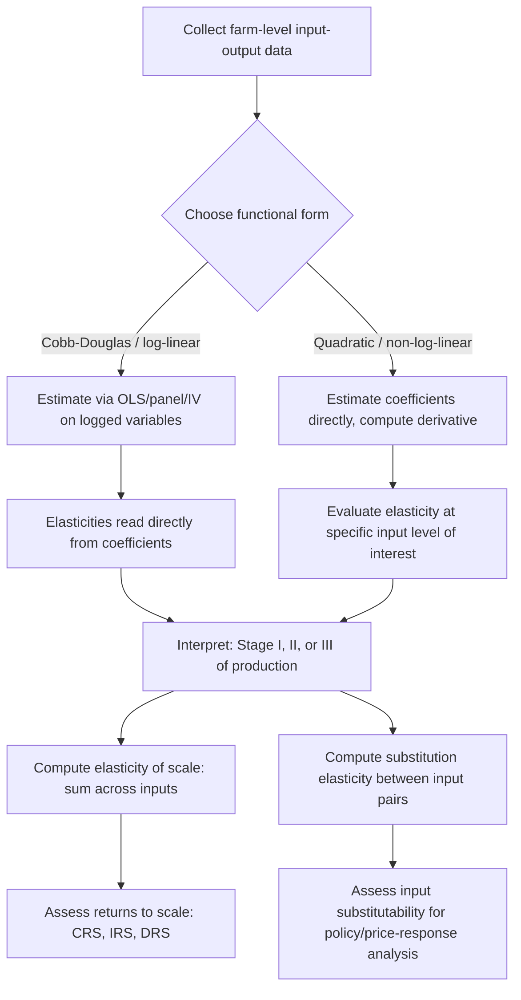

## Input-Output Relationships and Elasticities

### Definition and Conceptual Foundation

Input-output relationships describe how changes in the quantity of productive inputs translate into changes in output within a production process. **Elasticities** quantify these relationships in dimensionless, scale-free terms — the percentage response of one variable to a 1% change in another — making them comparable across farms, regions, crops, and studies regardless of the underlying units of measurement (kg, hectares, labor-hours, currency).

In agricultural economics, elasticity concepts are the primary analytical bridge between the technical production function and economic decision-making: they tell a policymaker or farm manager not just *whether* output responds to an input, but *how strongly*, and whether that response is proportionate, more than proportionate, or less than proportionate to the input change.

### Output Elasticity of an Input

The **output elasticity** (or partial production elasticity) measures the percentage change in output for a 1% change in a single input, holding other inputs constant:

$$E_{Q,X_i} = \frac{\partial Q/Q}{\partial X_i/X_i} = \frac{\partial Q}{\partial X_i} \cdot \frac{X_i}{Q} = MP_{X_i} \times \frac{X_i}{Q}$$

Equivalently, this can be written as the ratio of marginal product to average product:

$$E_{Q,X_i} = \frac{MP_{X_i}}{AP_{X_i}}$$

This relationship directly links elasticity to the three stages of production discussed under production functions:

- $E_{Q,X_i} > 1$: output rising faster than the input (Stage I, $MP > AP$).
- $0 < E_{Q,X_i} < 1$: output rising slower than the input, the classic diminishing-returns region (Stage II).
- $E_{Q,X_i} = 0$: output at its maximum with respect to that input ($MP = 0$).
- $E_{Q,X_i} < 0$: output falling as the input rises (Stage III, over-application).

**Example**

If applying an additional unit of nitrogen fertilizer at the current application rate raises maize yield by 0.4% for every 1% increase in nitrogen applied, then $E_{Q,N} = 0.4$. This places production in Stage II — increasing but diminishing returns — and is the economically relevant range for input-use decisions.

For a Cobb-Douglas production function $Q = A L^{\alpha}K^{\beta}M^{\gamma}$, the output elasticities are constant and directly read off as the exponents themselves: $E_{Q,L} = \alpha$, $E_{Q,K} = \beta$, $E_{Q,M} = \gamma$. This constancy is precisely why Cobb-Douglas remains popular for quick applied elasticity estimation, despite its restrictive assumption that elasticities do not vary with input levels.

### Elasticity of Substitution

While output elasticity concerns the responsiveness of output to a single input, the **elasticity of substitution** ($\sigma$) measures how easily one input can be substituted for another while holding output constant — i.e., movement along an isoquant:

$$\sigma_{LK} = \frac{d\ln(K/L)}{d\ln(MRTS_{LK})} = \frac{d\ln(K/L)}{d\ln(MP_L/MP_K)}$$

- $\sigma \to 0$: inputs are perfect complements (fixed-proportions/Leontief technology) — no substitution possible.
- $\sigma = 1$: unitary elasticity of substitution (the Cobb-Douglas case).
- $\sigma \to \infty$: inputs are perfect substitutes (linear technology).

**Agricultural relevance**: the elasticity of substitution between labor and machinery determines how strongly farms will mechanize as rural wages rise relative to machinery costs. A low $\sigma$ implies farms have limited ability to substitute machinery for labor even when labor becomes relatively expensive (e.g., due to agronomic or terrain constraints), while a high $\sigma$ implies rapid mechanization in response to wage increases. [Inference: empirical estimates of labor-capital substitution elasticities in agriculture vary considerably by crop, farming system, and mechanization stage, so context-specific estimation is generally preferred over assuming a universal value.]

### Illustration: Isoquant Map and Elasticity of Substitution (svg_diagram)

<svg xmlns="http://www.w3.org/2000/svg" viewBox="0 0 520 320">
<text x="260" y="22" text-anchor="middle" font-size="15" font-weight="bold" fill="#222">Isoquants and Input Substitution (svg_diagram)</text>
<line x1="70" y1="280" x2="470" y2="280" stroke="#333" stroke-width="1.5" />
<line x1="70" y1="280" x2="70" y2="40" stroke="#333" stroke-width="1.5" />
<text x="475" y="298" font-size="12">Labor (L)</text>
<text x="35" y="45" font-size="12">Capital (K)</text>

<path d="M 110 260 C 140 150, 220 90, 380 80" stroke="#2255aa" stroke-width="2" fill="none" />
<path d="M 150 260 C 190 170, 270 110, 420 100" stroke="#2255aa" stroke-width="2" fill="none" stroke-dasharray="0" />

<text x="385" y="78" font-size="11" fill="`#2255aa`">Q1</text>

<text x="425" y="98" font-size="11" fill="`#2255aa`">Q2</text>

<line x1="90" y1="250" x2="440" y2="110" stroke="#aa3322" stroke-width="1.5" stroke-dasharray="5,3" />
<text x="445" y="112" font-size="11" fill="#aa3322">Isocost</text>

<circle cx="255" cy="181" r="4" fill="#222" />
<text x="260" y="175" font-size="11" fill="#222">Optimal input mix</text>

<text x="140" y="310" font-size="11" fill="#555">Curvature reflects the elasticity of substitution (σ) between inputs</text>

</svg>

### Elasticity of Factor Substitution and the CES Framework

The CES production function makes the substitution elasticity an explicit, estimable parameter:

$$\sigma = \frac{1}{1+\rho}$$

Estimating $\rho$ (and hence $\sigma$) from farm-level data allows direct testing of whether the Cobb-Douglas assumption ($\sigma=1$) is empirically supported, or whether inputs are more rigidly complementary (relevant, for instance, to irrigation water and land, which often cannot easily substitute for one another).

### Cross-Price Elasticity of Input Demand

Beyond output elasticities, input-output analysis extends to the **derived demand** for inputs — since input demand is derived from output demand via the production technology, cross-price elasticities describe how the quantity demanded of one input responds to price changes in another:

$$E_{X_i, P_j} = \frac{\partial X_i/X_i}{\partial P_j/P_j}$$

- $E_{X_i,P_j} > 0$: inputs $i$ and $j$ are **substitutes** (e.g., a rise in the price of hired labor increases demand for machinery).
- $E_{X_i,P_j} < 0$: inputs $i$ and $j$ are **complements** (e.g., a rise in the price of tractors reduces demand for diesel fuel, since less machinery use is purchased).

### Elasticity of Scale (Returns to Scale Elasticity)

While individual output elasticities measure single-input responsiveness, the **elasticity of scale** measures the proportionate output response to a proportionate change in *all* inputs simultaneously:

$$E_{scale} = \sum_i E_{Q,X_i} = \frac{d\ln Q}{d\ln t}\Big|_{X_i = tX_i^0}$$

This is the sum of individual output elasticities in a Cobb-Douglas specification ($\alpha + \beta + \gamma$), and directly indicates:

- $E_{scale} = 1$: constant returns to scale.
- $E_{scale} > 1$: increasing returns to scale.
- $E_{scale} < 1$: decreasing returns to scale.

### Elasticity of Output with Respect to Price (Supply Elasticity)

A distinct but related concept in agricultural economics is the **own-price elasticity of supply**, describing how quantity supplied responds to output price changes, mediated by the underlying production technology and cost structure:

$$E_{s} = \frac{\partial Q^s/Q^s}{\partial P_Q/P_Q}$$

Agricultural supply elasticities are frequently found to be low in the short run (due to biological production cycles limiting immediate adjustment — a farmer cannot instantly plant a new crop once prices rise mid-season) but considerably higher in the long run, once land allocation, irrigation investment, and crop choice can adjust. [Inference: the specific magnitude of short-run versus long-run supply elasticity is highly commodity- and region-specific and should be estimated empirically rather than assumed.]

### Summary Table of Key Elasticity Concepts

| Elasticity concept | Formula (core idea) | What it measures | Agricultural example |
| --- | --- | --- | --- |
| Output elasticity of input $i$ | $MP_i \times X_i/Q$ | % output change per 1% input change | Yield response to 1% more fertilizer |
| Elasticity of substitution ($\sigma$) | $d\ln(K/L)/d\ln(MRTS)$ | Ease of substituting inputs along an isoquant | Labor vs. machinery substitutability |
| Cross-price elasticity of input demand | $\partial X_i/X_i \div \partial P_j/P_j$ | Substitute vs. complement input relationship | Labor demand response to machinery price |
| Elasticity of scale | $\sum_i E_{Q,X_i}$ | Output response to proportional scaling of all inputs | Returns to farm-size expansion |
| Own-price supply elasticity | $\partial Q^s/Q^s \div \partial P_Q/P_Q$ | Output response to output price changes | Crop acreage response to price increase |

### Estimating Elasticities from Data

**Key Points**

- For Cobb-Douglas and translog specifications, output elasticities are recovered directly as (functions of) estimated regression coefficients after taking logs.
- For non-log-linear forms (e.g., quadratic response functions), elasticities must be computed **at a specific point** on the curve, since they vary with the input level — unlike Cobb-Douglas, there is no single constant elasticity value.
- Elasticities computed from a fitted quadratic function follow directly from the general definition: $E_{Q,X} = (dQ/dX)(X/Q)$, evaluated at the chosen $X$.
- As with production function estimation generally, elasticity estimates are vulnerable to **endogeneity bias** if input levels are correlated with unobserved productivity shocks (e.g., more skilled farmers may simultaneously apply more fertilizer and achieve higher yields independent of the fertilizer's own effect), requiring panel, IV, or control-function methods for credible causal estimates.

**Example**

Using the quadratic yield response function from the fertilizer example, $Q = 2000 + 40N - 0.2N^2$, at $N = 90$:

$$MP_N = 40 - 0.4(90) = 4$$

$$Q(90) = 3980$$

$$E_{Q,N} = 4 \times \frac{90}{3980} \approx 0.0905$$

This indicates that at the profit-maximizing application rate, output is quite inelastic with respect to further nitrogen use (about 0.09% output gain per 1% more nitrogen) — consistent with operating deep in the diminishing-returns region of Stage II, close to the yield ceiling.

### Diagram: Elasticity Estimation and Application Workflow

### Applications in Agricultural Economics

1. **Fertilizer and agrochemical response analysis**: output elasticities inform extension recommendations on economically efficient application rates distinct from agronomic yield-maximizing rates.
2. **Mechanization policy analysis**: substitution elasticities between labor and capital predict how farms respond to rural wage growth or machinery subsidy programs.
3. **Input subsidy and price policy design**: cross-price elasticities of input demand help anticipate unintended consequences of subsidizing one input (e.g., a fertilizer subsidy may reduce demand for organic soil amendments if the two are substitutes).
4. **Farm consolidation and scale policy**: elasticity of scale estimates inform debates on whether policies favoring farm consolidation would yield productivity gains.
5. **Supply response modeling**: own-price supply elasticities are essential inputs to agricultural commodity market models, trade policy analysis, and price stabilization scheme design.
6. **Water-use efficiency studies**: output elasticity of irrigation water, often estimated with quadratic or translog forms, guides water allocation policy in water-scarce agricultural regions.
7. **Cross-country productivity comparisons**: comparing output elasticities across countries or farming systems reveals differences in technology and resource-use efficiency, informing technology transfer and extension program design.

### Common Pitfalls

- **Treating Cobb-Douglas elasticities as universal constants** when the true production technology exhibits elasticities that vary meaningfully across input levels — a translog or quadratic form may be more appropriate when this variation matters for the research question.
- **Confusing output elasticity with elasticity of substitution** — the former concerns a single input's effect on output; the latter concerns the trade-off between two inputs along an isoquant. These are distinct concepts with distinct formulas.
- **Ignoring the point of evaluation** for elasticities from non-constant-elasticity functional forms — reporting "the" elasticity from a quadratic function without specifying the input level at which it is computed is a common source of confusion.
- **Failing to correct for endogeneity** in input choice, which can bias elasticity estimates in either direction depending on the correlation structure between inputs and unobserved productivity.
- **Extrapolating elasticities far beyond the observed data range**, since elasticities estimated within one input range (e.g., moderate fertilizer rates) may not describe behavior at very low or very high input levels, particularly given known biological ceiling effects.

### Related Topics

- Production functions and factor productivity (Cobb-Douglas, CES, translog, quadratic forms)
- Cost functions and duality theory
- Derived demand for agricultural inputs
- Supply response analysis and agricultural commodity market models
- Technical efficiency and stochastic frontier analysis
- Input subsidy policy evaluation
- Isoquant and isocost analysis in farm resource allocation
- Panel data and instrumental variable methods for production function estimation
- Risk-adjusted input-output relationships under production uncertainty