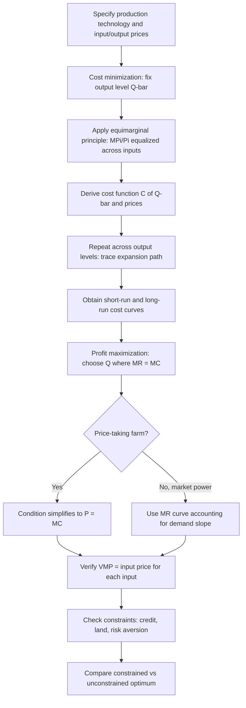

## Cost Minimization and Profit Maximization

### Conceptual Foundation

Cost minimization and profit maximization are the two central optimization problems in the economic theory of the firm, and they apply directly to farm-level decision-making in agricultural economics. Both problems are built on the technical constraint imposed by the production function, but they differ in what is held fixed and what is being optimized:

- **Cost minimization**: given a target output level, find the input combination that achieves it at lowest possible cost. Output is fixed; the choice variable is the input mix.
- **Profit maximization**: choose both the output level and the input mix jointly to maximize the difference between revenue and cost, with no output target imposed.

These two problems are formally linked by **duality theory**: solving the cost minimization problem for every possible output level traces out the cost function, and the profit-maximizing output level is then found by comparing marginal revenue to marginal cost derived from that cost function. In agricultural applications, this distinction matters because farmers frequently face a two-stage decision: first, given a planned crop area or contracted output quantity, minimize the cost of producing it; second, decide whether that output level itself is profit-maximizing given market prices.

### The Cost Minimization Problem

**Formal statement**: given a target output $\bar{Q}$ and input prices $P_L, P_K$, choose $L, K$ to minimize total cost:

$$\min_{L,K} \; C = P_L L + P_K K \quad \text{subject to} \quad f(L,K) = \bar{Q}$$

**First-order condition (tangency condition)**: the cost-minimizing input bundle occurs where the isoquant is tangent to the isocost line, i.e., where the marginal rate of technical substitution equals the input price ratio:

$$\frac{MP_L}{MP_K} = \frac{P_L}{P_K} \quad \Longleftrightarrow \quad \frac{MP_L}{P_L} = \frac{MP_K}{P_K}$$

This second form is the **equimarginal principle**: cost minimization requires that the marginal product per dollar spent be equalized across all inputs. If $MP_L/P_L > MP_K/P_K$, the firm gets more output per dollar from labor than from capital, and cost can be reduced (holding output constant) by substituting labor for capital until the ratios equalize.

**Example**

Suppose a farm's production technology gives $MP_L = 8$ and $MP_K = 5$ (in output units per additional unit of input) at the current input mix, with wage $P_L = \$20/\text{day}$ and capital rental rate $P_K = \$10/\text{unit}$.

$$\frac{MP_L}{P_L} = \frac{8}{20} = 0.40, \qquad \frac{MP_K}{P_K} = \frac{5}{10} = 0.50$$

Since $0.40 < 0.50$, capital delivers more output per dollar than labor at this input mix. The farm should substitute capital for labor (e.g., invest more in machinery, reduce hired labor days) until the two ratios are equalized, reducing total cost for the same output level.

### Illustration: Cost-Minimizing Input Choice (svg_diagram)

<svg xmlns="http://www.w3.org/2000/svg" viewBox="0 0 500 320">
<text x="250" y="22" text-anchor="middle" font-size="15" font-weight="bold" fill="#222">Isoquant-Isocost Tangency (svg_diagram)</text>
<line x1="70" y1="280" x2="460" y2="280" stroke="#333" stroke-width="1.5" />
<line x1="70" y1="280" x2="70" y2="40" stroke="#333" stroke-width="1.5" />
<text x="465" y="298" font-size="12">Labor (L)</text>
<text x="35" y="45" font-size="12">Capital (K)</text>

<path d="M 110 250 C 160 140, 260 90, 400 95" stroke="#2255aa" stroke-width="2" fill="none" />
<text x="405" y="93" font-size="11" fill="#2255aa">Isoquant Q̄</text>

<line x1="80" y1="260" x2="260" y2="60" stroke="#aa3322" stroke-width="1" stroke-dasharray="4,3" opacity="0.5" />
<line x1="110" y1="270" x2="420" y2="80" stroke="#aa3322" stroke-width="2" />
<line x1="150" y1="278" x2="440" y2="150" stroke="#aa3322" stroke-width="1" stroke-dasharray="4,3" opacity="0.5" />

<text x="425" y="82" font-size="11" fill="`#aa3322`">Tangent isocost (min cost)</text>

<circle cx="235" cy="163" r="4" fill="#222" />
<text x="245" y="158" font-size="11" fill="#222">L*, K* (cost-min mix)</text>
</svg>

### The Expansion Path

Repeating the cost minimization problem across a range of output targets $\bar{Q}$ traces out the **expansion path** — the locus of cost-minimizing input combinations as output scales up. Along this path:

$$\frac{MP_L}{P_L} = \frac{MP_K}{P_K} \quad \text{holds at every output level}$$

The shape of the expansion path (whether it is a straight line through the origin, or curves toward one input) reveals whether the farm's input mix changes as it scales up or down — relevant to whether smallholder and large-commercial farm technologies are truly comparable, or whether input ratios shift systematically with scale.

### The Cost Function and Its Properties

Solving the cost minimization problem for a general $\bar{Q}$ yields the **cost function** $C(\bar{Q}, P_L, P_K)$, expressing minimum cost as a function of output and input prices. Standard properties (from duality theory) that any well-behaved cost function must satisfy:

- **Homogeneity of degree 1 in input prices**: doubling all input prices doubles cost, holding output fixed.
- **Non-decreasing in output**: producing more costs at least as much.
- **Concavity in input prices**: cost functions are concave, not convex, in prices — a consequence of firms' ability to substitute away from inputs that become relatively more expensive.
- **Shephard's Lemma**: the cost-minimizing demand for input $i$ is recovered directly by differentiating the cost function with respect to that input's price:

$$X_i^*(\bar{Q}, P) = \frac{\partial C(\bar{Q}, P)}{\partial P_i}$$

This is a powerful applied result: once a flexible cost function (e.g., translog cost function) is estimated econometrically, input demand functions can be derived analytically without needing to separately estimate the production function or solve the optimization problem numerically for each price scenario.

### Short-Run versus Long-Run Cost Curves

Agricultural cost analysis distinguishes short-run costs (where at least one input, typically land, is fixed) from long-run costs (where all inputs, including land holdings, are variable):

- **Short-run total cost**: $SC = FC + VC(\bar{Q})$, where $FC$ is fixed cost (e.g., land rent, fixed equipment costs already committed) and $VC$ is variable cost (labor, seed, fertilizer).
- **Marginal cost**: $MC = dVC/dQ = dSC/dQ$ (fixed costs do not affect marginal cost).
- **Average total cost (ATC)**, **average variable cost (AVC)**, and **average fixed cost (AFC)**: $ATC = AVC + AFC$, with $AFC$ falling continuously as output rises (spreading fixed costs over more units) — a key driver of scale economies on farms with substantial fixed equipment or land costs.
- **Long-run cost curve**: the envelope of all short-run cost curves, reflecting the cost-minimizing scale of fixed inputs (e.g., landholding size, irrigation infrastructure) for each output level.

The relationship between short-run and long-run marginal/average cost curves in agriculture is central to debates on optimal farm size: if long-run average cost declines with output (economies of scale), consolidation into larger operations lowers per-unit costs; if it eventually rises (diseconomies of scale, e.g., due to management span-of-control limits), an optimal intermediate farm size exists.

### The Profit Maximization Problem

**Formal statement**: choose output $Q$ (or equivalently, the input bundle) to maximize profit:

$$\max_{Q} \; \pi = P_Q \, Q - C(Q)$$

**First-order condition**: profit is maximized where marginal revenue equals marginal cost:

$$MR = MC$$

For a price-taking farm (the standard assumption for most agricultural commodity producers, who are individually too small to affect market price), $MR = P_Q$ (output price), so the condition simplifies to:

$$P_Q = MC(Q^*)$$

**Second-order condition**: for a true maximum (not a minimum or inflection point), marginal cost must be rising at $Q^*$, i.e., $MC$ crosses $P_Q$ from below.

**Input-side equivalent condition**: profit maximization can equivalently be expressed directly in terms of inputs — for each input $X_i$, the **value of marginal product** must equal the input price:

$$VMP_{X_i} = P_Q \times MP_{X_i} = P_{X_i}$$

This is the same profit-maximizing input rule introduced in production function analysis (e.g., the nitrogen fertilizer example: $VMP_N = P_N$), now placed explicitly within the broader profit maximization framework — cost minimization (equimarginal principle across inputs) and profit maximization (VMP = input price for each input) are jointly satisfied at the profit-maximizing point, since a profit-maximizing farm is automatically cost-minimizing for whatever output level it ends up producing.

### Illustration: Profit Maximization at MR = MC (svg_diagram)

<svg xmlns="http://www.w3.org/2000/svg" viewBox="0 0 500 300">
<text x="250" y="22" text-anchor="middle" font-size="15" font-weight="bold" fill="#222">Marginal Cost, Marginal Revenue, and Profit-Maximizing Output (svg_diagram)</text>
<line x1="70" y1="260" x2="460" y2="260" stroke="#333" stroke-width="1.5" />
<line x1="70" y1="260" x2="70" y2="40" stroke="#333" stroke-width="1.5" />
<text x="465" y="278" font-size="12">Output (Q)</text>
<text x="35" y="45" font-size="12">$/unit</text>

<path d="M 100 240 C 160 180, 220 150, 280 140 C 340 132, 390 110, 430 70" stroke="#aa3322" stroke-width="2.5" fill="none" />
<text x="435" y="70" font-size="12" fill="#aa3322">MC</text>

<line x1="70" y1="140" x2="460" y2="140" stroke="#2255aa" stroke-width="2" />
<text x="465" y="143" font-size="12" fill="#2255aa">P = MR</text>

<circle cx="280" cy="140" r="4" fill="#222" />
<line x1="280" y1="140" x2="280" y2="260" stroke="#888" stroke-dasharray="4,3" />
<text x="255" y="278" font-size="11" fill="#222">Q*</text>
</svg>

### The Profit Function and Duality

Just as cost minimization yields a cost function, profit maximization yields a **profit function** $\pi(P_Q, P_L, P_K)$, with its own duality property, **Hotelling's Lemma**:

$$Q^*(P) = \frac{\partial \pi(P)}{\partial P_Q}, \qquad X_i^*(P) = -\frac{\partial \pi(P)}{\partial P_{X_i}}$$

This allows output supply functions and input demand functions to be derived directly from an estimated profit function, without separately estimating and solving the underlying production function — a common strategy in applied farm-level econometric studies since it avoids the endogeneity concerns tied to observed input choices being correlated with unobserved productivity (profit function estimation instead relies only on observed output and input **prices**, which are typically closer to exogenous from an individual farm's perspective).

### Multi-Output Considerations

Most real farms produce multiple outputs (e.g., a mixed crop-livestock operation), motivating **multi-output cost and profit functions**:

$$C(Q_1, Q_2, ..., P) \quad \text{or} \quad \pi(P_{Q_1}, P_{Q_2}, ..., P_X)$$

Key concepts specific to multi-output settings:

- **Economies of scope**: joint production of two outputs costs less than producing them separately, i.e., $C(Q_1, Q_2) < C(Q_1, 0) + C(0, Q_2)$. Relevant to crop-livestock integration, where crop residues feed livestock and manure fertilizes crops.
- **Product-specific returns to scale** and **cost complementarities** between outputs, estimated via multi-output translog cost functions in applied work.

### Constrained Optimization in Practice

Agricultural producers frequently face binding constraints not present in the textbook unconstrained problem:

- **Credit constraints**: limited access to capital prevents farms from reaching the unconstrained cost-minimizing or profit-maximizing input levels, particularly for cash-intensive inputs like fertilizer or hired labor.
- **Land constraints**: fixed landholding size, especially for smallholders, converts what would be a long-run problem into an effectively short-run one.
- **Risk and uncertainty**: under output price or yield risk, risk-averse farmers may deviate from the risk-neutral profit-maximizing input level, generally applying less of a risky input than the risk-neutral optimum would suggest (formalized via expected utility or mean-variance frameworks).
- **Labor market frictions**: family labor is not always perfectly substitutable with hired labor at a fixed market wage, complicating the equimarginal principle's straightforward application in smallholder settings.

[Inference: the extent to which observed farm behavior deviates from the textbook cost-minimization/profit-maximization benchmark due to these frictions is an active empirical research area, and the appropriate correction depends heavily on the specific constraint and farming context.]

### Diagram: Cost Minimization and Profit Maximization Workflow

### Applications in Agricultural Economics

1. **Farm input allocation decisions**: applying the equimarginal principle to allocate limited cash or credit across fertilizer, labor, and machinery rental to minimize the cost of achieving a target yield.
2. **Optimal farm size and consolidation policy**: long-run average cost curve estimation informs whether land consolidation or smallholder support policies better exploit scale economies.
3. **Crop-livestock integration analysis**: multi-output cost function estimation to quantify economies of scope from mixed farming systems.
4. **Contract farming and output quotas**: cost minimization for a fixed contracted output quantity is directly relevant where farmers commit to delivering a specified volume to a processor or cooperative.
5. **Input subsidy and price policy evaluation**: profit function estimation (via Hotelling's Lemma) to predict output supply and input demand responses to price policy changes without requiring separate production function estimation.
6. **Risk management and insurance design**: understanding how risk aversion shifts input use away from the risk-neutral profit-maximizing level informs the design of index insurance and other risk-mitigation instruments intended to restore efficient input use.
7. **Mechanization and labor substitution policy**: cost-minimization analysis of the labor-capital input mix informs predictions about mechanization uptake as rural wages rise.

### Common Pitfalls

- **Confusing cost minimization with profit maximization**: cost minimization alone does not determine the optimal output level; it only determines the cheapest way to produce a given output. Profit maximization requires the additional step of choosing $Q^*$ where $MR = MC$.
- **Applying the price-taking $P=MC$ rule to farmers who possess local market power** (e.g., due to buyer concentration or unique product differentiation), where the correct condition involves marginal revenue rather than price directly.
- **Ignoring binding real-world constraints** (credit, land, risk aversion) and interpreting deviations from the unconstrained optimum as irrationality or inefficiency, when constrained optimization may fully explain the observed behavior.
- **Applying Shephard's or Hotelling's Lemma results from a flexible functional form** (e.g., translog) without checking that the estimated cost or profit function satisfies the required theoretical regularity conditions (monotonicity, concavity) at the relevant data points — violations undermine the validity of derived input demand or output supply elasticities.
- **Treating fixed costs as relevant to short-run production decisions**: sunk or fixed costs (already-committed land rent, owned equipment) should not enter the marginal input-use or output-level decision, though they remain relevant to the separate question of whether to continue operating at all in the long run.

### Related Topics

- Production functions and factor productivity
- Input-output relationships and elasticities
- Duality theory: cost, profit, and revenue functions
- Economies of scale and scope in agricultural production
- Risk and uncertainty in farm decision-making (expected utility, mean-variance analysis)
- Farm household models under credit and labor constraints
- Agricultural supply response and price policy analysis
- Multi-output production and joint-cost allocation
- Stochastic frontier and efficiency analysis relative to the cost-minimizing benchmark