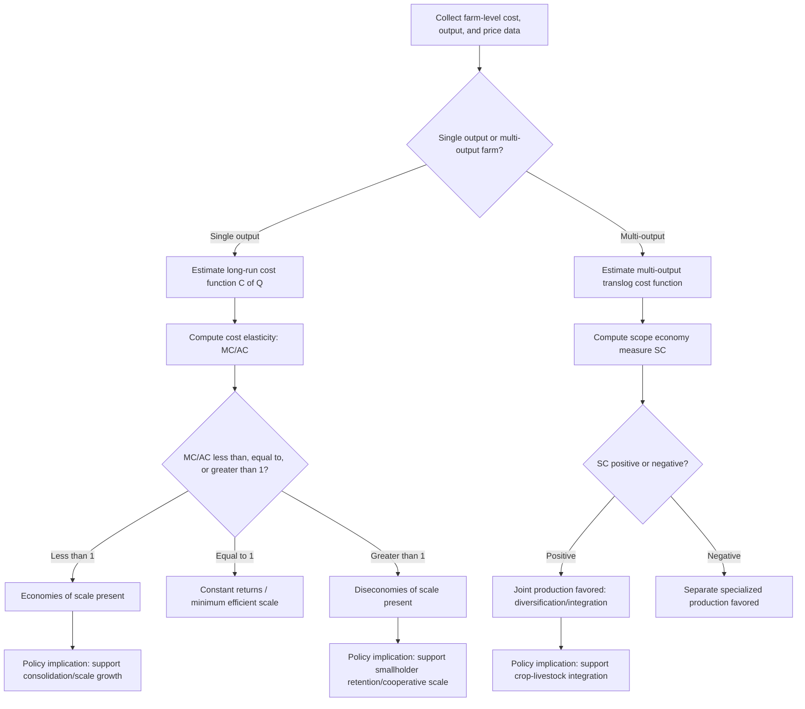

## Economies of Scale and Scope

### Definition and Conceptual Foundation

Economies of scale and economies of scope are two distinct concepts describing how cost efficiency changes as farm operations grow or diversify:

- **Economies of scale** concern how per-unit cost of a *single* output changes as the *volume* of that output increases, holding the product mix fixed.
- **Economies of scope** concern how cost changes when a farm produces *multiple* outputs jointly rather than separately, holding total output volumes fixed.

Both concepts sit downstream of the production function and cost function framework: scale economies are read off the shape of the long-run average cost curve, while scope economies require a multi-output cost function to compare joint versus separate production costs.

### Economies of Scale: Formal Definition

Given a long-run cost function $C(Q)$, the **elasticity of cost with respect to output** is:

$$E_C = \frac{dC/C}{dQ/Q} = \frac{MC}{AC}$$

This elasticity directly classifies scale behavior:

- $E_C < 1$ (equivalently $MC < AC$): **economies of scale** — long-run average cost is falling as output rises.
- $E_C = 1$ (equivalently $MC = AC$): **constant returns to scale / cost** — long-run average cost is flat, at its minimum.
- $E_C > 1$ (equivalently $MC > AC$): **diseconomies of scale** — long-run average cost is rising as output rises.

This is the cost-side mirror image of the returns-to-scale concept from production function analysis: increasing returns to scale in production (output rising more than proportionally with inputs) translates into economies of scale in cost (average cost falling as output rises), and the two are formally equivalent under cost-minimizing behavior.

### The Long-Run Average Cost (LRAC) Curve

The classical **U-shaped LRAC curve** synthesizes scale economies across the full range of farm sizes:

- **Declining segment**: economies of scale dominate — larger farms spread fixed costs (machinery, irrigation infrastructure, management overhead) over more output units, and may access input discounts or specialized technology unavailable at small scale.
- **Flat segment (minimum efficient scale)**: the range of output over which average cost is approximately minimized; farms of different sizes within this range are equally cost-efficient.
- **Rising segment**: diseconomies of scale dominate — typically driven by increasing managerial complexity, coordination costs, or diminishing returns from labor supervision, monitoring, and information asymmetries that grow disproportionately with farm size.

### Illustration: Long-Run Average Cost Curve (svg_diagram)

<svg xmlns="http://www.w3.org/2000/svg" viewBox="0 0 500 300">
<text x="250" y="22" text-anchor="middle" font-size="15" font-weight="bold" fill="#222">U-Shaped Long-Run Average Cost Curve (svg_diagram)</text>
<line x1="70" y1="260" x2="460" y2="260" stroke="#333" stroke-width="1.5" />
<line x1="70" y1="260" x2="70" y2="40" stroke="#333" stroke-width="1.5" />
<text x="465" y="278" font-size="12">Output / Farm Size (Q)</text>
<text x="30" y="45" font-size="12">Avg Cost</text>
<path d="M 90 230 C 160 130, 220 90, 280 85 C 330 82, 370 95, 430 150" stroke="#2255aa" stroke-width="2.5" fill="none" />
<line x1="255" y1="85" x2="315" y2="85" stroke="#888" stroke-dasharray="4,3" />
<text x="250" y="70" font-size="11" fill="#555">Minimum efficient scale</text>

<text x="130" y="180" font-size="12" fill="`#2c6e2c`">Economies of scale</text>

<text x="360" y="200" font-size="12" fill="`#aa3322`">Diseconomies of scale</text>

</svg>

### Sources of Scale Economies in Farming

**Key Points**

- **Indivisibility of capital equipment**: a combine harvester or tractor represents a large, "lumpy" fixed investment whose per-hectare cost falls sharply as cultivated area increases, since the same machine covers more land without proportional cost increase (up to its capacity limit).
- **Bulk input purchasing power**: larger operations can negotiate volume discounts on seed, fertilizer, and agrochemicals, lowering average variable cost.
- **Specialized management and labor division**: larger farms can afford to hire specialized agronomists, dedicated equipment operators, or financial managers, spreading that expertise's cost over more output.
- **Reduced per-unit transaction and marketing costs**: fixed costs of negotiating contracts, arranging transport, and meeting buyer certification requirements are spread over larger output volumes.
- **Access to credit and risk pooling**: larger, more diversified operations may access credit at more favorable terms, and are better able to self-insure against localized production risk (e.g., through a portfolio of plots across different microclimates).
- **Technology adoption thresholds**: some precision agriculture technologies (GPS-guided equipment, drone-based monitoring) have fixed setup costs that are only economical to adopt above a certain farm size.

### Sources of Scale Diseconomies in Farming

- **Managerial span-of-control limits**: beyond a certain size, owner-operators cannot personally supervise all operations, requiring hired management whose incentives may not perfectly align with the owner's, introducing agency costs.
- **Monitoring costs for hired labor**: agricultural labor is notoriously difficult to monitor (task quality and effort are hard to verify remotely across large, spatially dispersed plots), and this monitoring cost tends to rise disproportionately with farm size — a classic explanation in the agricultural economics literature for why family farms often outperform large corporate farms on crops where labor supervision is critical (e.g., some horticultural or labor-intensive crops).
- **Soil and microclimate heterogeneity**: very large landholdings often span more heterogeneous soil and microclimate conditions, complicating uniform management practices optimized for a single, smaller plot.
- **Bureaucratic and coordination overhead**: as an operation grows, communication, decision-making, and coordination between departments or units introduce overhead costs absent in small owner-operated farms.

[Inference: the specific point at which diseconomies begin to dominate is highly crop- and technology-specific — labor-supervision-intensive crops such as fruits and vegetables tend to exhibit scale diseconomies at much smaller farm sizes than mechanization-friendly grain crops, though exact thresholds require empirical estimation for a given context.]

### The Farm Size-Productivity Debate

A long-standing empirical puzzle in agricultural economics is the frequently observed **inverse relationship between farm size and land productivity** (yield per hectare) in many developing-country settings — smaller farms often show *higher* output per hectare than larger farms, apparently contradicting scale-economy intuition. Commonly proposed explanations include:

- **Labor market imperfections**: family labor on small farms is used more intensively per hectare because its opportunity cost is low or difficult to redeploy elsewhere, while hired labor on large farms is used more sparingly due to monitoring costs (the labor-supervision-cost explanation above).
- **Land quality differences**: smaller plots may be disproportionately located on higher-quality land in some settings (a potential omitted-variable / measurement issue rather than a true behavioral relationship).
- **Missing or imperfect credit and insurance markets**: risk aversion combined with limited insurance access may lead differently sized farms to choose different input intensities.

[Inference: this remains a debated and actively researched area in development and agricultural economics, and no single explanation is universally accepted as the definitive resolution across all contexts; the empirically observed relationship, its magnitude, and even its direction vary by country, crop, and time period.]

### Economies of Scope: Formal Definition

For a farm producing two outputs $Q_1$ and $Q_2$, **economies of scope** exist when joint production is cheaper than separate production of the same total quantities:

$$SC = \frac{C(Q_1, 0) + C(0, Q_2) - C(Q_1, Q_2)}{C(Q_1, Q_2)} > 0$$

- $SC > 0$: economies of scope — joint production saves cost, favoring diversified/mixed operations.
- $SC < 0$: diseconomies of scope — specialization into separate single-product operations is cheaper.
- $SC = 0$: no cost interaction between the two outputs (cost-separable technology).

### Sources of Scope Economies in Farming

**Key Points**

- **Crop-livestock integration**: crop residues (straw, stover) serve as livestock feed, while livestock manure serves as organic fertilizer for crops — each output reduces an input cost for the other, a textbook example of a positive cost complementarity.
- **Shared fixed capital**: machinery, storage facilities, and farm buildings often serve multiple enterprises (e.g., a barn used for both equipment storage and livestock housing, or a tractor used across multiple crop types).
- **Crop rotation benefits**: rotating nitrogen-fixing legumes with cereal crops reduces fertilizer costs for the subsequent cereal crop — a scope economy realized through sequential rather than strictly simultaneous joint production, though it operates through the same underlying cost-complementarity logic.
- **Risk diversification as an implicit scope benefit**: while not a pure cost-saving in the strict accounting sense, diversifying into multiple crops or crop-livestock combinations reduces income variability, which can lower the effective cost of capital (via reduced risk premia demanded by lenders) — an indirect scope-economy-like effect.
- **Labor-use smoothing across seasons**: combining crops or enterprises with different peak labor demand periods (e.g., a grain crop and a livestock enterprise with different seasonal labor needs) allows more even utilization of a fixed family or hired labor force across the year, reducing the effective cost of maintaining that labor capacity.

### Illustration: Economies of Scope in a Mixed Crop-Livestock System (svg_diagram)

<svg xmlns="http://www.w3.org/2000/svg" viewBox="0 0 520 260">
<text x="260" y="22" text-anchor="middle" font-size="15" font-weight="bold" fill="#222">Cost Complementarity: Crop-Livestock Integration (svg_diagram)</text>
<rect x="60" y="70" width="150" height="90" rx="8" fill="#cfe8cf" stroke="#2c6e2c" stroke-width="1.5" />
<text x="135" y="120" text-anchor="middle" font-size="13">Crop Production</text>
<rect x="310" y="70" width="150" height="90" rx="8" fill="#f5dcc0" stroke="#aa6622" stroke-width="1.5" />
<text x="385" y="120" text-anchor="middle" font-size="13">Livestock Production</text>
<path d="M 210 100 L 305 100" stroke="#2c6e2c" stroke-width="2" marker-end="url(#arrow1)" />
<text x="215" y="92" font-size="11" fill="#2c6e2c">Residues/stover as feed</text>
<path d="M 305 140 L 210 140" stroke="#aa6622" stroke-width="2" marker-end="url(#arrow2)" />
<text x="230" y="158" font-size="11" fill="#aa6622">Manure as fertilizer</text>
<text x="260" y="220" text-anchor="middle" font-size="12" fill="#333">Each enterprise reduces an input cost for the other → SC &gt; 0</text>

</svg>

### Estimating Scale and Scope Economies Empirically

**Multi-output translog cost function** is the standard flexible-form workhorse for jointly estimating scale and scope economies:

$$\ln C = \alpha_0 + \sum_k \alpha_k \ln Q_k + \frac{1}{2}\sum_k\sum_l \gamma_{kl} \ln Q_k \ln Q_l + \sum_i \beta_i \ln P_i + ...$$

- Product-specific and overall scale economy measures, and the scope economy measure $SC$, can be computed directly from the estimated coefficients.
- Because $C(Q_1, 0)$ and $C(0, Q_2)$ (pure single-output costs) are typically **not observed** in the data if most farms in the sample produce both outputs (a common data limitation), estimating scope economies from a translog form requires extrapolating the cost function to the boundary of zero output for one product — a region often outside the support of the observed data, making these estimates sensitive to functional-form assumptions near the boundary. [Inference: this "non-observability of the scope boundary" is a well-recognized methodological challenge in the applied multi-output cost function literature, and results should be interpreted with corresponding caution.]

**Simpler applied alternatives**:

- **Farm size-cost regressions**: directly regressing average cost or cost per hectare on farm size (with appropriate controls) to estimate scale elasticity without a full structural cost function.
- **Stochastic frontier cost functions**: incorporating a one-sided inefficiency term alongside the scale/scope structure, distinguishing genuine scale-driven cost differences from farm-specific inefficiency.
- **Non-parametric approaches (DEA)**: can also be adapted to estimate scale efficiency scores by comparing farms of different sizes against a data-driven best-practice frontier, without imposing a specific functional form.

### Diagram: Scale and Scope Economy Assessment Workflow

### Cooperative and Institutional Responses to Scale Economies

Where individual farms are too small to realize scale economies in input purchasing, processing, or marketing, **agricultural cooperatives and contract farming arrangements** allow smallholders to capture collective-scale benefits without consolidating landholding itself:

- **Input supply cooperatives**: bulk-purchase fertilizer, seed, and equipment rental services, passing volume discounts to individually small member farms.
- **Marketing cooperatives and farmer producer organizations**: aggregate output to meet minimum volume requirements for processors or export markets, and negotiate better prices than individual smallholders could achieve alone.
- **Custom hiring / machinery-sharing schemes**: allow smallholders to access large indivisible equipment (combine harvesters, laser land levelers) without individually bearing the fixed investment cost, effectively converting a farm-level indivisibility into a rentable, divisible service.

This institutional dimension is central to agricultural policy debates in smallholder-dominated systems: rather than assuming farm consolidation is the only route to capturing scale economies, cooperative and service-market institutions can decouple scale economies in inputs, processing, and marketing from scale in landholding itself.

### Applications in Agricultural Economics

1. **Farm consolidation policy debate**: LRAC curve estimation informs whether land consolidation policies would yield genuine efficiency gains or primarily benefit large operators without productivity justification.
2. **Cooperative and farmer organization design**: identifying which functions (input purchasing, marketing, machinery access) exhibit the strongest scale economies guides which cooperative services deliver the greatest smallholder benefit.
3. **Crop-livestock integration extension programs**: quantifying scope economies from mixed farming systems supports extension recommendations promoting integrated rather than specialized production.
4. **Mechanization investment decisions**: individual farm-level scale-economy analysis of machinery investment informs whether ownership, custom-hire services, or shared-equipment cooperatives are the more cost-effective path to mechanization at a given farm size.
5. **Land reform and tenure policy analysis**: understanding the inverse farm size-productivity relationship informs debates on land redistribution versus consolidation policies in various developing-country contexts.
6. **Value chain and processing facility siting**: scale economies in processing (e.g., minimum efficient scale for a rice mill or dairy processing plant) determine optimal facility size and the catchment area of farms needed to supply it economically.
7. **Precision agriculture technology diffusion**: identifying the farm-size threshold above which fixed technology setup costs (GPS guidance, variable-rate application systems) become economically justified.

### Common Pitfalls

- **Conflating farm size with scale economies without evidence**: larger farms are not automatically more cost-efficient; the inverse farm size-productivity relationship observed in many settings demonstrates this is an empirical question, not a theoretical certainty.
- **Ignoring labor supervision costs** when assessing scale economies in labor-intensive crops, leading to overly optimistic projections of consolidation benefits for crops where family labor has a genuine productivity advantage.
- **Estimating scope economies by extrapolating cost functions to unobserved output combinations** (e.g., zero output of one product) without acknowledging the resulting sensitivity to functional-form assumptions in that unobserved region.
- **Treating economies of scale and economies of scope as interchangeable concepts** — a farm can exhibit strong scope economies (from crop-livestock integration) while showing no meaningful scale economies (from expanding the size of either enterprise alone), and vice versa.
- **Overlooking cooperative and market-based alternatives to consolidation** as a means of capturing scale economies, particularly relevant in smallholder-dominated agricultural systems where landholding consolidation faces social, political, or equity constraints.

### Related Topics

- Production functions and factor productivity
- Cost minimization and profit maximization
- The farm size-productivity puzzle in development economics
- Multi-output cost functions and duality theory
- Agricultural cooperatives and farmer producer organizations
- Contract farming and value chain integration
- Stochastic frontier analysis and technical/scale efficiency measurement
- Crop-livestock integrated farming systems
- Land tenure, consolidation, and agrarian reform policy