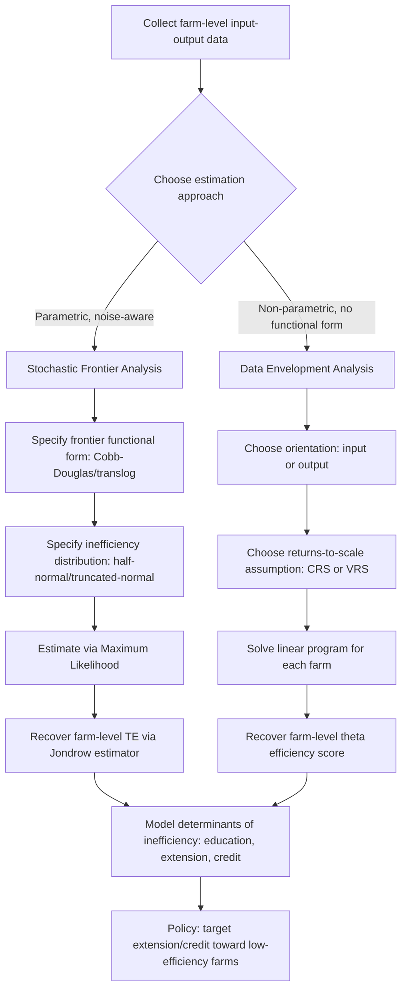

## Technical Efficiency and Productivity Measurement


### Definition and Conceptual Foundation

Technical efficiency measures how close an actual producer's input-output combination is to the theoretical "best-practice" frontier defined by the production technology — i.e., whether a farm is extracting the maximum possible output from its given inputs (output-oriented), or using the minimum possible inputs to produce its given output (input-oriented). This is distinct from, but closely related to, **allocative efficiency** (whether inputs are combined in cost-minimizing proportions given prices) and **economic efficiency** (the combination of both, equivalent to the cost-minimization/profit-maximization conditions discussed under production economics).

Productivity measurement extends this static efficiency concept to a **dynamic** question: how output per unit of input, or total factor productivity, changes over time — distinguishing genuine technological progress and efficiency improvement from mere input growth.

### Efficiency Decomposition: Farrell's Framework

The foundational decomposition (Farrell, 1957) separates overall economic efficiency into two multiplicative components:

$$EE = TE \times AE$$

- **Technical Efficiency (TE)**: ability to produce maximum output from a given input bundle (or minimum input for a given output), given the technology — a purely physical/engineering concept.
- **Allocative Efficiency (AE)**: ability to use inputs in cost-minimizing proportions given their prices, conditional on being technically efficient.
- **Economic (Cost) Efficiency (EE)**: the product of the two, representing overall performance relative to the theoretical cost-minimizing benchmark.

### Illustration: Farrell Efficiency Decomposition (svg_diagram)

<svg xmlns="http://www.w3.org/2000/svg" viewBox="0 0 500 320">
<text x="250" y="22" text-anchor="middle" font-size="15" font-weight="bold" fill="#222">Technical vs Allocative Efficiency (svg_diagram)</text>
<line x1="70" y1="280" x2="460" y2="280" stroke="#333" stroke-width="1.5" />
<line x1="70" y1="280" x2="70" y2="40" stroke="#333" stroke-width="1.5" />
<text x="465" y="298" font-size="12">Input 1/Output</text>
<text x="30" y="45" font-size="12">Input 2/Output</text>

<path d="M 110 250 C 160 140, 260 90, 400 95" stroke="#2255aa" stroke-width="2.5" fill="none" />
<text x="405" y="93" font-size="11" fill="#2255aa">Efficient frontier</text>

<line x1="100" y1="260" x2="420" y2="80" stroke="#aa3322" stroke-width="1.5" stroke-dasharray="5,3" />

<circle cx="330" cy="205" r="4" fill="#222" />
<text x="340" y="200" font-size="11" fill="#222">P (observed, inefficient farm)</text>

<line x1="70" y1="280" x2="330" y2="205" stroke="#888" stroke-dasharray="3,2" />
<circle cx="250" cy="128" r="4" fill="#2c6e2c" />
<text x="255" y="122" font-size="11" fill="#2c6e2c">Q (technically efficient)</text>

<circle cx="228" cy="165" r="4" fill="#aa3322" />
<text x="150" y="165" font-size="11" fill="#aa3322">R (cost-min point)</text>

<text x="130" y="315" font-size="11" fill="#333">TE = OQ/OP; AE = OR/OQ; EE = OR/OP = TE × AE</text>

</svg>

Formally, in the input-orientation shown above, with $O$ the origin, $P$ the observed input use, and $Q$ the radial projection of $P$ onto the frontier along the ray from the origin:

$$TE = \frac{OQ}{OP}, \qquad AE = \frac{OR}{OQ}, \qquad EE = \frac{OR}{OP} = TE \times AE$$

$TE \in (0,1]$, with $TE=1$ indicating a fully technically efficient farm operating exactly on the frontier.

### Input-Oriented versus Output-Oriented Efficiency

- **Input-oriented TE**: by how much could input use be proportionally reduced while still producing the same output? (Relevant when input reduction is the policy lever of interest — e.g., resource conservation programs.)
- **Output-oriented TE**: by how much could output be proportionally expanded using the same input bundle? (Relevant when output expansion is the policy lever of interest — e.g., food security or yield-gap analysis.)

Under constant returns to scale, input- and output-oriented measures coincide; under variable returns to scale, they generally differ, and the choice of orientation should match the decision context being analyzed.

### Two Principal Estimation Approaches

Two broad methodological families dominate applied technical efficiency measurement in agricultural economics, differing in whether they impose a parametric functional form and whether they allow for statistical noise.

#### Stochastic Frontier Analysis (SFA)

A **parametric** approach that specifies a functional form for the production frontier and decomposes the error term into two distinct components:

$$\ln Q_i = \ln f(X_i; \beta) + v_i - u_i$$

- $v_i \sim N(0, \sigma_v^2)$: symmetric statistical noise (measurement error, weather shocks, luck) — a farm's output can be higher or lower than the frontier prediction due to pure randomness.
- $u_i \geq 0$: one-sided technical inefficiency term, typically assumed to follow a half-normal, truncated-normal, or exponential distribution.

Technical efficiency for each farm is recovered via the conditional expectation of $u_i$ given the composite residual (Jondrow et al. estimator):

$$TE_i = E[e^{-u_i} \mid \varepsilon_i]$$

**Key advantage**: explicitly separates inefficiency from statistical noise, appropriate given the substantial weather- and pest-driven randomness inherent to agricultural output.

**Key limitation**: requires specifying both a functional form for the frontier (Cobb-Douglas, translog) and a distributional assumption for $u_i$, and results can be sensitive to these choices, particularly in small samples.

**Determinants of inefficiency**: a common extension (Battese-Coelli, 1995) models the mean of the inefficiency distribution as a function of farm/farmer characteristics in a single-stage estimation:

$$\mu_i = \delta_0 + \delta_1 \text{Education}_i + \delta_2 \text{ExtensionContact}_i + \delta_3 \text{FarmSize}_i + ...$$

allowing direct inference on which observable factors (education, extension access, farm size, credit access) are associated with higher or lower technical efficiency — a frequent focus of applied agricultural development research.

#### Data Envelopment Analysis (DEA)

A **non-parametric** linear-programming approach that constructs a piecewise-linear best-practice frontier directly from the data, with no functional form imposed:

$$\min_{\theta,\lambda} \theta \quad \text{s.t.} \quad \sum_j \lambda_j Q_j \geq Q_0, \quad \sum_j \lambda_j X_j \leq \theta X_0, \quad \lambda_j \geq 0$$

(input-oriented formulation shown; $\theta \leq 1$ is the technical efficiency score for the farm under evaluation)

- **CRS (Charnes-Cooper-Rhodes) model**: assumes constant returns to scale, yielding an "overall technical efficiency" score.
- **VRS (Banker-Charnes-Cooper) model**: assumes variable returns to scale, yielding a "pure technical efficiency" score.
- **Scale efficiency**: $SE = TE_{CRS}/TE_{VRS}$, isolating the portion of inefficiency attributable to operating at the wrong scale rather than pure technical inefficiency.

**Key advantage**: no functional-form assumption on the technology, and directly handles multiple outputs without requiring an aggregate output index.

**Key limitation**: deterministic — all deviation from the frontier is attributed to inefficiency, with no allowance for statistical noise, making DEA scores sensitive to measurement error and outliers (a single unusually high-output farm, whether from luck or genuine best practice, can shift the entire frontier).

### Summary Comparison: SFA versus DEA

| Feature | Stochastic Frontier Analysis (SFA) | Data Envelopment Analysis (DEA) |
| --- | --- | --- |
| Approach type | Parametric | Non-parametric |
| Functional form | Must be specified (Cobb-Douglas, translog) | Not required |
| Statistical noise | Explicitly modeled and separated from inefficiency | Not modeled (deterministic) |
| Multiple outputs | Requires aggregation or distance function extension | Handled directly |
| Sensitivity to outliers | Moderate (noise term absorbs some outliers) | High (frontier defined by extreme points) |
| Hypothesis testing | Standard likelihood-ratio and t-tests available | Limited; typically bootstrap-based inference |
| Typical agri-econ use | Yield-risk-prone crops with substantial weather variation | Multi-output farms, benchmarking studies |

[Inference: neither approach is universally superior; the choice depends on data quality, sample size, whether multiple outputs must be handled directly, and whether separating noise from inefficiency is a priority for the specific research question. Many applied studies report both as a robustness check.]

### Diagram: Technical Efficiency Estimation Workflow



### Total Factor Productivity Growth and the Malmquist Index

While the Farrell framework measures **static** efficiency at a point in time, productivity change over time requires a dynamic decomposition. The **Malmquist Productivity Index (MPI)**, computed from panel data using DEA-based distance functions, decomposes TFP growth between two periods into:

$$MPI = \Delta TFP = \Delta TE \times \Delta TC$$

- **Efficiency change ($\Delta TE$)**: whether a farm is moving closer to or further from the frontier over time ("catching up").
- **Technical change ($\Delta TC$)**: whether the frontier itself is shifting outward over time (genuine technological progress, e.g., a new crop variety or improved practice raising the maximum attainable output for all farms).

This decomposition is central to agricultural productivity growth studies, since it distinguishes whether observed yield or output growth over time is driven by farms adopting existing best practices more fully ("catch-up") versus the emergence of genuinely new, superior technology ("frontier-shift") — a distinction with very different policy implications (extension and adoption support versus agricultural R&D investment).

### Illustration: Efficiency Change versus Technical Change (svg_diagram)

<svg xmlns="http://www.w3.org/2000/svg" viewBox="0 0 520 300">
<text x="260" y="22" text-anchor="middle" font-size="15" font-weight="bold" fill="#222">Malmquist Decomposition: Catch-Up vs Frontier-Shift (svg_diagram)</text>
<line x1="70" y1="260" x2="460" y2="260" stroke="#333" stroke-width="1.5" />
<line x1="70" y1="260" x2="70" y2="40" stroke="#333" stroke-width="1.5" />
<text x="465" y="278" font-size="12">Input</text>
<text x="35" y="45" font-size="12">Output</text>

<path d="M 100 240 C 180 150, 300 100, 420 90" stroke="#2255aa" stroke-width="2" fill="none" />
<text x="425" y="88" font-size="11" fill="#2255aa">Frontier, period t</text>

<path d="M 100 210 C 180 110, 300 60, 420 50" stroke="#2c6e2c" stroke-width="2" fill="none" />
<text x="425" y="48" font-size="11" fill="#2c6e2c">Frontier, period t+1</text>

<circle cx="250" cy="180" r="4" fill="#aa3322" />
<text x="200" y="200" font-size="11" fill="#aa3322">Farm at t</text>
<circle cx="250" cy="120" r="4" fill="#aa3322" />
<text x="255" y="115" font-size="11" fill="#aa3322">Farm at t+1</text>
<line x1="250" y1="180" x2="250" y2="120" stroke="#888" stroke-dasharray="3,2" />

<text x="130" y="290" font-size="11" fill="#333">Vertical gain = technical change (frontier shift) + efficiency change (catch-up)</text>

</svg>

### Practical Software Implementation

**Key Points**

- **R**: `frontier` and `sfaR` packages for stochastic frontier estimation; `Benchmarking` and `rDEA` for DEA and scale efficiency computation; `productivity` and `FEAR`-based packages for Malmquist index decomposition.
- **Stata**: `frontier` command (native) for SFA; user-written `dea` command for DEA.
- **Python**: `pyStoNED` for combined stochastic and non-parametric (nonparametric envelopment) frontier estimation; general-purpose DEA implementations are less standardized than in R/Stata.

**Example**

A minimal illustrative structure for an SFA estimation in R using a Cobb-Douglas frontier with inefficiency determinants:

```r
library(frontier)

model <- sfa(
  log(yield) ~ log(land) + log(labor) + log(fertilizer) + log(seed)
| education + extension_contact + farm_size,
  data = farm_data
)

summary(model)
efficiencies(model)  # farm-level TE scores
```

[Unverified: exact function arguments and formula syntax may differ across package versions; consult current package documentation before production use.]

### Applications in Agricultural Economics

1. **Smallholder efficiency benchmarking**: identifying which farms are operating well below the technology frontier, to target extension services, credit access programs, or input-quality interventions toward the farms with the greatest efficiency-improvement potential.
2. **Yield gap analysis**: distinguishing the portion of the gap between actual and potential yield attributable to technical inefficiency (correctable through better practice) versus genuine technological limitations (requiring new varieties or infrastructure).
3. **Agricultural extension program evaluation**: using inefficiency-determinant models (Battese-Coelli specification) to quantify the efficiency-improving impact of extension contact, controlling for other farm and farmer characteristics.
4. **Total Factor Productivity growth monitoring**: Malmquist index decomposition to track whether national or regional agricultural productivity growth stems from technology diffusion/catch-up or genuine innovation, informing R&D versus extension investment priorities.
5. **Irrigation and water-use efficiency studies**: technical efficiency measurement specifically oriented toward water input, identifying farms with the greatest potential for water-saving without yield loss.
6. **Organic versus conventional farming comparisons**: comparing technical efficiency scores across farming systems to assess whether observed yield differences reflect genuine technology gaps or correctable inefficiency within each system.
7. **Cooperative and farmer group performance assessment**: DEA-based benchmarking of member farms within a cooperative to identify best-practice peers for farmer-to-farmer learning programs.

### Common Pitfalls

- **Treating DEA efficiency scores as free of measurement error**: since DEA is fully deterministic, a single farm with unusually favorable weather (or simply mismeasured output) can be classified as "fully efficient" and distort the frontier for all other farms in the sample.
- **Ignoring the choice of orientation (input vs. output) and returns-to-scale assumption (CRS vs. VRS)** in DEA, both of which can materially change efficiency rankings and should be justified by the specific policy question.
- **Conflating technical inefficiency with allocative or economic inefficiency**: a farm can be technically efficient (on the frontier) while still being economically inefficient if its input mix does not reflect current relative prices — the two require separate estimation and separate policy responses.
- **Applying SFA with a restrictive distributional assumption on the inefficiency term without testing its adequacy**, since results (particularly mean TE levels, though rankings are typically more robust) can be sensitive to this choice, especially in smaller samples.
- **Misinterpreting Malmquist index components**: attributing all observed productivity growth to "technical change" (innovation) when a meaningful share may reflect "efficiency change" (catch-up to existing best practice), leading to misallocation between R&D and extension investment priorities.

### Related Topics

- Production functions and factor productivity
- Cost minimization and profit maximization
- Economies of scale and scope in farming
- Total Factor Productivity growth accounting
- Yield gap analysis and agricultural extension impact evaluation
- Panel data econometrics for efficiency and productivity analysis
- Risk and stochastic production under weather and yield uncertainty
- Agricultural technology adoption and diffusion modeling
- Benchmarking and peer-group performance analysis in farmer cooperatives