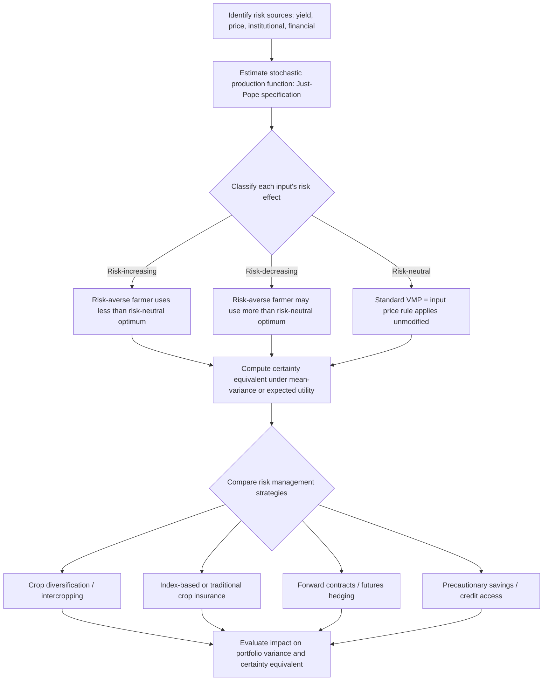

## Risk in Agricultural Production

### Definition and Conceptual Foundation

Risk in agricultural production refers to the exposure of farm outcomes — yield, revenue, and profit — to uncertain, often uncontrollable events, primarily weather, pest and disease pressure, and price fluctuations. Agriculture is distinguished from most other production sectors by the sheer breadth and severity of risk sources acting simultaneously on the same underlying biological production process, and by the typically long, fixed production cycle (a full growing season) during which corrective mid-course action is often limited.

A foundational distinction in the risk literature separates:

- **Risk**: outcomes with a known or estimable probability distribution (e.g., historical rainfall variability with an established statistical pattern).
- **Uncertainty**: outcomes whose probability distribution is unknown or unknowable (e.g., a genuinely novel pest outbreak with no historical precedent).

In practice, most applied agricultural economics work treats this distinction loosely and models both under the umbrella of "risk," typically via a known or estimated probability distribution over outcomes, while acknowledging that some events (climate change acceleration, novel disease emergence) may be better characterized as genuine uncertainty in the stricter sense.

### Sources of Agricultural Risk

**Key Points**

- **Production/yield risk**: weather variability (rainfall timing and quantity, temperature extremes, frost, hail), pest and disease outbreaks, and soil-related variability affecting realized output for a given input bundle.
- **Price risk**: output price volatility between planting and harvest (the farmer commits inputs before knowing the eventual sale price), and input price volatility (fertilizer, fuel, and agrochemical costs can shift substantially between purchase and use).
- **Institutional/policy risk**: changes in subsidy programs, trade policy, tariffs, or regulatory requirements that alter the economic environment after production decisions are already committed.
- **Financial risk**: variability in the cost and availability of credit, particularly relevant for cash-constrained smallholders who borrow to finance input purchases.
- **Human/personal risk**: illness, injury, or death of the farm operator or key labor, affecting the farm's operational capacity independent of the biological production process itself.
- **Technological risk**: uncertainty in the performance of new technologies or practices not yet fully proven under local conditions (e.g., an unfamiliar crop variety's actual yield response).

These sources frequently compound rather than act independently: a drought (production risk) often coincides with lower regional supply and thus higher output prices (partially offsetting revenue risk for those who still have output to sell), while simultaneously straining credit access (financial risk) for farmers with reduced collateral value.

### Expected Utility Theory and Risk Aversion

The standard theoretical framework for modeling farmer decision-making under risk is **expected utility theory**. A farmer is assumed to choose actions (input levels, crop mix) to maximize expected utility of wealth or profit, rather than expected profit itself:

$$\max_X \; E[U(\pi(X, \tilde{\theta}))]$$

where $\tilde{\theta}$ represents the random state of nature (weather, prices) and $U(\cdot)$ is a utility function reflecting the farmer's risk preferences.

**Risk aversion** is characterized by a concave utility function ($U'' < 0$), implying the farmer prefers a certain outcome to an uncertain one with the same expected value. The **Arrow-Pratt coefficient of absolute risk aversion** formalizes the degree of risk aversion:

$$r_A(\pi) = -\frac{U''(\pi)}{U'(\pi)}$$

- $r_A > 0$: risk-averse (concave utility) — the typical assumption for most farm-level agricultural decision models.
- $r_A = 0$: risk-neutral (linear utility) — maximizes expected profit only.
- $r_A < 0$: risk-seeking (convex utility) — rare in applied agricultural models but theoretically possible.

**Constant Relative Risk Aversion (CRRA)** and **Constant Absolute Risk Aversion (CARA)** utility functions are the most commonly used parametric forms in applied work, due to their tractability:

$$U_{CARA}(\pi) = -e^{-r\pi}, \qquad U_{CRRA}(\pi) = \frac{\pi^{1-\rho}}{1-\rho}$$

### The Mean-Variance Framework

A widely used simplification of expected utility theory in applied agricultural risk analysis assumes farmers care only about the **mean** and **variance** of profit (exact under quadratic utility or normally distributed returns, and a reasonable approximation more generally):

$$E[U(\pi)] \approx E[\pi] - \frac{r}{2}\text{Var}(\pi)$$

This yields the **certainty equivalent (CE)**, the guaranteed profit level a risk-averse farmer would consider equally desirable as the uncertain prospect:

$$CE = E[\pi] - \frac{r}{2}\text{Var}(\pi)$$

The gap between $E[\pi]$ and $CE$ is the **risk premium** — the amount of expected profit the farmer would sacrifice to eliminate the underlying uncertainty entirely.

**Example**

Suppose a farmer is deciding between two maize varieties. Variety A has expected profit $E[\pi_A] = \$500/\text{ha}$ with variance $\text{Var}(\pi_A) = 10{,}000$; Variety B has higher expected profit $E[\pi_B] = \$550/\text{ha}$ but higher variance $\text{Var}(\pi_B) = 40{,}000$ (a riskier, higher-yield-potential variety). With a risk-aversion coefficient $r = 0.005$:

$$CE_A = 500 - \frac{0.005}{2}(10{,}000) = 500 - 25 = 475$$

$$CE_B = 550 - \frac{0.005}{2}(40{,}000) = 550 - 100 = 450$$

Despite Variety B's higher expected profit, its certainty equivalent is lower once the farmer's risk aversion is accounted for — the risk-averse farmer would rationally choose Variety A. A risk-neutral farmer ($r=0$), by contrast, would choose Variety B purely on expected profit grounds. This illustrates why risk-averse farmers may systematically forgo higher-expected-return technologies or varieties in favor of lower-risk alternatives — a frequently cited explanation for cautious technology adoption patterns among smallholders.

### Illustration: Mean-Variance Trade-off in Farm Decisions (svg_diagram)

<svg xmlns="http://www.w3.org/2000/svg" viewBox="0 0 500 300">
<text x="250" y="22" text-anchor="middle" font-size="15" font-weight="bold" fill="#222">Mean-Variance Efficient Frontier (svg_diagram)</text>
<line x1="70" y1="260" x2="460" y2="260" stroke="#333" stroke-width="1.5" />
<line x1="70" y1="260" x2="70" y2="40" stroke="#333" stroke-width="1.5" />
<text x="465" y="278" font-size="12">Risk (Std. Dev. of profit)</text>
<text x="30" y="45" font-size="12">Expected profit</text>

<path d="M 110 220 C 200 170, 300 110, 420 70" stroke="#2255aa" stroke-width="2.5" fill="none" />
<text x="425" y="68" font-size="11" fill="#2255aa">Efficient frontier</text>

<path d="M 90 160 C 180 130, 280 145, 380 200" stroke="#aa3322" stroke-width="1.5" stroke-dasharray="5,3" fill="none" />
<text x="385" y="202" font-size="11" fill="#aa3322">Indifference curve</text>
<circle cx="215" cy="150" r="4" fill="#222" />
<text x="225" y="145" font-size="11" fill="#222">Optimal risky choice</text>
<circle cx="175" cy="200" r="4" fill="#2c6e2c" />
<text x="120" y="220" font-size="11" fill="#2c6e2c">Variety A (lower risk)</text>
<circle cx="330" cy="160" r="4" fill="#8b4513" />
<text x="335" y="155" font-size="11" fill="#8b4513">Variety B (higher risk/return)</text>
</svg>

### Stochastic Production Functions and Risk-Adjusted Input Use

Risk considerations modify the standard production function framework by explicitly incorporating a stochastic component and distinguishing inputs by their effect on output **variance**, not just mean output. The **Just-Pope stochastic production function** (1978) is the standard specification for this purpose:

$$Q = f(X;\beta) + h(X;\alpha) \cdot \varepsilon, \qquad E[\varepsilon]=0, \; \text{Var}(\varepsilon)=\sigma^2$$

This structure allows an input to simultaneously be:

- **Risk-increasing**: $\partial h/\partial X_i > 0$ — the input raises output variance (e.g., nitrogen fertilizer is frequently found to increase yield variance in some cropping systems, since higher yield potential also means greater downside exposure to adverse weather).
- **Risk-decreasing**: $\partial h/\partial X_i < 0$ — the input reduces output variance (e.g., irrigation, which buffers against rainfall variability, is commonly modeled as risk-reducing).
- **Risk-neutral**: $\partial h/\partial X_i = 0$ — the input affects only mean output, not its variance.

This distinction matters directly for optimal input use under risk aversion: a risk-averse farmer's optimal input level for a risk-increasing input is **lower** than the risk-neutral profit-maximizing level (from the standard $VMP=P_X$ condition), while for a risk-reducing input it may be **higher** than the risk-neutral optimum, since the farmer values the input's variance-reduction benefit in addition to its mean-output effect. [Inference: whether a specific input is empirically risk-increasing, risk-decreasing, or risk-neutral is context- and crop-specific and requires estimation via the Just-Pope framework or similar; it should not be assumed a priori.]

### Diagram: Risk-Adjusted Decision-Making Workflow

### Risk Management Strategies in Agriculture

**On-farm (self-insurance) strategies**:

- **Diversification**: growing multiple crops, or combining crops with livestock, reduces overall portfolio variance when returns are imperfectly correlated across enterprises — directly analogous to portfolio diversification in financial theory.
- **Intercropping and staggered planting**: spreading production across time or spatial arrangements to reduce the risk of a single catastrophic loss event affecting the entire crop simultaneously.
- **Input flexibility / sequential decision-making**: adjusting input levels (e.g., top-dressing fertilizer) based on realized early-season conditions rather than committing all inputs at planting.
- **Precautionary savings and asset accumulation**: building buffer stocks or savings to smooth consumption and reinvestment across good and bad years, particularly important where formal insurance and credit markets are thin or absent.

**Market-based risk transfer strategies**:

- **Forward contracts and futures/options hedging**: locking in output prices ahead of harvest to eliminate price risk, though typically more accessible to larger, more commercialized operations with the volume and market access to participate.
- **Traditional (indemnity-based) crop insurance**: compensates farmers based on their own realized losses, but suffers from well-documented **information asymmetry problems** — **adverse selection** (farmers with private knowledge of higher risk are more likely to purchase insurance) and **moral hazard** (insured farmers may reduce loss-prevention effort, since the insurer bears the downside).
- **Index-based (parametric) insurance**: pays out based on an objectively measurable index (e.g., regional rainfall, area-average yield, satellite-derived vegetation indices) rather than individually verified losses, largely eliminating moral hazard and reducing adverse selection and verification costs, at the cost of introducing **basis risk** — the possibility that an individual farmer's actual loss diverges from what the index indicates, so payouts may not align well with the farmer's true loss experience.

### Basis Risk in Index Insurance

Basis risk is a central practical limitation of index insurance products and a major focus of applied agricultural risk research:

$$\text{Basis risk} = |\text{Individual farmer's actual loss} - \text{Index-triggered payout}|$$

Sources of basis risk include spatial mismatch (the reference weather station or index-measurement zone does not perfectly represent the specific farm's conditions), and idiosyncratic factors specific to an individual farm (pest outbreak, localized hail damage) that the index does not capture. [Inference: reducing basis risk through finer-resolution indices, such as satellite-based measurement, is an active area of agricultural risk product design, though a full elimination of basis risk is not generally achievable given the inherent trade-off between index objectivity/verifiability and individual-farm specificity.]

### Empirical Estimation of Risk Preferences and Risk Effects

**Key Points**

- **Elicitation experiments**: lottery-choice or multiple-price-list experiments conducted with farmers directly estimate individual risk-aversion parameters, widely used in field experimental agricultural economics.
- **Revealed-preference approaches**: inferring risk aversion from observed farm decisions (e.g., crop choice, input intensity) under an assumed structural model, avoiding the need for separate experimental elicitation but requiring stronger identifying assumptions about the underlying decision model.
- **Just-Pope stochastic production function estimation**: typically via a two-step or joint maximum likelihood procedure, regressing mean output on inputs, then regressing squared residuals (or their log) on the same inputs to estimate the variance function $h(X;\alpha)$.
- **Panel data approaches**: exploiting within-farm variation over time (e.g., years with differing rainfall realizations) to separately identify mean and variance effects of input use, controlling for time-invariant farm heterogeneity.

### Applications in Agricultural Economics

1. **Crop insurance product design and pricing**: understanding basis risk, adverse selection, and moral hazard informs whether indemnity-based or index-based products are more suitable for a given farming context and crop.
2. **Technology adoption analysis under risk aversion**: explaining why risk-averse smallholders may underadopt higher-expected-return but higher-variance technologies (improved seed varieties, new agrochemicals) relative to a risk-neutral benchmark, informing extension and subsidy design (e.g., bundling new technology adoption with insurance to offset the risk barrier).
3. **Optimal input recommendation under risk**: adjusting standard VMP-based fertilizer or pesticide recommendations to account for whether the input is risk-increasing or risk-decreasing, rather than relying solely on mean-yield response.
4. **Diversification and portfolio choice modeling**: applying mean-variance portfolio theory to crop-mix decisions, informing extension recommendations on diversification for risk mitigation.
5. **Social safety net and disaster relief program design**: understanding farmer risk-coping strategies (precautionary savings, informal risk-sharing networks) to design complementary formal safety nets that do not crowd out effective informal mechanisms.
6. **Climate change adaptation planning**: incorporating increasing weather variability into risk models to assess the changing risk-return trade-offs of current crop choices and input practices under future climate scenarios.
7. **Contract farming and price risk transfer**: analyzing how forward contracting arrangements between farmers and processors/buyers reallocate price risk, and the resulting implications for farm-level input intensity decisions.

### Common Pitfalls

- **Assuming risk neutrality by default in farm decision models**, when substantial empirical evidence across many agricultural contexts supports meaningful risk aversion among farmers, particularly smallholders with limited capacity to absorb large losses.
- **Treating all inputs as risk-neutral with respect to output variance**, ignoring the Just-Pope distinction between risk-increasing and risk-decreasing inputs, which can lead to incorrect input-use recommendations for risk-averse farmers.
- **Designing index insurance products without adequately addressing basis risk**, leading to low farmer uptake or trust when payouts poorly match individually experienced losses, a widely documented practical challenge in index-insurance rollout.
- **Ignoring the interaction between risk sources**: treating yield risk and price risk as independent when they are often negatively correlated (natural revenue insurance, since low regional yields tend to coincide with higher prices), which affects the true variance of farm revenue and can lead to an overstatement of the risk-management benefit of yield-only insurance products.
- **Conflating risk aversion with the entirely separate concept of a farmer's overall attitude toward technology adoption or innovation** — low adoption rates can stem from binding credit constraints, information gaps, or other factors independent of risk preferences, and attributing all underadoption to risk aversion without testing alternative explanations is a common overreach in applied research.

### Related Topics

- Production functions and factor productivity (Just-Pope stochastic extension)
- Cost minimization and profit maximization under certainty (the risk-neutral benchmark)
- Technology adoption and diffusion under uncertainty
- Agricultural insurance markets: indemnity-based and index-based products
- Climate change impacts and adaptation in agriculture
- Farm household models and consumption-smoothing behavior
- Contract farming and vertical coordination in value chains
- Behavioral agricultural economics: experimental elicitation of risk and time preferences
- Portfolio theory applied to crop and enterprise diversification