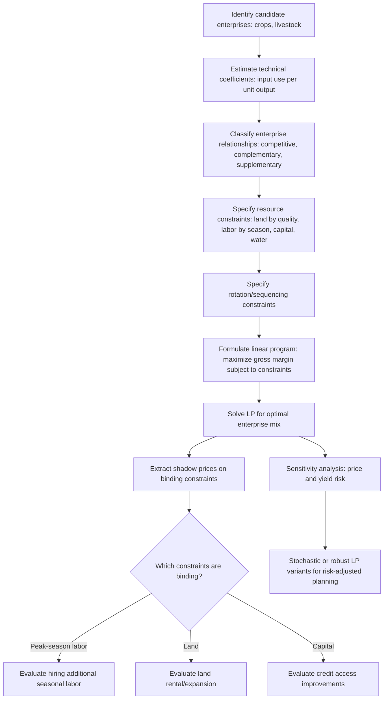

## Multi-Product Farm Decision Making

### Definition and Conceptual Foundation

Multi-product farm decision making addresses how a farm chooses its output mix, resource allocation across enterprises, and production intensity when it produces more than one product simultaneously — the typical real-world condition for most farms globally, as opposed to the single-output abstraction used to introduce basic production theory. This framework extends single-output profit maximization and cost minimization to jointly determine both the **level** and **composition** of output across multiple crops, livestock enterprises, or crop-livestock combinations.

The central analytical tool is the **Production Possibility Frontier (PPF)**, or **product transformation curve**, which describes the maximum combinations of two (or more) outputs obtainable from a fixed bundle of resources (land, labor, capital), given the technology.

### The Production Possibility Frontier and Product Transformation

For two outputs $Q_1$ and $Q_2$ produced from a shared, fixed resource bundle $\bar{X}$, the PPF traces the boundary of technically feasible output combinations:

$$T(Q_1, Q_2; \bar{X}) = 0$$

The slope of this frontier is the **Marginal Rate of Product Transformation (MRPT)**:

$$MRPT_{12} = -\frac{dQ_2}{dQ_1}\bigg|_{\bar{X}}$$

representing how much of $Q_2$ must be sacrificed to produce one additional unit of $Q_1$, given the fixed resource constraint. The shape of the PPF reveals the underlying relationship between the two enterprises:

- **Concave to the origin (bowed outward)**: the standard case, reflecting increasing opportunity cost — as more resources shift toward $Q_1$, progressively less-suited resources must be reallocated from $Q_2$, so each additional unit of $Q_1$ costs more units of $Q_2$ forgone. This is the typical shape when resources are imperfectly substitutable between enterprises (e.g., some land is better suited to one crop than another).
- **Straight line (linear)**: constant opportunity cost — occurs when resources are equally productive in either use, so resources can be reallocated between enterprises at a constant rate.
- **Convex to the origin (bowed inward)**: indicates **complementary** production relationships — producing more of one output actually facilitates production of the other (e.g., a nitrogen-fixing legume crop enhancing soil fertility for a subsequent cereal crop, or crop residues supporting livestock which in turn supplies manure).

### Illustration: Production Possibility Frontiers Under Different Product Relationships (svg_diagram)

<svg xmlns="http://www.w3.org/2000/svg" viewBox="0 0 560 300">
<text x="280" y="22" text-anchor="middle" font-size="15" font-weight="bold" fill="#222">PPF Shapes: Competitive, Independent, Complementary (svg_diagram)</text>

<line x1="60" y1="260" x2="220" y2="260" stroke="#333" stroke-width="1.2" />
<line x1="60" y1="260" x2="60" y2="60" stroke="#333" stroke-width="1.2" />
<path d="M 65 255 C 100 240, 170 150, 210 70" stroke="#2255aa" stroke-width="2.5" fill="none" />
<text x="100" y="285" font-size="11" fill="#333">Competitive (concave)</text>
<text x="222" y="70" font-size="10">Q1</text>
<text x="35" y="65" font-size="10">Q2</text>

<line x1="240" y1="260" x2="400" y2="260" stroke="#333" stroke-width="1.2" />
<line x1="240" y1="260" x2="240" y2="60" stroke="#333" stroke-width="1.2" />
<line x1="245" y1="255" x2="390" y2="70" stroke="#2c6e2c" stroke-width="2.5" />
<text x="270" y="285" font-size="11" fill="#333">Constant rate (linear)</text>
<text x="402" y="70" font-size="10">Q1</text>
<text x="215" y="65" font-size="10">Q2</text>

<line x1="420" y1="260" x2="540" y2="260" stroke="#333" stroke-width="1.2" />
<line x1="420" y1="260" x2="420" y2="60" stroke="#333" stroke-width="1.2" />
<path d="M 425 255 C 470 250, 500 200, 530 70" stroke="#aa3322" stroke-width="2.5" fill="none" />
<text x="440" y="285" font-size="11" fill="#333">Complementary (convex)</text>
<text x="542" y="70" font-size="10">Q1</text>
<text x="395" y="65" font-size="10">Q2</text>
</svg>

### Classifying Enterprise Relationships

Three canonical relationships between products sharing common resources are distinguished, mirroring the PPF shape discussion above but framed in terms of the marginal effect one enterprise has on another:

- **Competitive products**: increasing one output requires reducing the other, given fixed resources (concave PPF) — the most common case, since land, labor, and capital are typically scarce and must be allocated between uses (e.g., allocating a fixed hectare of land between maize and soybean).
- **Complementary products**: increasing one output *increases* the other, at least over some range, given fixed resources (convex PPF over that range) — arising from a positive biological or resource-use interaction (e.g., legume-cereal rotation improving soil nitrogen, or crop residues supporting integrated livestock).
- **Supplementary products**: increasing one output has *no effect* on the other, because they use entirely non-competing or slack resources (e.g., a farm enterprise using labor only during an off-peak season when other enterprises have no labor demand — the PPF segment is a straight vertical or horizontal line over that range).

### Optimal Product Mix: The Profit-Maximizing Combination

The profit-maximizing output combination on the PPF is found where the **MRPT equals the output price ratio**:

$$MRPT_{12} = \frac{P_1}{P_2}$$

This is the multi-output analogue of the single-input $MRTS = $ input price ratio condition from cost minimization: the farm should reallocate resources between enterprises until the physical trade-off rate exactly matches the market's price trade-off rate.

**Example**

Suppose a farm has a PPF between maize ($Q_1$) and soybean ($Q_2$) such that at the current allocation, giving up 1 ton of soybean allows producing 2.5 additional tons of maize ($MRPT_{12} = 2.5$). If maize sells at $P_1 = \$200/\text{ton}$ and soybean at $P_2 = \$550/\text{ton}$:

$$\frac{P_1}{P_2} = \frac{200}{550} \approx 0.36$$

Since $MRPT_{12} = 2.5 > P_1/P_2 = 0.36$, the physical trade-off rate (2.5 tons maize per ton soybean forgone) substantially exceeds the market's compensation rate for that trade-off — the farm is over-allocated toward maize relative to the profit-maximizing mix and should reallocate resources toward soybean until the two ratios equalize. This illustrates how price signals (not just yield potential) should drive the optimal crop-mix decision, a central message in applied farm planning and extension advice.

### Illustration: Optimal Product Mix on the PPF (svg_diagram)

<svg xmlns="http://www.w3.org/2000/svg" viewBox="0 0 480 300">
<text x="240" y="22" text-anchor="middle" font-size="15" font-weight="bold" fill="#222">Profit-Maximizing Output Mix (svg_diagram)</text>
<line x1="70" y1="260" x2="440" y2="260" stroke="#333" stroke-width="1.5" />
<line x1="70" y1="260" x2="70" y2="40" stroke="#333" stroke-width="1.5" />
<text x="445" y="278" font-size="12">Maize (Q1)</text>
<text x="35" y="45" font-size="12">Soybean (Q2)</text>
<path d="M 90 240 C 160 210, 300 130, 400 70" stroke="#2255aa" stroke-width="2.5" fill="none" />
<text x="405" y="68" font-size="11" fill="#2255aa">PPF</text>

<line x1="130" y1="255" x2="380" y2="95" stroke="#aa3322" stroke-width="2" stroke-dasharray="5,3" />
<text x="385" y="97" font-size="11" fill="#aa3322">Iso-revenue line (slope = P1/P2)</text>
<circle cx="270" cy="160" r="4" fill="#222" />
<text x="278" y="155" font-size="11" fill="#222">Optimal mix (MRPT = P1/P2)</text>
</svg>

### The Linear Programming (LP) Framework for Multi-Enterprise Farm Planning

Because real farms allocate multiple resources across multiple enterprises simultaneously, applied farm planning most commonly uses **linear programming** to solve the full multi-constraint optimization problem, generalizing the two-output PPF intuition to many outputs and many resource constraints at once:

$$\max_{Q_1,...,Q_n} \; \pi = \sum_i (P_i - c_i) Q_i \quad \text{subject to resource constraints:}$$

$$\sum_i a_{ij} Q_i \leq \bar{X}_j \quad \forall j \; (\text{land, labor by season, capital, water})$$

$$Q_i \geq 0 \quad \forall i$$

where $a_{ij}$ is the amount of resource $j$ required per unit of enterprise $i$'s output (technical coefficients), and $\bar{X}_j$ is the fixed availability of resource $j$.

**Key structural features relevant to agricultural applications**:

- **Seasonal/period-specific labor constraints**: labor requirements are typically modeled separately by season (planting, weeding, harvest) rather than as a single annual total, since labor is not perfectly fungible across the calendar year — an enterprise mix that looks profitable in aggregate may be infeasible if it creates a labor bottleneck in a specific month.
- **Land-quality-specific constraints**: distinguishing land by quality class or suitability (e.g., irrigated versus rainfed, or by soil type) rather than treating all land as homogeneous.
- **Rotation and sequencing constraints**: representing agronomic requirements (e.g., a legume must precede a cereal in rotation, or a crop cannot be grown on the same plot in consecutive seasons) as additional linear constraints linking enterprise choices across time periods.
- **Shadow prices (dual values)**: the LP solution's dual values directly quantify the marginal value of relaxing each binding resource constraint — e.g., the shadow price on the peak-season labor constraint indicates how much additional profit an extra unit of labor at that specific time would generate, informing whether hiring additional seasonal labor is worthwhile at the prevailing wage.

### Diagram: Multi-Enterprise Farm Planning Workflow

### Extensions: Risk-Adjusted and Whole-Farm Planning Models

Standard LP assumes certainty in prices and yields; applied multi-product farm planning frequently extends the basic model to address this limitation:

- **MOTAD (Minimization of Total Absolute Deviations)** and **Target MOTAD**: linear-programming-compatible risk-programming approaches that approximate the mean-variance framework using absolute deviations from expected income rather than variance, avoiding the quadratic terms a true mean-variance objective would introduce, and thus remaining solvable with standard linear programming methods.
- **Quadratic Risk Programming (E-V models)**: directly incorporates the variance of farm income into a quadratic objective function, following the mean-variance logic introduced under risk in agricultural production, but requiring quadratic (rather than linear) programming solvers.
- **Stochastic programming with recourse**: models sequential decisions where some choices (e.g., input purchases) are made before uncertainty resolves and others (e.g., harvest-time selling decisions) are made after, allowing the model to capture farmers' ability to adapt mid-season.
- **Whole-farm simulation/budgeting models**: less formally optimization-based, but widely used in applied extension settings — comparing gross margins across candidate enterprise combinations under multiple price and yield scenarios without solving a full constrained optimization problem, valued for their transparency and ease of communication to farmers.

### Joint Products and Byproducts

A distinct but related multi-product consideration arises when a single production process generates two outputs in **fixed proportion** — true **joint products** (as opposed to enterprises that can be independently scaled) — such as grain and straw from a cereal crop, or milk and calves from a dairy operation. Here:

- The two outputs cannot be produced independently; the ratio between them is fixed by the biological process, at least in the short run.
- Cost allocation between joint products for accounting or pricing purposes (e.g., how much of total production cost to attribute to grain versus straw) is inherently somewhat arbitrary from a pure economic-efficiency standpoint, since neither output has a separately identifiable marginal cost — a well-known conceptual issue in joint-cost accounting.
- The profit-maximizing decision concerns only the **overall scale** of the joint-product process (how much of the fixed-ratio bundle to produce), determined by comparing the **combined** value of both outputs to their combined marginal cost, since the fixed-ratio nature removes any output-mix choice at the margin.

This differs from the general PPF/LP framework above, where enterprises are typically assumed independently scalable (a farm can freely vary the maize-to-soybean land allocation), whereas true joint products cannot be independently varied without changing the underlying biological process itself.

### Applications in Agricultural Economics

1. **Farm-level crop-mix optimization**: applying LP-based whole-farm models to recommend profit-maximizing crop combinations subject to land, labor, and capital constraints, widely used in agricultural extension and farm consulting.
2. **Seasonal labor bottleneck identification**: using shadow prices on season-specific labor constraints to identify which periods of the year most constrain farm profitability, informing labor-hiring or mechanization investment priorities.
3. **Crop-livestock integration planning**: modeling complementary product relationships (crop residues as feed, manure as fertilizer) within an LP framework to identify the profit-maximizing scale of integration between enterprises.
4. **Rotation planning and soil health management**: incorporating agronomic rotation constraints into farm planning models to balance short-term profitability against long-term soil fertility maintenance.
5. **Diversification strategy design under risk**: using MOTAD, Target MOTAD, or quadratic risk programming to recommend enterprise combinations that balance expected income against income variability, directly extending the risk-aversion concepts from stochastic production analysis to a multi-enterprise setting.
6. **Land-use policy and agricultural zoning analysis**: PPF-based analysis of regional production trade-offs (e.g., food crops versus cash/export crops) informing land-use policy debates.
7. **Byproduct valuation and joint-cost pricing**: informing pricing and accounting decisions for joint agricultural products (grain/straw, milk/calves) where cost allocation between outputs is required for management or contractual purposes.

### Common Pitfalls

- **Treating all farm outputs as independently produced when true joint products are present**, leading to an incorrectly specified optimization problem (attempting to independently vary outputs whose ratio is technically fixed by the production process).
- **Ignoring seasonal labor constraints in favor of an aggregate annual labor total**, which can produce an LP-recommended enterprise mix that is infeasible in practice due to a specific peak-season bottleneck.
- **Applying a linear PPF assumption (constant opportunity cost) when the true relationship is concave or convex**, distorting the recommended optimal product mix, particularly when enterprises draw on land or resources of heterogeneous quality.
- **Solving a deterministic LP for farm planning without any risk adjustment**, when farmer risk aversion (established under risk in agricultural production) may lead to systematically different, more diversified enterprise choices than the pure expected-profit-maximizing LP solution would recommend.
- **Neglecting shadow price interpretation**: failing to use the dual values from an LP solution to inform complementary decisions (labor hiring, land rental, credit access), which represent a substantial portion of the practical decision-support value of the LP framework beyond just the primal enterprise-mix recommendation itself.

### Related Topics

- Production functions and factor productivity
- Cost minimization and profit maximization
- Risk in agricultural production (mean-variance, expected utility, MOTAD extensions)
- Economies of scale and scope in farming (crop-livestock integration overlap)
- Linear and quadratic programming methods in farm management
- Joint-cost accounting and byproduct valuation
- Crop rotation and soil fertility management economics
- Whole-farm budgeting and enterprise gross margin analysis
- Land-use planning and agricultural zoning policy