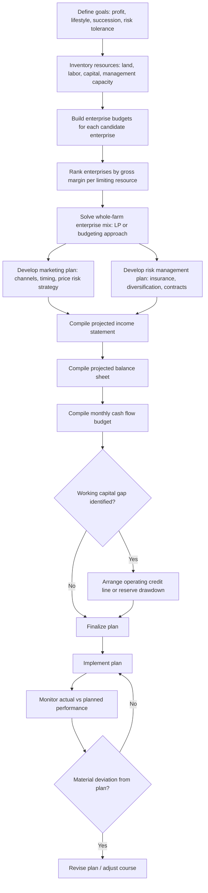

## Farm Business Planning


### Definition and Conceptual Foundation

Farm business planning is the systematic process by which a farm operator sets goals, assesses resources and constraints, evaluates alternative courses of action, and formalizes a strategy for organizing and operating a farm enterprise over a defined planning horizon. It sits at the practical, applied end of farm management economics — translating the theoretical optimization concepts of production economics (cost minimization, profit maximization, multi-product decision making, risk management) into a structured, documented, and typically written plan used for internal decision-making, communication with lenders or partners, and periodic performance review.

A farm business plan differs from a single production decision (e.g., how much fertilizer to apply) in that it is **integrative**: it combines production, marketing, financial, labor, and risk management decisions into a coherent whole-farm strategy, typically spanning a multi-year horizon with an annual operating cycle nested within it.

### Core Components of a Farm Business Plan

**Key Points**

- **Executive summary / mission and goals**: a concise statement of the farm's purpose, ownership structure, and the operator's short- and long-term objectives — which may include profit, but frequently also encompasses lifestyle goals, succession intentions, environmental stewardship, or risk tolerance, all of which shape which decisions are considered "optimal."
- **Resource inventory**: a documented assessment of land (quantity, quality, tenure status), labor (family and hired, by skill and season), capital (machinery, buildings, livestock, cash reserves), and management capacity.
- **Enterprise analysis**: profitability assessment of each candidate or current enterprise (crop or livestock line), typically via gross margin or enterprise budget analysis (see below), directly drawing on the multi-product decision-making framework to determine the recommended enterprise mix.
- **Marketing plan**: strategy for output sales, including timing, channel selection (spot market, forward contract, cooperative), and price risk management approach.
- **Financial plan**: projected income statement, balance sheet, and cash flow statement, plus financing strategy (equity, debt, leasing) and capital investment schedule.
- **Risk management plan**: identification of key production, price, financial, and institutional risks (per the risk-in-agricultural-production framework) and the specific mitigation strategies adopted — insurance, diversification, contracts, reserves.
- **Human resources / labor plan**: staffing plan across the seasonal labor calendar, including succession or management transition planning where relevant.
- **Monitoring and review schedule**: specified checkpoints (often quarterly or seasonal) for comparing actual performance against planned targets and revising the plan as conditions change.

### The Enterprise Budget

The **enterprise budget** is the fundamental building block of farm business planning — a detailed itemization of expected revenue and costs for a single enterprise (one crop, one livestock line) over one production cycle, typically expressed on a per-unit-of-resource basis (per hectare, per head).

$$\text{Gross Margin} = \text{Total Revenue} - \text{Total Variable Costs}$$


$$\text{Net Farm Income} = \sum_i \text{Gross Margin}_i - \text{Total Fixed (Overhead) Costs}$$

**Structure of a typical enterprise budget**:

| Category | Line items |
| --- | --- |
| Revenue | Expected yield × expected price, plus any byproduct value |
| Variable costs | Seed, fertilizer, agrochemicals, fuel, hired seasonal labor, irrigation water, crop insurance premium |
| Gross margin | Revenue − variable costs |
| Fixed/overhead costs (allocated) | Land rent or opportunity cost, depreciation on owned machinery, permanent labor, property tax, interest on term debt |
| Net return | Gross margin − allocated fixed costs |

**Why gross margin, not just net return, drives most enterprise-mix decisions**: fixed costs are typically already committed regardless of which enterprises are chosen (a tractor already purchased, land already owned or leased for the season), so the gross margin — not the fully allocated net return — is the theoretically correct criterion for choosing which combination of enterprises to grow this season, since it reflects the actual marginal contribution of the decision at hand. Full net return remains relevant for the longer-run decision of whether to remain in farming or invest in additional fixed capacity at all.

**Example**

A maize enterprise budget on 1 hectare might show: expected yield 4 tons/ha at $220/ton = $880 revenue; variable costs of seed ($60), fertilizer ($150), agrochemicals ($40), hired labor ($80), fuel ($30) totaling $360. Gross margin = $880 − $360 = $520/ha. If an alternative soybean enterprise on the same land shows a gross margin of $470/ha, and the two compete for the same limited land (a competitive product relationship, per the multi-product decision-making framework), maize is the higher-return choice for that land — though a full farm plan would also weigh labor-season timing, rotation benefits, and price risk differences between the two before finalizing the recommendation.

### Illustration: Farm Business Planning Cycle (svg_diagram)

<svg xmlns="http://www.w3.org/2000/svg" viewBox="0 0 520 320">
<text x="260" y="22" text-anchor="middle" font-size="15" font-weight="bold" fill="#222">The Farm Business Planning Cycle (svg_diagram)</text>
<circle cx="260" cy="180" r="120" fill="none" stroke="#ccc" stroke-width="1" />
<g font-size="12" fill="#222">
<circle cx="260" cy="65" r="34" fill="#cfe8cf" stroke="#2c6e2c" />
<text x="260" y="69" text-anchor="middle">Set Goals</text>



```
<circle cx="375" cy="120" r="34" fill="#dce8f5" stroke="#2255aa" />
<text x="375" y="115" text-anchor="middle">Assess</text>
<text x="375" y="128" text-anchor="middle">Resources</text>

<circle cx="375" cy="245" r="34" fill="#f5e6c8" stroke="#aa8822" />
<text x="375" y="240" text-anchor="middle">Analyze</text>
<text x="375" y="253" text-anchor="middle">Alternatives</text>

<circle cx="260" cy="300" r="34" fill="#f0d5cf" stroke="#aa4422" />
<text x="260" y="304" text-anchor="middle">Implement Plan</text>

<circle cx="145" cy="245" r="34" fill="#e2d5f0" stroke="#6a3fa0" />
<text x="145" y="240" text-anchor="middle">Monitor</text>
<text x="145" y="253" text-anchor="middle">Performance</text>

<circle cx="145" cy="120" r="34" fill="#d5f0ea" stroke="#227766" />
<text x="145" y="115" text-anchor="middle">Review &amp;</text>
<text x="145" y="128" text-anchor="middle">Revise</text>
```

</g>
<path d="M 290 90 A 120 120 0 0 1 355 155" stroke="#888" stroke-width="1.5" fill="none" marker-end="url(#a1)" />
<path d="M 385 155 A 120 120 0 0 1 385 210" stroke="#888" stroke-width="1.5" fill="none" marker-end="url(#a1)" />
<path d="M 355 270 A 120 120 0 0 1 290 300" stroke="#888" stroke-width="1.5" fill="none" marker-end="url(#a1)" />
<path d="M 230 300 A 120 120 0 0 1 165 270" stroke="#888" stroke-width="1.5" fill="none" marker-end="url(#a1)" />
<path d="M 135 210 A 120 120 0 0 1 135 155" stroke="#888" stroke-width="1.5" fill="none" marker-end="url(#a1)" />
<path d="M 165 90 A 120 120 0 0 1 230 65" stroke="#888" stroke-width="1.5" fill="none" marker-end="url(#a1)" />
</svg>

### Financial Statements in Farm Planning

Three linked financial statements form the quantitative backbone of the financial plan:

- **Income statement (profit and loss statement)**: summarizes revenue, expenses, and net farm income over the planning period, aggregating enterprise-budget-level detail into a whole-farm view.
- **Balance sheet**: a snapshot of the farm's assets (land, machinery, livestock, cash), liabilities (debt), and owner equity at a point in time, used to assess **solvency** (equity relative to total assets) and track wealth change over time.
- **Cash flow statement (cash flow budget)**: projects the timing of cash inflows and outflows across the year, distinct from the income statement's accrual-based profit measure — critical in agriculture because of the pronounced seasonality of both expenses (concentrated at planting) and revenue (concentrated at harvest/sale), creating a **working capital gap** that must be bridged by operating credit or cash reserves.

$$\text{Working Capital} = \text{Current Assets} - \text{Current Liabilities}$$

A cash flow budget projected month-by-month (rather than only annually) is essential in farm planning specifically because annual profitability can mask a severe within-year liquidity shortfall — a farm can be profitable on paper for the year while still risking default on an input loan due before harvest revenue arrives.

### Key Financial Performance Ratios

| Ratio | Formula | What it measures |
| --- | --- | --- |
| Debt-to-asset ratio | Total liabilities / Total assets | Solvency; exposure to interest rate and asset-value risk |
| Current ratio | Current assets / Current liabilities | Short-term liquidity |
| Operating profit margin | Net farm income from operations / Gross revenue | Profitability per revenue dollar |
| Asset turnover ratio | Gross revenue / Total farm assets | Efficiency of asset use in generating revenue |
| Return on farm assets (ROA) | (Net farm income + interest expense − value of operator labor) / Total farm assets | Overall return on the capital invested in the farm |
| Return on farm equity (ROE) | (Net farm income − value of operator labor) / Farm equity | Return to the owner's invested capital specifically |

These ratios, often benchmarked against regional or peer-group averages, provide the standardized financial vocabulary used by lenders, farm management extension services, and the farm's own periodic self-assessment.

### Diagram: Farm Business Plan Development Workflow



### Planning Horizons: Strategic, Tactical, and Operational Levels

Farm business planning operates across nested timeframes, each with distinct decision content:

- **Strategic planning (multi-year, 3–10+ years)**: fundamental decisions about farm size, enterprise portfolio, major capital investment (land purchase, irrigation infrastructure, livestock housing), succession, and overall business structure.
- **Tactical planning (annual, seasonal)**: the annual operating plan — enterprise mix for the coming season, input purchase and financing arrangements, marketing plan for the season's expected output. This is the level at which the enterprise budget and whole-farm LP/budgeting analysis are most directly applied.
- **Operational planning (weekly/daily)**: day-to-day scheduling of specific field operations, labor task assignment, and input application timing within the constraints already set by the tactical plan.

A well-constructed farm business plan makes the linkage between these levels explicit: tactical decisions should be consistent with the strategic direction, and operational execution should be tracked against tactical targets, closing the planning-monitoring-revision loop shown in the workflow diagram above.

### Break-Even Analysis in Farm Planning

A standard planning tool for assessing enterprise viability under price or yield uncertainty is **break-even analysis**, identifying the yield or price level at which an enterprise exactly covers its costs:

$$\text{Break-even yield} = \frac{\text{Total costs per hectare}}{\text{Expected price per unit}}$$


$$\text{Break-even price} = \frac{\text{Total costs per hectare}}{\text{Expected yield per hectare}}$$

**Example**

If total costs (variable plus allocated fixed) for a maize enterprise are $700/ha and expected price is $220/ton, break-even yield is $700/220 \approx 3.18$ tons/ha — meaning any yield realization above this level generates a positive net return at the assumed price, providing a simple, communicable risk benchmark that complements the more formal mean-variance and expected-utility approaches from risk-in-agricultural-production analysis, without requiring the farmer to specify a full probability distribution or risk-aversion parameter.

### Succession and Business Structure Planning

A component of strategic-level farm business planning specific to family-operated agricultural enterprises (the dominant ownership structure globally) is **succession planning**: the process of transferring management control and/or ownership to the next generation or a successor operator.

**Key Points**

- Distinguishes **management succession** (transfer of day-to-day decision-making authority) from **ownership/asset transfer** (transfer of land and capital title), which need not occur simultaneously.
- Common structural vehicles include gradual transfer through partnership or corporate share allocation, lease-to-own arrangements for incoming operators, and various estate-planning instruments — the specific legal and tax mechanisms vary substantially by jurisdiction. [Unverified: specific legal/tax treatment of succession instruments is jurisdiction-dependent and should be verified against current local regulation and professional legal/accounting advice rather than treated as a general economic principle.]
- Succession planning interacts directly with the financial plan, since a transfer often requires financing arrangements (buy-out loans, gifted equity) that appear as liabilities or equity adjustments on the projected balance sheet.

### Applications in Agricultural Economics

1. **Farm loan application and lender evaluation**: a documented farm business plan with enterprise budgets and projected financial statements is typically required by agricultural lenders to assess creditworthiness and repayment capacity.
2. **Extension and farm advisory services**: enterprise budget templates and whole-farm planning tools are among the most widely used direct outputs of agricultural extension programs, translating research-based yield and cost data into farm-level decision support.
3. **New enterprise or technology adoption evaluation**: break-even and gross margin analysis provide a standardized, communicable framework for evaluating whether a new crop, livestock line, or technology investment is likely to be profitable before committing resources.
4. **Farm business performance benchmarking**: financial ratio analysis (debt-to-asset, ROA, ROE) allows comparison of a farm's performance against regional peer groups or historical trends, informing management improvement priorities.
5. **Risk management program design**: the risk management component of the farm plan directly operationalizes insurance, diversification, and contracting decisions informed by the theoretical risk framework.
6. **Farm transition and succession policy**: succession planning components inform rural policy discussions on generational farm transfer, entry barriers for new farmers, and land tenure continuity.
7. **Cash flow and working capital management**: monthly cash flow budgeting directly supports decisions on the timing and sizing of operating credit lines, particularly critical for farms with pronounced seasonal revenue-expense mismatches.

### Common Pitfalls

- **Using net return rather than gross margin to compare enterprises when fixed costs are already committed**, leading to a mischaracterization of which enterprise combination is truly optimal for the current planning decision.
- **Relying solely on an annual income statement without a monthly cash flow budget**, masking within-year liquidity risk that can cause a profitable farm to face a genuine cash shortfall at a critical point in the season.
- **Treating the farm business plan as a static, one-time document** rather than a living plan subject to the monitor-review-revise cycle, reducing its value as conditions (prices, weather realizations, family circumstances) inevitably diverge from initial assumptions.
- **Ignoring the interaction between production, marketing, financial, and risk management components**, planning each in isolation when the plan's integrative value comes precisely from ensuring these components are mutually consistent (e.g., a marketing plan that assumes storage capacity not reflected in the capital budget).
- **Deferring succession planning until a crisis forces the issue**, rather than treating it as an ongoing strategic-level planning component with its own timeline and financial implications for the whole-farm plan.

### Related Topics

- Cost minimization and profit maximization
- Multi-product farm decision making and enterprise budgeting
- Risk in agricultural production and risk management strategy design
- Linear programming methods in whole-farm planning
- Agricultural credit and farm financial management
- Farm succession and intergenerational transfer economics
- Break-even analysis and enterprise viability assessment
- Financial ratio analysis and farm performance benchmarking
- Agricultural extension and farm advisory service delivery